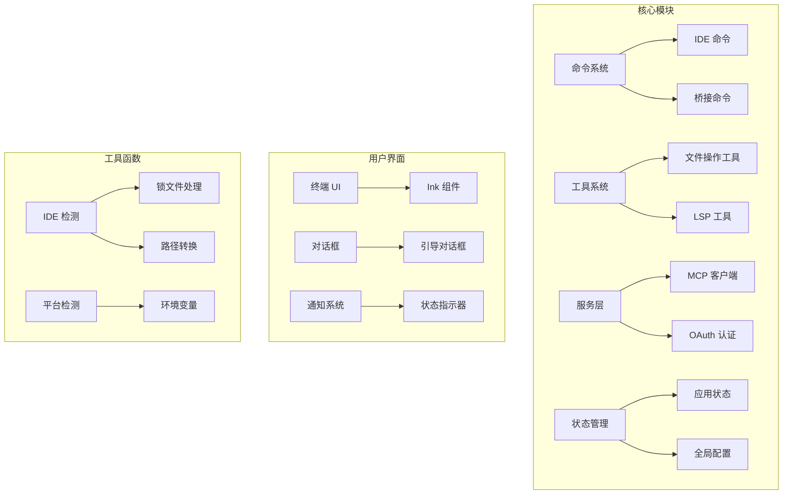
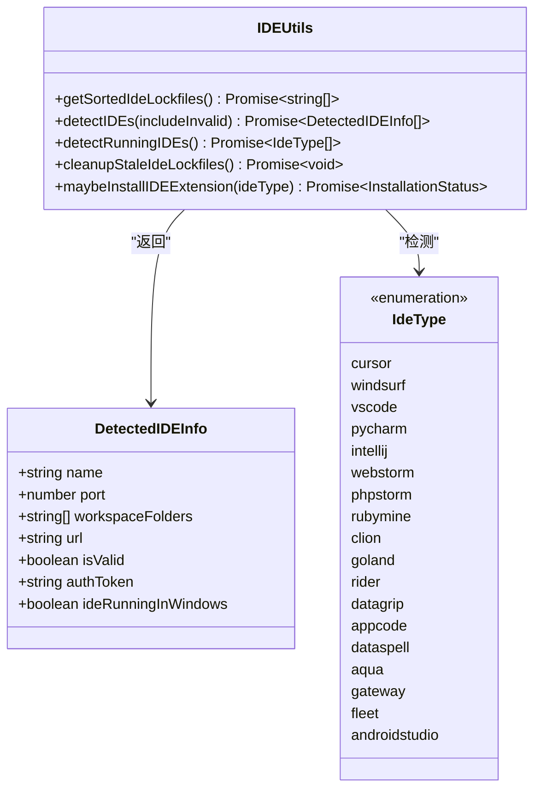
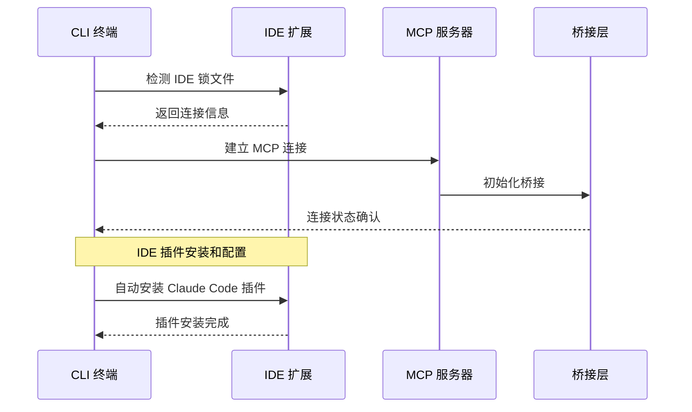
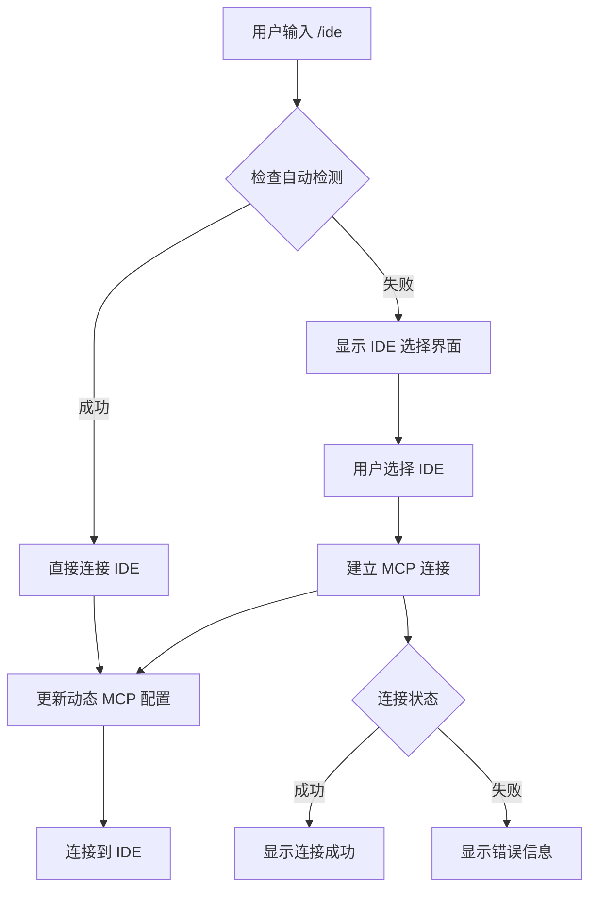
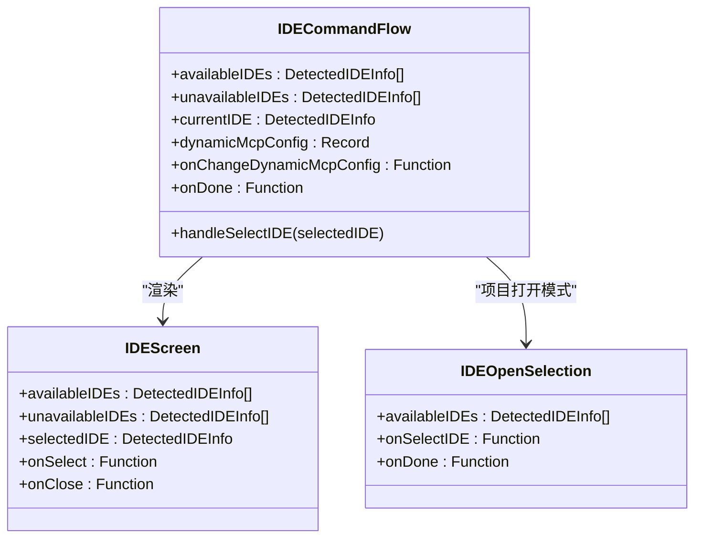
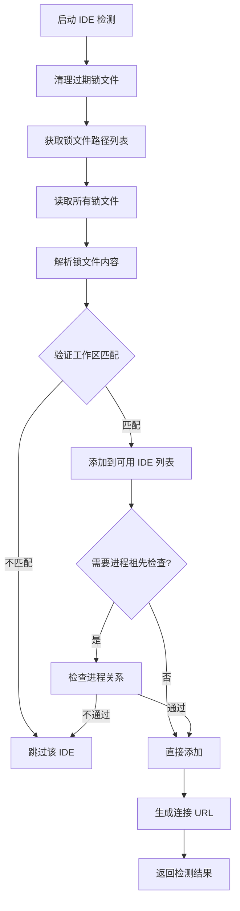
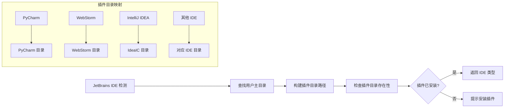
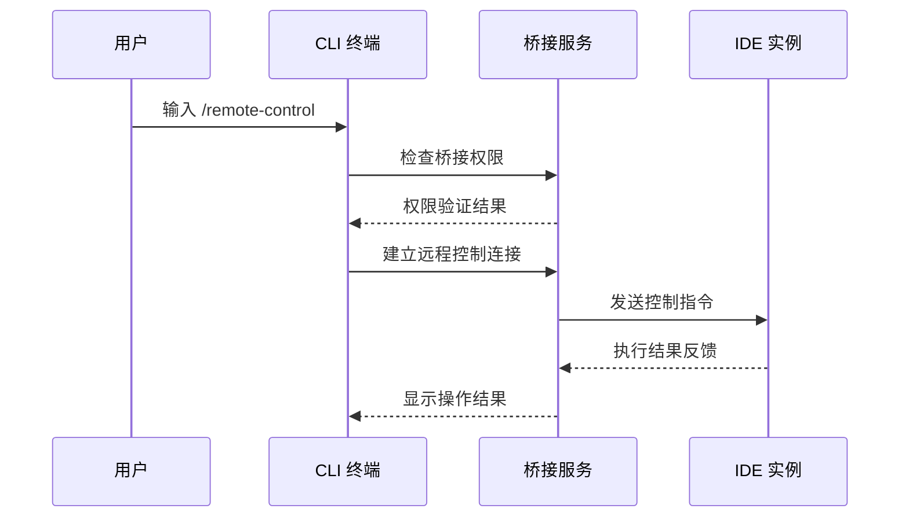

# IDE 集成指南

<cite>
**本文档引用的文件**
- [README.md](file://README.md)
- [FEATURES.md](file://FEATURES.md)
- [package.json](file://package.json)
- [src/commands/ide/ide.tsx](file://src/commands/ide/ide.tsx)
- [src/utils/ide.ts](file://src/utils/ide.ts)
- [src/utils/jetbrains.ts](file://src/utils/jetbrains.ts)
- [src/commands/bridge/index.ts](file://src/commands/bridge/index.ts)
- [src/bridge/bridgeEnabled.ts](file://src/bridge/bridgeEnabled.ts)
- [src/hooks/notifs/useIDEStatusIndicator.tsx](file://src/hooks/notifs/useIDEStatusIndicator.tsx)
- [src/components/IdeOnboardingDialog.tsx](file://src/components/IdeOnboardingDialog.tsx)
</cite>

## 目录
1. [简介](#简介)
2. [项目结构](#项目结构)
3. [核心组件](#核心组件)
4. [架构概览](#架构概览)
5. [详细组件分析](#详细组件分析)
6. [依赖关系分析](#依赖关系分析)
7. [性能考虑](#性能考虑)
8. [故障排除指南](#故障排除指南)
9. [结论](#结论)

## 简介

free-code 是一个基于 Claude Code 的终端原生 AI 编码代理，支持 VS Code 和 JetBrains 系列 IDE 的深度集成。该项目移除了所有遥测数据上报，去除了安全限制提示词，并解锁了全部实验性功能。

本指南将详细介绍如何在 VS Code 和 JetBrains IDE 中配置和使用 free-code 的 IDE 集成功能，包括插件安装、配置参数设置和连接建立过程。

## 项目结构

free-code 项目采用模块化架构设计，主要包含以下核心模块：



**图表来源**
- [src/commands/ide/ide.tsx:1-646](file://src/commands/ide/ide.tsx#L1-L646)
- [src/utils/ide.ts:1-800](file://src/utils/ide.ts#L1-L800)

**章节来源**
- [README.md:284-313](file://README.md#L284-L313)
- [package.json:1-122](file://package.json#L1-L122)

## 核心组件

### IDE 检测与连接系统

IDE 检测系统是整个集成的核心，负责自动发现运行中的 IDE 实例并建立连接。



**图表来源**
- [src/utils/ide.ts:92-121](file://src/utils/ide.ts#L92-L121)
- [src/utils/ide.ts:102-129](file://src/utils/ide.ts#L102-L129)

### 支持的 IDE 类型

项目支持多种主流 IDE，包括：

| IDE 类型 | 显示名称 | 进程关键词 |
|---------|----------|-----------|
| vscode | VS Code | Visual Studio Code, Code Helper |
| cursor | Cursor | Cursor Helper, Cursor.app |
| windsurf | Windsurf | Windsurf Helper, Windsurf.app |
| intellij | IntelliJ IDEA | IntelliJ IDEA |
| pycharm | PyCharm | PyCharm |
| webstorm | WebStorm | WebStorm |
| phpstorm | PhpStorm | PhpStorm |
| rubymine | RubyMine | RubyMine |
| clion | CLion | CLion |
| goland | GoLand | GoLand |
| rider | Rider | Rider |
| datagrip | DataGrip | DataGrip |
| appcode | AppCode | AppCode |
| dataspell | DataSpell | DataSpell |
| aqua | Aqua | Aqua |
| gateway | Gateway | Gateway |
| fleet | Fleet | Fleet |
| androidstudio | Android Studio | Android Studio |

**章节来源**
- [src/utils/ide.ts:130-257](file://src/utils/ide.ts#L130-L257)

## 架构概览

free-code 的 IDE 集成采用分布式架构，通过 MCP（Model Context Protocol）协议实现与 IDE 的通信。



**图表来源**
- [src/utils/ide.ts:664-800](file://src/utils/ide.ts#L664-L800)
- [src/commands/ide/ide.tsx:419-504](file://src/commands/ide/ide.tsx#L419-L504)

## 详细组件分析

### IDE 命令系统

IDE 命令系统提供了完整的 IDE 集成功能，包括自动检测、手动选择和连接管理。



**图表来源**
- [src/commands/ide/ide.tsx:518-604](file://src/commands/ide/ide.tsx#L518-L604)

#### IDE 选择界面

IDE 选择界面提供了直观的用户交互体验：



**图表来源**
- [src/commands/ide/ide.tsx:18-646](file://src/commands/ide/ide.tsx#L18-L646)

**章节来源**
- [src/commands/ide/ide.tsx:18-646](file://src/commands/ide/ide.tsx#L18-L646)

### IDE 检测机制

IDE 检测机制通过扫描锁文件来发现运行中的 IDE 实例：



**图表来源**
- [src/utils/ide.ts:664-800](file://src/utils/ide.ts#L664-L800)

**章节来源**
- [src/utils/ide.ts:298-581](file://src/utils/ide.ts#L298-L581)

### JetBrains IDE 支持

JetBrains IDE 通过特殊的插件目录结构进行识别和管理：



**图表来源**
- [src/utils/jetbrains.ts:27-39](file://src/utils/jetbrains.ts#L27-L39)

**章节来源**
- [src/utils/jetbrains.ts:1-39](file://src/utils/jetbrains.ts#L1-L39)

### 远程控制桥接

远程控制功能允许通过 CLI 终端进行远程 IDE 控制：



**图表来源**
- [src/commands/bridge/index.ts:1-27](file://src/commands/bridge/index.ts#L1-L27)
- [src/bridge/bridgeEnabled.ts:28-36](file://src/bridge/bridgeEnabled.ts#L28-L36)

**章节来源**
- [src/commands/bridge/index.ts:1-27](file://src/commands/bridge/index.ts#L1-L27)
- [src/bridge/bridgeEnabled.ts:1-203](file://src/bridge/bridgeEnabled.ts#L1-L203)

## 依赖关系分析

### 核心依赖关系

```mermaid
graph TB
subgraph "外部依赖"
A[@modelcontextprotocol/sdk] --> B[MCP 协议实现]
C[execa] --> D[进程执行]
E[axios] --> F[HTTP 请求]
G[net] --> H[TCP 连接]
I[ws] --> J[WebSocket 支持]
end
subgraph "内部模块"
K[IDE 检测] --> L[锁文件处理]
K --> M[路径转换]
N[MCP 客户端] --> O[连接管理]
P[桥接服务] --> Q[认证管理]
end
A --> N
C --> K
E --> P
```

**图表来源**
- [package.json:22-116](file://package.json#L22-L116)

**章节来源**
- [package.json:1-122](file://package.json#L1-L122)

### 功能特性支持

根据 FEATURES.md 文件，项目支持以下 IDE 集成相关功能：

| 功能类别 | 特性名称 | 描述 |
|---------|----------|------|
| 交互与 UI | BRIDGE_MODE | IDE 远程控制桥接模式 |
| 工具与基础设施 | BASH_CLASSIFIER | 分类器辅助的 Bash 权限决策 |
| 工具与基础设施 | PROMPT_CACHE_BREAK_DETECTION | 压缩/查询流程中的缓存破坏检测 |

**章节来源**
- [FEATURES.md:104-128](file://FEATURES.md#L104-L128)

## 性能考虑

### IDE 检测优化

项目采用了多项性能优化策略：

1. **异步锁文件读取**：使用 Promise.all 并行读取多个锁文件
2. **缓存机制**：使用 memoize 装饰器缓存终端类型检测结果
3. **滚动节流**：在终端滚动期间暂停 IDE 检测以避免阻塞 UI
4. **智能超时**：IDE 连接检测设置合理的超时时间

### 内存管理

- 使用 AbortController 取消长时间运行的 IDE 搜索操作
- 实现过期锁文件清理机制，防止内存泄漏
- 智能路径转换，避免不必要的字符串操作

## 故障排除指南

### 常见连接问题

#### 1. IDE 插件未检测到

**症状**：`/ide` 命令无法检测到 IDE

**解决方案**：
1. 确认 IDE 已安装 Claude Code 插件
2. 检查 IDE 是否正在运行
3. 验证锁文件是否存在：`~/.claude/ide/`

**章节来源**
- [src/hooks/notifs/useIDEStatusIndicator.tsx:106-155](file://src/hooks/notifs/useIDEStatusIndicator.tsx#L106-L155)

#### 2. 连接超时

**症状**：连接 IDE 时出现超时错误

**解决方案**：
1. 检查网络连接是否正常
2. 验证 IDE 端口是否被防火墙阻止
3. 尝试重启 IDE 和 CLI 终端

#### 3. 路径匹配问题

**症状**：IDE 检测到但工作区不匹配

**解决方案**：
1. 确保当前工作目录在 IDE 工作区内
2. 检查路径大小写和特殊字符
3. 在 macOS 上注意 Unicode 规范化问题

### 权限配置问题

#### 1. VS Code 安装权限

**症状**：VS Code 插件安装失败

**解决方案**：
1. 确认 VS Code CLI (`code`) 可用
2. 检查 VS Code 是否以管理员权限运行
3. 验证用户是否有插件安装权限

#### 2. JetBrains IDE 权限

**症状**：JetBrains IDE 插件安装失败

**解决方案**：
1. 手动从 JetBrains Marketplace 安装插件
2. 检查 IDE 插件目录权限
3. 确认 IDE 具有网络访问权限

### 环境变量配置

以下环境变量可用于调试和配置 IDE 集成：

| 环境变量 | 用途 | 默认值 |
|---------|------|--------|
| CLAUDE_CODE_SSE_PORT | 指定 SSE 端口 | 自动检测 |
| CLAUDE_CODE_IDE_HOST_OVERRIDE | 覆盖 IDE 主机地址 | 127.0.0.1 |
| CLAUDE_CODE_IDE_SKIP_VALID_CHECK | 跳过工作区验证 | false |
| CLAUDE_CODE_IDE_SKIP_AUTO_INSTALL | 跳过自动安装 | true |
| FORCE_CODE_TERMINAL | 强制启用终端支持 | 无 |

**章节来源**
- [src/utils/ide.ts:670-701](file://src/utils/ide.ts#L670-L701)

## 结论

free-code 提供了完整的 IDE 集成解决方案，支持 VS Code 和 JetBrains 系列 IDE 的深度集成。通过智能的 IDE 检测机制、灵活的连接管理和完善的错误处理，用户可以轻松地在终端环境中控制和管理 IDE。

主要优势包括：
- **自动化程度高**：自动检测和安装 IDE 插件
- **跨平台支持**：支持 macOS、Linux 和 Windows
- **性能优化**：多处性能优化确保流畅体验
- **错误处理完善**：提供详细的错误诊断和解决方案

建议用户根据具体需求选择合适的 IDE，并按照本文档的配置步骤进行设置，以获得最佳的使用体验。