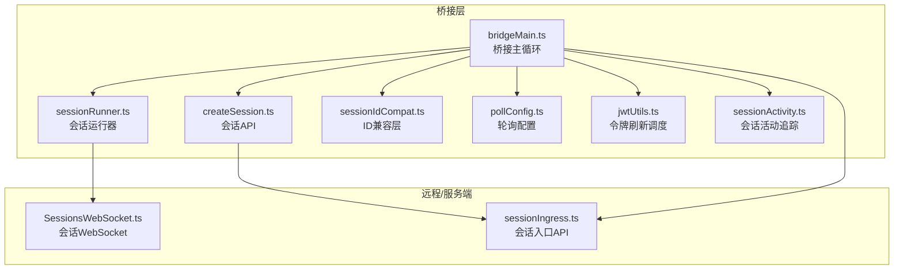
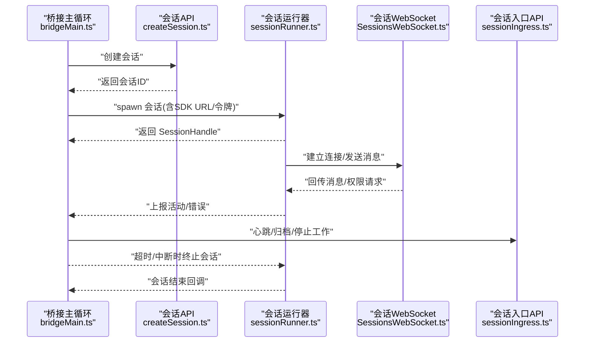
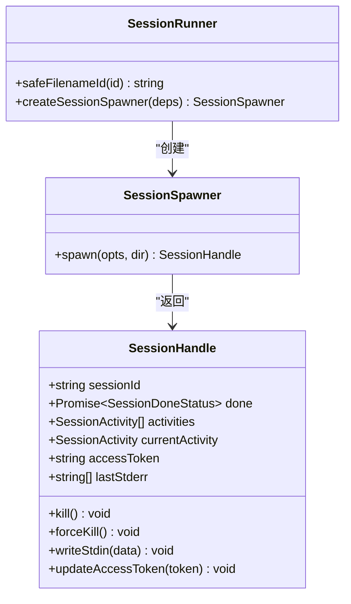
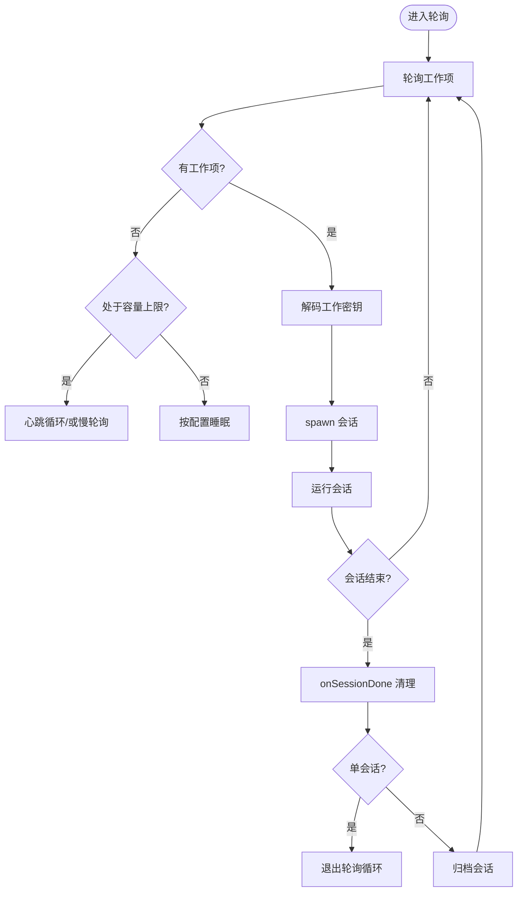
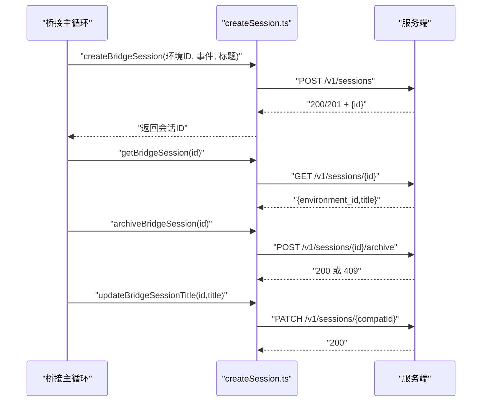
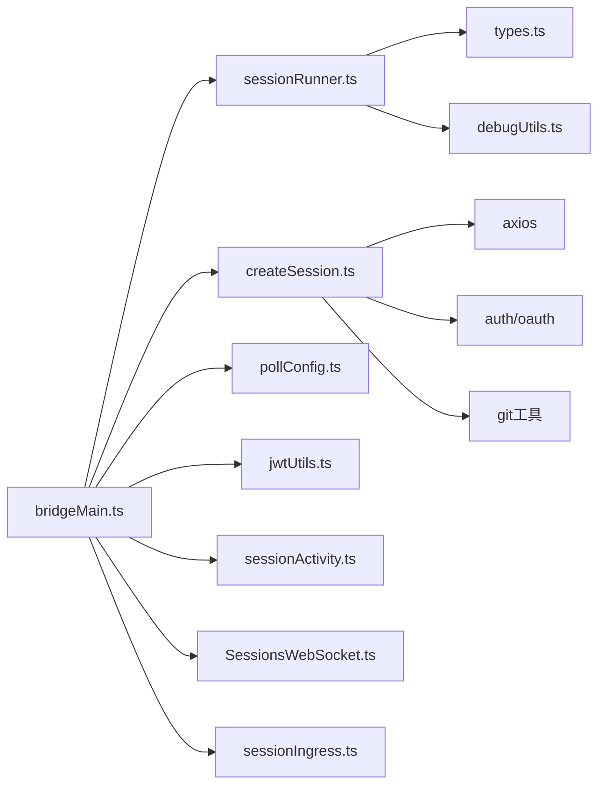
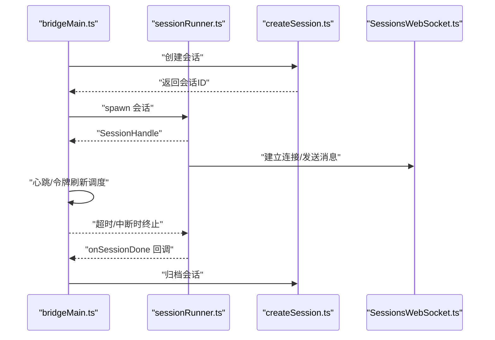

# 会话管理

<cite>
**本文引用的文件**
- [sessionRunner.ts](file://src/bridge/sessionRunner.ts)
- [bridgeMain.ts](file://src/bridge/bridgeMain.ts)
- [createSession.ts](file://src/bridge/createSession.ts)
- [sessionIdCompat.ts](file://src/bridge/sessionIdCompat.ts)
- [types.ts](file://src/bridge/types.ts)
- [pollConfig.ts](file://src/bridge/pollConfig.ts)
- [pollConfigDefaults.ts](file://src/bridge/pollConfigDefaults.ts)
- [jwtUtils.ts](file://src/bridge/jwtUtils.ts)
- [sessionActivity.ts](file://src/utils/sessionActivity.ts)
- [sessionStoragePortable.ts](file://src/utils/sessionStoragePortable.ts)
- [SessionsWebSocket.ts](file://src/remote/SessionsWebSocket.ts)
- [sessionIngress.ts](file://src/services/api/sessionIngress.ts)
</cite>

## 目录
1. [简介](#简介)
2. [项目结构](#项目结构)
3. [核心组件](#核心组件)
4. [架构总览](#架构总览)
5. [详细组件分析](#详细组件分析)
6. [依赖关系分析](#依赖关系分析)
7. [性能考量](#性能考量)
8. [故障排除指南](#故障排除指南)
9. [结论](#结论)
10. [附录](#附录)

## 简介
本文件系统化梳理 free-code 的会话管理系统，覆盖会话生命周期（创建、维护、销毁）、会话运行器工作原理、会话池管理与资源清理、会话 ID 兼容性、状态跟踪与超时管理、配置项与性能调优、以及监控与诊断工具使用方法。目标是帮助开发者与运维人员快速理解并高效使用该系统。

## 项目结构
围绕会话管理的关键代码主要位于 bridge 子系统与相关工具模块中：
- 会话运行器：负责子进程会话的启动、活动解析、权限请求转发、令牌刷新等
- 桥接主循环：负责轮询工作、容量控制、会话池管理、超时与清理
- 会话 API：负责会话创建、查询、归档、标题更新
- 会话 ID 兼容层：在 v1/v2 兼容网关下进行 cse_/session_ 标签互转
- 轮询与心跳配置：通过 GrowthBook 动态下发轮询间隔与心跳策略
- 令牌刷新调度：基于 JWT 过期时间的前瞻刷新与重试
- 会话活动追踪：对 API 调用与工具执行进行活动计数与保活心跳
- 会话日志与诊断：通过 WebSocket 与服务端接口获取日志与诊断信息

图表来源
- [bridgeMain.ts](file://src/bridge/bridgeMain.ts)
- [sessionRunner.ts](file://src/bridge/sessionRunner.ts)
- [createSession.ts](file://src/bridge/createSession.ts)
- [sessionIdCompat.ts](file://src/bridge/sessionIdCompat.ts)
- [pollConfig.ts](file://src/bridge/pollConfig.ts)
- [jwtUtils.ts](file://src/bridge/jwtUtils.ts)
- [sessionActivity.ts](file://src/utils/sessionActivity.ts)
- [SessionsWebSocket.ts](file://src/remote/SessionsWebSocket.ts)
- [sessionIngress.ts](file://src/services/api/sessionIngress.ts)

章节来源
- [bridgeMain.ts](file://src/bridge/bridgeMain.ts)
- [sessionRunner.ts](file://src/bridge/sessionRunner.ts)
- [createSession.ts](file://src/bridge/createSession.ts)
- [sessionIdCompat.ts](file://src/bridge/sessionIdCompat.ts)
- [pollConfig.ts](file://src/bridge/pollConfig.ts)
- [pollConfigDefaults.ts](file://src/bridge/pollConfigDefaults.ts)
- [jwtUtils.ts](file://src/bridge/jwtUtils.ts)
- [sessionActivity.ts](file://src/utils/sessionActivity.ts)
- [SessionsWebSocket.ts](file://src/remote/SessionsWebSocket.ts)
- [sessionIngress.ts](file://src/services/api/sessionIngress.ts)

## 核心组件
- 会话运行器（SessionRunner）
  - 负责子进程会话的 spawn、stdout 解析、stderr 缓存、权限请求转发、活动上报、令牌更新、终止与强制终止
  - 提供 SessionHandle 接口，统一管理会话生命周期事件
- 桥接主循环（Bridge Loop）
  - 周期性轮询工作项，按容量与配置决定是否接受新会话
  - 维护会话池 Map、开始时间、工作 ID、兼容 ID、入站令牌、定时器、完成工作集、工作树映射、超时会话集合、已命名会话集合
  - 处理心跳、令牌刷新、会话结束回调、归档、清理与退出
- 会话 API
  - 创建会话、获取会话、归档会话、更新标题
  - 使用组织级头与特定 beta 头访问会话管理端点
- 会话 ID 兼容层
  - 在 cse_* 与 session_* 之间转换，适配 v1/v2 兼容网关
- 轮询与心跳配置
  - 通过 GrowthBook 动态下发轮询间隔、心跳间隔、容量模式等
- 令牌刷新调度
  - 基于 JWT 过期时间提前刷新，支持失败重试与生成代数防竞态
- 会话活动追踪
  - 以引用计数方式管理活动，周期性发送保活心跳，记录空闲状态

章节来源
- [sessionRunner.ts](file://src/bridge/sessionRunner.ts)
- [bridgeMain.ts](file://src/bridge/bridgeMain.ts)
- [createSession.ts](file://src/bridge/createSession.ts)
- [sessionIdCompat.ts](file://src/bridge/sessionIdCompat.ts)
- [types.ts](file://src/bridge/types.ts)
- [pollConfig.ts](file://src/bridge/pollConfig.ts)
- [pollConfigDefaults.ts](file://src/bridge/pollConfigDefaults.ts)
- [jwtUtils.ts](file://src/bridge/jwtUtils.ts)
- [sessionActivity.ts](file://src/utils/sessionActivity.ts)

## 架构总览
下图展示从桥接主循环到会话运行器、再到远程会话与服务端的整体交互流程。

图表来源
- [bridgeMain.ts](file://src/bridge/bridgeMain.ts)
- [createSession.ts](file://src/bridge/createSession.ts)
- [sessionRunner.ts](file://src/bridge/sessionRunner.ts)
- [SessionsWebSocket.ts](file://src/remote/SessionsWebSocket.ts)
- [sessionIngress.ts](file://src/services/api/sessionIngress.ts)

## 详细组件分析

### 会话运行器（SessionRunner）
- 关键职责
  - 子进程 spawn、标准流读取与解析、活动提取与上报、权限请求转发、首次用户消息检测、令牌更新、终止与强制终止
  - 安全文件名处理，避免路径穿越
- 数据结构
  - 会话活动环形缓冲区（最近约10条）、最近 stderr 行环形缓冲区
  - 通过 SessionHandle 暴露 done Promise、当前活动、写入 stdin、更新令牌等
- 错误处理
  - stderr 缓存用于失败诊断；spawn 错误捕获并返回字符串错误
- 令牌更新
  - 通过向子进程 stdin 发送环境变量更新消息，使子进程即时切换新令牌

图表来源
- [sessionRunner.ts](file://src/bridge/sessionRunner.ts)
- [types.ts](file://src/bridge/types.ts)

章节来源
- [sessionRunner.ts](file://src/bridge/sessionRunner.ts)
- [types.ts](file://src/bridge/types.ts)

### 桥接主循环（Bridge Loop）
- 生命周期管理
  - 维护 activeSessions、sessionStartTimes、sessionWorkIds、sessionCompatIds、sessionIngressTokens、sessionTimers、completedWorkIds、sessionWorktrees、timedOutSessions、titledSessions
  - onSessionDone 回调负责清理映射、移除日志会话、取消定时器、唤醒容量等待、根据超时标记调整状态
- 轮询与容量控制
  - 根据配置决定 at-capacity 模式：仅心跳、仅慢轮询、或心跳+轮询
  - 心跳失败时触发服务器重新派发工作项
- 会话结束与归档
  - 多会话模式：归档已完成会话
  - 单会话模式：关闭轮询循环并退出
- 资源清理
  - 停止工作项、移除工作树、取消令牌刷新、释放日志会话

图表来源
- [bridgeMain.ts](file://src/bridge/bridgeMain.ts)

章节来源
- [bridgeMain.ts](file://src/bridge/bridgeMain.ts)

### 会话 API（创建/获取/归档/标题更新）
- 创建会话
  - 组装事件、上下文、模型、权限模式等，使用组织级头与 beta 头调用 /v1/sessions
- 获取会话
  - 返回 environment_id 与 title，使用相同组织级头
- 归档会话
  - 显式归档，幂等，允许 409
- 更新标题
  - 通过 toCompatSessionId 将 cse_* 转换为 session_* 后调用 PATCH

图表来源
- [createSession.ts](file://src/bridge/createSession.ts)
- [sessionIdCompat.ts](file://src/bridge/sessionIdCompat.ts)

章节来源
- [createSession.ts](file://src/bridge/createSession.ts)
- [sessionIdCompat.ts](file://src/bridge/sessionIdCompat.ts)

### 会话 ID 兼容性处理
- toCompatSessionId：将 cse_* 转为 session_*，用于兼容 v1 API
- toInfraSessionId：将 session_* 转为 cse_*，用于基础设施层调用
- 支持开关门控，避免在 SDK bundle 中引入不必要依赖

章节来源
- [sessionIdCompat.ts](file://src/bridge/sessionIdCompat.ts)

### 会话状态跟踪与超时管理
- 状态跟踪
  - 会话活动环形缓冲区（最近约10条），最近 stderr 行环形缓冲区
  - 日志器维护会话计数、活动摘要、标题显示
- 超时管理
  - per-session 定时器在 onSessionDone 清理
  - timedOutSessions 集合区分“超时杀死”与“正常中断”，确保归档与清理逻辑一致
- 令牌刷新
  - 基于 JWT 过期时间提前刷新，v2 模式通过 reconnectSession 触发服务器重新派发

章节来源
- [bridgeMain.ts](file://src/bridge/bridgeMain.ts)
- [jwtUtils.ts](file://src/bridge/jwtUtils.ts)

### 会话配置选项与动态调优
- 轮询配置（GrowthBook）
  - not_at_capacity / at_capacity / heartbeat_interval / multisession_* 等
  - 强制校验：至少启用一种 at-capacity 生命信号（心跳或轮询）
- 默认配置
  - 非容量轮询 2s，容量轮询 600s，心跳默认禁用
- 令牌刷新缓冲
  - 默认 5 分钟缓冲，fallback 30 分钟重试

章节来源
- [pollConfig.ts](file://src/bridge/pollConfig.ts)
- [pollConfigDefaults.ts](file://src/bridge/pollConfigDefaults.ts)
- [jwtUtils.ts](file://src/bridge/jwtUtils.ts)

### 会话监控与诊断
- 会话活动追踪
  - 引用计数 + 周期性心跳，空闲 30s 启动空闲计时器
  - 诊断日志输出活动计数、最老活动时长、清理时汇总
- 会话日志获取
  - 通过 sessionIngress API 获取日志，401 触发登录提示
- 诊断日志
  - 无 PII 的诊断日志通道，用于记录心跳、活动、清理等关键事件

章节来源
- [sessionActivity.ts](file://src/utils/sessionActivity.ts)
- [sessionIngress.ts](file://src/services/api/sessionIngress.ts)

## 依赖关系分析
- 组件耦合
  - bridgeMain.ts 依赖 sessionRunner.ts、createSession.ts、sessionIdCompat.ts、pollConfig.ts、jwtUtils.ts、sessionActivity.ts
  - sessionRunner.ts 依赖 types.ts、debugUtils.ts、slowOperations.js
  - createSession.ts 依赖 axios、auth、oauth、model、git 工具
- 外部集成
  - 会话 WebSocket（SessionsWebSocket.ts）用于实时消息与控制
  - 会话入口 API（sessionIngress.ts）用于日志与状态查询

图表来源
- [bridgeMain.ts](file://src/bridge/bridgeMain.ts)
- [sessionRunner.ts](file://src/bridge/sessionRunner.ts)
- [createSession.ts](file://src/bridge/createSession.ts)
- [pollConfig.ts](file://src/bridge/pollConfig.ts)
- [jwtUtils.ts](file://src/bridge/jwtUtils.ts)
- [sessionActivity.ts](file://src/utils/sessionActivity.ts)
- [SessionsWebSocket.ts](file://src/remote/SessionsWebSocket.ts)
- [sessionIngress.ts](file://src/services/api/sessionIngress.ts)

章节来源
- [bridgeMain.ts](file://src/bridge/bridgeMain.ts)
- [sessionRunner.ts](file://src/bridge/sessionRunner.ts)
- [createSession.ts](file://src/bridge/createSession.ts)
- [pollConfig.ts](file://src/bridge/pollConfig.ts)
- [jwtUtils.ts](file://src/bridge/jwtUtils.ts)
- [sessionActivity.ts](file://src/utils/sessionActivity.ts)
- [SessionsWebSocket.ts](file://src/remote/SessionsWebSocket.ts)
- [sessionIngress.ts](file://src/services/api/sessionIngress.ts)

## 性能考量
- 轮询与心跳
  - at-capacity 模式下启用心跳或轮询，避免空转；心跳与轮询可并行，减少阻塞
  - 非容量模式使用较短轮询间隔，提升响应速度
- 令牌刷新
  - 前瞻刷新减少过期导致的重连成本；失败重试限制避免风暴
- 并发与 I/O
  - 会话日志读取采用轻量缓冲与并发安全的文件句柄操作
- 资源回收
  - 及时清理定时器、工作树、日志会话与映射，避免内存泄漏

## 故障排除指南
- 会话创建失败
  - 检查认证令牌与组织 UUID 是否存在；查看请求状态与错误详情
- 会话归档失败
  - 归档幂等，409 正常；其他错误需重试或检查网络
- 会话标题更新失败
  - 标题同步为尽力而为，错误被吞掉；确认兼容 ID 转换正确
- 会话超时或中断
  - 区分“超时杀死”与“服务器/关闭中断”，前者会触发失败处理与归档
- 令牌过期
  - 心跳失败会触发服务器重新派发；v2 模式通过 reconnectSession 处理
- 日志与诊断
  - 使用 sessionIngress 获取日志；关注 401 提示并执行登录
  - 查看诊断日志通道中的心跳、活动与清理事件

章节来源
- [createSession.ts](file://src/bridge/createSession.ts)
- [bridgeMain.ts](file://src/bridge/bridgeMain.ts)
- [sessionIngress.ts](file://src/services/api/sessionIngress.ts)
- [sessionActivity.ts](file://src/utils/sessionActivity.ts)

## 结论
free-code 的会话管理系统通过桥接主循环与会话运行器协同，实现了高可用、可观测、可调优的多会话管理能力。其关键优势包括：
- 明确的生命周期管理与资源清理
- 动态轮询与心跳配置，适应不同负载场景
- 前瞻令牌刷新与兼容网关下的 ID 转换
- 丰富的监控与诊断手段，便于问题定位与优化

## 附录

### 会话生命周期时序（代码级）

图表来源
- [bridgeMain.ts](file://src/bridge/bridgeMain.ts)
- [sessionRunner.ts](file://src/bridge/sessionRunner.ts)
- [createSession.ts](file://src/bridge/createSession.ts)
- [SessionsWebSocket.ts](file://src/remote/SessionsWebSocket.ts)