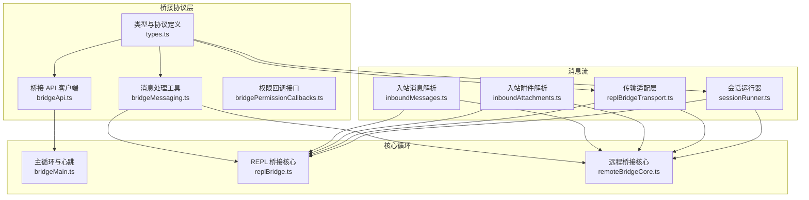
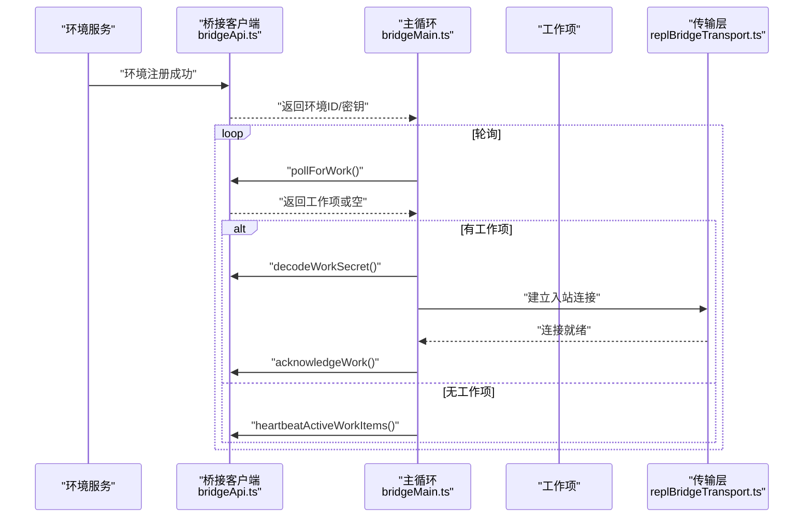
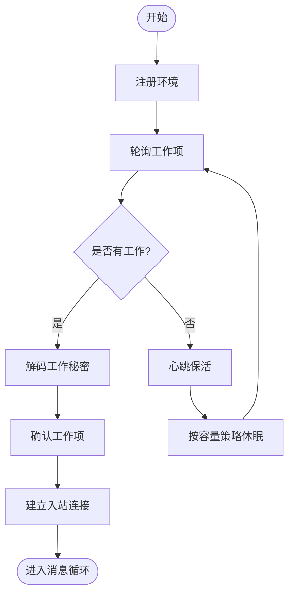
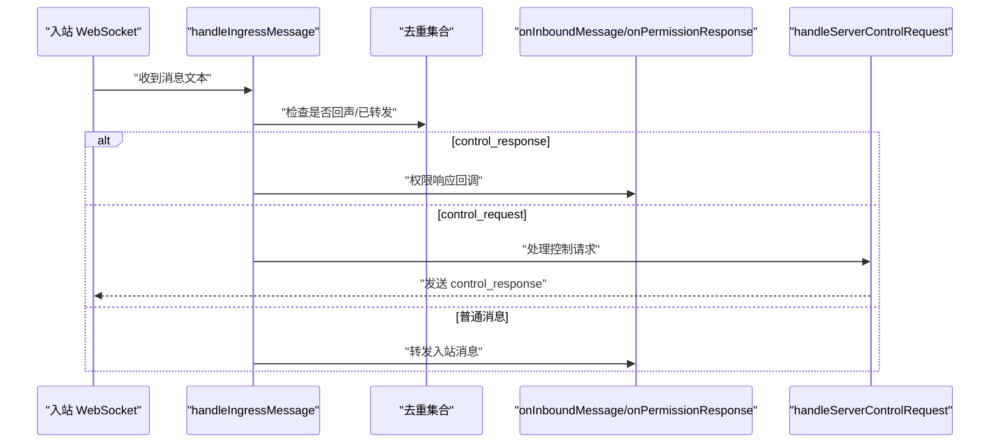
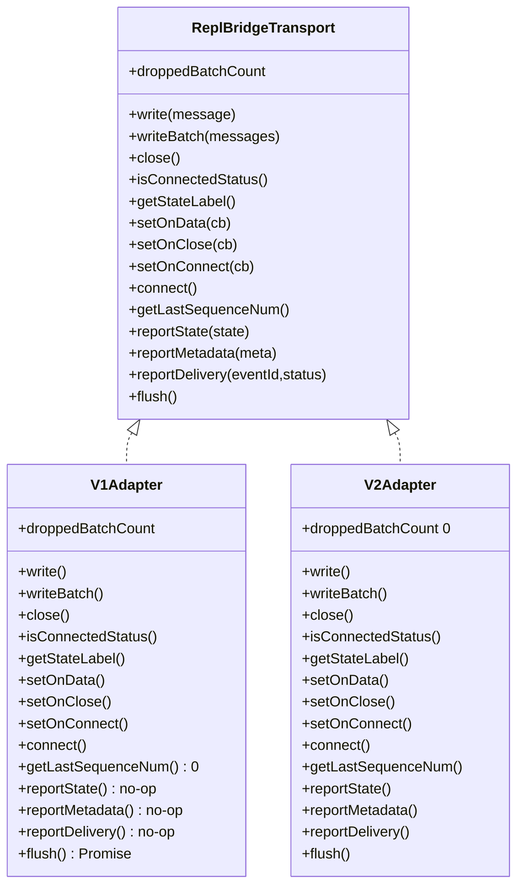
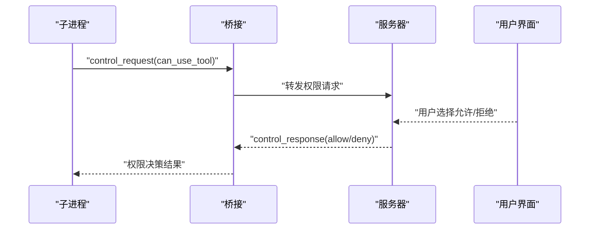
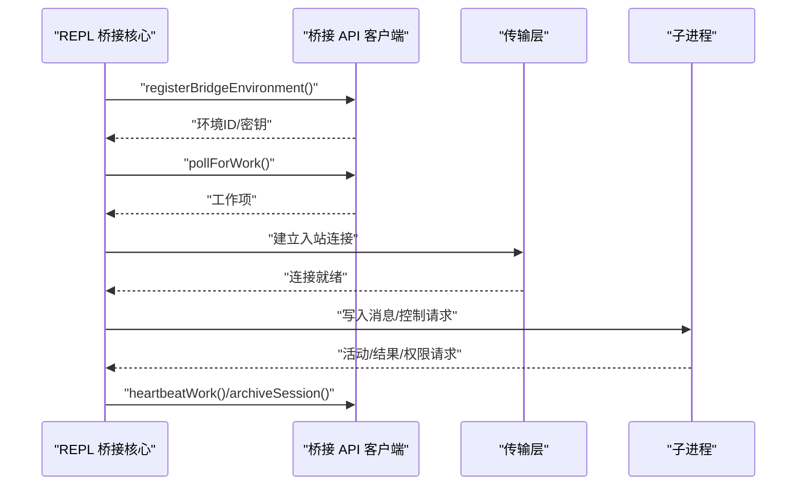
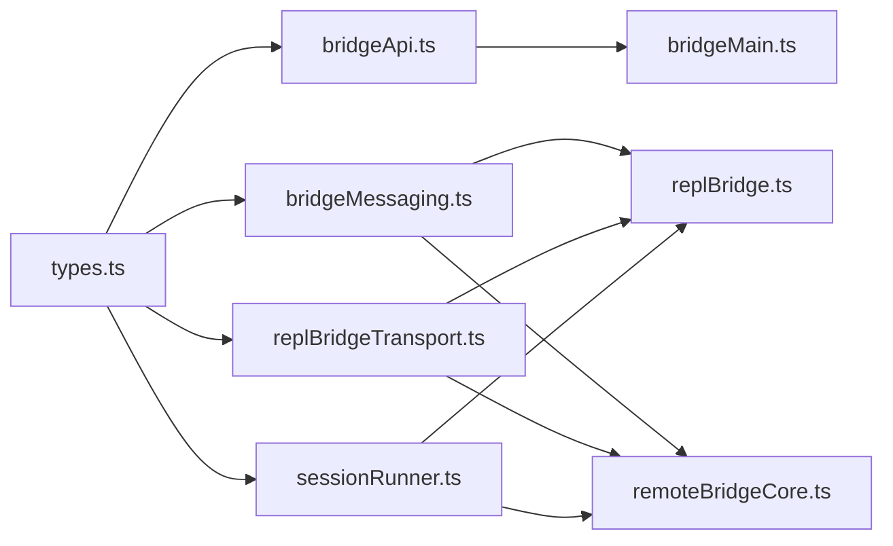

# 协议实现机制

<cite>
**本文档引用的文件**
- [bridgeApi.ts](file://src/bridge/bridgeApi.ts)
- [bridgeMessaging.ts](file://src/bridge/bridgeMessaging.ts)
- [bridgePermissionCallbacks.ts](file://src/bridge/bridgePermissionCallbacks.ts)
- [types.ts](file://src/bridge/types.ts)
- [bridgeMain.ts](file://src/bridge/bridgeMain.ts)
- [inboundMessages.ts](file://src/bridge/inboundMessages.ts)
- [inboundAttachments.ts](file://src/bridge/inboundAttachments.ts)
- [replBridge.ts](file://src/bridge/replBridge.ts)
- [replBridgeTransport.ts](file://src/bridge/replBridgeTransport.ts)
- [remoteBridgeCore.ts](file://src/bridge/remoteBridgeCore.ts)
- [workSecret.ts](file://src/bridge/workSecret.ts)
- [sessionRunner.ts](file://src/bridge/sessionRunner.ts)
- [debugUtils.ts](file://src/bridge/debugUtils.ts)
- [bridgeDebug.ts](file://src/bridge/bridgeDebug.ts)
</cite>

## 目录
1. [简介](#简介)
2. [项目结构](#项目结构)
3. [核心组件](#核心组件)
4. [架构总览](#架构总览)
5. [详细组件分析](#详细组件分析)
6. [依赖关系分析](#依赖关系分析)
7. [性能考虑](#性能考虑)
8. [故障排查指南](#故障排查指南)
9. [结论](#结论)

## 简介
本文件面向 free-code 的桥接协议实现，系统性阐述其通信协议设计、消息传递机制与权限回调体系。内容覆盖入站消息处理、出站消息发送、权限决策流程、消息序列化/反序列化、错误处理策略、协议规范（消息格式、事件类型、状态同步）以及实际消息流示例与调试技巧。目标读者既包括需要快速上手的开发者，也包括希望深入理解实现细节的技术人员。

## 项目结构
free-code 的桥接协议由多层模块协同完成：
- 协议与类型定义：统一的桥接 API 客户端、工作项与会话数据模型、权限事件等。
- 消息处理层：入站消息解析、去重、权限请求路由、控制请求响应。
- 传输适配层：v1（HybridTransport + Session-Ingress WS）与 v2（SSETransport + CCRClient）双栈支持。
- 会话运行器：子进程管理、活动记录、权限请求转发、令牌刷新。
- 调试与容错：敏感信息脱敏、错误描述提取、故障注入与恢复路径。

**图表来源**
- [types.ts](file://src/bridge/types.ts)
- [bridgeApi.ts](file://src/bridge/bridgeApi.ts)
- [bridgeMessaging.ts](file://src/bridge/bridgeMessaging.ts)
- [bridgePermissionCallbacks.ts](file://src/bridge/bridgePermissionCallbacks.ts)
- [inboundMessages.ts](file://src/bridge/inboundMessages.ts)
- [inboundAttachments.ts](file://src/bridge/inboundAttachments.ts)
- [replBridgeTransport.ts](file://src/bridge/replBridgeTransport.ts)
- [sessionRunner.ts](file://src/bridge/sessionRunner.ts)
- [bridgeMain.ts](file://src/bridge/bridgeMain.ts)
- [replBridge.ts](file://src/bridge/replBridge.ts)
- [remoteBridgeCore.ts](file://src/bridge/remoteBridgeCore.ts)

**章节来源**
- [types.ts](file://src/bridge/types.ts)
- [bridgeApi.ts](file://src/bridge/bridgeApi.ts)
- [bridgeMessaging.ts](file://src/bridge/bridgeMessaging.ts)
- [bridgePermissionCallbacks.ts](file://src/bridge/bridgePermissionCallbacks.ts)
- [inboundMessages.ts](file://src/bridge/inboundMessages.ts)
- [inboundAttachments.ts](file://src/bridge/inboundAttachments.ts)
- [replBridgeTransport.ts](file://src/bridge/replBridgeTransport.ts)
- [sessionRunner.ts](file://src/bridge/sessionRunner.ts)
- [bridgeMain.ts](file://src/bridge/bridgeMain.ts)
- [replBridge.ts](file://src/bridge/replBridge.ts)
- [remoteBridgeCore.ts](file://src/bridge/remoteBridgeCore.ts)

## 核心组件
- 桥接 API 客户端：封装环境注册、工作轮询、工作确认/停止、会话归档/重连、心跳等 HTTP 接口；内置 OAuth 401 刷新与致命错误分类。
- 消息处理工具：统一解析 SDKMessage，过滤 echo 与重复消息，分发到入站回调或权限响应处理器；支持控制请求（initialize/set_model/set_permission_mode/interrupt）的即时响应。
- 权限回调接口：抽象权限请求/响应的桥接接口，确保在不同上下文（REPL/守护进程）中可注入策略与 UI。
- 传输适配层：v1 使用 HybridTransport（WebSocket 读 + Session-Ingress POST 写），v2 使用 SSETransport（读）+ CCRClient（写/心跳/状态上报）。
- 会话运行器：负责子进程生命周期、活动记录、权限请求转发、令牌更新与转录日志。
- 主循环与心跳：环境级轮询、工作项确认、心跳保活、容量唤醒、超时与过期处理。

**章节来源**
- [bridgeApi.ts](file://src/bridge/bridgeApi.ts)
- [bridgeMessaging.ts](file://src/bridge/bridgeMessaging.ts)
- [bridgePermissionCallbacks.ts](file://src/bridge/bridgePermissionCallbacks.ts)
- [replBridgeTransport.ts](file://src/bridge/replBridgeTransport.ts)
- [sessionRunner.ts](file://src/bridge/sessionRunner.ts)
- [bridgeMain.ts](file://src/bridge/bridgeMain.ts)

## 架构总览
桥接协议采用“环境层 + 会话层 + 传输层”的三层架构：
- 环境层：通过环境注册与工作轮询协调会话生命周期，支持健康检查与容量管理。
- 会话层：基于工作秘密解码获取会话访问凭据，建立入站连接并进行消息编排。
- 传输层：v1/v2 双栈，分别面向传统 WebSocket 与 CCR v2 SSE/HTTP 协议。

**图表来源**
- [bridgeApi.ts](file://src/bridge/bridgeApi.ts)
- [bridgeMain.ts](file://src/bridge/bridgeMain.ts)
- [replBridgeTransport.ts](file://src/bridge/replBridgeTransport.ts)

**章节来源**
- [bridgeApi.ts](file://src/bridge/bridgeApi.ts)
- [bridgeMain.ts](file://src/bridge/bridgeMain.ts)
- [replBridgeTransport.ts](file://src/bridge/replBridgeTransport.ts)

## 详细组件分析

### 组件A：桥接 API 客户端（HTTP 协议）
- 功能要点
  - 环境注册：携带机器名、目录、分支、仓库 URL、最大会话数、元数据等，支持幂等重注册。
  - 工作轮询：带超时与信号中断，空响应计数与日志节流。
  - 工作确认/停止/反注册：对会话生命周期进行精确控制。
  - 心跳保活：使用会话凭据而非环境密钥，避免数据库查询。
  - 权限事件上报：通过会话事件接口发送控制响应事件。
  - 错误分类：区分 401/403/404/410/429 等，支持可抑制的 403。
  - OAuth 401 自动刷新：在允许的情况下尝试刷新并重试一次。
- 关键类型
  - WorkResponse/WorkSecret：工作项与凭据载体。
  - BridgeApiClient：对外暴露的 API 接口集合。
- 序列化/反序列化
  - 工作秘密采用 base64url 编码 JSON，版本校验后解析。
  - 日志输出使用安全脱敏与长度截断。

**图表来源**
- [bridgeApi.ts](file://src/bridge/bridgeApi.ts)
- [workSecret.ts](file://src/bridge/workSecret.ts)

**章节来源**
- [bridgeApi.ts](file://src/bridge/bridgeApi.ts)
- [workSecret.ts](file://src/bridge/workSecret.ts)

### 组件B：消息处理与去重（入站）
- 入站消息解析
  - 统一 SDKMessage 类型守卫，先识别 control_response，再识别 control_request，最后普通消息。
  - 基于 UUID 的回声过滤与二次去重（recentPostedUUIDs/recentInboundUUIDs）。
  - 仅转发用户/助理/本地命令系统事件，忽略内部 REPL 事件。
- 入站消息字段提取
  - 支持字符串内容与 ContentBlockParam[]（含图片），并对媒体类型进行规范化。
- 入站附件解析
  - 从消息中提取 file_attachments，通过 OAuth 获取文件内容并落盘，生成 @path 引用前缀。
- 控制请求处理
  - 对 initialize/set_model/set_permission_mode/interrupt 等请求进行即时响应，超时则报错。

**图表来源**
- [bridgeMessaging.ts](file://src/bridge/bridgeMessaging.ts)
- [inboundMessages.ts](file://src/bridge/inboundMessages.ts)
- [inboundAttachments.ts](file://src/bridge/inboundAttachments.ts)

**章节来源**
- [bridgeMessaging.ts](file://src/bridge/bridgeMessaging.ts)
- [inboundMessages.ts](file://src/bridge/inboundMessages.ts)
- [inboundAttachments.ts](file://src/bridge/inboundAttachments.ts)

### 组件C：传输适配层（v1/v2）
- v1（HybridTransport）
  - WebSocket 读取 + Session-Ingress POST 写入。
  - 无 SSE 序号承载，历史重放由服务端游标处理。
- v2（SSETransport + CCRClient）
  - SSE 读取事件流，CCRClient 写入事件与心跳。
  - 首次连接携带 from_sequence_num/Last-Event-ID，避免历史重放。
  - epoch 不匹配时主动关闭并触发主循环恢复。
- 认证差异
  - v2 端点要求 JWT（不接受 OAuth），需通过 /bridge 获取 worker_jwt 并周期刷新。
  - v1 使用 OAuth 令牌，便于 REPL 直接调用。

**图表来源**
- [replBridgeTransport.ts](file://src/bridge/replBridgeTransport.ts)

**章节来源**
- [replBridgeTransport.ts](file://src/bridge/replBridgeTransport.ts)

### 组件D：权限回调系统
- 权限请求
  - 子进程通过 control_request 发出 can_use_tool 请求，桥接转发至服务器等待用户决策。
- 权限响应
  - 用户决策以 control_response 形式返回，桥接将其转换为 BridgePermissionResponse 并回调上层。
- 回调接口
  - sendRequest/sendResponse/cancelRequest/onResponse 提供完整的权限生命周期管理。

**图表来源**
- [bridgePermissionCallbacks.ts](file://src/bridge/bridgePermissionCallbacks.ts)
- [sessionRunner.ts](file://src/bridge/sessionRunner.ts)

**章节来源**
- [bridgePermissionCallbacks.ts](file://src/bridge/bridgePermissionCallbacks.ts)
- [sessionRunner.ts](file://src/bridge/sessionRunner.ts)

### 组件E：REPL 与远程桥接核心
- REPL 桥接核心
  - 环境注册 → 会话创建 → 轮询工作项 → 建立入站连接 → 处理消息与控制请求 → 心跳保活 → 归档与清理。
  - 支持崩溃恢复指针、持久化序列号、标题派生、超时看门狗。
- 远程桥接核心（v2）
  - 直接创建会话并获取 worker_jwt，无需环境层。
  - 周期刷新 JWT 并重建传输，401 自动恢复。
  - 初始历史刷写与队列门控，保证顺序一致性。

**图表来源**
- [replBridge.ts](file://src/bridge/replBridge.ts)
- [remoteBridgeCore.ts](file://src/bridge/remoteBridgeCore.ts)
- [bridgeApi.ts](file://src/bridge/bridgeApi.ts)
- [replBridgeTransport.ts](file://src/bridge/replBridgeTransport.ts)

**章节来源**
- [replBridge.ts](file://src/bridge/replBridge.ts)
- [remoteBridgeCore.ts](file://src/bridge/remoteBridgeCore.ts)
- [bridgeApi.ts](file://src/bridge/bridgeApi.ts)
- [replBridgeTransport.ts](file://src/bridge/replBridgeTransport.ts)

## 依赖关系分析
- 模块耦合
  - bridgeApi.ts 与 types.ts 高内聚，提供稳定的 API 接口契约。
  - bridgeMessaging.ts 与 replBridge.ts/remoteBridgeCore.ts 低耦合，通过回调注入实现跨场景复用。
  - sessionRunner.ts 与 replBridgeTransport.ts 通过 SessionHandle/ReplBridgeTransport 解耦。
- 外部依赖
  - axios 用于 HTTP 通信；crypto 用于 UUID；第三方传输组件（SSETransport/CCRClient）。
- 循环依赖
  - 未发现直接循环；各模块通过接口与回调避免相互导入。

**图表来源**
- [types.ts](file://src/bridge/types.ts)
- [bridgeApi.ts](file://src/bridge/bridgeApi.ts)
- [bridgeMessaging.ts](file://src/bridge/bridgeMessaging.ts)
- [replBridgeTransport.ts](file://src/bridge/replBridgeTransport.ts)
- [sessionRunner.ts](file://src/bridge/sessionRunner.ts)
- [bridgeMain.ts](file://src/bridge/bridgeMain.ts)
- [replBridge.ts](file://src/bridge/replBridge.ts)
- [remoteBridgeCore.ts](file://src/bridge/remoteBridgeCore.ts)

**章节来源**
- [types.ts](file://src/bridge/types.ts)
- [bridgeApi.ts](file://src/bridge/bridgeApi.ts)
- [bridgeMessaging.ts](file://src/bridge/bridgeMessaging.ts)
- [replBridgeTransport.ts](file://src/bridge/replBridgeTransport.ts)
- [sessionRunner.ts](file://src/bridge/sessionRunner.ts)
- [bridgeMain.ts](file://src/bridge/bridgeMain.ts)
- [replBridge.ts](file://src/bridge/replBridge.ts)
- [remoteBridgeCore.ts](file://src/bridge/remoteBridgeCore.ts)

## 性能考虑
- 轮询与心跳
  - 空闲时按容量策略休眠，避免过度轮询；心跳模式与非独占心跳间隔可配置。
- 去重与回声过滤
  - BoundedUUIDSet 以常数空间维持最近消息 UUID，降低内存占用与重复处理开销。
- 批量写入
  - v2 通过 CCRClient 的批量上传器合并事件，减少网络往返。
- 超时与背压
  - 初始历史刷写使用 FlushGate 防止乱序；容量唤醒机制在会话结束时立即恢复轮询。
- 令牌刷新
  - v1 使用 OAuth 直接下发给子进程；v2 通过 /bridge 重新注册并重建传输，避免静默失效。

[本节为通用指导，无需特定文件引用]

## 故障排查指南
- 常见错误与处理
  - 401/403：尝试 OAuth 刷新（若可用），否则抛出 BridgeFatalError；可抑制的 403 不影响核心功能。
  - 404/410：环境过期或不存在，触发重注册与会话重连策略。
  - 429：轮询过于频繁，调整轮询间隔。
- 故障注入与恢复
  - 仅限内部构建：通过 /bridge-kick 注入致命/瞬时故障，验证恢复路径。
  - 传输层：v2 的 epoch 不匹配会主动关闭并触发主循环恢复。
- 调试技巧
  - 使用 debugBody/redactSecrets 输出安全日志，避免泄露敏感信息。
  - 结合 debugTruncate 截断长消息，便于定位问题。
  - 在 REPL 中启用详细日志与转录文件，配合 Activity 记录分析执行轨迹。

**章节来源**
- [bridgeApi.ts](file://src/bridge/bridgeApi.ts)
- [debugUtils.ts](file://src/bridge/debugUtils.ts)
- [bridgeDebug.ts](file://src/bridge/bridgeDebug.ts)
- [sessionRunner.ts](file://src/bridge/sessionRunner.ts)

## 结论
free-code 的桥接协议通过清晰的分层设计与严格的契约约束，实现了稳定高效的远程控制能力。其核心优势在于：
- 明确的协议规范与类型系统，确保消息与事件的一致性。
- 双栈传输适配，兼顾兼容性与性能。
- 完整的权限回调与错误处理机制，保障用户体验与系统鲁棒性。
- 丰富的调试与容错能力，便于问题定位与快速恢复。