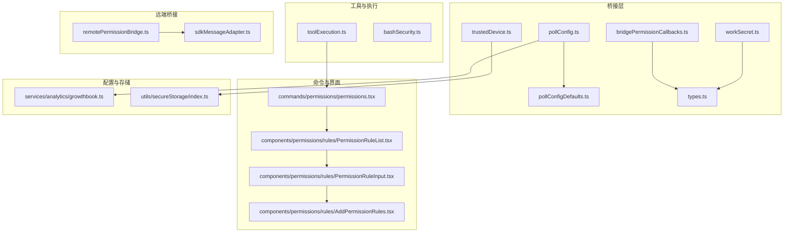
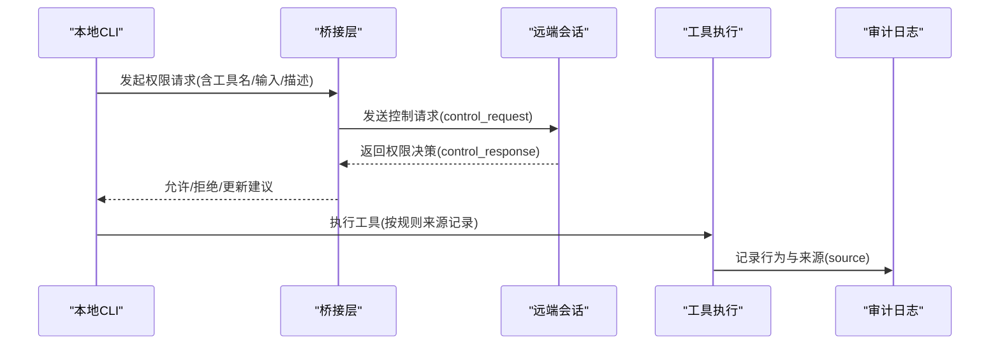
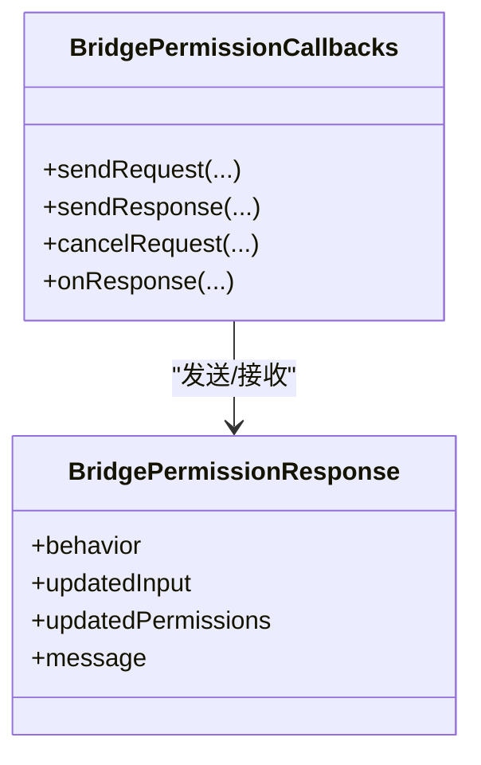
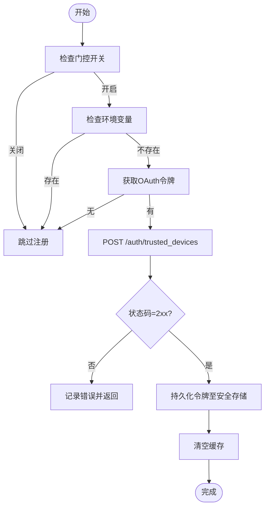
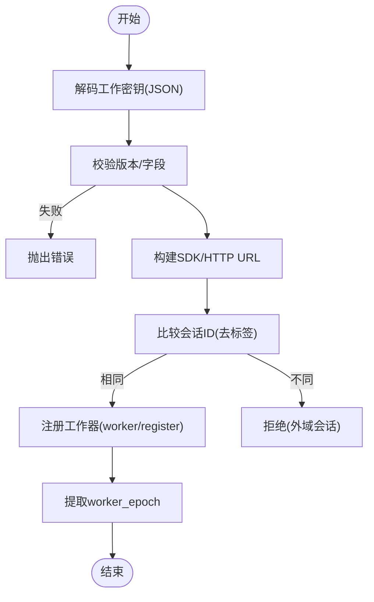
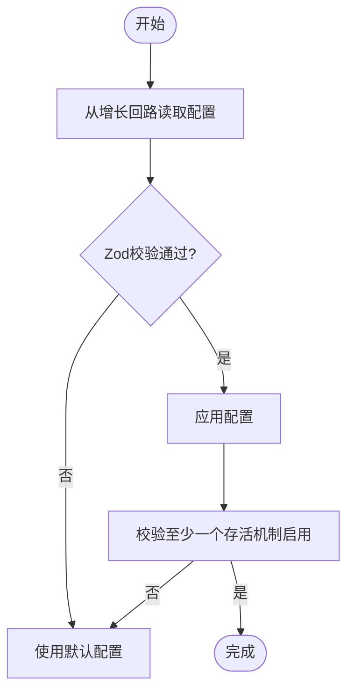
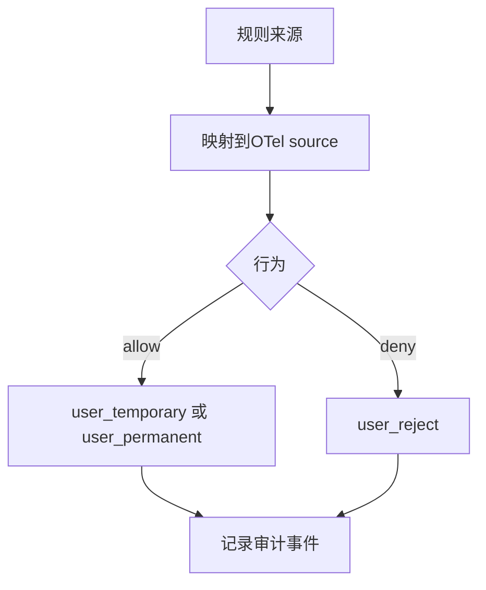
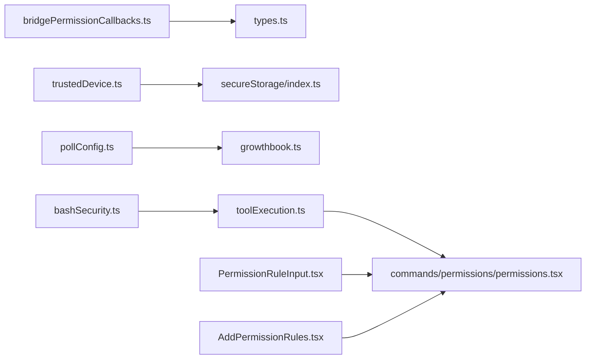

# 权限控制系统

<cite>
**本文引用的文件**
- [bridgePermissionCallbacks.ts](file://src/bridge/bridgePermissionCallbacks.ts)
- [trustedDevice.ts](file://src/bridge/trustedDevice.ts)
- [workSecret.ts](file://src/bridge/workSecret.ts)
- [pollConfig.ts](file://src/bridge/pollConfig.ts)
- [pollConfigDefaults.ts](file://src/bridge/pollConfigDefaults.ts)
- [types.ts](file://src/bridge/types.ts)
- [toolExecution.ts](file://src/services/tools/toolExecution.ts)
- [bashSecurity.ts](file://src/tools/BashTool/bashSecurity.ts)
- [PermissionUpdate.ts](file://src/utils/permissions/PermissionUpdate.ts)
- [permissions.tsx](file://src/commands/permissions/permissions.tsx)
- [PermissionRuleList.tsx](file://src/components/permissions/rules/PermissionRuleList.tsx)
- [PermissionRuleInput.tsx](file://src/components/permissions/rules/PermissionRuleInput.tsx)
- [AddPermissionRules.tsx](file://src/components/permissions/rules/AddPermissionRules.tsx)
- [jwtUtils.ts](file://src/bridge/jwtUtils.ts)
- [remotePermissionBridge.ts](file://src/remote/remotePermissionBridge.ts)
- [sdkMessageAdapter.ts](file://src/remote/sdkMessageAdapter.ts)
- [analytics/growthbook.ts](file://src/services/analytics/growthbook.ts)
- [secureStorage/index.ts](file://src/utils/secureStorage/index.ts)
- [messages.ts](file://src/utils/messages.ts)
</cite>

## 目录
1. [简介](#简介)
2. [项目结构](#项目结构)
3. [核心组件](#核心组件)
4. [架构总览](#架构总览)
5. [详细组件分析](#详细组件分析)
6. [依赖关系分析](#依赖关系分析)
7. [性能考量](#性能考量)
8. [故障排查指南](#故障排查指南)
9. [结论](#结论)
10. [附录](#附录)

## 简介
本文件系统性阐述 free-code 的权限控制系统，覆盖权限验证机制、设备信任管理、访问控制策略、权限回调处理、工作密钥验证与轮询配置管理，并补充安全令牌处理、权限升级机制与审计日志记录。文档同时提供权限配置指南、安全最佳实践与常见问题解决方案，以及权限系统的架构设计与实现细节。

## 项目结构
权限控制相关代码主要分布在以下模块：
- 桥接层（Bridge）：负责与远端会话交互、权限回调、设备信任、轮询配置与工作密钥解析
- 工具执行与安全：工具执行时的规则来源映射与安全检查
- 命令与界面：权限规则的展示、输入与交互
- 远端桥接：远程权限桥接与消息适配
- 配置与存储：增长回路（GrowthBook）配置、安全存储

图表来源
- [bridgePermissionCallbacks.ts:1-44](file://src/bridge/bridgePermissionCallbacks.ts#L1-L44)
- [trustedDevice.ts:1-211](file://src/bridge/trustedDevice.ts#L1-L211)
- [workSecret.ts:1-128](file://src/bridge/workSecret.ts#L1-L128)
- [pollConfig.ts:1-111](file://src/bridge/pollConfig.ts#L1-L111)
- [pollConfigDefaults.ts:1-83](file://src/bridge/pollConfigDefaults.ts#L1-L83)
- [types.ts:117-131](file://src/bridge/types.ts#L117-L131)
- [toolExecution.ts:173-194](file://src/services/tools/toolExecution.ts#L173-L194)
- [bashSecurity.ts:1046-1085](file://src/tools/BashTool/bashSecurity.ts#L1046-L1085)
- [permissions.tsx:1-9](file://src/commands/permissions/permissions.tsx#L1-L9)
- [remotePermissionBridge.ts](file://src/remote/remotePermissionBridge.ts)
- [sdkMessageAdapter.ts](file://src/remote/sdkMessageAdapter.ts)

章节来源
- [bridgePermissionCallbacks.ts:1-44](file://src/bridge/bridgePermissionCallbacks.ts#L1-L44)
- [trustedDevice.ts:1-211](file://src/bridge/trustedDevice.ts#L1-L211)
- [workSecret.ts:1-128](file://src/bridge/workSecret.ts#L1-L128)
- [pollConfig.ts:1-111](file://src/bridge/pollConfig.ts#L1-L111)
- [pollConfigDefaults.ts:1-83](file://src/bridge/pollConfigDefaults.ts#L1-L83)
- [permissions.tsx:1-9](file://src/commands/permissions/permissions.tsx#L1-L9)

## 核心组件
- 权限回调接口与响应模型：定义请求/响应契约、类型守卫与取消机制
- 设备信任令牌：门控开关、缓存与持久化、注册与清理流程
- 工作密钥解析：解码、URL 构建、会话一致性校验与工作器注册
- 轮询配置：GrowthBook 动态配置、参数校验与默认值
- 规则来源与审计：规则来源到 OpenTelemetry 源字段映射
- 安全检查：工具执行中的敏感路径与注入风险检测
- 远端权限桥接：SDK 消息适配与远程权限决策传递

章节来源
- [bridgePermissionCallbacks.ts:1-44](file://src/bridge/bridgePermissionCallbacks.ts#L1-L44)
- [trustedDevice.ts:1-211](file://src/bridge/trustedDevice.ts#L1-L211)
- [workSecret.ts:1-128](file://src/bridge/workSecret.ts#L1-L128)
- [pollConfig.ts:1-111](file://src/bridge/pollConfig.ts#L1-L111)
- [toolExecution.ts:173-194](file://src/services/tools/toolExecution.ts#L173-L194)
- [bashSecurity.ts:1046-1085](file://src/tools/BashTool/bashSecurity.ts#L1046-L1085)

## 架构总览
权限控制贯穿“本地桥接—远端会话—工具执行—审计日志”链路，采用“门控开关 + 动态配置 + 缓存 + 安全存储”的组合策略，确保在不同环境与场景下保持一致的安全基线。

图表来源
- [bridgePermissionCallbacks.ts:10-27](file://src/bridge/bridgePermissionCallbacks.ts#L10-L27)
- [types.ts:124-131](file://src/bridge/types.ts#L124-L131)
- [toolExecution.ts:181-194](file://src/services/tools/toolExecution.ts#L181-L194)

## 详细组件分析

### 权限回调处理与响应模型
- 请求/响应契约：定义允许/拒绝、可选更新输入与权限建议、消息提示
- 类型守卫：对响应载荷进行严格校验，避免不安全断言
- 取消机制：支持取消待决请求，便于前端交互关闭

图表来源
- [bridgePermissionCallbacks.ts:3-27](file://src/bridge/bridgePermissionCallbacks.ts#L3-L27)

章节来源
- [bridgePermissionCallbacks.ts:1-44](file://src/bridge/bridgePermissionCallbacks.ts#L1-L44)
- [types.ts:124-131](file://src/bridge/types.ts#L124-L131)

### 设备信任管理与安全令牌处理
- 门控开关：通过增长回路门控决定是否启用设备信任
- 缓存与持久化：基于安全存储的令牌读取缓存，减少系统调用开销
- 注册流程：登录后在会话窗口内注册设备令牌，失败时记录调试信息
- 清理策略：登出或会话切换时清除旧令牌，避免跨账户污染
- 环境变量优先：企业封装可通过环境变量直接注入令牌

图表来源
- [trustedDevice.ts:35-59](file://src/bridge/trustedDevice.ts#L35-L59)
- [trustedDevice.ts:103-117](file://src/bridge/trustedDevice.ts#L103-L117)
- [trustedDevice.ts:125-132](file://src/bridge/trustedDevice.ts#L125-L132)
- [trustedDevice.ts:142-172](file://src/bridge/trustedDevice.ts#L142-L172)
- [trustedDevice.ts:182-198](file://src/bridge/trustedDevice.ts#L182-L198)

章节来源
- [trustedDevice.ts:1-211](file://src/bridge/trustedDevice.ts#L1-L211)

### 工作密钥验证与会话一致性
- 解码校验：base64url 解码并校验版本号与必要字段
- URL 构建：根据 API 基础地址与会话 ID 生成 SDK/HTTP URL
- 会话比较：忽略标签前缀，仅比较主体 UUID，保证兼容性
- 工作器注册：向会话注册当前桥接为工作器，返回工作轮次以用于心跳等

图表来源
- [workSecret.ts:6-32](file://src/bridge/workSecret.ts#L6-L32)
- [workSecret.ts:41-87](file://src/bridge/workSecret.ts#L41-L87)
- [workSecret.ts:62-73](file://src/bridge/workSecret.ts#L62-L73)
- [workSecret.ts:97-127](file://src/bridge/workSecret.ts#L97-L127)

章节来源
- [workSecret.ts:1-128](file://src/bridge/workSecret.ts#L1-L128)

### 轮询配置管理与动态调整
- 动态配置：从增长回路读取轮询配置，带刷新窗口与回退默认值
- 参数校验：严格的最小值约束与互斥条件，防止误配置导致紧循环
- 多会话支持：独立的多会话轮询间隔，保持与单会话一致的行为语义
- 生效策略：任一“容量下/容量中/心跳”存活机制启用即生效

图表来源
- [pollConfig.ts:102-110](file://src/bridge/pollConfig.ts#L102-L110)
- [pollConfig.ts:28-92](file://src/bridge/pollConfig.ts#L28-L92)
- [pollConfigDefaults.ts:55-82](file://src/bridge/pollConfigDefaults.ts#L55-L82)

章节来源
- [pollConfig.ts:1-111](file://src/bridge/pollConfig.ts#L1-L111)
- [pollConfigDefaults.ts:1-83](file://src/bridge/pollConfigDefaults.ts#L1-L83)

### 权限规则来源与审计日志
- 规则来源映射：将“会话级/用户设置/本地设置”等来源映射为 OpenTelemetry 的 source 字段
- 行为影响：允许/拒绝分别对应临时/永久或用户拒绝，便于审计与可视化
- 日志记录：在应用权限更新时输出调试日志，便于追踪变更

图表来源
- [toolExecution.ts:181-194](file://src/services/tools/toolExecution.ts#L181-L194)
- [PermissionUpdate.ts:122-160](file://src/utils/permissions/PermissionUpdate.ts#L122-L160)

章节来源
- [toolExecution.ts:173-194](file://src/services/tools/toolExecution.ts#L173-L194)
- [PermissionUpdate.ts:122-160](file://src/utils/permissions/PermissionUpdate.ts#L122-L160)

### 安全令牌处理与权限升级机制
- JWT 工具：提供 JWT 相关工具函数，用于令牌解析与校验
- 权限升级：当工具执行触发高风险行为时，系统可要求用户确认或提供权限建议
- 审计事件：对安全检查触发点进行事件记录，便于后续审计

章节来源
- [jwtUtils.ts](file://src/bridge/jwtUtils.ts)
- [bashSecurity.ts:1046-1085](file://src/tools/BashTool/bashSecurity.ts#L1046-L1085)

### 远端权限桥接与消息适配
- 远端桥接：将本地权限决策与远端会话桥接，确保权限策略一致
- SDK 消息适配：适配 SDK 协议的消息格式，传递控制响应

章节来源
- [remotePermissionBridge.ts](file://src/remote/remotePermissionBridge.ts)
- [sdkMessageAdapter.ts](file://src/remote/sdkMessageAdapter.ts)

### 权限配置与用户交互
- 规则列表：展示当前权限规则，支持重试被拒绝的规则
- 规则输入：提供规则输入框与示例，指导用户正确配置
- 添加规则：支持添加允许/拒绝/询问规则，并记录来源

章节来源
- [permissions.tsx:1-9](file://src/commands/permissions/permissions.tsx#L1-L9)
- [PermissionRuleList.tsx](file://src/components/permissions/rules/PermissionRuleList.tsx)
- [PermissionRuleInput.tsx:79-113](file://src/components/permissions/rules/PermissionRuleInput.tsx#L79-L113)
- [AddPermissionRules.tsx:139-179](file://src/components/permissions/rules/AddPermissionRules.tsx#L139-L179)

## 依赖关系分析
- 组件耦合
  - 桥接层与远端会话：通过回调接口与响应模型进行解耦
  - 设备信任与安全存储：依赖安全存储模块进行令牌持久化
  - 轮询配置与增长回路：通过门控与刷新窗口实现动态调整
  - 规则来源与审计：通过规则来源映射统一审计语义
- 外部依赖
  - axios：用于设备注册与工作器注册等 HTTP 请求
  - lodash-es/memoize：用于令牌读取缓存
  - zod：用于轮询配置的严格校验

图表来源
- [bridgePermissionCallbacks.ts:1-44](file://src/bridge/bridgePermissionCallbacks.ts#L1-L44)
- [trustedDevice.ts:1-211](file://src/bridge/trustedDevice.ts#L1-L211)
- [pollConfig.ts:1-111](file://src/bridge/pollConfig.ts#L1-L111)
- [toolExecution.ts:173-194](file://src/services/tools/toolExecution.ts#L173-L194)
- [permissions.tsx:1-9](file://src/commands/permissions/permissions.tsx#L1-L9)
- [PermissionRuleInput.tsx:79-113](file://src/components/permissions/rules/PermissionRuleInput.tsx#L79-L113)
- [AddPermissionRules.tsx:139-179](file://src/components/permissions/rules/AddPermissionRules.tsx#L139-L179)
- [bashSecurity.ts:1046-1085](file://src/tools/BashTool/bashSecurity.ts#L1046-L1085)

## 性能考量
- 缓存优化：设备信任令牌读取使用缓存，降低系统调用成本
- 轮询节流：严格的最小轮询间隔与存活机制校验，避免紧循环
- 默认值与回退：配置解析失败时快速回退默认值，保障稳定性
- 会话比较：忽略标签前缀的会话比较逻辑，避免不必要的字符串处理

## 故障排查指南
- 设备信任未生效
  - 检查门控开关状态与环境变量优先级
  - 查看注册请求的状态码与响应体
  - 确认安全存储写入成功并已清空缓存
- 轮询配置异常
  - 校验增长回路配置是否满足最小间隔与至少一个存活机制启用
  - 检查刷新窗口与默认值回退逻辑
- 权限规则无效
  - 确认规则来源映射与行为匹配
  - 检查规则更新日志与过滤逻辑
- 工具执行被拒绝
  - 关注安全检查触发点与建议行为
  - 对高风险命令进行用户确认或降级处理

章节来源
- [trustedDevice.ts:167-172](file://src/bridge/trustedDevice.ts#L167-L172)
- [pollConfig.ts:74-91](file://src/bridge/pollConfig.ts#L74-L91)
- [PermissionUpdate.ts:139-160](file://src/utils/permissions/PermissionUpdate.ts#L139-L160)
- [bashSecurity.ts:1046-1085](file://src/tools/BashTool/bashSecurity.ts#L1046-L1085)

## 结论
该权限控制系统通过“门控开关 + 动态配置 + 缓存 + 安全存储 + 严格校验”的组合，在保证灵活性的同时强化了安全性与可观测性。桥接层、工具执行与远端会话之间的清晰边界，使得权限策略既可集中治理又能在本地快速响应。配合审计日志与调试信息，系统具备良好的可维护性与可诊断性。

## 附录
- 权限配置指南
  - 使用命令查看与编辑权限规则
  - 在输入框中按示例格式添加规则
  - 对于高风险工具，优先选择“询问”策略
- 安全最佳实践
  - 启用设备信任并在登录后及时注册
  - 限制轮询间隔，避免对服务器造成压力
  - 对规则来源进行分类管理，区分临时与永久策略
  - 对高风险命令进行用户确认与审计记录
- 常见问题
  - 令牌未持久化：检查安全存储可用性与写入结果
  - 轮询配置不生效：确认增长回路值满足最小间隔与存活机制
  - 规则冲突：检查来源映射与过滤逻辑，避免重复规则

章节来源
- [permissions.tsx:5-9](file://src/commands/permissions/permissions.tsx#L5-L9)
- [PermissionRuleInput.tsx:89-97](file://src/components/permissions/rules/PermissionRuleInput.tsx#L89-L97)
- [messages.ts](file://src/utils/messages.ts)