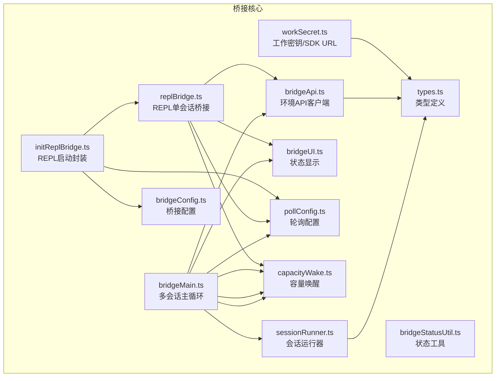
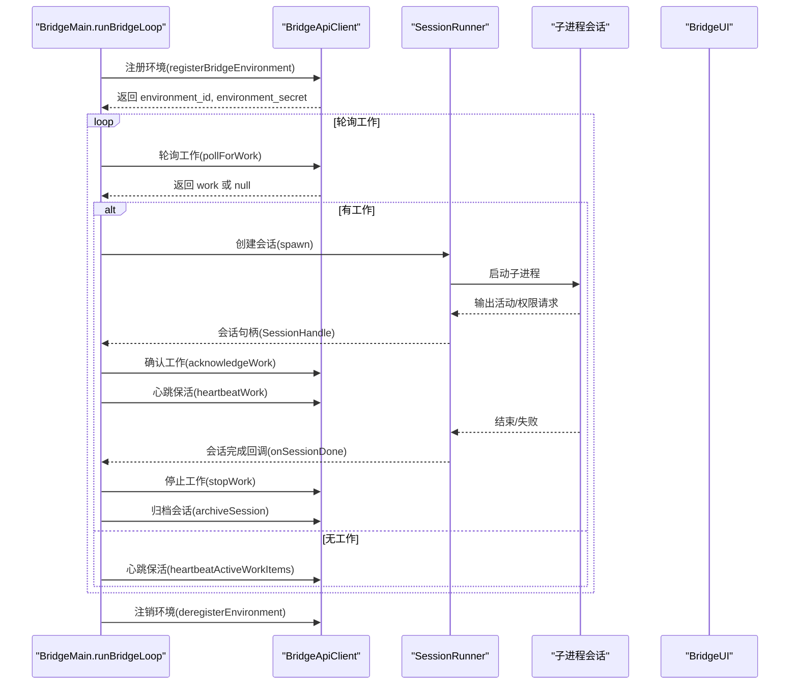
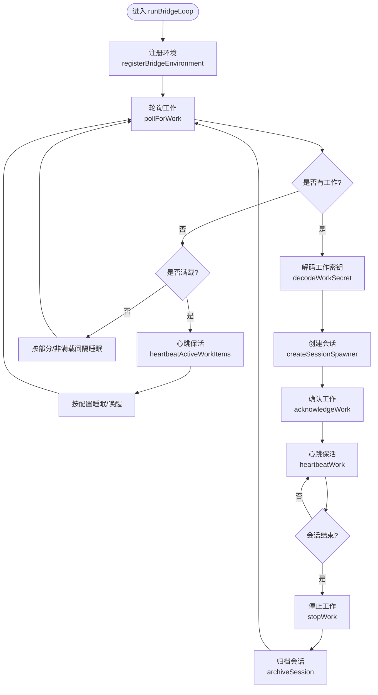
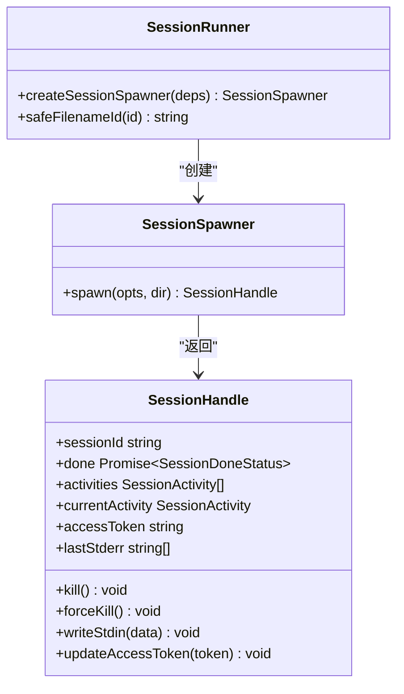
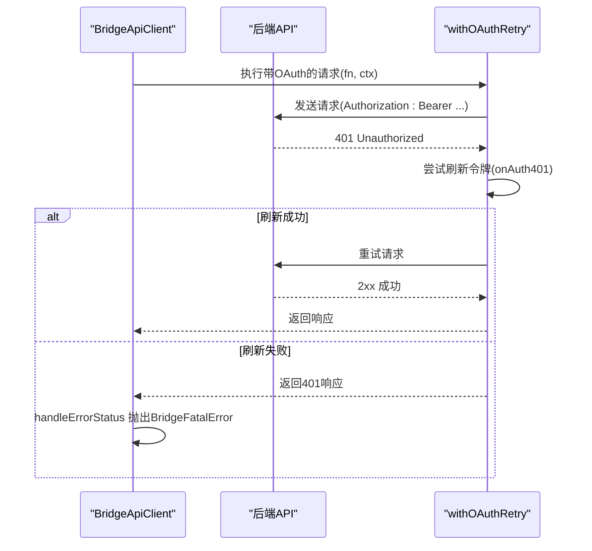
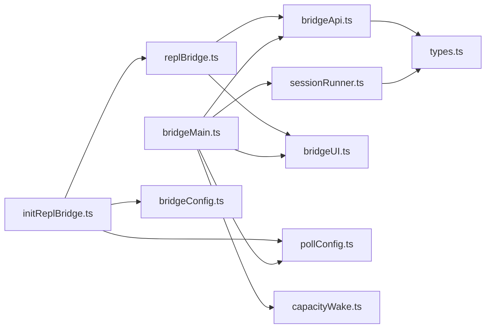

# 桥接架构设计

<cite>
**本文档引用的文件**
- [bridgeMain.ts](file://src/bridge/bridgeMain.ts)
- [sessionRunner.ts](file://src/bridge/sessionRunner.ts)
- [bridgeConfig.ts](file://src/bridge/bridgeConfig.ts)
- [types.ts](file://src/bridge/types.ts)
- [replBridge.ts](file://src/bridge/replBridge.ts)
- [bridgeApi.ts](file://src/bridge/bridgeApi.ts)
- [pollConfig.ts](file://src/bridge/pollConfig.ts)
- [bridgeUI.ts](file://src/bridge/bridgeUI.ts)
- [capacityWake.ts](file://src/bridge/capacityWake.ts)
- [bridgeStatusUtil.ts](file://src/bridge/bridgeStatusUtil.ts)
- [workSecret.ts](file://src/bridge/workSecret.ts)
- [initReplBridge.ts](file://src/bridge/initReplBridge.ts)
</cite>

## 目录
1. [简介](#简介)
2. [项目结构](#项目结构)
3. [核心组件](#核心组件)
4. [架构总览](#架构总览)
5. [详细组件分析](#详细组件分析)
6. [依赖关系分析](#依赖关系分析)
7. [性能考虑](#性能考虑)
8. [故障排除指南](#故障排除指南)
9. [结论](#结论)

## 简介
本文件面向 free-code 的桥接架构设计，系统性阐述桥接系统的核心理念、整体架构模式与实现细节。重点覆盖：
- BridgeMain 主循环机制、会话管理策略与生命周期控制
- 桥接配置系统、API 客户端设计与错误处理机制
- 会话运行器的工作原理、容量管理与资源分配策略
- 架构图表与组件交互说明，帮助开发者快速理解桥接系统的内部工作机制

## 项目结构
桥接系统位于 src/bridge 目录下，采用模块化分层设计：
- 核心运行时：bridgeMain.ts（多会话桥接）、replBridge.ts（REPL 单会话桥接）
- 会话管理：sessionRunner.ts（子进程会话生命周期管理）
- 配置与类型：bridgeConfig.ts、types.ts
- 通信与传输：bridgeApi.ts（环境 API 客户端）、workSecret.ts（工作密钥解析与 SDK URL 构建）
- UI 与状态：bridgeUI.ts、bridgeStatusUtil.ts
- 运行参数与策略：pollConfig.ts、capacityWake.ts
- REPL 启动封装：initReplBridge.ts

**图表来源**
- [bridgeMain.ts:1-800](file://src/bridge/bridgeMain.ts#L1-L800)
- [replBridge.ts:1-800](file://src/bridge/replBridge.ts#L1-L800)
- [sessionRunner.ts:1-551](file://src/bridge/sessionRunner.ts#L1-L551)
- [bridgeApi.ts:1-540](file://src/bridge/bridgeApi.ts#L1-L540)
- [workSecret.ts:1-128](file://src/bridge/workSecret.ts#L1-L128)
- [pollConfig.ts:1-111](file://src/bridge/pollConfig.ts#L1-L111)
- [capacityWake.ts:1-57](file://src/bridge/capacityWake.ts#L1-L57)
- [bridgeUI.ts:1-531](file://src/bridge/bridgeUI.ts#L1-L531)
- [bridgeStatusUtil.ts:1-164](file://src/bridge/bridgeStatusUtil.ts#L1-L164)
- [bridgeConfig.ts:1-49](file://src/bridge/bridgeConfig.ts#L1-L49)
- [types.ts:1-263](file://src/bridge/types.ts#L1-L263)
- [initReplBridge.ts:1-570](file://src/bridge/initReplBridge.ts#L1-L570)

**章节来源**
- [bridgeMain.ts:1-800](file://src/bridge/bridgeMain.ts#L1-L800)
- [replBridge.ts:1-800](file://src/bridge/replBridge.ts#L1-L800)
- [sessionRunner.ts:1-551](file://src/bridge/sessionRunner.ts#L1-L551)
- [bridgeApi.ts:1-540](file://src/bridge/bridgeApi.ts#L1-L540)
- [workSecret.ts:1-128](file://src/bridge/workSecret.ts#L1-L128)
- [pollConfig.ts:1-111](file://src/bridge/pollConfig.ts#L1-L111)
- [capacityWake.ts:1-57](file://src/bridge/capacityWake.ts#L1-L57)
- [bridgeUI.ts:1-531](file://src/bridge/bridgeUI.ts#L1-L531)
- [bridgeStatusUtil.ts:1-164](file://src/bridge/bridgeStatusUtil.ts#L1-L164)
- [bridgeConfig.ts:1-49](file://src/bridge/bridgeConfig.ts#L1-L49)
- [types.ts:1-263](file://src/bridge/types.ts#L1-L263)
- [initReplBridge.ts:1-570](file://src/bridge/initReplBridge.ts#L1-L570)

## 核心组件
- 多会话桥接主循环（BridgeMain.runBridgeLoop）：负责环境注册、轮询工作、心跳保活、会话生命周期管理、容量控制与错误恢复。
- 会话运行器（SessionRunner.createSessionSpawner）：管理子进程会话的创建、活动追踪、权限请求转发、令牌更新与清理。
- 环境 API 客户端（BridgeApiClient）：封装环境 API 的注册、轮询、确认、停止、注销、权限事件发送、会话归档、重连与心跳等操作。
- REPL 桥接核心（initBridgeCore）：在无环境层（env-less）或基于环境（env-based）两种路径下完成注册、会话创建、轮询、传输选择与断线重连。
- 配置与类型系统：统一的 BridgeConfig、WorkSecret、SessionHandle 等类型定义，以及桥接配置解析与安全校验。
- UI 与状态管理：实时状态显示、QR 码生成、工具活动展示、失败/重连提示与会话计数。
- 轮询与容量控制：可配置的轮询间隔、容量唤醒信号、心跳模式与退避策略。

**章节来源**
- [bridgeMain.ts:141-800](file://src/bridge/bridgeMain.ts#L141-L800)
- [sessionRunner.ts:248-551](file://src/bridge/sessionRunner.ts#L248-L551)
- [bridgeApi.ts:68-452](file://src/bridge/bridgeApi.ts#L68-L452)
- [replBridge.ts:260-800](file://src/bridge/replBridge.ts#L260-L800)
- [types.ts:81-263](file://src/bridge/types.ts#L81-L263)
- [bridgeUI.ts:42-531](file://src/bridge/bridgeUI.ts#L42-L531)
- [pollConfig.ts:102-111](file://src/bridge/pollConfig.ts#L102-L111)
- [capacityWake.ts:28-57](file://src/bridge/capacityWake.ts#L28-L57)

## 架构总览
桥接系统采用“环境 API + 子进程会话”的双层架构：
- 环境 API 层：负责环境注册、工作项轮询、心跳保活、会话归档与重连。
- 会话执行层：通过子进程承载具体任务，桥接负责生命周期管理、权限控制与状态上报。

**图表来源**
- [bridgeMain.ts:141-800](file://src/bridge/bridgeMain.ts#L141-L800)
- [bridgeApi.ts:141-452](file://src/bridge/bridgeApi.ts#L141-L452)
- [sessionRunner.ts:248-551](file://src/bridge/sessionRunner.ts#L248-L551)
- [bridgeUI.ts:294-531](file://src/bridge/bridgeUI.ts#L294-L531)

## 详细组件分析

### BridgeMain 主循环机制
- 环境注册与初始化：通过 BridgeApiClient.registerBridgeEnvironment 获取 environment_id 与 environment_secret，并记录到日志与诊断系统。
- 工作轮询与容量控制：根据 GrowthBook 配置动态调整轮询间隔；在“满载”状态下采用心跳模式或短周期轮询，避免过度轮询。
- 会话生命周期：维护活跃会话映射、开始时间、工作 ID、兼容会话 ID、入口令牌、定时器、已完成工作集合、工作树信息、超时标记与标题集合。
- 心跳保活与认证刷新：对活跃工作项进行心跳保活；当收到 401/403 时触发 reconnectSession 将会话重新入队，避免空转。
- 令牌刷新：支持 v1（OAuth 直接注入）与 v2（reconnectSession 触发服务端再派发）两种刷新策略。
- 清理与退出：会话结束时清理定时器、令牌刷新、工作树与归档；多会话模式下保留环境继续等待新工作，单会话模式下终止轮询循环。

**图表来源**
- [bridgeMain.ts:141-800](file://src/bridge/bridgeMain.ts#L141-L800)
- [bridgeApi.ts:199-417](file://src/bridge/bridgeApi.ts#L199-L417)
- [sessionRunner.ts:248-551](file://src/bridge/sessionRunner.ts#L248-L551)

**章节来源**
- [bridgeMain.ts:141-800](file://src/bridge/bridgeMain.ts#L141-L800)
- [bridgeApi.ts:199-417](file://src/bridge/bridgeApi.ts#L199-L417)
- [sessionRunner.ts:248-551](file://src/bridge/sessionRunner.ts#L248-L551)

### 会话运行器（SessionRunner）
- 子进程管理：通过 spawn 启动子进程，传递 SDK URL、会话 ID、输入输出格式、调试文件与权限模式等参数。
- 活动追踪：从子进程 stdout 解析 NDJSON，提取工具调用、文本消息与结果/错误事件，维护最近活动环形缓冲区。
- 权限请求：检测 control_request 并转发至服务器，由用户在 web 端审批。
- 令牌更新：通过 stdin 发送 update_environment_variables 消息，动态更新会话访问令牌。
- 清理与退出：监听子进程 close/error 事件，区分 SIGTERM/SIGINT 中断与非零退出失败；支持强制 SIGKILL。

**图表来源**
- [sessionRunner.ts:248-551](file://src/bridge/sessionRunner.ts#L248-L551)
- [types.ts:178-211](file://src/bridge/types.ts#L178-L211)

**章节来源**
- [sessionRunner.ts:248-551](file://src/bridge/sessionRunner.ts#L248-L551)
- [types.ts:178-211](file://src/bridge/types.ts#L178-L211)

### 桥接配置系统
- 访问令牌与基础 URL：优先使用开发覆盖（ANT-only），否则回退到 OAuth 配置。
- BridgeConfig：包含目录、机器名、分支、Git 仓库 URL、最大会话数、启动模式、详细日志、沙箱、桥接 ID、工作器类型、环境 ID、会话入口 URL、调试文件路径与会话超时等字段。
- 安全校验：validateBridgeId 对路径段中的 ID 进行安全校验，防止注入攻击。

**章节来源**
- [bridgeConfig.ts:17-49](file://src/bridge/bridgeConfig.ts#L17-L49)
- [types.ts:81-115](file://src/bridge/types.ts#L81-L115)
- [bridgeApi.ts:48-53](file://src/bridge/bridgeApi.ts#L48-L53)

### API 客户端设计与错误处理
- 统一的 OAuth Retry 机制：在 401 时尝试刷新令牌并重试一次；若刷新失败则抛出 BridgeFatalError。
- 错误分类与处理：针对 401/403/404/410/429 等状态码分别抛出不同错误类型，便于上层区分处理。
- 会话入口令牌：v1 使用会话入口令牌进行心跳保活，v2 通过 reconnectSession 触发服务端再派发。
- 幂等与容错：stopWork 支持 force 参数；archiveSession 幂等（409 不视为错误）。

**图表来源**
- [bridgeApi.ts:106-139](file://src/bridge/bridgeApi.ts#L106-L139)
- [bridgeApi.ts:454-500](file://src/bridge/bridgeApi.ts#L454-L500)

**章节来源**
- [bridgeApi.ts:68-452](file://src/bridge/bridgeApi.ts#L68-L452)
- [bridgeApi.ts:454-500](file://src/bridge/bridgeApi.ts#L454-L500)

### REPL 桥接核心（initBridgeCore）
- 环境注册：根据配置调用 registerBridgeEnvironment，支持复用旧环境 ID（reuseEnvironmentId）以实现“原地重连”。
- 会话创建：在环境就绪后创建会话，支持持久化桥接指针（perpetual 模式）以便跨进程恢复。
- 传输选择：根据工作密钥中的 use_code_sessions 字段选择 v1（HybridTransport）或 v2（SSETransport + CCRClient）。
- 断线重连：当环境丢失（404/410）时，尝试 re-register + reconnectSession，若失败则归档旧会话并创建新会话。
- 历史重放：初始消息通过 ingress WebSocket 重放，避免重复 UUID 导致连接被杀。

**章节来源**
- [replBridge.ts:260-800](file://src/bridge/replBridge.ts#L260-L800)
- [workSecret.ts:62-87](file://src/bridge/workSecret.ts#L62-L87)
- [initReplBridge.ts:110-570](file://src/bridge/initReplBridge.ts#L110-L570)

### 会话运行器的工作原理、容量管理与资源分配
- 容量唤醒：createCapacityWake 提供统一的 at-capacity 唤醒机制，合并外层信号与容量信号，避免轮询空转。
- 轮询配置：getPollIntervalConfig 从 GrowthBook 动态加载轮询参数，确保心跳与轮询至少启用其一，防止紧循环。
- 资源分配：会话运行器为每个会话创建独立的调试文件与转录文件，避免多会话互相干扰；工作树隔离（worktree 模式）保证会话间不互相覆盖。
- 令牌与传输：v1 使用会话入口令牌直接注入；v2 通过 registerWorker 获取 worker_epoch，用于 CCRClient 的心跳与状态上报。

**章节来源**
- [capacityWake.ts:28-57](file://src/bridge/capacityWake.ts#L28-L57)
- [pollConfig.ts:102-111](file://src/bridge/pollConfig.ts#L102-L111)
- [sessionRunner.ts:248-551](file://src/bridge/sessionRunner.ts#L248-L551)
- [workSecret.ts:97-127](file://src/bridge/workSecret.ts#L97-L127)

## 依赖关系分析
- 组件耦合：BridgeMain 依赖 SessionRunner、BridgeApiClient、BridgeUI、PollConfig、CapacityWake；SessionRunner 依赖类型系统与调试工具；BridgeApiClient 依赖 Axios 与错误处理工具。
- 外部依赖：Axios（HTTP 请求）、chalk/qrcode（UI 输出与二维码）、GrowthBook（动态配置）、Bootstrap 状态（REPL 启动）。
- 循环依赖：未发现直接循环依赖；各模块通过接口与类型定义解耦。

**图表来源**
- [bridgeMain.ts:1-800](file://src/bridge/bridgeMain.ts#L1-L800)
- [sessionRunner.ts:1-551](file://src/bridge/sessionRunner.ts#L1-L551)
- [bridgeApi.ts:1-540](file://src/bridge/bridgeApi.ts#L1-L540)
- [bridgeUI.ts:1-531](file://src/bridge/bridgeUI.ts#L1-L531)
- [pollConfig.ts:1-111](file://src/bridge/pollConfig.ts#L1-L111)
- [capacityWake.ts:1-57](file://src/bridge/capacityWake.ts#L1-L57)
- [replBridge.ts:1-800](file://src/bridge/replBridge.ts#L1-L800)
- [initReplBridge.ts:1-570](file://src/bridge/initReplBridge.ts#L1-L570)
- [bridgeConfig.ts:1-49](file://src/bridge/bridgeConfig.ts#L1-L49)
- [types.ts:1-263](file://src/bridge/types.ts#L1-L263)

**章节来源**
- [bridgeMain.ts:1-800](file://src/bridge/bridgeMain.ts#L1-L800)
- [sessionRunner.ts:1-551](file://src/bridge/sessionRunner.ts#L1-L551)
- [bridgeApi.ts:1-540](file://src/bridge/bridgeApi.ts#L1-L540)
- [bridgeUI.ts:1-531](file://src/bridge/bridgeUI.ts#L1-L531)
- [pollConfig.ts:1-111](file://src/bridge/pollConfig.ts#L1-L111)
- [capacityWake.ts:1-57](file://src/bridge/capacityWake.ts#L1-L57)
- [replBridge.ts:1-800](file://src/bridge/replBridge.ts#L1-L800)
- [initReplBridge.ts:1-570](file://src/bridge/initReplBridge.ts#L1-L570)
- [bridgeConfig.ts:1-49](file://src/bridge/bridgeConfig.ts#L1-L49)
- [types.ts:1-263](file://src/bridge/types.ts#L1-L263)

## 性能考虑
- 轮询节流：通过 GrowthBook 动态配置轮询间隔，满载时采用心跳模式减少网络压力。
- 令牌刷新：提前 5 分钟刷新 v1 入口令牌，v2 通过 reconnectSession 触发服务端再派发，避免会话静默死亡。
- 资源隔离：工作树模式隔离会话工作目录，避免文件冲突；调试与转录文件按会话唯一命名，便于定位问题。
- UI 更新：状态行按需渲染，避免频繁重绘；QR 码异步生成，不影响主循环。

## 故障排除指南
- 认证失败（401/403）：检查 OAuth 令牌有效性与组织权限；必要时执行 /login 重新登录。
- 环境过期（404/410）：触发断线重连流程，尝试 re-register + reconnectSession；若失败则归档旧会话并创建新会话。
- 速率限制（429）：降低轮询频率或等待冷却时间；检查 GrowthBook 配置。
- 会话超时：超时守护会将会话标记为失败并清理资源；检查会话超时阈值与工作负载。
- 日志定位：启用 --debug-file 或 verbose 模式，查看会话调试日志与转录文件；关注桥接 UI 中的 QR 码与状态提示。

**章节来源**
- [bridgeApi.ts:454-500](file://src/bridge/bridgeApi.ts#L454-L500)
- [bridgeMain.ts:442-591](file://src/bridge/bridgeMain.ts#L442-L591)
- [sessionRunner.ts:348-480](file://src/bridge/sessionRunner.ts#L348-L480)
- [bridgeUI.ts:360-448](file://src/bridge/bridgeUI.ts#L360-L448)

## 结论
free-code 的桥接架构通过“环境 API + 子进程会话”的双层设计实现了高可用、可扩展的远程控制能力。BridgeMain 的主循环与 REPL 桥接核心提供了完善的生命周期管理、容量控制与错误恢复机制；SessionRunner 则专注于会话级的资源隔离与权限控制。配合动态轮询配置与统一的 API 客户端，系统在复杂场景下仍能保持稳定与高效。