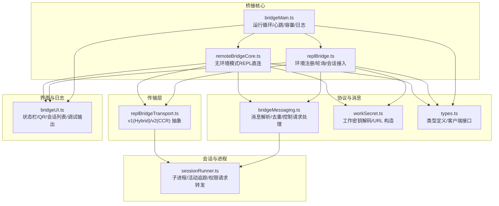
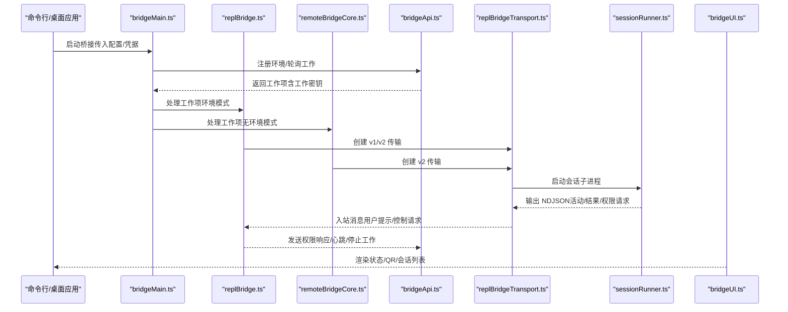
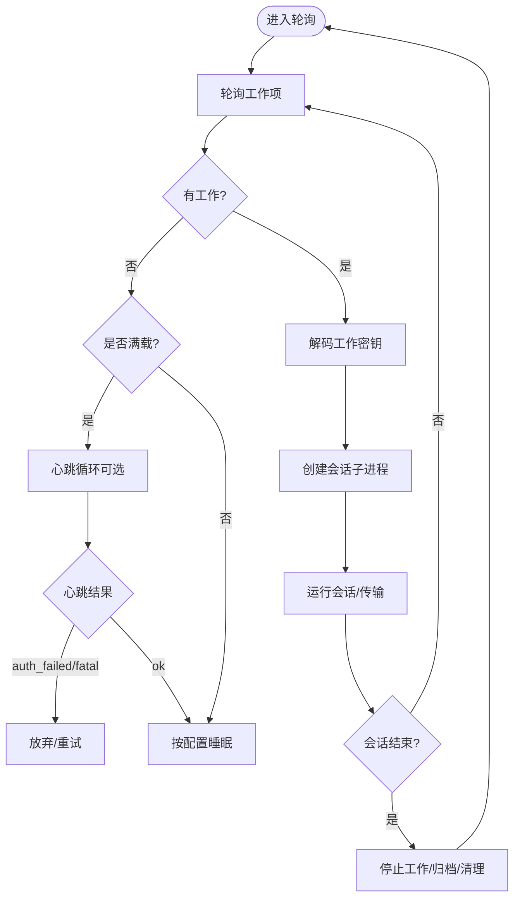
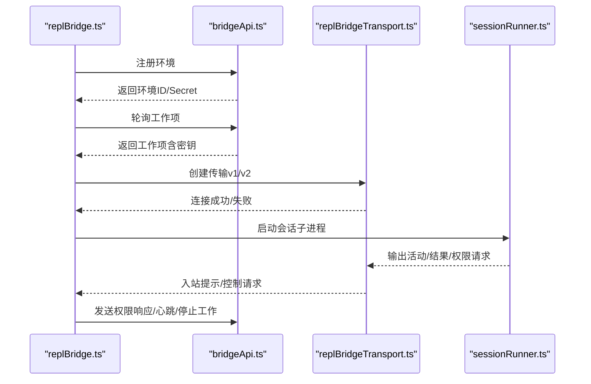
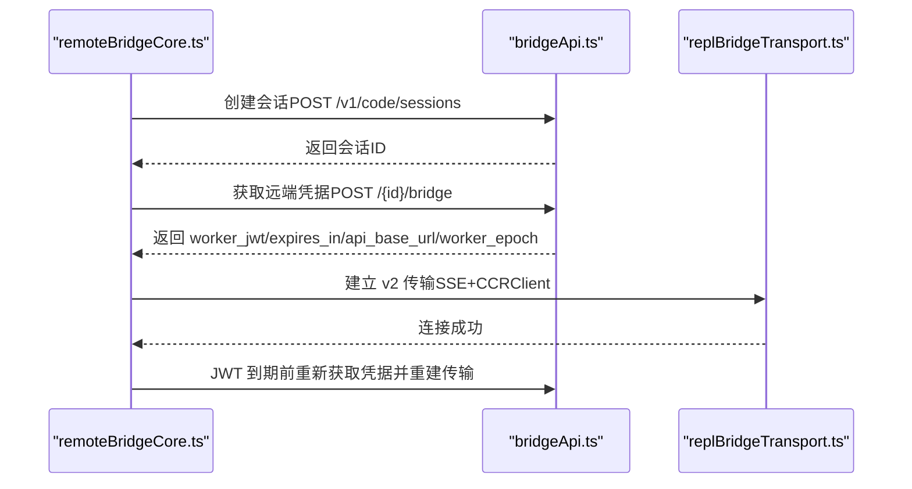
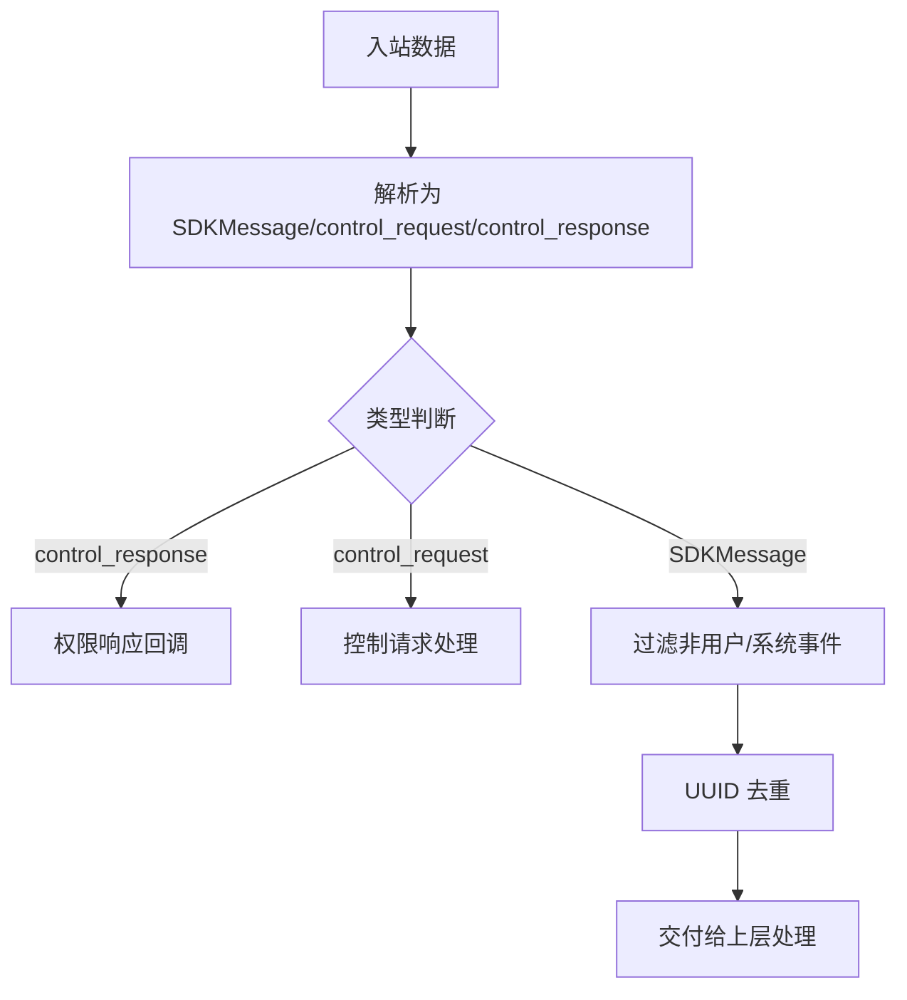
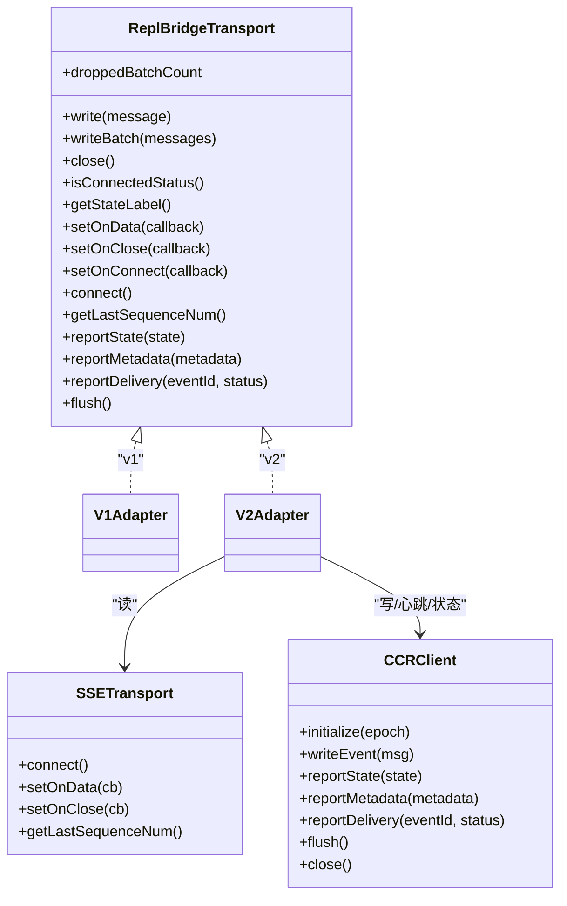
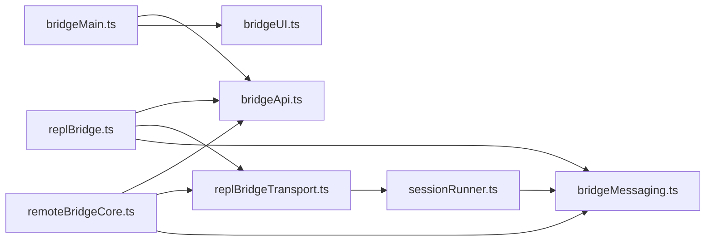

# 桥接系统（IDE 远程控制）

<cite>
**本文引用的文件**
- [bridgeMain.ts](file://src/bridge/bridgeMain.ts)
- [types.ts](file://src/bridge/types.ts)
- [bridgeApi.ts](file://src/bridge/bridgeApi.ts)
- [remoteBridgeCore.ts](file://src/bridge/remoteBridgeCore.ts)
- [replBridge.ts](file://src/bridge/replBridge.ts)
- [bridgeMessaging.ts](file://src/bridge/bridgeMessaging.ts)
- [replBridgeTransport.ts](file://src/bridge/replBridgeTransport.ts)
- [workSecret.ts](file://src/bridge/workSecret.ts)
- [sessionRunner.ts](file://src/bridge/sessionRunner.ts)
- [bridgeUI.ts](file://src/bridge/bridgeUI.ts)
</cite>

## 目录
1. [简介](#简介)
2. [项目结构](#项目结构)
3. [核心组件](#核心组件)
4. [架构总览](#架构总览)
5. [详细组件分析](#详细组件分析)
6. [依赖关系分析](#依赖关系分析)
7. [性能考量](#性能考量)
8. [故障排查指南](#故障排查指南)
9. [结论](#结论)
10. [附录：IDE 集成与使用指南](#附录ide-集成与使用指南)

## 简介
本文件系统性阐述 free-code 的“桥接系统”（IDE 远程控制）设计与实现，覆盖以下主题：
- 设计理念：通过“环境注册—工作轮询—会话接入—消息编解码—状态同步”的闭环，实现对 VS Code、JetBrains 等 IDE 的远程控制与本地会话管理。
- 协议与消息：统一 SDK 消息格式（NDJSON），支持入站提示、出站工具调用、权限请求与控制指令；在 v1（HybridTransport）与 v2（SSETransport + CCRClient）之间动态切换。
- 状态同步：心跳保活、断线重连、标题派生、活动追踪、多会话容量管理。
- 集成指南：桌面应用与命令行启动、权限与安全、故障排查与最佳实践。

## 项目结构
桥接系统位于 src/bridge 目录，围绕“环境层（Environments API）+ REPL 层（会话桥接）+ 传输层（v1/v2）+ 会话子进程（Session Runner）+ UI 日志与状态（Bridge UI）”构建。

图表来源
- [bridgeMain.ts:141-800](file://src/bridge/bridgeMain.ts#L141-L800)
- [replBridge.ts:260-800](file://src/bridge/replBridge.ts#L260-L800)
- [remoteBridgeCore.ts:140-800](file://src/bridge/remoteBridgeCore.ts#L140-L800)
- [bridgeMessaging.ts:132-462](file://src/bridge/bridgeMessaging.ts#L132-L462)
- [replBridgeTransport.ts:119-371](file://src/bridge/replBridgeTransport.ts#L119-L371)
- [workSecret.ts:6-128](file://src/bridge/workSecret.ts#L6-L128)
- [sessionRunner.ts:248-551](file://src/bridge/sessionRunner.ts#L248-L551)
- [bridgeUI.ts:42-531](file://src/bridge/bridgeUI.ts#L42-L531)

章节来源
- [bridgeMain.ts:141-800](file://src/bridge/bridgeMain.ts#L141-L800)
- [replBridge.ts:260-800](file://src/bridge/replBridge.ts#L260-L800)
- [remoteBridgeCore.ts:140-800](file://src/bridge/remoteBridgeCore.ts#L140-L800)
- [bridgeMessaging.ts:132-462](file://src/bridge/bridgeMessaging.ts#L132-L462)
- [replBridgeTransport.ts:119-371](file://src/bridge/replBridgeTransport.ts#L119-L371)
- [workSecret.ts:6-128](file://src/bridge/workSecret.ts#L6-L128)
- [sessionRunner.ts:248-551](file://src/bridge/sessionRunner.ts#L248-L551)
- [bridgeUI.ts:42-531](file://src/bridge/bridgeUI.ts#L42-L531)

## 核心组件
- 运行循环与环境管理（bridgeMain.ts）
  - 负责环境注册、工作轮询、心跳保活、容量管理、会话生命周期、错误恢复与诊断日志。
- REPL 桥接（replBridge.ts）
  - 环境注册、会话创建、工作分发、v1/v2 传输选择、断线重连策略、标题派生与持久化。
- 无环境 REPL 桥接（remoteBridgeCore.ts）
  - 直接基于会话入口层（无需 Environments API），简化 REPL 场景下的初始化路径。
- 消息编解码与控制（bridgeMessaging.ts）
  - 统一 SDK 消息解析、去重（echo/重复）、控制请求处理（初始化、模型设置、中断等）。
- 传输抽象（replBridgeTransport.ts）
  - v1：HybridTransport（WS 读 + POST 写到 Session-Ingress）；v2：SSETransport + CCRClient（写走 /worker/*）。
- 工作密钥与 URL 构造（workSecret.ts）
  - 解码工作密钥（含会话入口 JWT、API 基址、源信息等），构造 SDK URL 与 CCR v2 URL。
- 会话子进程（sessionRunner.ts）
  - 子进程启动、NDJSON 流解析、活动追踪、首次用户消息派生标题、权限请求转发。
- UI 与日志（bridgeUI.ts）
  - 状态栏渲染（就绪/连接中/失败/附着）、QR 码、会话列表、工具活动展示、调试输出。

章节来源
- [bridgeMain.ts:141-800](file://src/bridge/bridgeMain.ts#L141-L800)
- [replBridge.ts:260-800](file://src/bridge/replBridge.ts#L260-L800)
- [remoteBridgeCore.ts:140-800](file://src/bridge/remoteBridgeCore.ts#L140-L800)
- [bridgeMessaging.ts:132-462](file://src/bridge/bridgeMessaging.ts#L132-L462)
- [replBridgeTransport.ts:119-371](file://src/bridge/replBridgeTransport.ts#L119-L371)
- [workSecret.ts:6-128](file://src/bridge/workSecret.ts#L6-L128)
- [sessionRunner.ts:248-551](file://src/bridge/sessionRunner.ts#L248-L551)
- [bridgeUI.ts:42-531](file://src/bridge/bridgeUI.ts#L42-L531)

## 架构总览
桥接系统采用“环境层 + 会话层 + 传输层 + 子进程层 + UI 层”的分层设计，核心流程如下：

图表来源
- [bridgeMain.ts:141-800](file://src/bridge/bridgeMain.ts#L141-L800)
- [replBridge.ts:260-800](file://src/bridge/replBridge.ts#L260-L800)
- [remoteBridgeCore.ts:140-800](file://src/bridge/remoteBridgeCore.ts#L140-L800)
- [bridgeApi.ts:141-452](file://src/bridge/bridgeApi.ts#L141-L452)
- [replBridgeTransport.ts:119-371](file://src/bridge/replBridgeTransport.ts#L119-L371)
- [sessionRunner.ts:248-551](file://src/bridge/sessionRunner.ts#L248-L551)
- [bridgeUI.ts:42-531](file://src/bridge/bridgeUI.ts#L42-L531)

## 详细组件分析

### 组件 A：运行循环与环境管理（bridgeMain.ts）
- 关键职责
  - 环境注册与凭证管理、工作轮询、心跳保活、会话生命周期、容量唤醒、超时与清理、日志与诊断。
- 核心机制
  - 心跳保活：对活跃工作项发送心跳，处理 401/403 触发重新派发或致命错误。
  - 容量管理：在多会话模式下，空闲时以较低频率轮询，满载时仅心跳或快速轮询。
  - 令牌刷新：v1 使用 OAuth 直接更新会话令牌；v2 通过服务器重新派发触发再连接。
  - 会话结束：区分完成/失败/中断，清理工作树、归档会话、更新 UI。
- 性能与可靠性
  - 指数退避与最大等待时间，避免服务端压力；睡眠检测阈值大于最大退避上限，防止误判。
  - 并发清理队列，确保优雅退出前完成资源回收。

图表来源
- [bridgeMain.ts:141-800](file://src/bridge/bridgeMain.ts#L141-L800)

章节来源
- [bridgeMain.ts:141-800](file://src/bridge/bridgeMain.ts#L141-L800)

### 组件 B：REPL 桥接（replBridge.ts）
- 关键职责
  - 环境注册、会话创建、工作轮询、v1/v2 传输选择、断线重连、标题派生与持久化、权限模式控制。
- 核心机制
  - 传输选择：根据工作密钥中的标志位决定使用 HybridTransport（v1）还是 SSETransport + CCRClient（v2）。
  - 断线重连：环境丢失时尝试“原地重连”（复用环境 ID）或回退到新会话；v2 通过 epoch 匹配防止过期握手。
  - 标题派生：监听首次真实用户消息，派生会话标题；支持从存储刷新标题。
  - 初始历史：在传输建立后批量刷新初始对话历史，保证上下文一致性。
- 可靠性
  - 最大重建次数限制，避免无限重试；序列号携带（SSE）避免重放历史。
  - 权限模式回调注入，避免在不支持的上下文中静默失败。

图表来源
- [replBridge.ts:260-800](file://src/bridge/replBridge.ts#L260-L800)
- [bridgeApi.ts:141-452](file://src/bridge/bridgeApi.ts#L141-L452)
- [replBridgeTransport.ts:119-371](file://src/bridge/replBridgeTransport.ts#L119-L371)
- [sessionRunner.ts:248-551](file://src/bridge/sessionRunner.ts#L248-L551)

章节来源
- [replBridge.ts:260-800](file://src/bridge/replBridge.ts#L260-L800)
- [bridgeApi.ts:141-452](file://src/bridge/bridgeApi.ts#L141-L452)
- [replBridgeTransport.ts:119-371](file://src/bridge/replBridgeTransport.ts#L119-L371)
- [sessionRunner.ts:248-551](file://src/bridge/sessionRunner.ts#L248-L551)

### 组件 C：无环境 REPL 桥接（remoteBridgeCore.ts）
- 关键职责
  - 直接创建会话并获取工作 JWT，建立 v2 传输，处理 JWT 刷新与 401 恢复。
- 核心机制
  - 会话创建：POST /v1/code/sessions → 获取会话 ID。
  - 远端凭据：POST /v1/code/sessions/{id}/bridge → 获取 worker_jwt、expires_in、api_base_url、worker_epoch。
  - 传输建立：SSETransport + CCRClient，epoch 作为注册凭证。
  - JWT 刷新：在到期前 5 分钟主动重新获取凭据并重建传输，避免 epoch 不匹配。
- 可靠性
  - 401 自动恢复：刷新 OAuth 后重新获取凭据并重建传输。
  - 出站模式：支持仅出站（镜像）场景，拒绝入站可变控制请求。

图表来源
- [remoteBridgeCore.ts:140-800](file://src/bridge/remoteBridgeCore.ts#L140-L800)
- [bridgeApi.ts:141-452](file://src/bridge/bridgeApi.ts#L141-L452)
- [replBridgeTransport.ts:119-371](file://src/bridge/replBridgeTransport.ts#L119-L371)

章节来源
- [remoteBridgeCore.ts:140-800](file://src/bridge/remoteBridgeCore.ts#L140-L800)
- [bridgeApi.ts:141-452](file://src/bridge/bridgeApi.ts#L141-L452)
- [replBridgeTransport.ts:119-371](file://src/bridge/replBridgeTransport.ts#L119-L371)

### 组件 D：消息编解码与控制（bridgeMessaging.ts）
- 关键职责
  - 统一 SDK 消息解析、去重（echo/重复）、控制请求处理（初始化、模型设置、中断、权限模式）。
- 核心机制
  - 类型守卫：区分 SDKMessage、control_request、control_response。
  - 去重策略：基于最近发送/接收 UUID 集合，避免 echo 与重复消息。
  - 控制请求：对 initialize/set_model/set_max_thinking_tokens/set_permission_mode/interrupt 提供即时响应。
- 适用范围
  - 适用于环境模式与无环境模式的入站消息处理。

图表来源
- [bridgeMessaging.ts:132-462](file://src/bridge/bridgeMessaging.ts#L132-L462)

章节来源
- [bridgeMessaging.ts:132-462](file://src/bridge/bridgeMessaging.ts#L132-L462)

### 组件 E：传输抽象（replBridgeTransport.ts）
- 关键职责
  - v1：HybridTransport（WS 读 + POST 写到 Session-Ingress）。
  - v2：SSETransport（读）+ CCRClient（写/心跳/状态/交付跟踪）。
- 核心机制
  - v2 注册：通过 /worker/register 获取 worker_epoch，作为后续心跳/写入的凭证。
  - epoch 不匹配：自动关闭并上报 4090，触发上层重连。
  - 出站模式：可禁用 SSE 读流，仅启用 CCRClient 写路径。
- 可靠性
  - 写路径批量化与顺序保证；读写分离，避免阻塞。

图表来源
- [replBridgeTransport.ts:23-371](file://src/bridge/replBridgeTransport.ts#L23-L371)

章节来源
- [replBridgeTransport.ts:23-371](file://src/bridge/replBridgeTransport.ts#L23-L371)

### 组件 F：工作密钥与 URL 构造（workSecret.ts）
- 关键职责
  - 解码工作密钥（版本校验、字段校验）、构造 SDK URL（v1/v2）、比较会话 ID（兼容层）。
- 核心机制
  - 版本 1 的工作密钥包含会话入口 JWT、API 基址、来源信息、可选的 CCR v2 标识。
  - CCR v2 URL 构造：基于 api_base_url 与 session_id，指向 /v1/code/sessions/{id}。
  - 会话 ID 比较：忽略标签前缀，仅比较底层 UUID，适配兼容层。

章节来源
- [workSecret.ts:6-128](file://src/bridge/workSecret.ts#L6-L128)

### 组件 G：会话子进程（sessionRunner.ts）
- 关键职责
  - 子进程启动、NDJSON 流解析、活动追踪、首次用户消息派生标题、权限请求转发。
- 核心机制
  - 参数拼装：根据是否 v2 设置相应环境变量（如 CLAUDE_CODE_USE_CCR_V2、WORKER_EPOCH）。
  - 活动提取：从 assistant/tool_use/text/result 等消息中提取工具动作摘要。
  - 权限请求：当子进程发出 can_use_tool 请求时，通过桥接转发至服务器，等待用户决策。
  - 令牌更新：通过 stdin 发送 update_environment_variables 消息，动态更新会话令牌。
- 可靠性
  - 三路流（stdin/stdout/stderr）分离，stderr 缓冲用于诊断；进程退出码映射为完成/失败/中断。

章节来源
- [sessionRunner.ts:248-551](file://src/bridge/sessionRunner.ts#L248-L551)

### 组件 H：UI 与日志（bridgeUI.ts）
- 关键职责
  - 状态栏渲染（就绪/连接中/失败/附着）、QR 码生成与切换、会话列表、工具活动展示、调试输出。
- 核心机制
  - 状态机：idle/attached/reconnecting/failed，配合定时器与渲染函数。
  - 多会话显示：在单槽或多槽模式下分别渲染容量与会话列表。
  - 交互提示：支持空格显示/隐藏 QR、按键切换 spawn 模式等。
- 可观测性
  - 详细日志与诊断输出，便于问题定位。

章节来源
- [bridgeUI.ts:42-531](file://src/bridge/bridgeUI.ts#L42-L531)

## 依赖关系分析
- 组件耦合
  - bridgeMain.ts 与 replBridge.ts 通过 BridgeApiClient 接口耦合，前者负责运行循环，后者负责环境与会话接入。
  - bridgeMessaging.ts 与 replBridgeTransport.ts 通过消息契约耦合，前者负责解析与去重，后者负责传输。
  - sessionRunner.ts 与 replBridgeTransport.ts 通过子进程与传输接口耦合，前者提供活动与权限事件，后者承载消息写入。
- 外部依赖
  - HTTP 客户端（axios）用于与后端 API 通信。
  - SSE/WS 传输用于实时消息通道。
  - 子进程用于隔离会话执行环境。

图表来源
- [bridgeMain.ts:141-800](file://src/bridge/bridgeMain.ts#L141-L800)
- [replBridge.ts:260-800](file://src/bridge/replBridge.ts#L260-L800)
- [remoteBridgeCore.ts:140-800](file://src/bridge/remoteBridgeCore.ts#L140-L800)
- [bridgeApi.ts:141-452](file://src/bridge/bridgeApi.ts#L141-L452)
- [replBridgeTransport.ts:119-371](file://src/bridge/replBridgeTransport.ts#L119-L371)
- [sessionRunner.ts:248-551](file://src/bridge/sessionRunner.ts#L248-L551)
- [bridgeUI.ts:42-531](file://src/bridge/bridgeUI.ts#L42-L531)
- [bridgeMessaging.ts:132-462](file://src/bridge/bridgeMessaging.ts#L132-L462)

章节来源
- [bridgeMain.ts:141-800](file://src/bridge/bridgeMain.ts#L141-L800)
- [replBridge.ts:260-800](file://src/bridge/replBridge.ts#L260-L800)
- [remoteBridgeCore.ts:140-800](file://src/bridge/remoteBridgeCore.ts#L140-L800)
- [bridgeApi.ts:141-452](file://src/bridge/bridgeApi.ts#L141-L452)
- [replBridgeTransport.ts:119-371](file://src/bridge/replBridgeTransport.ts#L119-L371)
- [sessionRunner.ts:248-551](file://src/bridge/sessionRunner.ts#L248-L551)
- [bridgeUI.ts:42-531](file://src/bridge/bridgeUI.ts#L42-L531)
- [bridgeMessaging.ts:132-462](file://src/bridge/bridgeMessaging.ts#L132-L462)

## 性能考量
- 轮询与心跳
  - 在满载或空闲状态下采用不同轮询间隔，减少不必要的网络开销。
  - 心跳保活使用轻量级 JWT 认证，避免数据库查询。
- 传输优化
  - v2 写路径批量化与顺序保证，减少网络往返；SSE 序列号携带避免历史重放。
  - 出站模式禁用读流，降低资源占用。
- 令牌与重连
  - 预刷新策略避免 5 小时窗口内的静默死亡；401 自动恢复减少人工干预。
- 日志与诊断
  - 详细日志与诊断输出，便于定位瓶颈与异常。

## 故障排查指南
- 常见错误与处理
  - 401/403：认证失败或会话过期，检查登录状态与组织权限；必要时重启桥接。
  - 404/410：环境不存在或已过期，尝试重新注册或重启桥接。
  - 429：轮询过于频繁，调整轮询间隔或等待。
  - 4090/4091：epoch 不匹配或初始化失败，触发传输重建。
- 诊断方法
  - 查看桥接日志与会话转录文件（NDJSON）。
  - 使用 UI 中的 QR 码与会话链接确认连接状态。
  - 在多会话模式下观察容量与活动列表，定位卡顿或堆积。
- 建议
  - 保持网络稳定，避免长时间休眠导致的 JWT 过期。
  - 合理设置最大并发会话数，避免资源争用。
  - 使用 verbose 模式收集更详细的诊断信息。

章节来源
- [bridgeApi.ts:454-540](file://src/bridge/bridgeApi.ts#L454-L540)
- [replBridgeTransport.ts:209-232](file://src/bridge/replBridgeTransport.ts#L209-L232)
- [bridgeUI.ts:42-531](file://src/bridge/bridgeUI.ts#L42-L531)

## 结论
桥接系统通过清晰的分层设计与稳健的协议抽象，实现了对 VS Code、JetBrains 等 IDE 的远程控制与本地会话管理。其核心优势在于：
- 环境层与 REPL 层解耦，支持多种接入路径（环境模式与无环境模式）。
- v1/v2 传输抽象统一消息契约，提升可维护性与可扩展性。
- 强大的去重与控制机制保障消息一致性与安全性。
- 完善的日志与 UI 提升可观测性与用户体验。

## 附录：IDE 集成与使用指南
- 桌面应用集成
  - 通过桌面应用启动桥接进程，自动注册环境并生成连接二维码；在 UI 中查看会话列表与活动。
- 命令行启动
  - 使用命令行参数指定目录、分支、最大会话数、沙箱模式、调试文件等；支持多会话模式与工作树隔离。
- 权限与安全
  - 登录后方可使用远程控制；组织权限不足时会收到明确提示；可信设备令牌用于增强安全。
- 故障排查
  - 检查网络与代理设置；查看桥接日志与会话转录；在 UI 中确认连接状态与 QR 码。
- 最佳实践
  - 合理设置最大并发会话数；启用 verbose 模式进行问题定位；定期重启桥接以避免长期运行的累积问题。

章节来源
- [bridgeUI.ts:42-531](file://src/bridge/bridgeUI.ts#L42-L531)
- [types.ts:81-115](file://src/bridge/types.ts#L81-L115)
- [bridgeApi.ts:141-197](file://src/bridge/bridgeApi.ts#L141-L197)