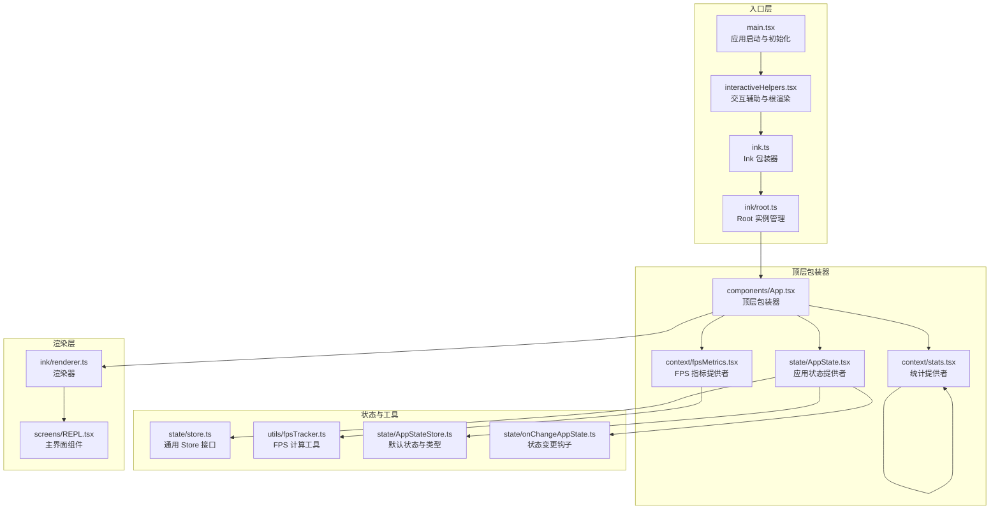
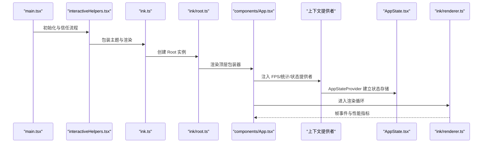
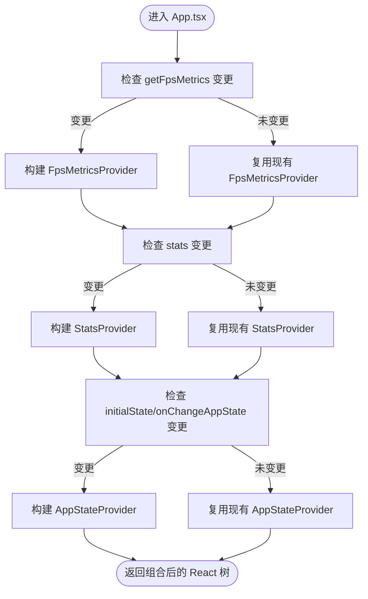
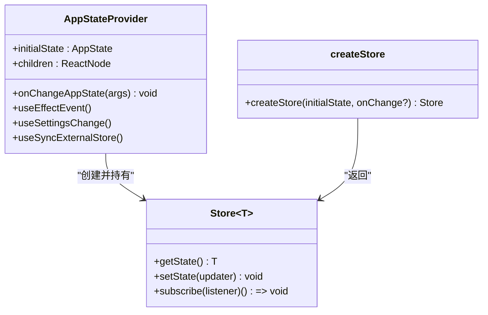
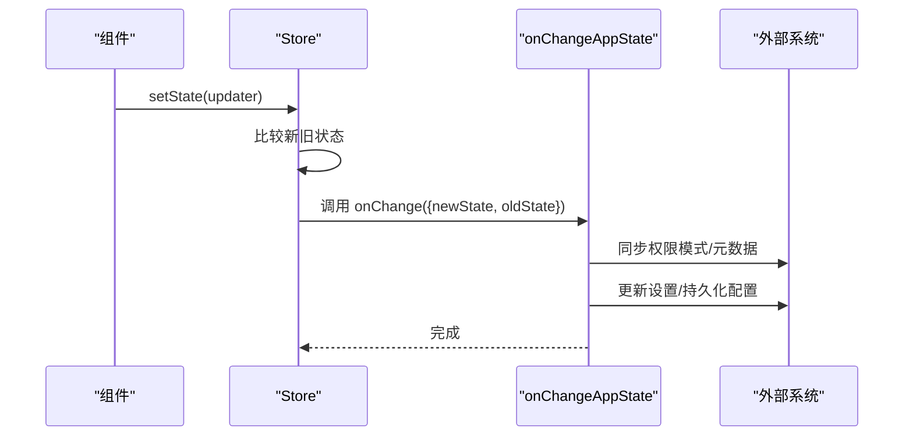
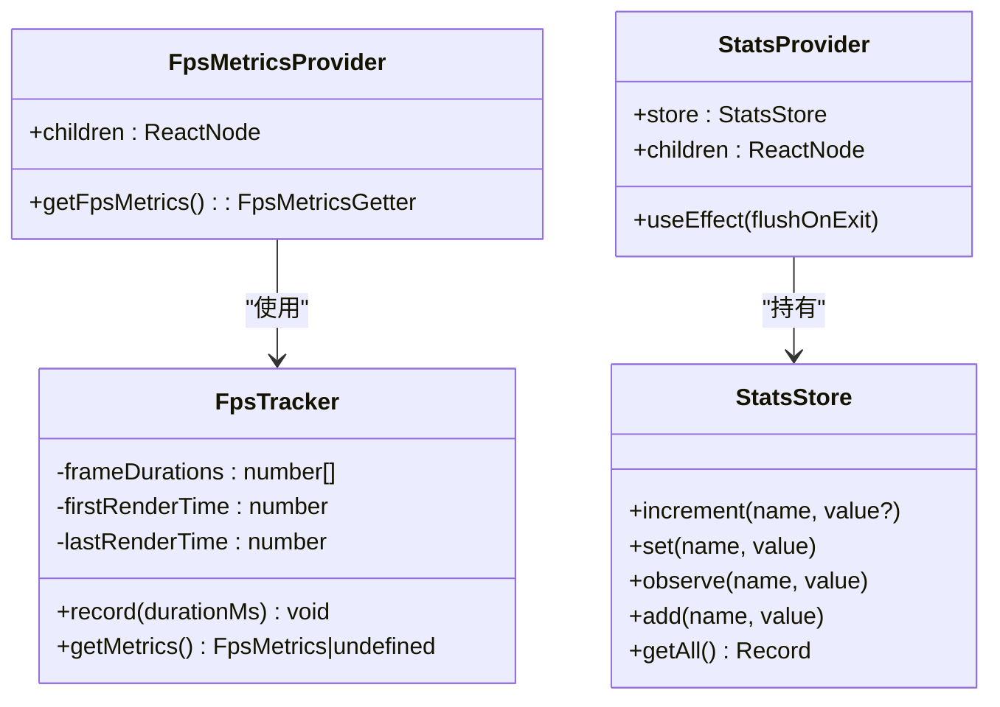
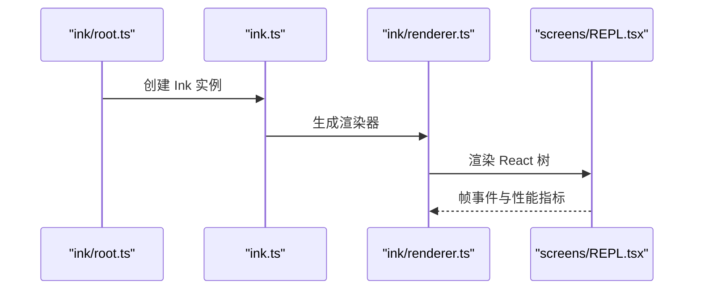
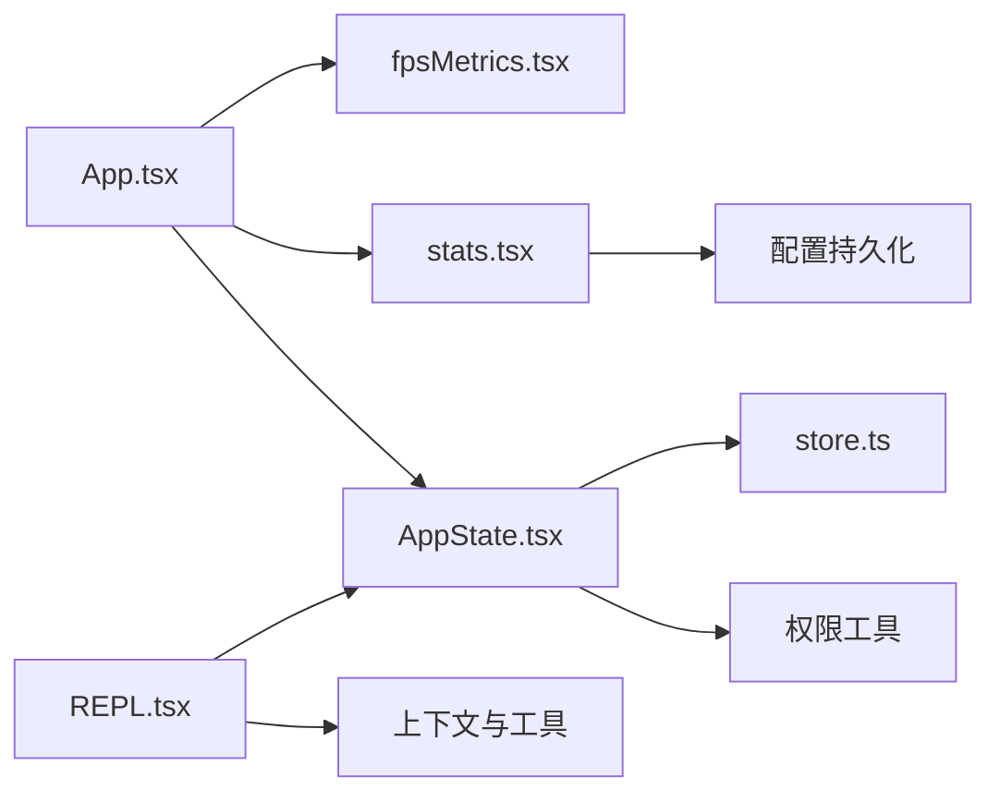

# UI 架构设计

<cite>
**本文档引用的文件**
- [App.tsx](file://src/components/App.tsx)
- [AppState.tsx](file://src/state/AppState.tsx)
- [AppStateStore.ts](file://src/state/AppStateStore.ts)
- [onChangeAppState.ts](file://src/state/onChangeAppState.ts)
- [fpsMetrics.tsx](file://src/context/fpsMetrics.tsx)
- [stats.tsx](file://src/context/stats.tsx)
- [fpsTracker.ts](file://src/utils/fpsTracker.ts)
- [store.ts](file://src/state/store.ts)
- [main.tsx](file://src/main.tsx)
- [REPL.tsx](file://src/screens/REPL.tsx)
- [interactiveHelpers.tsx](file://src/interactiveHelpers.tsx)
- [ink.ts](file://src/ink.ts)
- [root.ts](file://src/ink/root.ts)
- [renderer.ts](file://src/ink/renderer.ts)
</cite>

## 目录
1. [简介](#简介)
2. [项目结构](#项目结构)
3. [核心组件](#核心组件)
4. [架构总览](#架构总览)
5. [详细组件分析](#详细组件分析)
6. [依赖关系分析](#依赖关系分析)
7. [性能考虑](#性能考虑)
8. [故障排除指南](#故障排除指南)
9. [结论](#结论)

## 简介
本文件面向 free-code 终端 UI 架构，系统性阐述基于 React + Ink 的整体设计与组件层次结构。重点解析 App.tsx 作为顶级包装器如何整合 FPS 指标提供者、统计上下文与应用状态提供者；深入说明 AppStateProvider 的状态管理模式与 onChangeAppState 的工作机制；展示上下文系统在 FPS 跟踪、统计数据管理与应用状态同步中的作用；并给出架构决策的技术背景与设计权衡。

## 项目结构
free-code 的终端 UI 采用“顶层包装器 + 多层上下文提供者 + React 状态管理”的分层架构：
- 顶层包装器：App.tsx 将 FPS 指标、统计与应用状态提供者组合到组件树中
- 应用状态层：AppState.tsx 提供集中式状态存储与订阅机制
- 上下文层：fpsMetrics.tsx 与 stats.tsx 分别提供 FPS 跟踪与统计能力
- 渲染层：Ink 框架负责终端渲染与事件处理
- 入口层：main.tsx 负责初始化、根渲染与生命周期管理

**图示来源**
- [main.tsx:585-800](file://src/main.tsx#L585-L800)
- [interactiveHelpers.tsx:98-103](file://src/interactiveHelpers.tsx#L98-L103)
- [ink.ts:18-31](file://src/ink.ts#L18-L31)
- [root.ts:129-157](file://src/ink/root.ts#L129-L157)
- [App.tsx:19-55](file://src/components/App.tsx#L19-L55)
- [fpsMetrics.tsx:10-26](file://src/context/fpsMetrics.tsx#L10-L26)
- [stats.tsx:104-156](file://src/context/stats.tsx#L104-L156)
- [AppState.tsx:37-110](file://src/state/AppState.tsx#L37-L110)
- [store.ts:10-35](file://src/state/store.ts#L10-L35)
- [fpsTracker.ts:6-47](file://src/utils/fpsTracker.ts#L6-L47)
- [AppStateStore.ts:456-570](file://src/state/AppStateStore.ts#L456-L570)
- [onChangeAppState.ts:43-172](file://src/state/onChangeAppState.ts#L43-L172)
- [renderer.ts:31-179](file://src/ink/renderer.ts#L31-L179)
- [REPL.tsx:1-200](file://src/screens/REPL.tsx#L1-L200)

**章节来源**
- [App.tsx:1-56](file://src/components/App.tsx#L1-L56)
- [AppState.tsx:1-200](file://src/state/AppState.tsx#L1-L200)
- [AppStateStore.ts:1-570](file://src/state/AppStateStore.ts#L1-L570)
- [onChangeAppState.ts:1-172](file://src/state/onChangeAppState.ts#L1-L172)
- [fpsMetrics.tsx:1-30](file://src/context/fpsMetrics.tsx#L1-L30)
- [stats.tsx:1-220](file://src/context/stats.tsx#L1-L220)
- [fpsTracker.ts:1-48](file://src/utils/fpsTracker.ts#L1-L48)
- [store.ts:1-35](file://src/state/store.ts#L1-L35)
- [main.tsx:585-800](file://src/main.tsx#L585-L800)
- [REPL.tsx:1-200](file://src/screens/REPL.tsx#L1-L200)
- [interactiveHelpers.tsx:1-200](file://src/interactiveHelpers.tsx#L1-L200)
- [ink.ts:1-86](file://src/ink.ts#L1-L86)
- [root.ts:1-185](file://src/ink/root.ts#L1-L185)
- [renderer.ts:1-179](file://src/ink/renderer.ts#L1-L179)

## 核心组件
- 顶层包装器 App.tsx：聚合 FPS 指标、统计与应用状态提供者，向子树提供统一上下文环境
- 应用状态提供者 AppState.tsx：封装集中式状态存储、订阅与外部设置变更同步
- FPS 指标提供者 fpsMetrics.tsx：通过上下文暴露 FPS 获取器，供组件读取性能指标
- 统计提供者 stats.tsx：提供计数器、仪表盘、计时器与集合等统计能力，并持久化会话指标
- Store 接口 store.ts：定义通用状态更新与订阅接口，支持 onChange 回调
- FPS 计算工具 fpsTracker.ts：计算平均 FPS 与低百分位 FPS，用于性能监控
- onChangeAppState 钩子：在状态变更时同步外部系统（如 SDK、外部元数据）

**章节来源**
- [App.tsx:19-55](file://src/components/App.tsx#L19-L55)
- [AppState.tsx:37-110](file://src/state/AppState.tsx#L37-L110)
- [fpsMetrics.tsx:10-29](file://src/context/fpsMetrics.tsx#L10-L29)
- [stats.tsx:104-156](file://src/context/stats.tsx#L104-L156)
- [store.ts:4-8](file://src/state/store.ts#L4-L8)
- [fpsTracker.ts:6-47](file://src/utils/fpsTracker.ts#L6-L47)
- [onChangeAppState.ts:43-172](file://src/state/onChangeAppState.ts#L43-L172)

## 架构总览
React + Ink 架构以“顶层包装器 + 多上下文 + 集中式状态”为核心，结合 Ink 的渲染管线与帧事件回调，实现高性能、可扩展的终端 UI。

**图示来源**
- [main.tsx:585-800](file://src/main.tsx#L585-L800)
- [interactiveHelpers.tsx:98-103](file://src/interactiveHelpers.tsx#L98-L103)
- [ink.ts:18-31](file://src/ink.ts#L18-L31)
- [root.ts:129-157](file://src/ink/root.ts#L129-L157)
- [App.tsx:19-55](file://src/components/App.tsx#L19-L55)
- [renderer.ts:31-179](file://src/ink/renderer.ts#L31-L179)

## 详细组件分析

### 顶层包装器 App.tsx
- 职责：接收 FPS 获取器、统计存储与初始应用状态，按序注入 FPS 指标提供者、统计提供者与应用状态提供者
- 设计要点：通过三重 Provider 组合，确保子树组件可同时访问性能指标、统计数据与应用状态
- 性能优化：使用记忆化缓存避免重复渲染，仅在输入变化时重建 Provider 树

**图示来源**
- [App.tsx:19-55](file://src/components/App.tsx#L19-L55)

**章节来源**
- [App.tsx:19-55](file://src/components/App.tsx#L19-L55)

### 应用状态提供者 AppState.tsx
- 状态存储：通过 createStore(initialState, onChangeAppState) 创建稳定 Store，避免 Provider 触发不必要的重渲染
- 生命周期：在挂载时校验权限模式一致性，监听外部设置变更并通过 applySettingsChange 同步
- 订阅机制：useSyncExternalStore 结合自定义 subscribe，实现选择性重渲染与高效订阅
- 上下文暴露：提供 HasAppStateContext 与 AppStoreContext，防止嵌套 Provider

**图示来源**
- [AppState.tsx:37-110](file://src/state/AppState.tsx#L37-L110)
- [store.ts:10-35](file://src/state/store.ts#L10-L35)

**章节来源**
- [AppState.tsx:37-110](file://src/state/AppState.tsx#L37-L110)
- [store.ts:10-35](file://src/state/store.ts#L10-L35)

### 状态管理模式与 onChangeAppState
- 状态更新：Store.setState 接受 updater，比较新旧状态，触发 onChange 回调与订阅者通知
- 外部同步：onChangeAppState 在模式变更时同步外部元数据（如 SDK、CCR），并持久化配置
- 设置联动：当 mainLoopModel 变更时，自动更新用户设置与模型覆盖；verbose、面板可见性等也持久化

**图示来源**
- [store.ts:20-27](file://src/state/store.ts#L20-L27)
- [onChangeAppState.ts:43-172](file://src/state/onChangeAppState.ts#L43-L172)

**章节来源**
- [store.ts:20-27](file://src/state/store.ts#L20-L27)
- [onChangeAppState.ts:43-172](file://src/state/onChangeAppState.ts#L43-L172)

### 上下文系统：FPS 指标与统计数据
- FPS 指标：FpsMetricsProvider 暴露 getFpsMetrics，组件通过 useFpsMetrics 读取当前帧耗时并计算平均与低百分位 FPS
- 统计数据：StatsProvider 提供计数器、仪表盘、计时器与集合操作，内部使用直方图与蓄水池采样计算分位数，并在进程退出时持久化

**图示来源**
- [fpsMetrics.tsx:10-29](file://src/context/fpsMetrics.tsx#L10-L29)
- [fpsTracker.ts:6-47](file://src/utils/fpsTracker.ts#L6-L47)
- [stats.tsx:104-156](file://src/context/stats.tsx#L104-L156)
- [stats.tsx:28-98](file://src/context/stats.tsx#L28-L98)

**章节来源**
- [fpsMetrics.tsx:10-29](file://src/context/fpsMetrics.tsx#L10-L29)
- [fpsTracker.ts:6-47](file://src/utils/fpsTracker.ts#L6-L47)
- [stats.tsx:104-156](file://src/context/stats.tsx#L104-L156)
- [stats.tsx:28-98](file://src/context/stats.tsx#L28-L98)

### 渲染与事件循环（Ink）
- Root 管理：createRoot 返回可复用的 Root 实例，支持多次渲染与等待退出
- 渲染器：renderer.ts 负责将 React 节点转换为终端屏幕输出，处理视口、光标与增量刷新
- 主界面：REPL.tsx 作为核心界面，集成输入、消息列表、任务与权限控制等模块

**图示来源**
- [root.ts:129-157](file://src/ink/root.ts#L129-L157)
- [ink.ts:18-31](file://src/ink.ts#L18-L31)
- [renderer.ts:31-179](file://src/ink/renderer.ts#L31-L179)
- [REPL.tsx:1-200](file://src/screens/REPL.tsx#L1-L200)

**章节来源**
- [root.ts:129-157](file://src/ink/root.ts#L129-L157)
- [ink.ts:18-31](file://src/ink.ts#L18-L31)
- [renderer.ts:31-179](file://src/ink/renderer.ts#L31-L179)
- [REPL.tsx:1-200](file://src/screens/REPL.tsx#L1-L200)

## 依赖关系分析
- App.tsx 依赖：fpsMetrics.tsx、stats.tsx、AppState.tsx、onChangeAppState.ts、fpsTracker.ts
- AppState.tsx 依赖：store.ts、settings 工具、权限工具、上下文提供者（Mailbox/Voice）
- stats.tsx 依赖：配置持久化工具，进程退出事件
- REPL.tsx 依赖：AppState.tsx、上下文与工具函数，贯穿整个 UI 流程

**图示来源**
- [App.tsx:1-56](file://src/components/App.tsx#L1-L56)
- [AppState.tsx:1-200](file://src/state/AppState.tsx#L1-L200)
- [stats.tsx:1-220](file://src/context/stats.tsx#L1-L220)
- [store.ts:1-35](file://src/state/store.ts#L1-L35)
- [REPL.tsx:1-200](file://src/screens/REPL.tsx#L1-L200)

**章节来源**
- [App.tsx:1-56](file://src/components/App.tsx#L1-L56)
- [AppState.tsx:1-200](file://src/state/AppState.tsx#L1-L200)
- [stats.tsx:1-220](file://src/context/stats.tsx#L1-L220)
- [store.ts:1-35](file://src/state/store.ts#L1-L35)
- [REPL.tsx:1-200](file://src/screens/REPL.tsx#L1-L200)

## 性能考虑
- FPS 监控：通过 FpsTracker 记录帧耗时，计算平均与低百分位 FPS，便于识别卡顿瓶颈
- 统计采样：直方图与蓄水池采样支持高基数指标的近似统计，降低内存占用
- 渲染优化：Ink 渲染器采用增量刷新与视口管理，减少全量重绘
- 状态更新：Store.setState 使用 Object.is 比较，避免无意义重渲染；useSyncExternalStore 提升订阅效率

[本节为通用指导，无需特定文件引用]

## 故障排除指南
- FPS 异常：若 FPS 指标为空或异常，检查 FpsTracker 是否正确记录帧耗时，确认渲染循环正常
- 统计缺失：若统计未持久化，检查 StatsProvider 的进程退出事件绑定与配置保存逻辑
- 状态不同步：若外部系统（如 SDK/CCR）状态不一致，检查 onChangeAppState 中的权限模式同步逻辑
- 渲染异常：若出现光标错位或屏幕撕裂，检查渲染器的视口高度与 alt-screen 逻辑

**章节来源**
- [fpsTracker.ts:20-47](file://src/utils/fpsTracker.ts#L20-L47)
- [stats.tsx:120-145](file://src/context/stats.tsx#L120-L145)
- [onChangeAppState.ts:65-92](file://src/state/onChangeAppState.ts#L65-L92)
- [renderer.ts:146-177](file://src/ink/renderer.ts#L146-L177)

## 结论
free-code 的终端 UI 架构通过顶层包装器与多层上下文提供者，实现了 FPS 监控、统计与应用状态的统一管理；结合 Ink 的高效渲染与帧事件机制，提供了流畅的终端交互体验。AppState.tsx 的集中式状态管理与 onChangeAppState 的外部同步策略，确保了状态一致性与可观测性。该架构在可维护性、性能与扩展性之间取得良好平衡，适合复杂终端应用的长期演进。