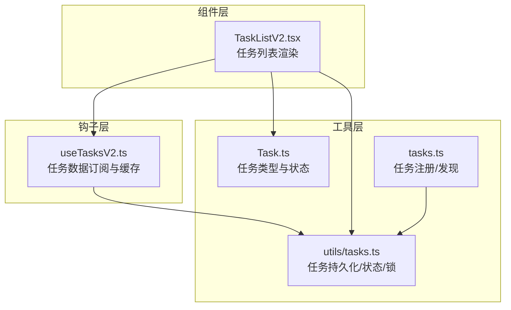
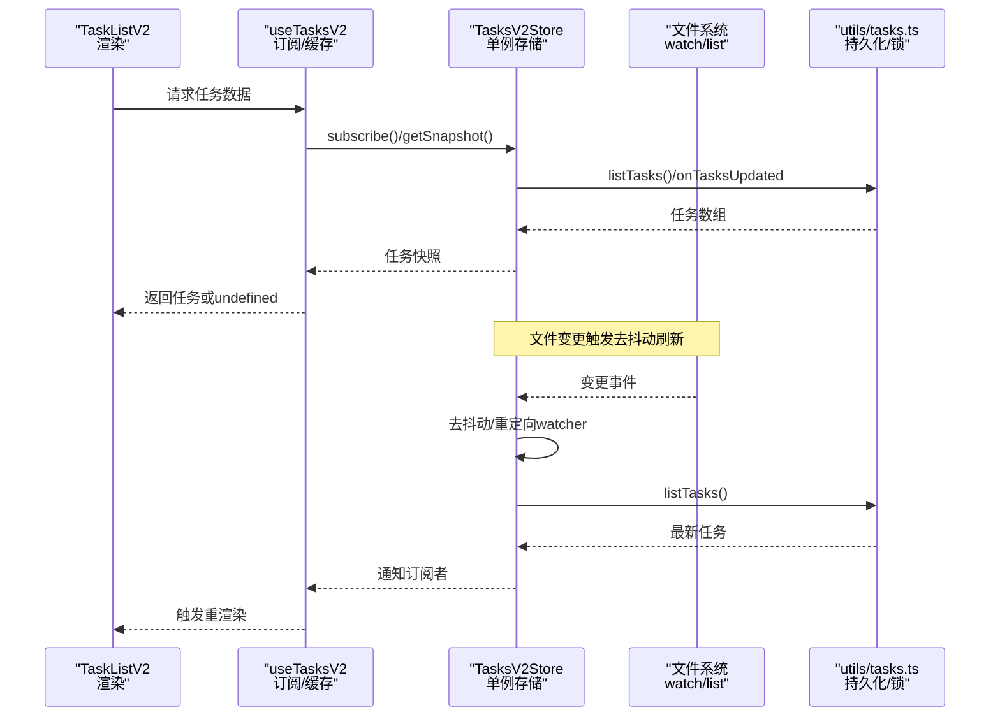
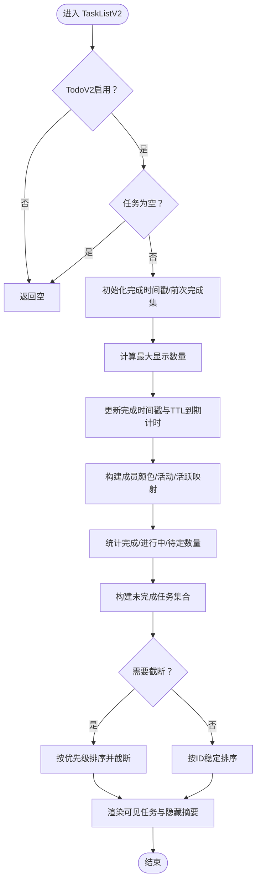
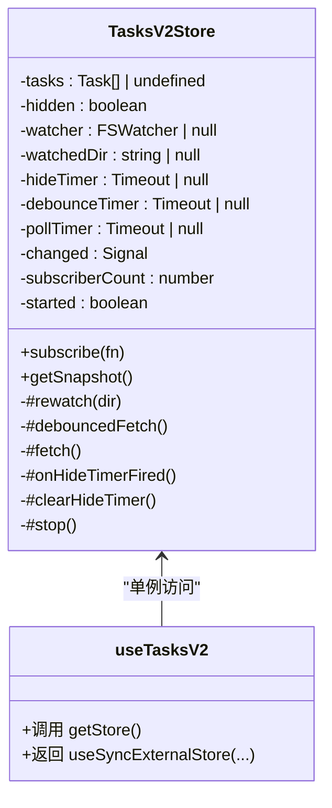
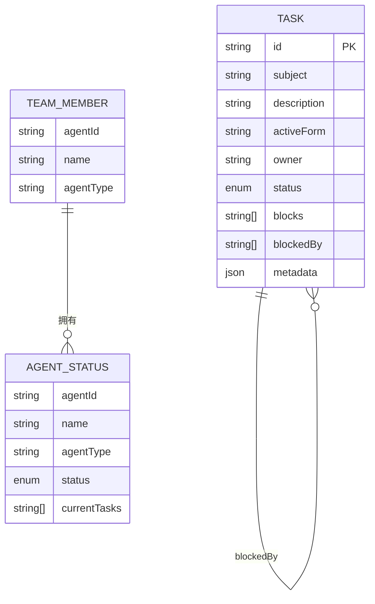
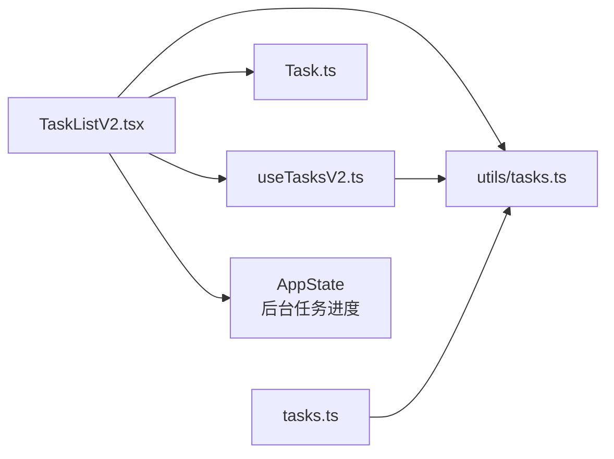

# 任务列表组件

<cite>
**本文档引用的文件**
- [TaskListV2.tsx](file://src/components/TaskListV2.tsx)
- [tasks.ts](file://src/utils/tasks.ts)
- [useTasksV2.ts](file://src/hooks/useTasksV2.ts)
- [Task.ts](file://src/Task.ts)
- [tasks.ts](file://src/tasks.ts)
</cite>

## 目录
1. [简介](#简介)
2. [项目结构](#项目结构)
3. [核心组件](#核心组件)
4. [架构总览](#架构总览)
5. [详细组件分析](#详细组件分析)
6. [依赖关系分析](#依赖关系分析)
7. [性能考量](#性能考量)
8. [故障排除指南](#故障排除指南)
9. [结论](#结论)
10. [附录](#附录)

## 简介
本文件为 free-code 项目的任务列表组件提供完整参考文档。重点涵盖：
- 任务列表的架构设计与数据流
- 任务状态管理（待定、进行中、已完成）与持久化
- 可视化展示与响应式布局
- 后台任务、远程会话、Shell 任务与异步代理任务的处理
- 组件 props 接口、进度跟踪与状态更新机制
- 使用示例、自定义样式与交互功能
- 与任务管理器、通知系统、性能监控的集成关系

## 项目结构
任务列表组件位于组件层，通过 hooks 与工具层协作，实现对任务数据的读取、监听与展示。

**图表来源**
- [TaskListV2.tsx:1-378](file://src/components/TaskListV2.tsx#L1-L378)
- [useTasksV2.ts:1-251](file://src/hooks/useTasksV2.ts#L1-L251)
- [tasks.ts:1-863](file://src/utils/tasks.ts#L1-L863)
- [Task.ts:1-126](file://src/Task.ts#L1-L126)
- [tasks.ts:1-40](file://src/tasks.ts#L1-L40)

**章节来源**
- [TaskListV2.tsx:1-378](file://src/components/TaskListV2.tsx#L1-L378)
- [useTasksV2.ts:1-251](file://src/hooks/useTasksV2.ts#L1-L251)
- [tasks.ts:1-863](file://src/utils/tasks.ts#L1-L863)
- [Task.ts:1-126](file://src/Task.ts#L1-L126)
- [tasks.ts:1-40](file://src/tasks.ts#L1-L40)

## 核心组件
- TaskListV2：负责在终端界面中渲染任务列表，支持截断、优先级排序与最近完成高亮。
- useTasksV2：提供基于 useSyncExternalStore 的任务数据订阅，内置文件系统监听、去抖动与隐藏逻辑。
- 工具层 tasks：提供任务持久化、锁机制、任务 ID 分配、阻塞关系维护、代理状态查询等能力。
- 类型系统 Task：统一任务类型与状态，定义任务上下文与生命周期。

**章节来源**
- [TaskListV2.tsx:17-33](file://src/components/TaskListV2.tsx#L17-L33)
- [useTasksV2.ts:29-199](file://src/hooks/useTasksV2.ts#L29-L199)
- [tasks.ts:284-456](file://src/utils/tasks.ts#L284-L456)
- [Task.ts:66-76](file://src/Task.ts#L66-L76)

## 架构总览
任务列表的运行时流程如下：

**图表来源**
- [TaskListV2.tsx:30-211](file://src/components/TaskListV2.tsx#L30-L211)
- [useTasksV2.ts:29-199](file://src/hooks/useTasksV2.ts#L29-L199)
- [tasks.ts:443-456](file://src/utils/tasks.ts#L443-L456)

## 详细组件分析

### TaskListV2 组件
- 功能职责
  - 渲染任务列表，支持独立模式与嵌入模式
  - 截断策略：根据终端行数限制显示数量，并按“最近完成、进行中、待定、旧完成”优先级排序
  - 近期完成高亮：完成时间在 30 秒内的任务以特殊标识显示
  - 团队成员活动摘要：聚合代理近期活动，显示在进行中的任务旁
  - 阻塞关系可视化：显示被哪些任务阻塞
  - 主题颜色映射：根据团队成员颜色主题渲染所有者标签
- 关键 props
  - tasks: 任务数组
  - isStandalone?: 是否独立显示（含统计行）
- 关键状态与计算
  - completionTimestampsRef：记录每个任务完成的时间戳，用于 30 秒 TTL 内的高亮
  - teammateActivity/activeTeammates：从 AppState 中提取后台任务进度，汇总最近活动
  - unresolvedTaskIds：未完成任务集合，用于判断阻塞
- 性能优化
  - 按列宽动态截断与文本截断，避免过度渲染
  - 使用 React 缓存与稳定节点引用减少重渲染

**图表来源**
- [TaskListV2.tsx:30-211](file://src/components/TaskListV2.tsx#L30-L211)

**章节来源**
- [TaskListV2.tsx:17-33](file://src/components/TaskListV2.tsx#L17-L33)
- [TaskListV2.tsx:42-85](file://src/components/TaskListV2.tsx#L42-L85)
- [TaskListV2.tsx:93-126](file://src/components/TaskListV2.tsx#L93-L126)
- [TaskListV2.tsx:128-189](file://src/components/TaskListV2.tsx#L128-L189)

### useTasksV2 钩子与 TasksV2Store
- 设计目标
  - 单例存储，共享文件系统监听与定时器，避免重复开销
  - 基于 useSyncExternalStore 的外部状态订阅，保证渲染稳定性
  - 自动隐藏：当全部任务完成后延迟 5 秒清空并复位
  - 去抖动：文件系统事件合并，降低频繁刷新
  - 跨进程同步：在监听失败时回退轮询
- 关键行为
  - 订阅 onTasksUpdated 与文件系统变更
  - 重定向 watcher 到当前任务目录（支持团队切换）
  - 过滤内部任务（metadata._internal）
  - 在无未完成任务时启动隐藏计时器

**图表来源**
- [useTasksV2.ts:29-199](file://src/hooks/useTasksV2.ts#L29-L199)

**章节来源**
- [useTasksV2.ts:29-199](file://src/hooks/useTasksV2.ts#L29-L199)
- [useTasksV2.ts:212-229](file://src/hooks/useTasksV2.ts#L212-L229)
- [useTasksV2.ts:236-250](file://src/hooks/useTasksV2.ts#L236-L250)

### 工具层：任务持久化与状态管理
- 任务 ID 与目录
  - getTaskListId：根据环境变量、团队上下文、会话 ID 决定任务列表归属
  - getTasksDir/getTaskPath：生成任务文件路径
- 任务 CRUD
  - createTask：原子性分配 ID 并写入文件，使用锁防止竞争
  - getTask/updateTask/deleteTask：带锁读写，错误处理与迁移兼容
  - listTasks：列出并解析所有任务
- 任务关系
  - blockTask：建立双向阻塞关系（blocks/blockedBy）
- 代理任务与锁
  - claimTask/claimTaskWithBusyCheck：原子性认领任务，支持检查代理忙碌状态
  - getAgentStatuses：基于任务所有权统计代理状态
- 通知与监听
  - onTasksUpdated/notifyTasksUpdated：跨进程/同进程通知

**图表来源**
- [tasks.ts:76-89](file://src/utils/tasks.ts#L76-L89)
- [tasks.ts:696-712](file://src/utils/tasks.ts#L696-L712)

**章节来源**
- [tasks.ts:199-210](file://src/utils/tasks.ts#L199-L210)
- [tasks.ts:284-308](file://src/utils/tasks.ts#L284-L308)
- [tasks.ts:310-350](file://src/utils/tasks.ts#L310-L350)
- [tasks.ts:370-391](file://src/utils/tasks.ts#L370-L391)
- [tasks.ts:393-441](file://src/utils/tasks.ts#L393-L441)
- [tasks.ts:443-456](file://src/utils/tasks.ts#L443-L456)
- [tasks.ts:458-486](file://src/utils/tasks.ts#L458-L486)
- [tasks.ts:541-612](file://src/utils/tasks.ts#L541-L612)
- [tasks.ts:618-692](file://src/utils/tasks.ts#L618-L692)
- [tasks.ts:763-798](file://src/utils/tasks.ts#L763-L798)

### 类型系统与任务注册
- Task 类型：统一任务接口，包含名称、类型与 kill 方法
- TaskType：本地 Shell、本地代理、远程代理、进程内代理、工作流、MCP 监控、梦境等
- 任务注册：getAllTasks/getTaskByType 提供任务发现与加载

**章节来源**
- [Task.ts:66-76](file://src/Task.ts#L66-L76)
- [Task.ts:6-14](file://src/Task.ts#L6-L14)
- [tasks.ts:22-39](file://src/tasks.ts#L22-L39)

## 依赖关系分析
- 组件依赖
  - TaskListV2 依赖：终端尺寸、主题、图符库、应用状态、代理颜色映射、工具函数
  - useTasksV2 依赖：文件系统监听、信号、任务工具、团队判定
- 数据依赖
  - 任务持久化：utils/tasks.ts 提供文件锁、高水位标记、任务关系维护
  - 任务注册：tasks.ts 提供任务发现与加载
- 外部集成
  - AppState：后台代理任务进度与活动摘要
  - IPC/通知：onTasksUpdated 作为跨进程通知通道

**图表来源**
- [TaskListV2.tsx:1-20](file://src/components/TaskListV2.tsx#L1-L20)
- [useTasksV2.ts:1-15](file://src/hooks/useTasksV2.ts#L1-L15)
- [tasks.ts:1-16](file://src/tasks.ts#L1-L16)

**章节来源**
- [TaskListV2.tsx:1-20](file://src/components/TaskListV2.tsx#L1-L20)
- [useTasksV2.ts:1-15](file://src/hooks/useTasksV2.ts#L1-L15)
- [tasks.ts:1-16](file://src/tasks.ts#L1-L16)

## 性能考量
- 渲染优化
  - 仅在任务列表变化时设置 TTL 到期计时，避免每帧重排
  - 文本截断与列宽计算缓存，减少字符串宽度测量开销
  - 稳定的数组引用与去抖动监听，降低 React 重渲染频率
- 存储与并发
  - 文件锁与高水位标记确保并发安全与 ID 不重用
  - 轮询回退与监听失败容错，保障跨进程一致性
- 资源释放
  - 无订阅者时停止监听与定时器，避免资源泄漏

[本节为通用性能建议，无需特定文件引用]

## 故障排除指南
- 任务列表不显示
  - 检查 TodoV2 是否启用与团队上下文权限
  - 确认任务目录存在且可读
- 任务状态不同步
  - 确认 onTasksUpdated 通知是否触发
  - 检查文件监听是否可用，必要时等待轮询回退
- 任务 ID 冲突或重复
  - 检查高水位标记文件是否正确更新
  - 确认删除任务后是否清理了其他任务中的引用
- 代理认领冲突
  - 使用原子认领接口，必要时开启代理忙碌检查
- 进度摘要不更新
  - 确认 AppState 中后台任务进度是否正确写入

**章节来源**
- [useTasksV2.ts:107-152](file://src/hooks/useTasksV2.ts#L107-L152)
- [tasks.ts:147-188](file://src/utils/tasks.ts#L147-L188)
- [tasks.ts:541-612](file://src/utils/tasks.ts#L541-L612)
- [tasks.ts:618-692](file://src/utils/tasks.ts#L618-L692)

## 结论
任务列表组件通过清晰的分层设计与稳健的持久化机制，实现了在终端环境下的高效任务可视化与状态管理。其与 hooks 的结合提供了稳定的订阅模型，配合文件系统监听与轮询回退，确保跨进程一致性。组件支持多种任务类型与团队协作场景，具备良好的扩展性与可维护性。

[本节为总结性内容，无需特定文件引用]

## 附录

### 使用示例与最佳实践
- 基本使用
  - 将 TaskListV2 包裹在支持终端渲染的容器中
  - 通过 useTasksV2 获取任务数据并传入组件
- 自定义样式
  - 使用主题颜色映射渲染所有者标签
  - 通过 isStandalone 控制是否显示统计行
- 交互功能
  - 任务阻塞关系自动高亮
  - 进行中任务显示活动摘要
  - 最近完成任务在 30 秒内保持高亮

**章节来源**
- [TaskListV2.tsx:17-33](file://src/components/TaskListV2.tsx#L17-L33)
- [TaskListV2.tsx:93-126](file://src/components/TaskListV2.tsx#L93-L126)
- [TaskListV2.tsx:128-189](file://src/components/TaskListV2.tsx#L128-L189)

### 任务类型与状态说明
- 任务类型
  - 本地 Shell、本地代理、远程代理、进程内代理、工作流、MCP 监控、梦境
- 任务状态
  - 待定、进行中、已完成、失败、已终止（组件侧：待定/进行中/已完成）

**章节来源**
- [Task.ts:6-14](file://src/Task.ts#L6-L14)
- [tasks.ts:69-74](file://src/utils/tasks.ts#L69-L74)