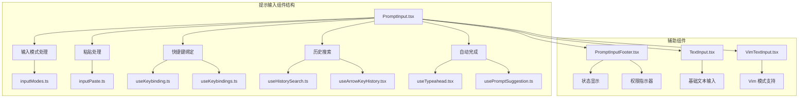
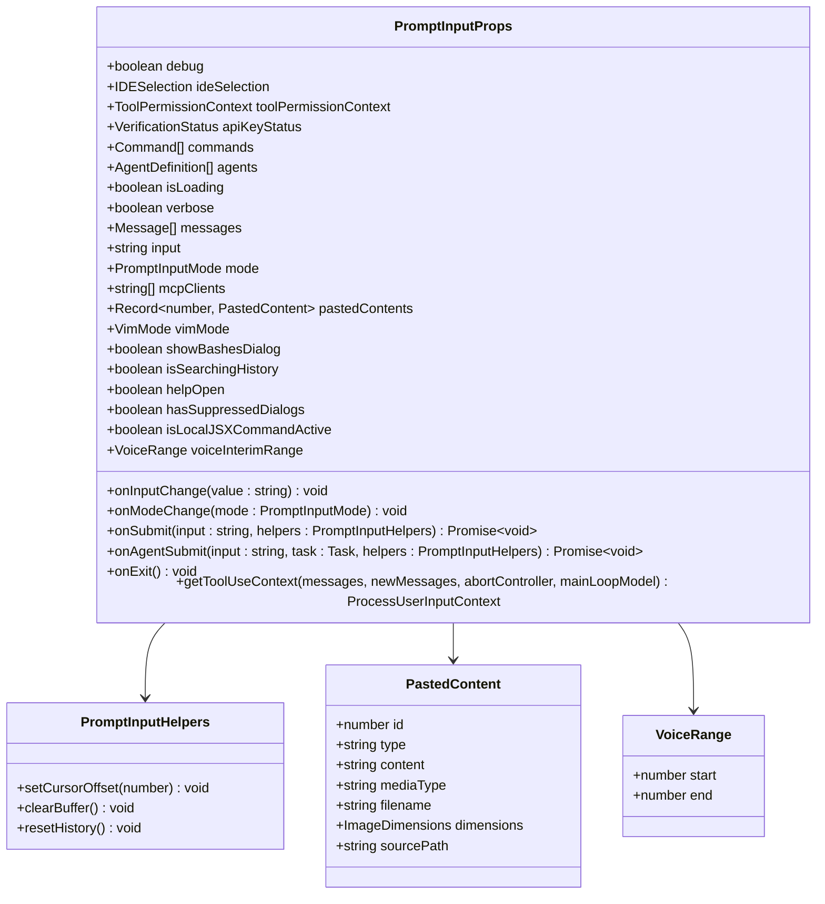
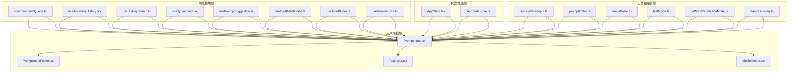
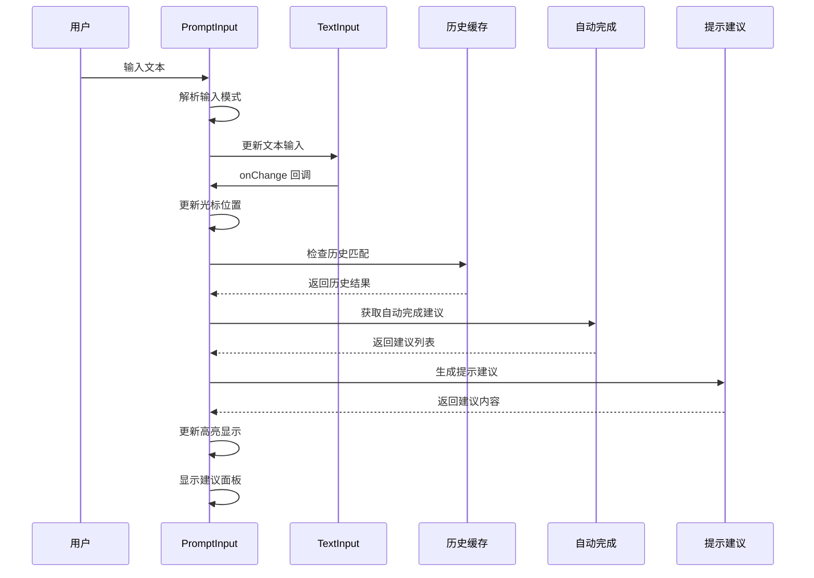
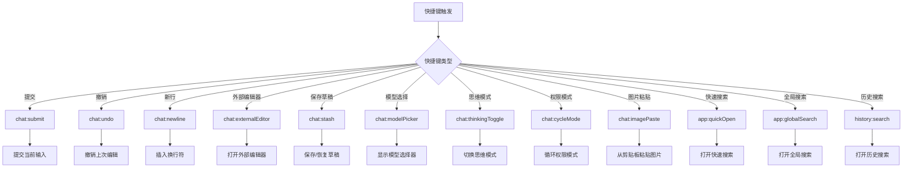
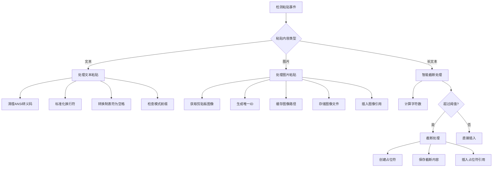
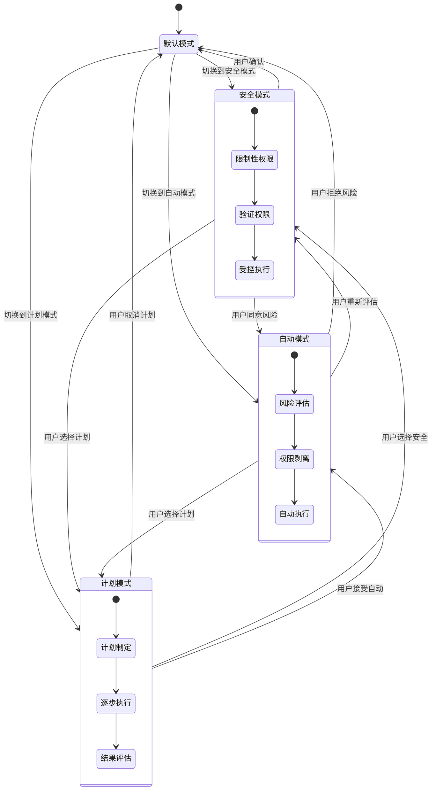
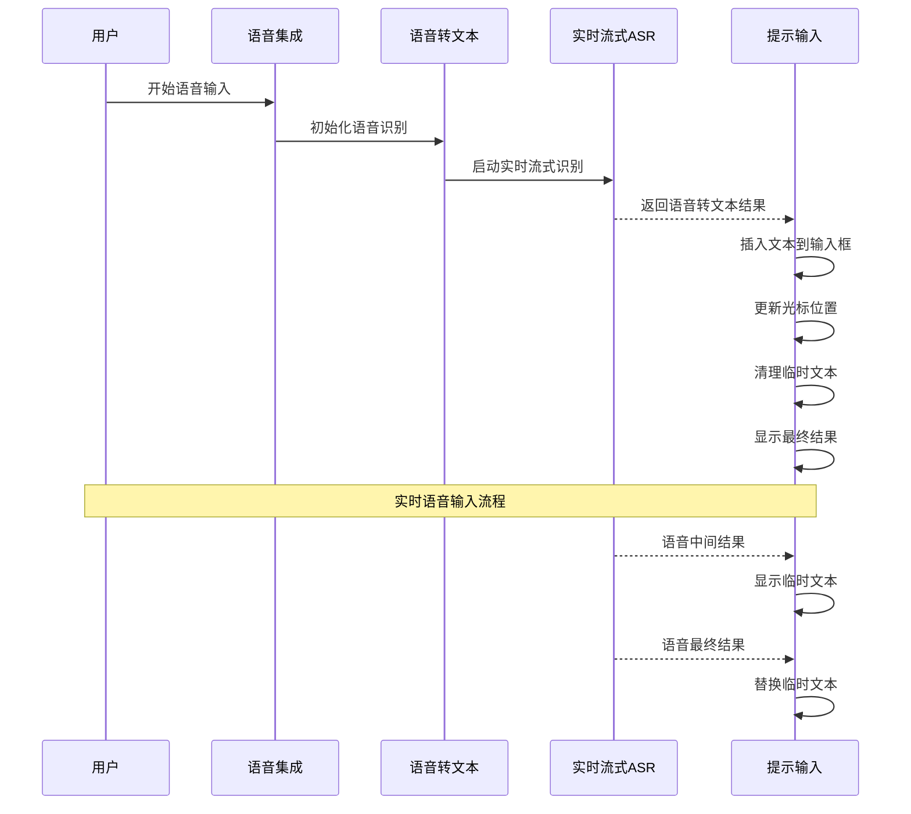
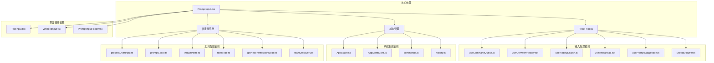

# 提示输入组件

<cite>
**本文档引用的文件**
- [PromptInput.tsx](file://src/components/PromptInput/PromptInput.tsx)
- [inputModes.ts](file://src/components/PromptInput/inputModes.ts)
- [inputPaste.ts](file://src/components/PromptInput/inputPaste.ts)
- [usePromptInputPlaceholder.ts](file://src/components/PromptInput/usePromptInputPlaceholder.ts)
- [PromptInputFooter.tsx](file://src/components/PromptInput/PromptInputFooter.tsx)
- [TextInput.tsx](file://src/components/TextInput.tsx)
- [VimTextInput.tsx](file://src/components/VimTextInput.tsx)
- [useCommandQueue.ts](file://src/hooks/useCommandQueue.ts)
- [useArrowKeyHistory.tsx](file://src/hooks/useArrowKeyHistory.tsx)
- [useHistorySearch.ts](file://src/hooks/useHistorySearch.ts)
- [useTypeahead.tsx](file://src/hooks/useTypeahead.tsx)
- [usePromptSuggestion.ts](file://src/hooks/usePromptSuggestion.ts)
- [useIdeAtMentioned.ts](file://src/hooks/useIdeAtMentioned.ts)
- [useInputBuffer.ts](file://src/hooks/useInputBuffer.ts)
- [useTerminalSize.ts](file://src/hooks/useTerminalSize.ts)
- [useKeybinding.ts](file://src/hooks/useKeybinding.ts)
- [useKeybindings.ts](file://src/hooks/useKeybindings.ts)
- [AppState.tsx](file://src/state/AppState.tsx)
- [AppStateStore.ts](file://src/state/AppStateStore.ts)
- [commands.ts](file://src/commands.ts)
- [history.ts](file://src/history.ts)
- [processUserInput.ts](file://src/utils/processUserInput/processUserInput.ts)
- [promptEditor.ts](file://src/utils/promptEditor.ts)
- [imagePaste.ts](file://src/utils/imagePaste.ts)
- [imageStore.ts](file://src/utils/imageStore.ts)
- [keyboardShortcuts.ts](file://src/utils/keyboardShortcuts.ts)
- [fastMode.ts](file://src/utils/fastMode.ts)
- [permissions/getNextPermissionMode.ts](file://src/utils/permissions/getNextPermissionMode.ts)
- [permissions/permissionSetup.ts](file://src/utils/permissions/permissionSetup.ts)
- [teamDiscovery.ts](file://src/utils/teamDiscovery.ts)
- [teammateContext.ts](file://src/utils/teammateContext.ts)
- [teammateMailbox.ts](file://src/utils/teammateMailbox.ts)
- [textHighlighting.ts](file://src/utils/textHighlighting.ts)
- [theme.ts](file://src/utils/theme.ts)
- [thinking.ts](file://src/utils/thinking.ts)
- [ultraplan/keyword.ts](file://src/utils/ultraplan/keyword.ts)
- [voice.ts](file://src/services/voice.ts)
- [voiceStreamSTT.ts](file://src/services/voiceStreamSTT.ts)
- [voiceIntegration.tsx](file://src/hooks/useVoiceIntegration.tsx)
- [voice.ts](file://src/hooks/useVoice.ts)
- [voiceEnabled.ts](file://src/hooks/useVoiceEnabled.ts)
- [voice.ts](file://src/context/voice.tsx)
- [voice.ts](file://src/services/voice.ts)
- [voiceKeyterms.ts](file://src/services/voiceKeyterms.ts)
- [voiceStreamSTT.ts](file://src/services/voiceStreamSTT.ts)
- [voiceIntegration.tsx](file://src/hooks/useVoiceIntegration.tsx)
- [voice.ts](file://src/hooks/useVoice.ts)
- [voiceEnabled.ts](file://src/hooks/useVoiceEnabled.ts)
- [voice.ts](file://src/context/voice.tsx)
- [voice.ts](file://src/services/voice.ts)
- [voiceKeyterms.ts](file://src/services/voiceKeyterms.ts)
- [voiceStreamSTT.ts](file://src/services/voiceStreamSTT.ts)
- [voiceIntegration.tsx](file://src/hooks/useVoiceIntegration.tsx)
- [voice.ts](file://src/hooks/useVoice.ts)
- [voiceEnabled.ts](file://src/hooks/useVoiceEnabled.ts)
- [voice.ts](file://src/context/voice.tsx)
- [voice.ts](file://src/services/voice.ts)
- [voiceKeyterms.ts](file://src/services/voiceKeyterms.ts)
- [voiceStreamSTT.ts](file://src/services/voiceStreamSTT.ts)
- [voiceIntegration.tsx](file://src/hooks/useVoiceIntegration.tsx)
- [voice.ts](file://src/hooks/useVoice.ts)
- [voiceEnabled.ts](file://src/hooks/useVoiceEnabled.ts)
- [voice.ts](file://src/context/voice.tsx)
- [voice.ts](file://src/services/voice.ts)
- [voiceKeyterms.ts](file://src/services/voiceKeyterms.ts)
- [voiceStreamSTT.ts](file://src/services/voiceStreamSTT.ts)
- [voiceIntegration.tsx](file://src/hooks/useVoiceIntegration.tsx)
- [voice.ts](file://src/hooks/useVoice.ts)
- [voiceEnabled.ts](file://src/hooks/useVoiceEnabled.ts)
- [voice.ts](file://src/context/voice.tsx)
- [voice.ts](file://src/services/voice.ts)
- [voiceKeyterms.ts](file://src/services/voiceKeyterms.ts)
- [voiceStreamSTT.ts](file://src/services/voiceStreamSTT.ts)
- [voiceIntegration.tsx](file://src/hooks/useVoiceIntegration.tsx)
- [voice.ts](file://src/hooks/useVoice.ts)
- [voiceEnabled.ts](file://src/hooks/useVoiceEnabled.ts)
- [voice.ts](file://src/context/voice.tsx)
- [voice.ts](file://src/services/voice.ts)
- [voiceKeyterms.ts](file://src/services/voiceKeyterms.ts)
- [voiceStreamSTT.ts](file://src/services/voiceStreamSTT.ts)
- [voiceIntegration.tsx](file://src/hooks/useVoiceIntegration.tsx)
- [voice.ts](file://src/hooks/useVoice.ts)
- [voiceEnabled.ts](file://src/hooks/useVoiceEnabled.ts)
- [voice.ts](file://src/context/......)
</cite>

## 目录
1. [简介](#简介)
2. [项目结构](#项目结构)
3. [核心组件](#核心组件)
4. [架构概览](#架构概览)
5. [详细组件分析](#详细组件分析)
6. [依赖关系分析](#依赖关系分析)
7. [性能考虑](#性能考虑)
8. [故障排除指南](#故障排除指南)
9. [结论](#结论)
10. [附录](#附录)

## 简介

提示输入组件是 Claude Code 智能代码助手的核心交互界面，负责处理用户输入、提供智能建议、管理输入模式和集成多种高级功能。该组件提供了完整的命令行界面体验，支持历史搜索、快捷键绑定、粘贴处理、输入模式切换等功能。

该组件采用现代化的 React 架构设计，集成了丰富的功能模块，包括：
- 多模式输入支持（提示模式、Bash 模式）
- 智能自动完成和上下文建议
- 历史搜索和导航
- 快捷键系统和键盘导航
- 图片和文本粘贴处理
- 语音输入集成
- 权限管理和安全控制
- IDE 集成和文件引用

## 项目结构

提示输入组件位于 `src/components/PromptInput/` 目录下，包含以下关键文件：

**图表来源**
- [PromptInput.tsx:194-2339](file://src/components/PromptInput/PromptInput.tsx#L194-L2339)
- [inputModes.ts:1-34](file://src/components/PromptInput/inputModes.ts#L1-L34)
- [inputPaste.ts:1-91](file://src/components/PromptInput/inputPaste.ts#L1-L91)

**章节来源**
- [PromptInput.tsx:1-2339](file://src/components/PromptInput/PromptInput.tsx#L1-L2339)
- [inputModes.ts:1-34](file://src/components/PromptInput/inputModes.ts#L1-L34)
- [inputPaste.ts:1-91](file://src/components/PromptInput/inputPaste.ts#L1-L91)

## 核心组件

### 主要接口定义

提示输入组件通过丰富的 props 接口提供灵活的配置选项：

**图表来源**
- [PromptInput.tsx:124-189](file://src/components/PromptInput/PromptInput.tsx#L124-L189)

### 输入模式系统

组件支持多种输入模式，通过统一的模式识别和转换机制实现：

| 模式类型 | 触发字符 | 功能描述 | 示例 |
|---------|---------|----------|------|
| 提示模式 | 默认 | 标准聊天输入 | "如何修复这个错误？" |
| Bash 模式 | `!` | 执行系统命令 | `!ls -la` |
| Vim 模式 | `vim` | Vim 编辑器模式 | `vim file.txt` |

**章节来源**
- [PromptInput.tsx:854-901](file://src/components/PromptInput/PromptInput.tsx#L854-L901)
- [inputModes.ts:16-33](file://src/components/PromptInput/inputModes.ts#L16-L33)

## 架构概览

提示输入组件采用分层架构设计，将不同功能模块分离到独立的文件中：

**图表来源**
- [PromptInput.tsx:1-2339](file://src/components/PromptInput/PromptInput.tsx#L1-L2339)

## 详细组件分析

### 输入处理流程

提示输入组件的核心处理流程如下：

**图表来源**
- [PromptInput.tsx:854-1126](file://src/components/PromptInput/PromptInput.tsx#L854-L1126)

### 快捷键系统

组件实现了完整的快捷键绑定系统：

**图表来源**
- [PromptInput.tsx:1660-1673](file://src/components/PromptInput/PromptInput.tsx#L1660-L1673)

**章节来源**
- [PromptInput.tsx:1637-1686](file://src/components/PromptInput/PromptInput.tsx#L1637-L1686)

### 粘贴处理机制

组件支持多种粘贴格式的智能处理：

**图表来源**
- [PromptInput.tsx:1201-1240](file://src/components/PromptInput/PromptInput.tsx#L1201-L1240)
- [inputPaste.ts:20-90](file://src/components/PromptInput/inputPaste.ts#L20-L90)

**章节来源**
- [PromptInput.tsx:1151-1240](file://src/components/PromptInput/PromptInput.tsx#L1151-L1240)
- [inputPaste.ts:1-91](file://src/components/PromptInput/inputPaste.ts#L1-L91)

### 权限管理模式

组件实现了复杂的权限管理模式：

**图表来源**
- [PromptInput.tsx:1409-1556](file://src/components/PromptInput/PromptInput.tsx#L1409-L1556)
- [getNextPermissionMode.ts](file://src/utils/permissions/getNextPermissionMode.ts)

**章节来源**
- [PromptInput.tsx:1409-1556](file://src/components/PromptInput/PromptInput.tsx#L1409-L1556)

### 语音输入集成

组件支持完整的语音输入功能：

**图表来源**
- [PromptInput.tsx:1619-1635](file://src/components/PromptInput/PromptInput.tsx#L1619-L1635)
- [voiceIntegration.tsx](file://src/hooks/useVoiceIntegration.tsx)
- [voice.ts](file://src/services/voice.ts)

**章节来源**
- [PromptInput.tsx:1619-1635](file://src/components/PromptInput/PromptInput.tsx#L1619-L1635)
- [voice.ts](file://src/services/voice.ts)
- [voiceStreamSTT.ts](file://src/services/voiceStreamSTT.ts)

## 依赖关系分析

提示输入组件的依赖关系复杂且层次分明：

**图表来源**
- [PromptInput.tsx:1-2339](file://src/components/PromptInput/PromptInput.tsx#L1-L2339)

**章节来源**
- [PromptInput.tsx:1-2339](file://src/components/PromptInput/PromptInput.tsx#L1-L2339)

## 性能考虑

提示输入组件在设计时充分考虑了性能优化：

### 内存管理
- 使用 `React.memo` 优化渲染性能
- 智能的状态更新避免不必要的重渲染
- 输入缓冲区限制大小防止内存泄漏

### 渲染优化
- 终端尺寸动态计算减少布局重排
- 高亮显示仅在必要时更新
- 建议面板延迟渲染

### 异步处理
- 语音识别使用流式处理避免阻塞
- 图像处理异步执行不阻塞主线程
- 历史搜索使用防抖机制

## 故障排除指南

### 常见问题及解决方案

**问题：快捷键无响应**
- 检查 `useKeybinding` 和 `useKeybindings` 是否正确注册
- 确认 `isModalOverlayActive` 状态是否阻止了快捷键处理
- 验证快捷键上下文设置是否正确

**问题：粘贴内容格式异常**
- 检查 `stripAnsi` 函数是否正确移除 ANSI 转义码
- 确认 `PASTE_THRESHOLD` 设置是否合理
- 验证 `parseReferences` 函数是否正确解析引用

**问题：权限模式切换失败**
- 检查 `cyclePermissionMode` 函数调用链
- 确认 `transitionPermissionMode` 是否正确应用
- 验证 `teamContext` 参数传递

**问题：语音输入不工作**
- 检查浏览器权限设置
- 确认 `getImageFromClipboard` 函数是否返回数据
- 验证语音服务连接状态

**章节来源**
- [PromptInput.tsx:1637-1686](file://src/components/PromptInput/PromptInput.tsx#L1637-L1686)
- [inputPaste.ts:1-91](file://src/components/PromptInput/inputPaste.ts#L1-L91)

## 结论

提示输入组件是一个功能完整、架构清晰的现代化 React 组件。它成功地将多种复杂功能集成在一个统一的界面中，提供了优秀的用户体验。组件的设计体现了以下特点：

1. **模块化设计**：功能按模块分离，便于维护和扩展
2. **状态管理**：采用集中式状态管理，确保数据一致性
3. **性能优化**：多层优化策略确保流畅的用户体验
4. **可扩展性**：插件化的架构支持功能扩展
5. **安全性**：完善的权限控制系统保护用户安全

该组件为 Claude Code 智能代码助手提供了强大的输入能力，是整个系统的重要组成部分。

## 附录

### API 参考

#### Props 接口
- `debug`: 调试模式开关
- `ideSelection`: IDE 选区信息
- `toolPermissionContext`: 工具权限上下文
- `apiKeyStatus`: API 密钥验证状态
- `commands`: 可用命令列表
- `agents`: 可用代理列表
- `isLoading`: 加载状态
- `verbose`: 详细输出模式
- `messages`: 对话消息数组
- `input`: 当前输入内容
- `mode`: 输入模式
- `mcpClients`: MCP 服务器连接
- `pastedContents`: 粘贴内容映射
- `vimMode`: Vim 模式状态
- `isSearchingHistory`: 历史搜索状态
- `helpOpen`: 帮助菜单状态
- `hasSuppressedDialogs`: 抑制对话框状态

#### 事件处理器
- `onInputChange`: 输入变更回调
- `onModeChange`: 模式变更回调
- `onSubmit`: 提交回调
- `onAgentSubmit`: 代理提交回调
- `onExit`: 退出回调
- `getToolUseContext`: 工具使用上下文获取

### 最佳实践

1. **性能优化**
   - 使用 `React.memo` 包装大型组件
   - 合理使用 `useMemo` 和 `useCallback`
   - 避免不必要的状态更新

2. **用户体验**
   - 提供清晰的反馈信息
   - 支持键盘导航和快捷键
   - 实现适当的加载状态

3. **错误处理**
   - 实现全面的错误边界
   - 提供友好的错误提示
   - 支持错误恢复机制

4. **可访问性**
   - 支持屏幕阅读器
   - 提供键盘导航
   - 确保颜色对比度符合标准