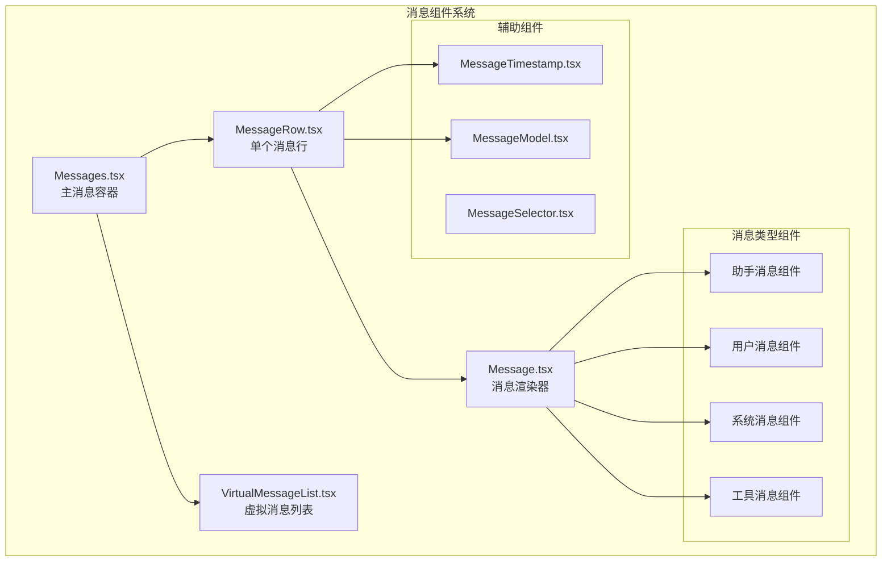
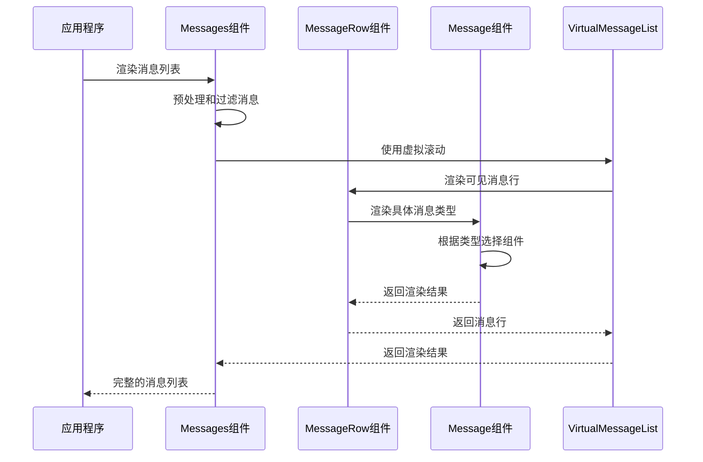
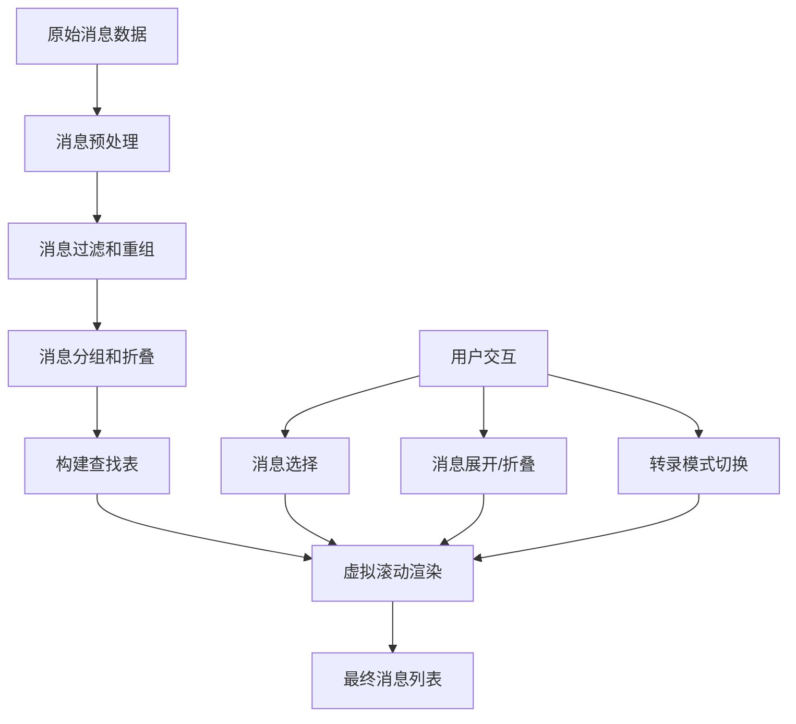
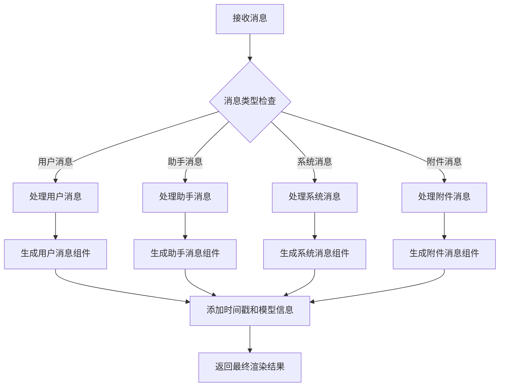
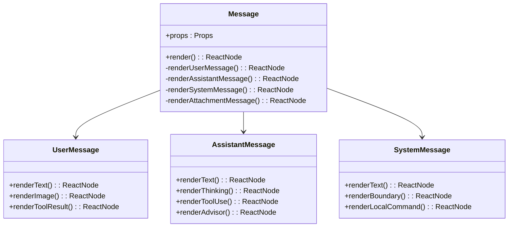
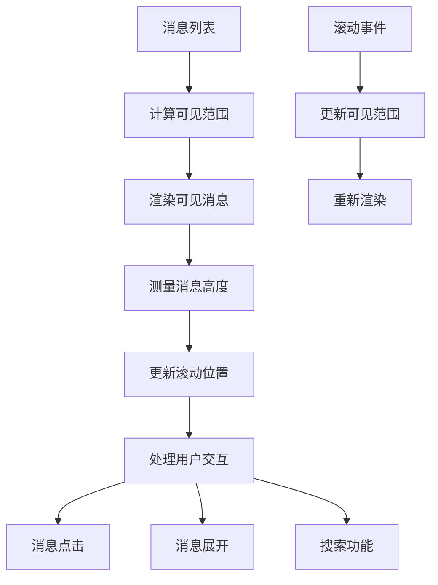
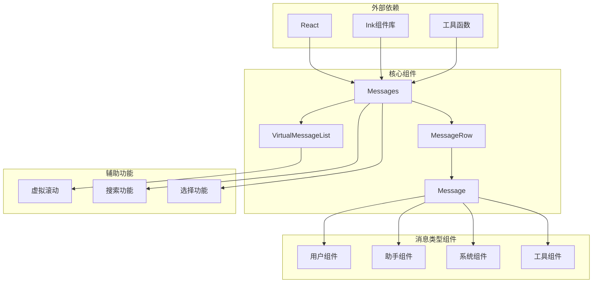

# 消息组件

<cite>
**本文档引用的文件**
- [Message.tsx](file://src/components/Message.tsx)
- [Messages.tsx](file://src/components/Messages.tsx)
- [MessageRow.tsx](file://src/components/MessageRow.tsx)
- [MessageModel.tsx](file://src/components/MessageModel.tsx)
- [VirtualMessageList.tsx](file://src/components/VirtualMessageList.tsx)
</cite>

## 目录
1. [简介](#简介)
2. [项目结构](#项目结构)
3. [核心组件](#核心组件)
4. [架构概览](#架构概览)
5. [详细组件分析](#详细组件分析)
6. [依赖关系分析](#依赖关系分析)
7. [性能考虑](#性能考虑)
8. [故障排除指南](#故障排除指南)
9. [结论](#结论)

## 简介

free-code 的消息组件系统是一个高度优化的终端消息渲染框架，专为 Claude AI 应用程序设计。该系统提供了完整的消息类型支持、虚拟滚动、消息选择和操作功能，以及丰富的渲染选项。

消息组件系统的核心特点包括：
- 支持多种消息类型：用户消息、助手消息、系统消息、工具消息等
- 高效的虚拟滚动机制，支持数千条消息的流畅滚动
- 智能的消息分组和折叠功能
- 完整的转录模式支持
- 实时流式内容渲染
- 消息选择和操作功能

## 项目结构

消息组件系统主要位于 `src/components/` 目录下，包含以下核心文件：

**图表来源**
- [Messages.tsx:1-834](file://src/components/Messages.tsx#L1-L834)
- [MessageRow.tsx:1-383](file://src/components/MessageRow.tsx#L1-L383)
- [Message.tsx:1-627](file://src/components/Message.tsx#L1-L627)

**章节来源**
- [Messages.tsx:1-834](file://src/components/Messages.tsx#L1-L834)
- [MessageRow.tsx:1-383](file://src/components/MessageRow.tsx#L1-L383)
- [Message.tsx:1-627](file://src/components/Message.tsx#L1-L627)

## 核心组件

### 主要组件架构

消息组件系统采用分层架构设计，每个层级都有特定的职责：

1. **Messages 组件** - 主容器，负责消息的预处理、过滤和渲染协调
2. **MessageRow 组件** - 单个消息行的渲染，处理消息的布局和样式
3. **Message 组件** - 具体消息类型的渲染器，根据消息类型选择相应的组件
4. **VirtualMessageList 组件** - 虚拟滚动实现，处理大量消息的高效渲染

### 消息类型支持

系统支持以下消息类型：

| 消息类型 | 描述 | 组件 |
|---------|------|------|
| user | 用户发送的消息 | UserTextMessage, UserImageMessage, UserToolResultMessage |
| assistant | 助手回复的消息 | AssistantTextMessage, AssistantThinkingMessage, AssistantToolUseMessage |
| system | 系统消息 | SystemTextMessage, CompactBoundaryMessage |
| attachment | 附件消息 | AttachmentMessage |
| grouped_tool_use | 分组工具调用 | GroupedToolUseContent |
| collapsed_read_search | 折叠的读取/搜索消息 | CollapsedReadSearchContent |

**章节来源**
- [Message.tsx:82-354](file://src/components/Message.tsx#L82-L354)
- [Messages.tsx:207-275](file://src/components/Messages.tsx#L207-L275)

## 架构概览

消息组件系统采用 React 函数式组件和现代 React 特性构建，实现了高性能和可维护性的平衡。

**图表来源**
- [Messages.tsx:341-721](file://src/components/Messages.tsx#L341-L721)
- [MessageRow.tsx:93-287](file://src/components/MessageRow.tsx#L93-L287)
- [Message.tsx:58-355](file://src/components/Message.tsx#L58-L355)

### 数据流架构

**图表来源**
- [Messages.tsx:481-529](file://src/components/Messages.tsx#L481-L529)
- [VirtualMessageList.tsx:289-800](file://src/components/VirtualMessageList.tsx#L289-L800)

## 详细组件分析

### Messages 组件

Messages 组件是整个消息系统的主控制器，负责消息的预处理、过滤、重组和最终渲染。

#### 核心功能

1. **消息预处理** - 标准化消息格式，移除空消息
2. **消息过滤** - 根据模式和条件过滤消息
3. **消息重组** - 重新排列消息顺序以优化用户体验
4. **消息分组** - 将相关的消息组合在一起
5. **虚拟滚动** - 处理大量消息的高效渲染

#### 关键属性

| 属性名 | 类型 | 描述 |
|--------|------|------|
| messages | MessageType[] | 原始消息数组 |
| tools | Tools | 工具集合 |
| commands | Command[] | 命令集合 |
| verbose | boolean | 详细模式开关 |
| inProgressToolUseIDs | Set<string> | 进行中的工具使用ID集合 |
| isMessageSelectorVisible | boolean | 消息选择器可见性 |
| screen | Screen | 当前屏幕模式 |
| streamingToolUses | StreamingToolUse[] | 流式工具使用数据 |
| hidePastThinking | boolean | 隐藏过去思考内容 |
| streamingThinking | StreamingThinking | 流式思考数据 |

**章节来源**
- [Messages.tsx:207-275](file://src/components/Messages.tsx#L207-L275)
- [Messages.tsx:341-778](file://src/components/Messages.tsx#L341-L778)

### MessageRow 组件

MessageRow 组件负责单个消息行的渲染，处理消息的布局、样式和交互。

#### 渲染逻辑

**图表来源**
- [MessageRow.tsx:93-287](file://src/components/MessageRow.tsx#L93-L287)

#### 性能优化

MessageRow 组件采用了多种性能优化技术：

1. **记忆化缓存** - 使用 React.memo 避免不必要的重渲染
2. **条件渲染** - 只在必要时重新计算和渲染
3. **增量更新** - 仅更新发生变化的部分

**章节来源**
- [MessageRow.tsx:342-382](file://src/components/MessageRow.tsx#L342-L382)

### Message 组件

Message 组件是消息渲染的核心，根据消息类型动态选择相应的渲染组件。

#### 消息类型处理

**图表来源**
- [Message.tsx:58-590](file://src/components/Message.tsx#L58-L590)

#### 思考过程显示

系统支持完整的思考过程显示功能，包括：

1. **思考内容渲染** - 显示助手的内部思考过程
2. **转录模式控制** - 在转录模式下控制思考内容的可见性
3. **实时更新** - 支持流式思考内容的实时更新

**章节来源**
- [Message.tsx:433-589](file://src/components/Message.tsx#L433-L589)

### VirtualMessageList 组件

VirtualMessageList 组件实现了高效的虚拟滚动功能，支持数千条消息的流畅滚动。

#### 虚拟滚动实现

**图表来源**
- [VirtualMessageList.tsx:289-800](file://src/components/VirtualMessageList.tsx#L289-L800)

#### 搜索和导航

VirtualMessageList 提供了强大的搜索和导航功能：

1. **全文搜索** - 支持消息内容的全文搜索
2. **高亮显示** - 搜索结果的高亮显示
3. **快速导航** - 支持快速跳转到指定消息
4. **锚点功能** - 支持设置搜索锚点

**章节来源**
- [VirtualMessageList.tsx:466-780](file://src/components/VirtualMessageList.tsx#L466-L780)

## 依赖关系分析

消息组件系统具有清晰的依赖关系和模块化设计：

**图表来源**
- [Messages.tsx:1-834](file://src/components/Messages.tsx#L1-L834)
- [MessageRow.tsx:1-383](file://src/components/MessageRow.tsx#L1-L383)
- [Message.tsx:1-627](file://src/components/Message.tsx#L1-L627)

### 组件间通信

消息组件系统通过以下方式实现组件间的通信：

1. **属性传递** - 父组件向子组件传递必要的数据和回调函数
2. **上下文共享** - 使用 React Context 共享全局状态
3. **事件回调** - 子组件通过回调函数通知父组件状态变化
4. **引用传递** - 通过 ref 传递组件实例以实现直接调用

**章节来源**
- [Messages.tsx:39-45](file://src/components/Messages.tsx#L39-L45)
- [MessageRow.tsx:628-636](file://src/components/MessageRow.tsx#L628-L636)

## 性能考虑

消息组件系统在设计时充分考虑了性能优化，特别是在处理大量消息时的表现。

### 内存管理

1. **虚拟滚动** - 仅渲染可见区域的消息，避免一次性渲染所有消息
2. **增量更新** - 仅更新发生变化的消息，减少重渲染开销
3. **缓存机制** - 使用 WeakMap 和缓存策略减少重复计算

### 渲染优化

1. **React.memo** - 对无状态组件使用记忆化避免不必要的重渲染
2. **条件渲染** - 根据消息类型和状态选择最优的渲染路径
3. **懒加载** - 对于大型附件和复杂内容采用懒加载策略

### 滚动性能

1. **高度缓存** - 缓存消息高度以避免重复测量
2. **批量更新** - 批量处理滚动事件以提高响应性
3. **防抖处理** - 对频繁的滚动事件进行防抖处理

**章节来源**
- [Messages.tsx:741-778](file://src/components/Messages.tsx#L741-L778)
- [MessageRow.tsx:342-382](file://src/components/MessageRow.tsx#L342-L382)

## 故障排除指南

### 常见问题和解决方案

#### 消息不显示或显示异常

**问题症状**：
- 某些消息完全不显示
- 消息显示格式错误
- 消息内容截断

**可能原因**：
1. 消息类型不支持
2. 消息数据格式不正确
3. 渲染组件配置错误

**解决步骤**：
1. 检查消息类型是否在支持列表中
2. 验证消息数据结构的完整性
3. 确认渲染组件的 props 配置

#### 性能问题

**问题症状**：
- 滚动卡顿
- 页面响应缓慢
- 内存使用过高

**可能原因**：
1. 消息数量过多
2. 渲染组件过于复杂
3. 缺少必要的优化

**解决步骤**：
1. 启用虚拟滚动功能
2. 简化复杂的渲染逻辑
3. 实施适当的缓存策略

#### 搜索功能异常

**问题症状**：
- 搜索结果不准确
- 搜索速度慢
- 高亮显示错误

**可能原因**：
1. 搜索索引未正确构建
2. 文本提取算法问题
3. 搜索查询处理错误

**解决步骤**：
1. 重建搜索索引
2. 检查文本提取逻辑
3. 验证搜索查询处理

**章节来源**
- [VirtualMessageList.tsx:528-605](file://src/components/VirtualMessageList.tsx#L528-L605)
- [Messages.tsx:649-676](file://src/components/Messages.tsx#L649-L676)

## 结论

free-code 的消息组件系统是一个设计精良、功能完整的消息渲染框架。它通过合理的架构设计、性能优化和丰富的功能特性，为用户提供了一个高效、流畅的消息交互体验。

### 主要优势

1. **模块化设计** - 清晰的组件层次和职责分离
2. **高性能实现** - 虚拟滚动和多种优化技术
3. **功能丰富** - 支持多种消息类型和交互功能
4. **可扩展性** - 良好的扩展接口和自定义能力
5. **用户体验** - 流畅的滚动和响应式交互

### 未来发展方向

1. **更多消息类型支持** - 扩展对新消息类型的支持
2. **增强的搜索功能** - 更智能的搜索和过滤能力
3. **更好的移动端支持** - 优化移动端的显示和交互
4. **性能进一步优化** - 持续改进渲染性能和内存使用

这个消息组件系统为开发者提供了一个强大而灵活的基础，可以轻松地扩展和定制以满足各种应用场景的需求。