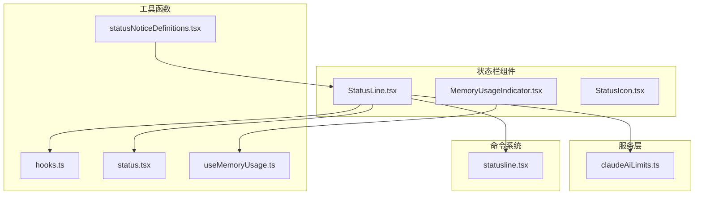
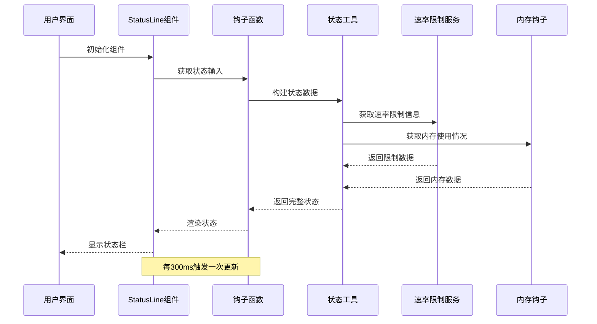
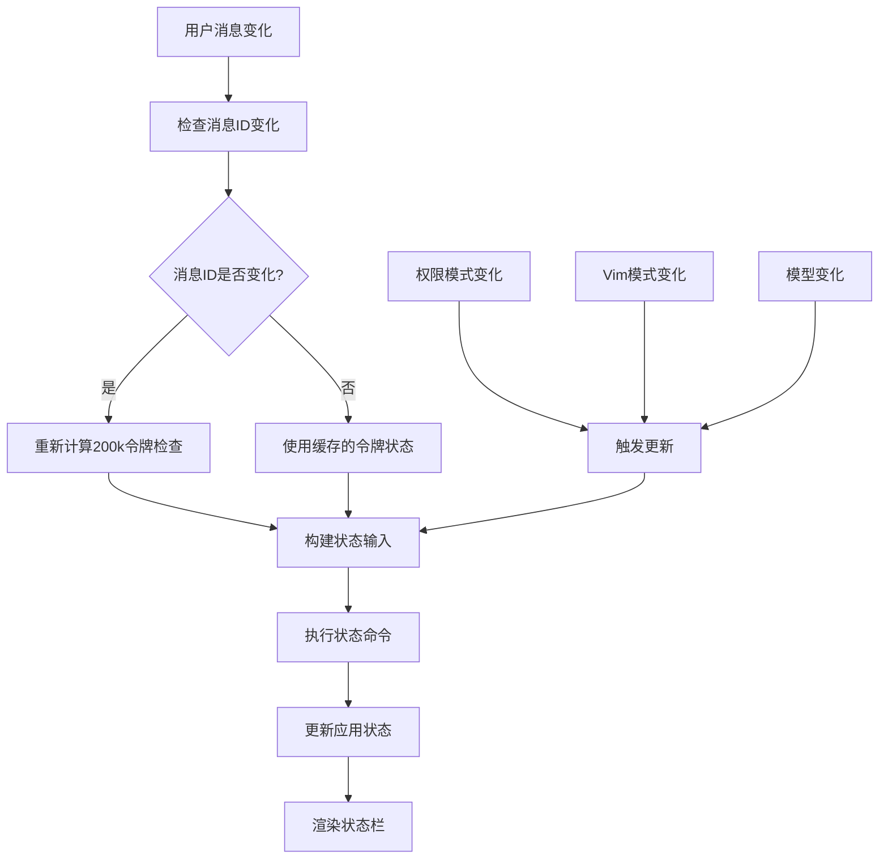
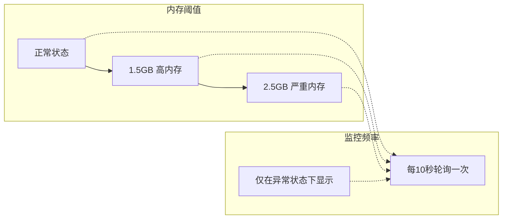
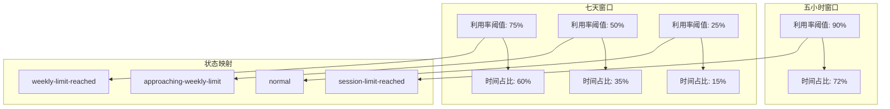
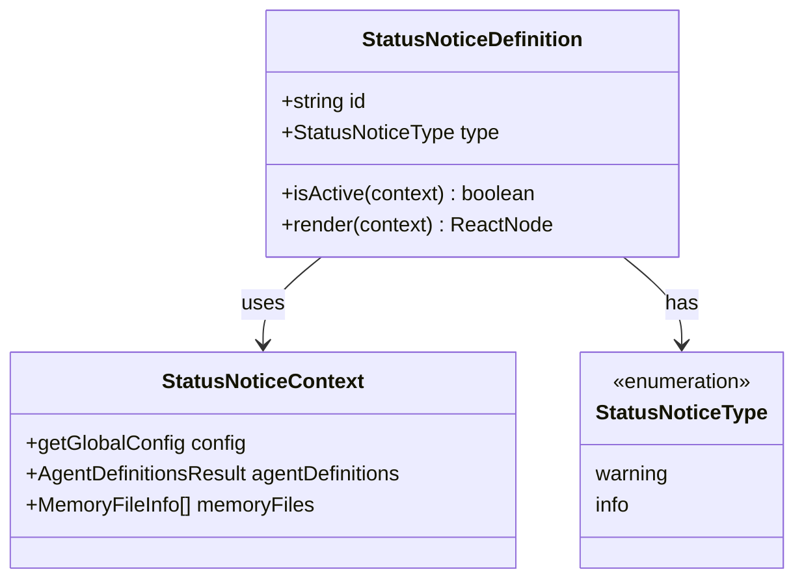
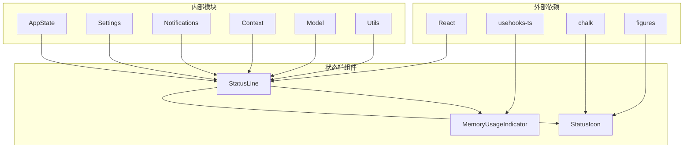
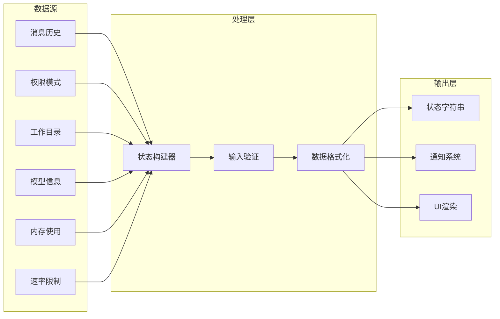

# 状态栏组件

<cite>
**本文档引用的文件**
- [src/components/StatusLine.tsx](file://src/components/StatusLine.tsx)
- [src/utils/hooks.ts](file://src/utils/hooks.ts)
- [src/utils/status.tsx](file://src/utils/status.tsx)
- [src/utils/statusNoticeDefinitions.tsx](file://src/utils/statusNoticeDefinitions.tsx)
- [src/components/MemoryUsageIndicator.tsx](file://src/components/MemoryUsageIndicator.tsx)
- [src/hooks/useMemoryUsage.ts](file://src/hooks/useMemoryUsage.ts)
- [src/services/claudeAiLimits.ts](file://src/services/claudeAiLimits.ts)
- [src/commands/statusline.tsx](file://src/commands/statusline.tsx)
- [src/components/design-system/StatusIcon.tsx](file://src/components/design-system/StatusIcon.tsx)
</cite>

## 目录
1. [简介](#简介)
2. [项目结构](#项目结构)
3. [核心组件](#核心组件)
4. [架构概览](#架构概览)
5. [详细组件分析](#详细组件分析)
6. [依赖关系分析](#依赖关系分析)
7. [性能考虑](#性能考虑)
8. [故障排除指南](#故障排除指南)
9. [结论](#结论)
10. [附录](#附录)

## 简介

状态栏组件是 Claude Code 开发工具中的关键界面元素，负责在终端底部显示实时状态信息。该组件提供了丰富的状态指示功能，包括内存使用情况、速率限制状态、模型状态、连接状态等多维度的系统监控信息。

本组件采用响应式设计，能够根据不同的工作环境和用户配置动态调整显示内容。通过钩子函数实现数据获取和状态管理，确保了良好的性能表现和用户体验。

## 项目结构

状态栏相关的核心文件分布在以下目录中：



**图表来源**
- [src/components/StatusLine.tsx:1-324](file://src/components/StatusLine.tsx#L1-L324)
- [src/utils/hooks.ts:4584-4644](file://src/utils/hooks.ts#L4584-L4644)

**章节来源**
- [src/components/StatusLine.tsx:1-324](file://src/components/StatusLine.tsx#L1-L324)
- [src/utils/hooks.ts:4584-4644](file://src/utils/hooks.ts#L4584-L4644)

## 核心组件

### StatusLine 组件

StatusLine 是状态栏的主要组件，负责构建和渲染状态信息。该组件具有以下核心特性：

- **智能缓存机制**：使用 useRef 和 useCallback 实现高效的状态缓存
- **防抖更新**：通过 setTimeout 实现 300ms 的防抖延迟
- **条件渲染**：仅在状态变化时重新渲染
- **安全执行**：支持 AbortController 取消正在进行的操作

### 内存使用指示器

MemoryUsageIndicator 提供实时内存使用监控功能：

- **阈值检测**：当内存使用超过 1.5GB（高）或 2.5GB（严重）时才显示
- **格式化输出**：使用 formatFileSize 函数美化内存大小显示
- **状态颜色**：根据内存使用状态选择不同的颜色（警告或错误）

### 状态图标系统

StatusIcon 组件提供统一的状态视觉表示：

- **多状态支持**：支持 success、error、pending 等不同状态
- **可配置颜色**：根据状态自动选择合适的颜色方案
- **空间控制**：支持可选的文本间距设置

**章节来源**
- [src/components/StatusLine.tsx:128-324](file://src/components/StatusLine.tsx#L128-L324)
- [src/components/MemoryUsageIndicator.tsx:1-37](file://src/components/MemoryUsageIndicator.tsx#L1-L37)
- [src/components/design-system/StatusIcon.tsx:54-94](file://src/components/design-system/StatusIcon.tsx#L54-L94)

## 架构概览

状态栏组件采用分层架构设计，确保了模块间的松耦合和高内聚：



**图表来源**
- [src/components/StatusLine.tsx:191-223](file://src/components/StatusLine.tsx#L191-L223)
- [src/utils/hooks.ts:4584-4644](file://src/utils/hooks.ts#L4584-L4644)

## 详细组件分析

### StatusLine 组件深度分析

#### 数据流架构



**图表来源**
- [src/components/StatusLine.tsx:200-246](file://src/components/StatusLine.tsx#L200-L246)

#### 关键属性接口

StatusLine 组件接受以下属性：

| 属性名 | 类型 | 必需 | 描述 |
|--------|------|------|------|
| messagesRef | RefObject<Message[]> | 是 | 消息数组的引用对象 |
| lastAssistantMessageId | string \| null | 是 | 最后一条助手消息的ID |
| vimMode | VimMode | 否 | Vim编辑模式状态 |

#### 状态更新机制

组件实现了智能的状态更新策略：

1. **消息变更检测**：通过比较 lastAssistantMessageId 来判断消息是否发生变化
2. **令牌超限检查**：仅在消息变化时重新计算是否超过200k令牌限制
3. **防抖优化**：使用 setTimeout 实现300ms的防抖延迟
4. **缓存策略**：使用 previousStateRef 缓存上一次的状态值

**章节来源**
- [src/components/StatusLine.tsx:128-324](file://src/components/StatusLine.tsx#L128-L324)

### 内存使用监控系统

#### 内存阈值配置



**图表来源**
- [src/hooks/useMemoryUsage.ts:11-39](file://src/hooks/useMemoryUsage.ts#L11-L39)

#### 内存状态分类

| 状态 | 阈值 | 颜色 | 行为 |
|------|------|------|------|
| normal | < 1.5GB | 无 | 不显示 |
| high | ≥ 1.5GB | 警告 | 显示警告信息 |
| critical | ≥ 2.5GB | 错误 | 显示错误信息 |

**章节来源**
- [src/hooks/useMemoryUsage.ts:1-39](file://src/hooks/useMemoryUsage.ts#L1-L39)
- [src/components/MemoryUsageIndicator.tsx:1-37](file://src/components/MemoryUsageIndicator.tsx#L1-L37)

### 速率限制监控

#### 早期预警系统



**图表来源**
- [src/services/claudeAiLimits.ts:53-89](file://src/services/claudeAiLimits.ts#L53-L89)

**章节来源**
- [src/services/claudeAiLimits.ts:43-89](file://src/services/claudeAiLimits.ts#L43-L89)

### 状态通知系统

#### 通知定义结构



**图表来源**
- [src/utils/statusNoticeDefinitions.tsx:17-28](file://src/utils/statusNoticeDefinitions.tsx#L17-L28)

#### 支持的通知类型

| 通知ID | 类型 | 触发条件 | 显示内容 |
|--------|------|----------|----------|
| large-memory-files | warning | 大文件影响性能 | 内存文件警告信息 |
| claude-ai-external-token | warning | 认证冲突 | Claude AI令牌冲突 |
| api-key-conflict | warning | API密钥冲突 | API密钥冲突信息 |
| both-auth-methods | warning | 双重认证方法 | 双重认证冲突 |
| large-agent-descriptions | warning | 代理描述过大 | 代理描述警告 |
| jetbrains-plugin-install | info | JetBrains插件未安装 | 插件安装提示 |

**章节来源**
- [src/utils/statusNoticeDefinitions.tsx:30-198](file://src/utils/statusNoticeDefinitions.tsx#L30-L198)

## 依赖关系分析

### 组件间依赖关系



**图表来源**
- [src/components/StatusLine.tsx:1-30](file://src/components/StatusLine.tsx#L1-L30)
- [src/components/MemoryUsageIndicator.tsx:1-5](file://src/components/MemoryUsageIndicator.tsx#L1-L5)

### 数据流依赖



**图表来源**
- [src/components/StatusLine.tsx:36-127](file://src/components/StatusLine.tsx#L36-L127)

**章节来源**
- [src/components/StatusLine.tsx:1-324](file://src/components/StatusLine.tsx#L1-L324)

## 性能考虑

### 优化策略

1. **防抖机制**：300ms的防抖延迟避免频繁更新
2. **智能缓存**：使用 useRef 缓存状态值，减少不必要的计算
3. **条件渲染**：仅在状态变化时重新渲染
4. **内存监控优化**：10秒轮询间隔，仅在异常状态下显示

### 内存使用优化

- **空闲状态优化**：正常状态下不设置轮询定时器
- **状态复用**：使用 React.memo 避免不必要的重渲染
- **资源清理**：组件卸载时清理定时器和订阅

## 故障排除指南

### 常见问题及解决方案

#### 状态栏不显示

**可能原因**：
1. 设置中禁用了状态栏
2. 工作区信任未确认
3. 所有钩子功能被禁用

**解决步骤**：
1. 检查 `settings.statusLine` 配置
2. 确认工作区信任状态
3. 验证钩子功能启用状态

#### 内存使用指示器不显示

**可能原因**：
1. 内存使用正常（< 1.5GB）
2. 构建类型为 external
3. 内存监控钩子未正确初始化

**解决步骤**：
1. 等待内存使用超过阈值
2. 检查构建配置
3. 验证钩子函数调用

#### 速率限制状态异常

**可能原因**：
1. 服务器响应异常
2. 本地时间同步问题
3. 配置文件错误

**解决步骤**：
1. 检查网络连接
2. 验证系统时间
3. 重新加载配置

**章节来源**
- [src/components/StatusLine.tsx:277-287](file://src/components/StatusLine.tsx#L277-L287)
- [src/hooks/useMemoryUsage.ts:18-39](file://src/hooks/useMemoryUsage.ts#L18-L39)

## 结论

状态栏组件通过精心设计的架构和优化策略，成功地在终端环境中提供了丰富的状态信息展示。其核心优势包括：

1. **高性能设计**：通过防抖、缓存和条件渲染确保流畅的用户体验
2. **全面监控**：涵盖内存使用、速率限制、模型状态等多个维度
3. **安全可靠**：内置多种安全检查和错误处理机制
4. **灵活配置**：支持用户自定义状态栏内容和显示方式

该组件为开发者提供了重要的系统状态反馈，有助于提高开发效率和问题诊断能力。

## 附录

### 使用示例

#### 基本使用

```typescript
// 在组件中使用状态栏
<StatusLine 
  messagesRef={messagesRef}
  lastAssistantMessageId={lastMessageId}
/>
```

#### 自定义配置

```typescript
// 配置状态栏显示内容
{
  statusLine: {
    type: 'command',
    command: 'echo "Custom status"',
    padding: 1
  }
}
```

#### 样式定制

```typescript
// 通过主题系统定制颜色
const theme = {
  success: '#4ade80',
  warning: '#fbbf24',
  error: '#f87171'
}
```