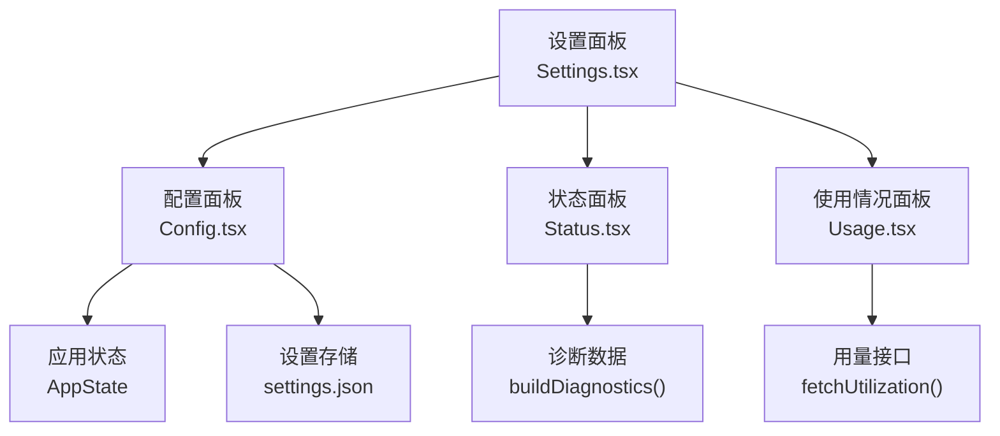
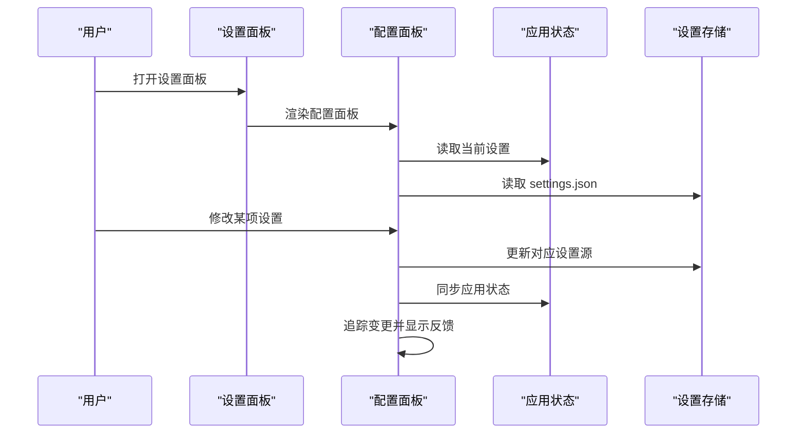
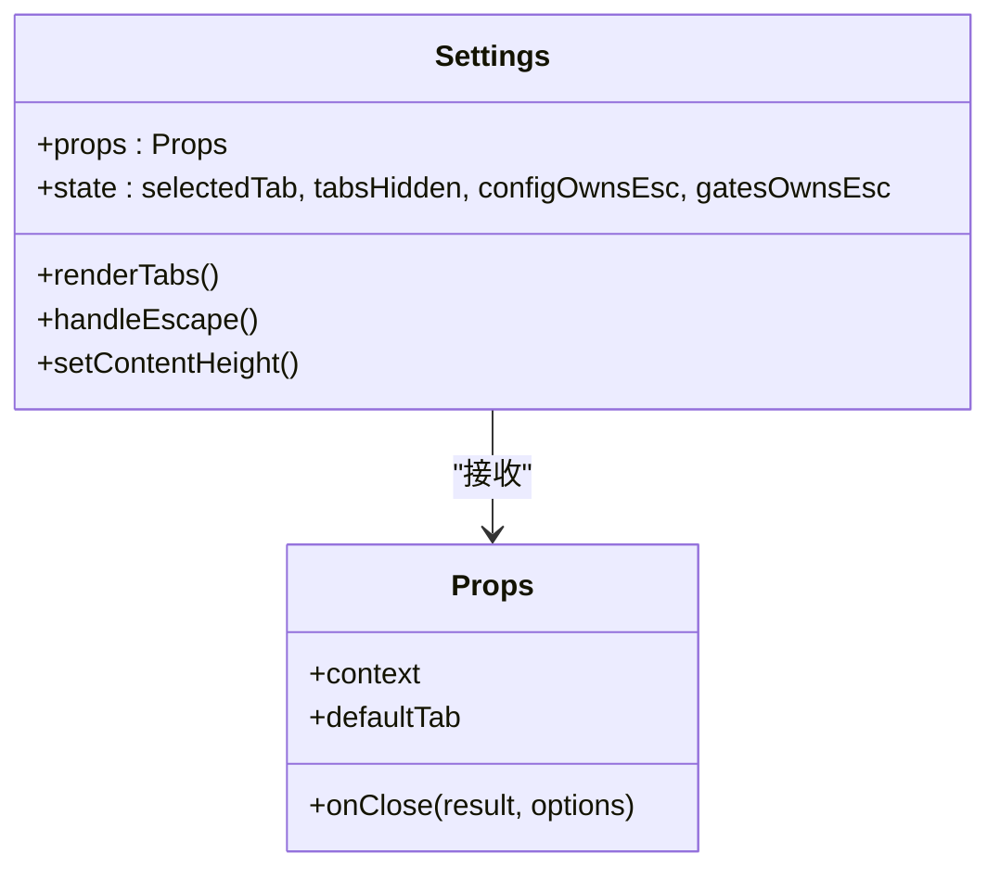
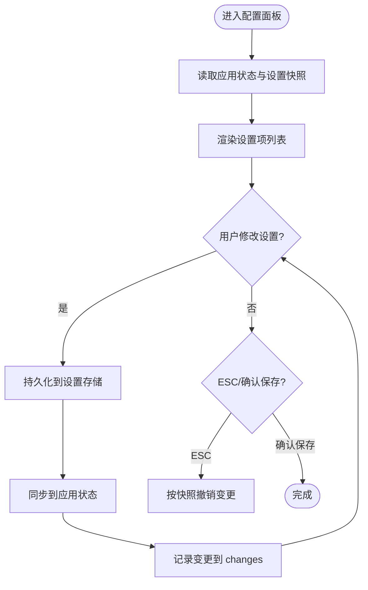
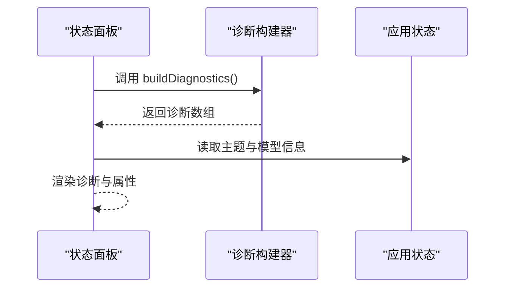
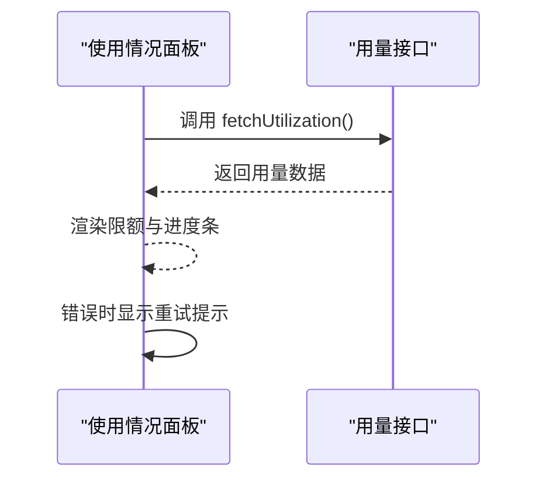
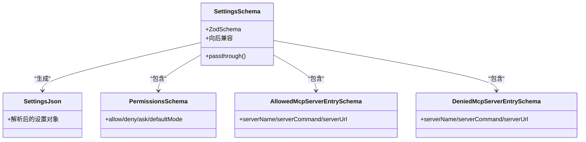
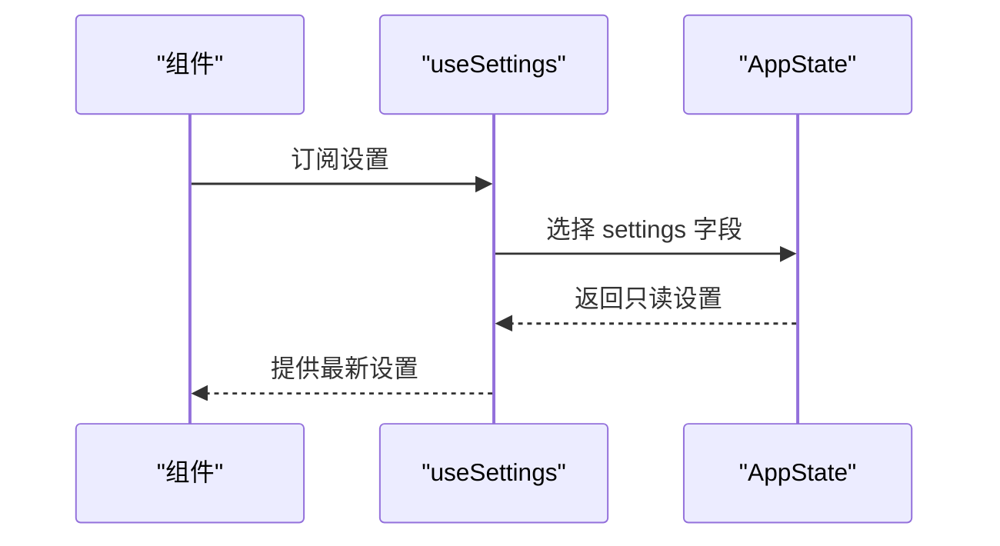
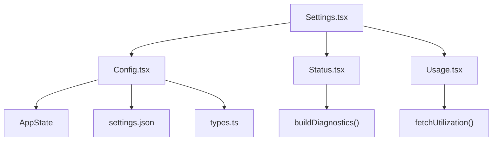

# 设置组件

<cite>
**本文档引用的文件**
- [Settings.tsx](file://src/components/Settings/Settings.tsx)
- [Config.tsx](file://src/components/Settings/Config.tsx)
- [Status.tsx](file://src/components/Settings/Status.tsx)
- [Usage.tsx](file://src/components/Settings/Usage.tsx)
- [types.ts](file://src/utils/settings/types.ts)
- [useSettings.ts](file://src/hooks/useSettings.ts)
- [useSettingsChange.ts](file://src/hooks/useSettingsChange.ts)
- [config.tsx](file://src/commands/config/config.tsx)
</cite>

## 目录
1. [简介](#简介)
2. [项目结构](#项目结构)
3. [核心组件](#核心组件)
4. [架构总览](#架构总览)
5. [详细组件分析](#详细组件分析)
6. [依赖关系分析](#依赖关系分析)
7. [性能考虑](#性能考虑)
8. [故障排除指南](#故障排除指南)
9. [结论](#结论)

## 简介
本文件为 free-code 的设置组件系统提供完整参考文档，涵盖设置面板的架构设计、配置分类与管理机制，以及设置组件的 props 接口、状态同步与持久化存储方式。文档还解释了配置项的展示、实时编辑、验证反馈与重置功能，并给出使用示例、自定义配置与扩展方法，说明设置组件与应用状态、插件配置及安全策略的集成关系。

## 项目结构
设置组件系统由一个主面板组件与三个子面板组成：
- 主面板：设置面板容器，负责标签页切换、键盘快捷键处理与内容高度适配
- 配置面板：用户可交互的设置项列表，支持实时编辑与变更追踪
- 状态面板：系统诊断信息展示，包含版本、会话、模型、IDE/MCP、沙箱与设置来源等
- 使用情况面板：用量与限额信息展示，支持重试加载与提示

**图表来源**
- [Settings.tsx:1-137](file://src/components/Settings/Settings.tsx#L1-137)
- [Config.tsx:1-800](file://src/components/Settings/Config.tsx#L1-800)
- [Status.tsx:1-241](file://src/components/Settings/Status.tsx#L1-241)
- [Usage.tsx:1-377](file://src/components/Settings/Usage.tsx#L1-377)

**章节来源**
- [Settings.tsx:1-137](file://src/components/Settings/Settings.tsx#L1-137)
- [Config.tsx:1-800](file://src/components/Settings/Config.tsx#L1-800)
- [Status.tsx:1-241](file://src/components/Settings/Status.tsx#L1-241)
- [Usage.tsx:1-377](file://src/components/Settings/Usage.tsx#L1-377)

## 核心组件
- 设置面板（Settings）
  - 负责标签页渲染与切换，处理 ESC 键盘事件，控制内容高度以避免布局抖动
  - 提供默认选中的标签页参数，支持隐藏标签页与子面板交互
  - 将命令上下文传递给子面板，用于权限与环境判断
- 配置面板（Config）
  - 展示并管理用户可编辑的设置项，包括全局配置与用户设置
  - 实时更新应用状态与本地设置快照，支持撤销与持久化写入
  - 支持搜索模式、键盘导航与快捷键提示
- 状态面板（Status）
  - 展示版本、会话、模型、IDE/MCP、沙箱与设置来源等诊断信息
  - 异步构建诊断数据，支持在模态框内自适应高度
- 使用情况面板（Usage）
  - 展示当前会话、周限额与 Sonnet 限额，支持重试加载与错误提示
  - 显示额外用量与超量信用额度促销信息

**章节来源**
- [Settings.tsx:15-130](file://src/components/Settings/Settings.tsx#L15-130)
- [Config.tsx:51-91](file://src/components/Settings/Config.tsx#L51-91)
- [Status.tsx:15-187](file://src/components/Settings/Status.tsx#L15-187)
- [Usage.tsx:174-265](file://src/components/Settings/Usage.tsx#L174-265)

## 架构总览
设置组件系统采用“主面板 + 子面板”的分层架构，通过应用状态与设置存储实现状态同步与持久化。配置面板通过钩子与工具函数读取与更新设置，状态面板与使用情况面板分别负责诊断与用量数据的获取与展示。

**图表来源**
- [Settings.tsx:22-129](file://src/components/Settings/Settings.tsx#L22-129)
- [Config.tsx:91-166](file://src/components/Settings/Config.tsx#L91-166)
- [useSettings.ts:15-17](file://src/hooks/useSettings.ts#L15-17)
- [useSettingsChange.ts:7-25](file://src/hooks/useSettingsChange.ts#L7-25)

## 详细组件分析

### 设置面板（Settings）分析
- 组件职责
  - 管理标签页状态与切换逻辑，根据内容高度动态计算面板尺寸
  - 处理 ESC 键盘事件，确保在搜索模式下正确响应
  - 将命令上下文传递给子面板，支持权限与环境判断
- 关键 props
  - onClose：关闭回调，支持结果与显示选项
  - context：命令上下文，包含 IDE 客户端与安装状态等
  - defaultTab：默认选中标签页（Status/Config/Usage/Gates）
- 状态与行为
  - selectedTab：当前选中标签页
  - tabsHidden：是否隐藏标签页
  - configOwnsEsc/gatesOwnsEsc：标记配置/门禁面板是否接管 ESC 处理
  - contentHeight：根据终端尺寸计算的内容高度，避免布局抖动

**图表来源**
- [Settings.tsx:15-130](file://src/components/Settings/Settings.tsx#L15-130)

**章节来源**
- [Settings.tsx:15-130](file://src/components/Settings/Settings.tsx#L15-130)

### 配置面板（Config）分析
- 组件职责
  - 展示并管理用户可编辑的设置项，包括全局配置与用户设置
  - 实时更新应用状态与本地设置快照，支持撤销与持久化写入
  - 支持搜索模式、键盘导航与快捷键提示
- 关键 props
  - onClose/context/setTabsHidden/onIsSearchModeChange/contentHeight
- 数据流
  - 从应用状态与设置存储读取初始值
  - 用户修改后通过 updateSettingsForSource 或 saveGlobalConfig 持久化
  - 通过 setAppState 同步到应用状态，实现即时 UI 反馈
- 变更追踪
  - changes 对象记录本次会话中的变更，用于 ESC 撤销或确认保存
  - initial* 快照用于 ESC 撤销时恢复到初始状态

**图表来源**
- [Config.tsx:85-166](file://src/components/Settings/Config.tsx#L85-166)

**章节来源**
- [Config.tsx:51-91](file://src/components/Settings/Config.tsx#L51-91)
- [Config.tsx:137-176](file://src/components/Settings/Config.tsx#L137-176)

### 状态面板（Status）分析
- 组件职责
  - 展示版本、会话、模型、IDE/MCP、沙箱与设置来源等诊断信息
  - 异步构建诊断数据，支持在模态框内自适应高度
- 数据来源
  - buildDiagnostics 异步构建安装、健康与内存诊断
  - 应用状态与主题信息用于展示当前运行环境
- 布局适配
  - 在模态框内自动调整增长比例，避免滚动条出现

**图表来源**
- [Status.tsx:54-56](file://src/components/Settings/Status.tsx#L54-56)
- [Status.tsx:102-187](file://src/components/Settings/Status.tsx#L102-187)

**章节来源**
- [Status.tsx:15-187](file://src/components/Settings/Status.tsx#L15-187)

### 使用情况面板（Usage）分析
- 组件职责
  - 展示当前会话、周限额与 Sonnet 限额，支持重试加载与错误提示
  - 显示额外用量与超量信用额度促销信息
- 数据流
  - 通过 fetchUtilization 获取用量数据
  - 使用进度条与文本展示利用率与重置时间
- 错误处理
  - 加载失败时显示错误信息与重试快捷键提示

**图表来源**
- [Usage.tsx:174-204](file://src/components/Settings/Usage.tsx#L174-204)
- [Usage.tsx:205-210](file://src/components/Settings/Usage.tsx#L205-210)

**章节来源**
- [Usage.tsx:174-265](file://src/components/Settings/Usage.tsx#L174-265)

### 设置类型与验证（types.ts）
- 设计要点
  - 使用 Zod Schema 定义设置结构，支持向后兼容与未知字段保留
  - 权限、MCP 服务器、插件配置等关键领域有专门的校验规则
  - 支持企业级策略（如严格插件定制、市场源限制等）
- 关键类型
  - SettingsJson：最终解析后的设置对象类型
  - 允许/拒绝 MCP 服务器条目类型
  - 插件配置类型（含 MCP 服务器用户配置）

**图表来源**
- [types.ts:255-1073](file://src/utils/settings/types.ts#L255-1073)

**章节来源**
- [types.ts:255-1073](file://src/utils/settings/types.ts#L255-1073)

### 应用状态与设置钩子
- useSettings
  - 从应用状态中读取只读设置，支持 React 组件的响应式更新
- useSettingsChange
  - 订阅设置变更通知，触发回调以重新读取设置并更新组件

**图表来源**
- [useSettings.ts:15-17](file://src/hooks/useSettings.ts#L15-17)
- [useSettingsChange.ts:7-25](file://src/hooks/useSettingsChange.ts#L7-25)

**章节来源**
- [useSettings.ts:1-17](file://src/hooks/useSettings.ts#L1-17)
- [useSettingsChange.ts:1-25](file://src/hooks/useSettingsChange.ts#L1-25)

### 命令入口与默认标签页
- 命令入口
  - 通过命令调用打开设置面板，默认标签页为 Config
  - 将命令上下文传递给设置面板，用于权限与环境判断

**章节来源**
- [config.tsx:1-7](file://src/commands/config/config.tsx#L1-7)

## 依赖关系分析
- 组件间依赖
  - Settings 作为父容器，依赖 Config、Status、Usage 子面板
  - Config 依赖应用状态与设置存储，实现双向同步
  - Status 依赖诊断构建器与应用状态
  - Usage 依赖用量接口
- 外部依赖
  - Zod Schema 用于设置结构验证与向后兼容
  - 命令上下文用于权限与环境判断

**图表来源**
- [Settings.tsx:1-137](file://src/components/Settings/Settings.tsx#L1-137)
- [Config.tsx:1-800](file://src/components/Settings/Config.tsx#L1-800)
- [Status.tsx:1-241](file://src/components/Settings/Status.tsx#L1-241)
- [Usage.tsx:1-377](file://src/components/Settings/Usage.tsx#L1-377)
- [types.ts:1-1149](file://src/utils/settings/types.ts#L1-1149)

**章节来源**
- [Settings.tsx:1-137](file://src/components/Settings/Settings.tsx#L1-137)
- [Config.tsx:1-800](file://src/components/Settings/Config.tsx#L1-800)
- [Status.tsx:1-241](file://src/components/Settings/Status.tsx#L1-241)
- [Usage.tsx:1-377](file://src/components/Settings/Usage.tsx#L1-377)
- [types.ts:1-1149](file://src/utils/settings/types.ts#L1-1149)

## 性能考虑
- 渲染优化
  - 使用 Suspense 异步加载配置面板，避免阻塞主线程
  - 通过 memo 化与缓存减少重复渲染（例如 PropertyValue 组件）
- 数据加载
  - 状态面板与使用情况面板采用异步加载，避免阻塞 UI
  - 使用节流/防抖策略减少频繁写入磁盘的次数
- 内存与存储
  - 设置快照仅在需要时初始化，避免每次渲染都读取文件
  - 变更追踪对象仅记录本次会话的变更，降低内存占用

## 故障排除指南
- 设置无法保存或丢失
  - 检查设置存储路径与权限，确保可写入
  - 查看设置变更通知订阅是否正常工作
- 状态面板无数据
  - 确认诊断构建器返回的数据不为空
  - 检查网络连接与 API 可用性
- 使用情况面板加载失败
  - 查看错误提示与重试快捷键
  - 检查用量接口的认证与权限

**章节来源**
- [Status.tsx:204-241](file://src/components/Settings/Status.tsx#L204-241)
- [Usage.tsx:211-229](file://src/components/Settings/Usage.tsx#L211-229)

## 结论
设置组件系统通过清晰的分层架构与完善的钩子机制，实现了设置项的展示、实时编辑、验证反馈与持久化存储。配合应用状态与设置存储的双向同步，确保用户修改能够即时生效且可靠持久。企业级策略与安全控制通过 Zod Schema 与专用配置项得到强化，满足复杂场景下的合规与安全需求。