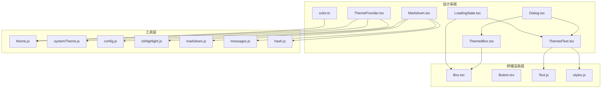
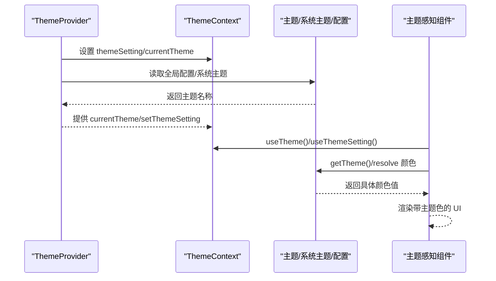
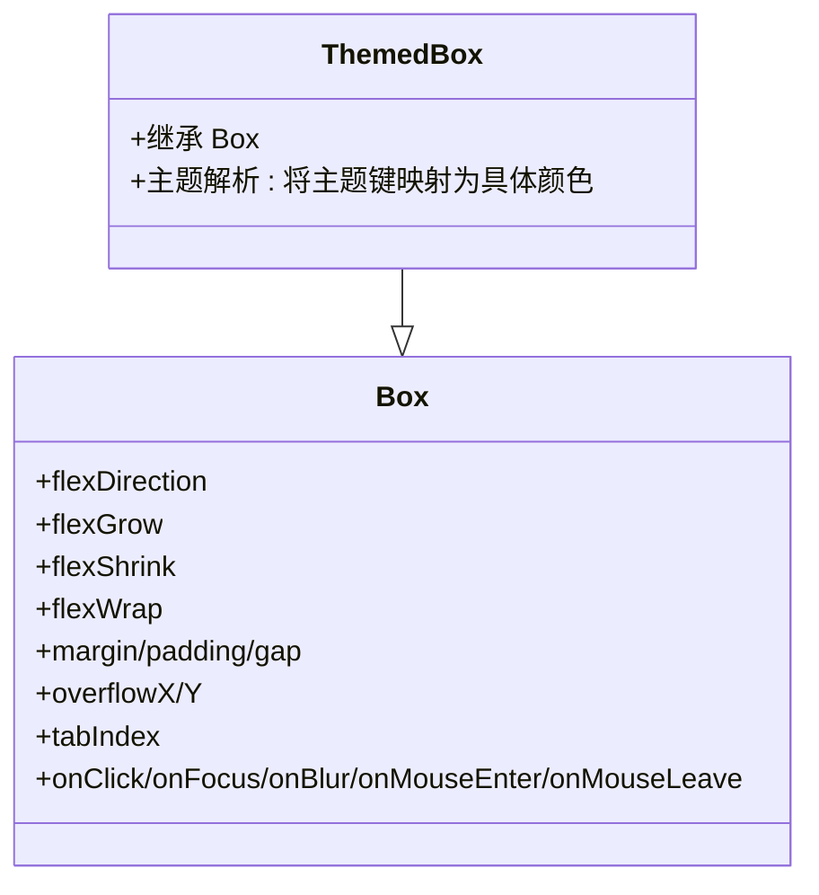
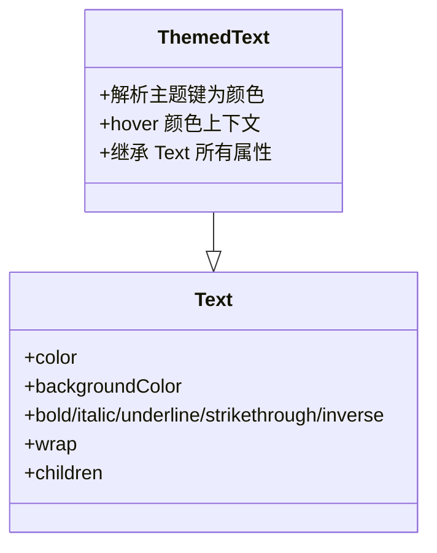
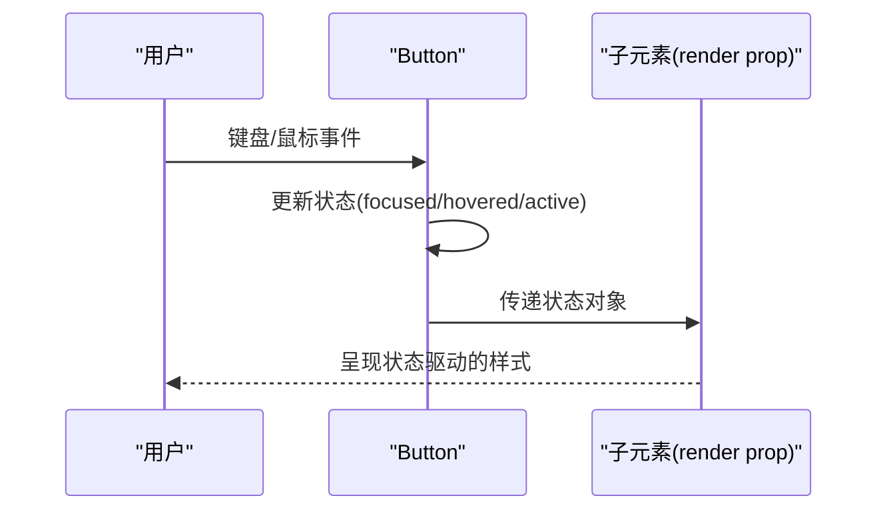
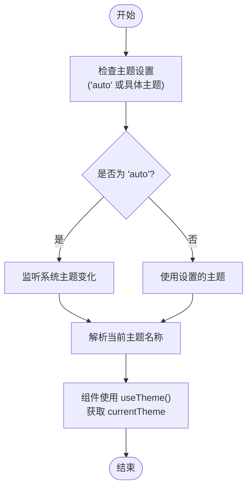
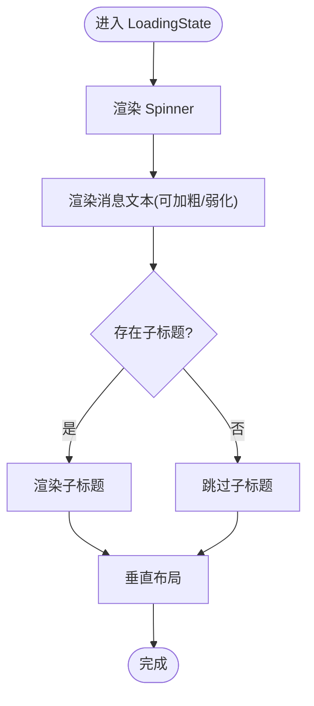
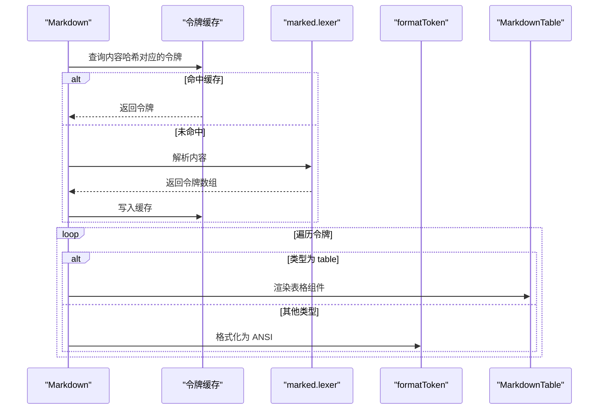
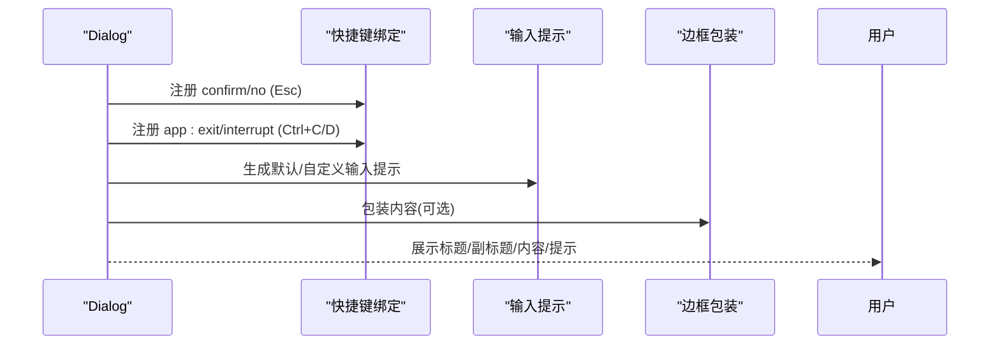
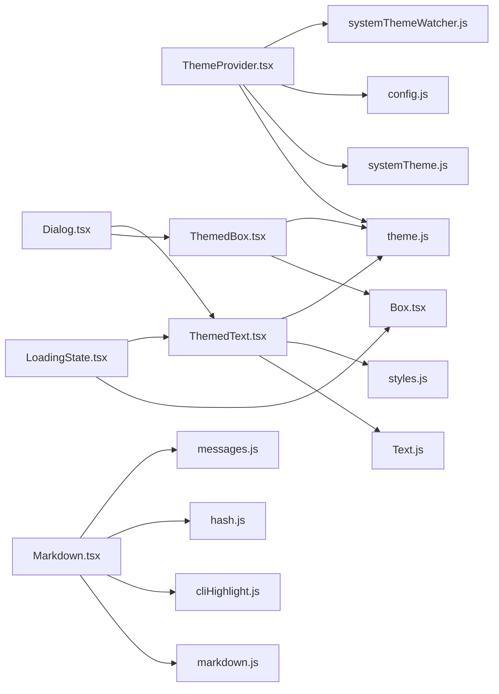

# 设计系统组件

<cite>
**本文档引用的文件**
- [ThemedBox.tsx](file://src/components/design-system/ThemedBox.tsx)
- [ThemedText.tsx](file://src/components/design-system/ThemedText.tsx)
- [ThemeProvider.tsx](file://src/components/design-system/ThemeProvider.tsx)
- [color.ts](file://src/components/design-system/color.ts)
- [Dialog.tsx](file://src/components/design-system/Dialog.tsx)
- [LoadingState.tsx](file://src/components/design-system/LoadingState.tsx)
- [Markdown.tsx](file://src/components/Markdown.tsx)
- [Box.tsx](file://src/ink/components/Box.tsx)
- [Button.tsx](file://src/ink/components/Button.tsx)
- [Text.js](file://src/ink/components/Text.js)
- [styles.js](file://src/ink/styles.js)
- [theme.js](file://src/utils/theme.js)
- [systemTheme.js](file://src/utils/systemTheme.js)
- [systemThemeWatcher.js](file://src/utils/systemThemeWatcher.js)
- [config.js](file://src/utils/config.js)
- [cliHighlight.js](file://src/utils/cliHighlight.js)
- [markdown.js](file://src/utils/markdown.js)
- [messages.js](file://src/utils/messages.js)
- [hash.js](file://src/utils/hash.js)
</cite>

## 目录
1. [简介](#简介)
2. [项目结构](#项目结构)
3. [核心组件](#核心组件)
4. [架构总览](#架构总览)
5. [详细组件分析](#详细组件分析)
6. [依赖关系分析](#依赖关系分析)
7. [性能考虑](#性能考虑)
8. [故障排除指南](#故障排除指南)
9. [结论](#结论)
10. [附录](#附录)

## 简介
本文件为 free-code 的设计系统组件提供权威参考文档。内容涵盖设计系统架构、主题系统与一致性原则，详解基础组件（Box、Text、Button）的 props 接口、样式变体与组合模式，并包含加载动画、Markdown 渲染、对话框组件与表单控件的实现说明。同时提供使用示例、主题定制方法与可访问性支持策略，阐述设计系统与整体 UI 体验及品牌规范的关系。

## 项目结构
设计系统位于 `src/components/design-system/` 目录，围绕主题上下文、主题感知组件与通用布局/文本/按钮等基础能力构建；同时复用 `src/ink/` 提供的终端渲染能力，通过 `src/utils/` 中的主题、高亮、标记解析等工具完成跨组件的一致性与性能优化。

**图表来源**
- [ThemedBox.tsx](file://src/components/design-system/ThemedBox.tsx)
- [ThemedText.tsx](file://src/components/design-system/ThemedText.tsx)
- [ThemeProvider.tsx](file://src/components/design-system/ThemeProvider.tsx)
- [color.ts](file://src/components/design-system/color.ts)
- [Dialog.tsx](file://src/components/design-system/Dialog.tsx)
- [LoadingState.tsx](file://src/components/design-system/LoadingState.tsx)
- [Markdown.tsx](file://src/components/Markdown.tsx)
- [Box.tsx](file://src/ink/components/Box.tsx)
- [Button.tsx](file://src/ink/components/Button.tsx)
- [Text.js](file://src/ink/components/Text.js)
- [styles.js](file://src/ink/styles.js)
- [theme.js](file://src/utils/theme.js)
- [systemTheme.js](file://src/utils/systemTheme.js)
- [systemThemeWatcher.js](file://src/utils/systemThemeWatcher.js)
- [config.js](file://src/utils/config.js)
- [cliHighlight.js](file://src/utils/cliHighlight.js)
- [markdown.js](file://src/utils/markdown.js)
- [messages.js](file://src/utils/messages.js)
- [hash.js](file://src/utils/hash.js)

**章节来源**
- [ThemedBox.tsx](file://src/components/design-system/ThemedBox.tsx)
- [ThemedText.tsx](file://src/components/design-system/ThemedText.tsx)
- [ThemeProvider.tsx](file://src/components/design-system/ThemeProvider.tsx)
- [color.ts](file://src/components/design-system/color.ts)
- [Dialog.tsx](file://src/components/design-system/Dialog.tsx)
- [LoadingState.tsx](file://src/components/design-system/LoadingState.tsx)
- [Markdown.tsx](file://src/components/Markdown.tsx)
- [Box.tsx](file://src/ink/components/Box.tsx)
- [Button.tsx](file://src/ink/components/Button.tsx)
- [Text.js](file://src/ink/components/Text.js)
- [styles.js](file://src/ink/styles.js)
- [theme.js](file://src/utils/theme.js)
- [systemTheme.js](file://src/utils/systemTheme.js)
- [systemThemeWatcher.js](file://src/utils/systemThemeWatcher.js)
- [config.js](file://src/utils/config.js)
- [cliHighlight.js](file://src/utils/cliHighlight.js)
- [markdown.js](file://src/utils/markdown.js)
- [messages.js](file://src/utils/messages.js)
- [hash.js](file://src/utils/hash.js)

## 核心组件
- 主题提供器：负责主题设置、预览、自动主题监听与持久化，向下游组件暴露当前主题与设置。
- 主题感知布局：基于 Ink 的 Box，结合主题色值进行边框、背景等视觉呈现。
- 主题感知文本：基于 Ink 的 Text，支持主题键到具体颜色值的解析，以及粗体、斜体、下划线、删除线、反色、截断/换行等样式变体。
- 按钮：无样式基元，仅处理交互状态（聚焦、悬停、激活），通过 render prop 将状态传递给子元素以实现状态驱动的样式。
- 对话框：内置确认/取消快捷键绑定、输入提示、可选边框包装与标题/副标题展示。
- 加载状态：带旋转指示器与消息显示，支持加粗与弱化颜色。
- Markdown：混合渲染（表格组件 + ANSI 文本），支持语法高亮、缓存与流式增量渲染。

**章节来源**
- [ThemeProvider.tsx](file://src/components/design-system/ThemeProvider.tsx)
- [ThemedBox.tsx](file://src/components/design-system/ThemedBox.tsx)
- [ThemedText.tsx](file://src/components/design-system/ThemedText.tsx)
- [Button.tsx](file://src/ink/components/Button.tsx)
- [Dialog.tsx](file://src/components/design-system/Dialog.tsx)
- [LoadingState.tsx](file://src/components/design-system/LoadingState.tsx)
- [Markdown.tsx](file://src/components/Markdown.tsx)

## 架构总览
设计系统采用“主题上下文 + 主题感知组件 + 终端渲染层”的分层架构。主题提供器集中管理用户偏好与系统主题，通过 Context 向下传递；主题感知组件在渲染前将主题键解析为具体颜色值；底层 Ink 组件负责终端布局与文本渲染；工具层提供主题定义、系统主题检测、配置持久化、高亮与标记解析等支撑。

**图表来源**
- [ThemeProvider.tsx](file://src/components/design-system/ThemeProvider.tsx)
- [theme.js](file://src/utils/theme.js)
- [systemTheme.js](file://src/utils/systemTheme.js)
- [config.js](file://src/utils/config.js)

**章节来源**
- [ThemeProvider.tsx](file://src/components/design-system/ThemeProvider.tsx)
- [theme.js](file://src/utils/theme.js)
- [systemTheme.js](file://src/utils/systemTheme.js)
- [config.js](file://src/utils/config.js)

## 详细组件分析

### 基础组件：Box、Text、Button

#### Box（主题感知布局）
- 职责：主题感知的布局容器，支持 flex 方向、伸缩、换行、内外边距、溢出控制等样式属性。
- 关键点：
  - 从 Ink 的 Box 扩展，保留所有样式与事件属性。
  - 通过主题解析颜色值，用于边框、背景等视觉元素。
  - 内置警告：对非整数的 margin/padding/gap 进行告警，避免小数导致布局错位。

**图表来源**
- [Box.tsx](file://src/ink/components/Box.tsx)
- [ThemedBox.tsx](file://src/components/design-system/ThemedBox.tsx)

**章节来源**
- [Box.tsx](file://src/ink/components/Box.tsx)
- [ThemedBox.tsx](file://src/components/design-system/ThemedBox.tsx)

#### Text（主题感知文本）
- 职责：主题感知文本渲染，支持颜色、背景色、粗体、斜体、下划线、删除线、反色、截断/换行等。
- 关键点：
  - 支持传入主题键或原始颜色值；主题键会解析为具体颜色。
  - 提供 hover 颜色上下文，允许在子树中覆盖颜色优先级。
  - 与 Ink 的 Text 组合，确保在终端环境下的正确渲染。

**图表来源**
- [ThemedText.tsx](file://src/components/design-system/ThemedText.tsx)
- [Text.js](file://src/ink/components/Text.js)
- [styles.js](file://src/ink/styles.js)

**章节来源**
- [ThemedText.tsx](file://src/components/design-system/ThemedText.tsx)
- [Text.js](file://src/ink/components/Text.js)
- [styles.js](file://src/ink/styles.js)

#### Button（交互状态驱动）
- 职责：无样式的交互基元，负责键盘与鼠标事件、焦点管理与激活反馈。
- 关键点：
  - 通过 render prop 将交互状态（聚焦、悬停、激活）传递给子元素，由子元素决定最终样式。
  - 支持自定义 tabIndex、autoFocus。
  - 激活状态会在短暂延迟后自动清除，避免视觉残留。

**图表来源**
- [Button.tsx](file://src/ink/components/Button.tsx)

**章节来源**
- [Button.tsx](file://src/ink/components/Button.tsx)

### 主题系统与一致性原则
- 主题提供器：
  - 管理用户主题设置（支持 'auto' 自动模式）、预览与保存。
  - 在 'auto' 模式下监听系统主题变化，动态切换。
  - 将当前主题与设置暴露给消费方，保证全组件树一致性。
- 颜色函数：
  - 提供 curried 形式的颜色函数，先解析主题键再委托给终端渲染器。
- 一致性原则：
  - 所有颜色相关组件均通过主题键引用，避免硬编码颜色。
  - 文本、边框、背景等视觉元素统一走主题解析流程。
  - 交互状态通过 Button 的 render prop 机制在各组件中保持一致的视觉反馈。

**图表来源**
- [ThemeProvider.tsx](file://src/components/design-system/ThemeProvider.tsx)
- [systemTheme.js](file://src/utils/systemTheme.js)
- [systemThemeWatcher.js](file://src/utils/systemThemeWatcher.js)
- [config.js](file://src/utils/config.js)

**章节来源**
- [ThemeProvider.tsx](file://src/components/design-system/ThemeProvider.tsx)
- [color.ts](file://src/components/design-system/color.ts)
- [systemTheme.js](file://src/utils/systemTheme.js)
- [systemThemeWatcher.js](file://src/utils/systemThemeWatcher.js)
- [config.js](file://src/utils/config.js)

### 加载动画与状态
- LoadingState：
  - 展示旋转指示器与消息，支持加粗与弱化颜色。
  - 子标题可选，用于补充说明。
- 使用场景：异步操作期间提供明确的反馈，提升可感知性与可访问性。

**图表来源**
- [LoadingState.tsx](file://src/components/design-system/LoadingState.tsx)

**章节来源**
- [LoadingState.tsx](file://src/components/design-system/LoadingState.tsx)

### Markdown 渲染
- 特性：
  - 表格使用 React 组件与 flexbox 布局渲染。
  - 其他内容通过 ANSI 字符串渲染，支持语法高亮。
  - 内容缓存与增量渲染：普通文本快速路径、令牌缓存、流式增量解析。
- 性能优化：
  - 语法检测快速路径：无 Markdown 语法时直接作为段落处理。
  - 令牌缓存：基于内容哈希缓存解析结果，LRU 淘汰。
  - 流式渲染：仅重新解析不稳定尾部，稳定部分复用。

**图表来源**
- [Markdown.tsx](file://src/components/Markdown.tsx)
- [markdown.js](file://src/utils/markdown.js)
- [cliHighlight.js](file://src/utils/cliHighlight.js)
- [hash.js](file://src/utils/hash.js)
- [messages.js](file://src/utils/messages.js)

**章节来源**
- [Markdown.tsx](file://src/components/Markdown.tsx)
- [markdown.js](file://src/utils/markdown.js)
- [cliHighlight.js](file://src/utils/cliHighlight.js)
- [hash.js](file://src/utils/hash.js)
- [messages.js](file://src/utils/messages.js)

### 对话框组件
- 功能：
  - 标题/副标题展示，支持颜色定制。
  - 内置确认/取消快捷键绑定（Esc 取消、Enter 确认）。
  - 输入提示可隐藏或自定义，支持显示退出键名与待确认状态。
  - 可选边框包装（Pane），统一视觉边界。
- 适用场景：需要明确用户选择与中断行为的交互区域。

**图表来源**
- [Dialog.tsx](file://src/components/design-system/Dialog.tsx)

**章节来源**
- [Dialog.tsx](file://src/components/design-system/Dialog.tsx)

### 表单控件与交互
- 当前设计系统未提供专用表单控件，但可通过 Button 的交互状态与 ThemedText/ThemedBox 组合实现常见表单交互：
  - 输入框：建议使用现有 TextInput 组件（不在设计系统目录内，但与设计系统风格一致）。
  - 按钮：使用 Button，通过 render prop 实现不同状态下的样式变化。
  - 标签与说明：使用 ThemedText，配合 ThemedBox 布局。
- 可访问性：
  - 通过 autoFocus、tabIndex 控制焦点顺序。
  - 提供键盘快捷键与明确的提示文案，便于键盘用户操作。

**章节来源**
- [Button.tsx](file://src/ink/components/Button.tsx)
- [ThemedText.tsx](file://src/components/design-system/ThemedText.tsx)
- [ThemedBox.tsx](file://src/components/design-system/ThemedBox.tsx)

## 依赖关系分析

**图表来源**
- [ThemeProvider.tsx](file://src/components/design-system/ThemeProvider.tsx)
- [ThemedText.tsx](file://src/components/design-system/ThemedText.tsx)
- [ThemedBox.tsx](file://src/components/design-system/ThemedBox.tsx)
- [Dialog.tsx](file://src/components/design-system/Dialog.tsx)
- [LoadingState.tsx](file://src/components/design-system/LoadingState.tsx)
- [Markdown.tsx](file://src/components/Markdown.tsx)
- [Box.tsx](file://src/ink/components/Box.tsx)
- [Button.tsx](file://src/ink/components/Button.tsx)
- [Text.js](file://src/ink/components/Text.js)
- [styles.js](file://src/ink/styles.js)
- [theme.js](file://src/utils/theme.js)
- [systemTheme.js](file://src/utils/systemTheme.js)
- [systemThemeWatcher.js](file://src/utils/systemThemeWatcher.js)
- [config.js](file://src/utils/config.js)
- [cliHighlight.js](file://src/utils/cliHighlight.js)
- [markdown.js](file://src/utils/markdown.js)
- [messages.js](file://src/utils/messages.js)
- [hash.js](file://src/utils/hash.js)

**章节来源**
- [ThemeProvider.tsx](file://src/components/design-system/ThemeProvider.tsx)
- [ThemedText.tsx](file://src/components/design-system/ThemedText.tsx)
- [ThemedBox.tsx](file://src/components/design-system/ThemedBox.tsx)
- [Dialog.tsx](file://src/components/design-system/Dialog.tsx)
- [LoadingState.tsx](file://src/components/design-system/LoadingState.tsx)
- [Markdown.tsx](file://src/components/Markdown.tsx)
- [Box.tsx](file://src/ink/components/Box.tsx)
- [Button.tsx](file://src/ink/components/Button.tsx)
- [Text.js](file://src/ink/components/Text.js)
- [styles.js](file://src/ink/styles.js)
- [theme.js](file://src/utils/theme.js)
- [systemTheme.js](file://src/utils/systemTheme.js)
- [systemThemeWatcher.js](file://src/utils/systemThemeWatcher.js)
- [config.js](file://src/utils/config.js)
- [cliHighlight.js](file://src/utils/cliHighlight.js)
- [markdown.js](file://src/utils/markdown.js)
- [messages.js](file://src/utils/messages.js)
- [hash.js](file://src/utils/hash.js)

## 性能考虑
- 快速路径：当内容不含 Markdown 语法时，直接作为段落处理，跳过解析成本。
- 令牌缓存：基于内容哈希缓存解析结果，LRU 淘汰，避免重复解析。
- 流式增量：仅重新解析不稳定尾部，稳定部分复用，降低滚动与更新开销。
- 事件与渲染优化：组件内部使用记忆化与最小化重渲染，减少不必要的计算。

**章节来源**
- [Markdown.tsx](file://src/components/Markdown.tsx)
- [Box.tsx](file://src/ink/components/Box.tsx)
- [ThemedText.tsx](file://src/components/design-system/ThemedText.tsx)

## 故障排除指南
- 主题不生效：
  - 检查 ThemeProvider 是否包裹根组件。
  - 确认主题设置是否为 'auto'，且系统主题监听已启用。
  - 查看配置持久化是否成功写入。
- 颜色异常：
  - 确认传入的是主题键而非原始颜色值，或确保原始颜色格式正确。
  - 检查 hover 颜色上下文是否被意外覆盖。
- Markdown 渲染问题：
  - 检查语法高亮开关与缓存状态。
  - 确认内容是否包含特殊 XML 标签，必要时使用提供的清理函数。
- 交互无响应：
  - 确认 Button 的 render prop 正确接收状态并应用样式。
  - 检查 tabIndex 与 autoFocus 配置是否符合预期。

**章节来源**
- [ThemeProvider.tsx](file://src/components/design-system/ThemeProvider.tsx)
- [ThemedText.tsx](file://src/components/design-system/ThemedText.tsx)
- [Markdown.tsx](file://src/components/Markdown.tsx)
- [Button.tsx](file://src/ink/components/Button.tsx)

## 结论
free-code 的设计系统通过主题上下文与主题感知组件，实现了跨组件的一致性与可扩展性。基础组件（Box、Text、Button）与高级组件（Dialog、LoadingState、Markdown）共同构成完整的终端 UI 能力集。借助缓存、快速路径与流式增量等性能优化，系统在复杂场景下仍能保持良好体验。通过明确的可访问性与品牌一致性原则，设计系统为整体 UI 体验提供了坚实基础。

## 附录
- 使用示例与最佳实践：
  - 在应用根部包裹 ThemeProvider，确保主题设置与自动监听生效。
  - 文本与边框颜色统一使用主题键，避免硬编码。
  - 对于需要状态反馈的交互，优先使用 Button 的 render prop 模式。
  - 大段富文本优先使用 Markdown 组件，合理开启语法高亮与缓存。
- 主题定制：
  - 在主题定义中添加新键值，即可在任意主题感知组件中使用。
  - 'auto' 模式下，系统主题变化会实时反映到 UI 上。
- 可访问性：
  - 合理设置 tabIndex 与 autoFocus，确保键盘可达。
  - 提供清晰的提示文案与快捷键说明，辅助用户理解操作。