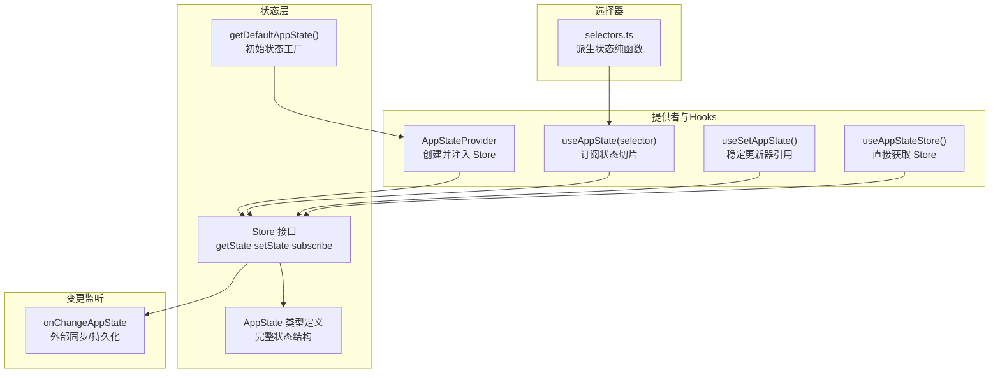
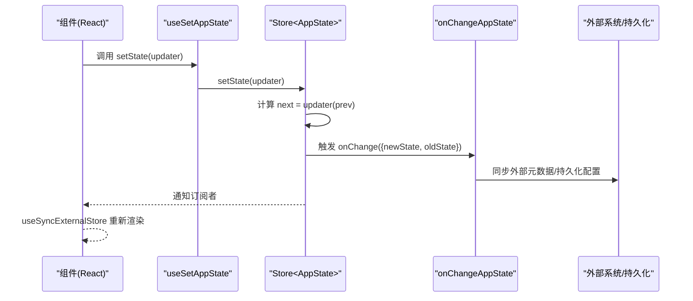
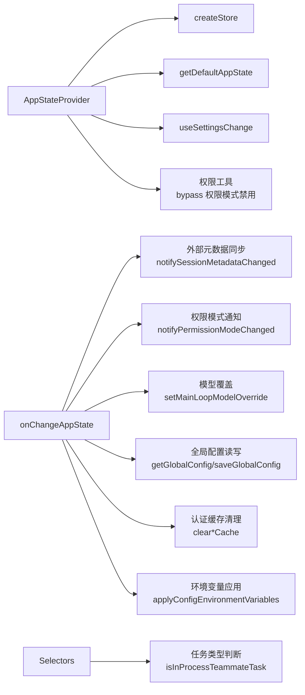

# 状态管理系统

<cite>
**本文引用的文件**
- [AppState.tsx](file://src/state/AppState.tsx)
- [AppStateStore.ts](file://src/state/AppStateStore.ts)
- [onChangeAppState.ts](file://src/state/onChangeAppState.ts)
- [selectors.ts](file://src/state/selectors.ts)
- [store.ts](file://src/state/store.ts)
- [state.ts](file://src/bootstrap/state.ts)
- [CompanionSprite.tsx](file://src/buddy/CompanionSprite.tsx)
- [bridge.tsx](file://src/commands/bridge/bridge.tsx)
</cite>

## 目录
1. [简介](#简介)
2. [项目结构](#项目结构)
3. [核心组件](#核心组件)
4. [架构总览](#架构总览)
5. [详细组件分析](#详细组件分析)
6. [依赖关系分析](#依赖关系分析)
7. [性能考量](#性能考量)
8. [故障排查指南](#故障排查指南)
9. [结论](#结论)
10. [附录：最佳实践与使用模式](#附录最佳实践与使用模式)

## 简介
本文件系统性阐述 free-code 的状态管理系统，重点围绕以下主题：
- 应用状态结构设计与管理机制：AppState 的定义、AppStateStore 的实现、状态选择器的使用
- 状态更新流程：onChangeAppState 的工作机制与状态变更监听
- 状态持久化策略、状态同步与跨组件状态共享
- 最佳实践：状态结构设计、性能优化与调试技巧
- 实际代码示例与使用模式（通过路径引用而非直接展示代码）

## 项目结构
free-code 的状态管理采用“轻量级自研 Store + React Hooks”的组合方案：
- 核心 Store 抽象：统一 getState、setState、subscribe 接口
- 应用状态模型：AppState 定义了完整的应用状态结构
- 提供者与 Hooks：AppStateProvider 提供上下文，useAppState/useSetAppState/useAppStateStore 提供订阅与更新能力
- 变更监听：onChangeAppState 在状态变更时进行外部同步与持久化
- 选择器：selectors 提供派生状态的纯函数选择器

图表来源
- [store.ts:1-35](file://src/state/store.ts#L1-L35)
- [AppStateStore.ts:89-570](file://src/state/AppStateStore.ts#L89-L570)
- [AppState.tsx:37-110](file://src/state/AppState.tsx#L37-L110)
- [AppState.tsx:142-179](file://src/state/AppState.tsx#L142-L179)
- [onChangeAppState.ts:43-171](file://src/state/onChangeAppState.ts#L43-L171)
- [selectors.ts:1-77](file://src/state/selectors.ts#L1-L77)

章节来源
- [store.ts:1-35](file://src/state/store.ts#L1-L35)
- [AppStateStore.ts:89-570](file://src/state/AppStateStore.ts#L89-L570)
- [AppState.tsx:37-110](file://src/state/AppState.tsx#L37-L110)
- [AppState.tsx:142-179](file://src/state/AppState.tsx#L142-L179)
- [onChangeAppState.ts:43-171](file://src/state/onChangeAppState.ts#L43-L171)
- [selectors.ts:1-77](file://src/state/selectors.ts#L1-L77)

## 核心组件
- Store<T>：提供 getState、setState、subscribe 三件套，支持 onChange 回调与订阅者集合
- AppState：应用全局状态的类型定义，覆盖设置、权限、桥接、插件、任务、通知等多维度
- AppStateStore：Store<AppState> 的别名，便于在类型层面约束
- AppStateProvider：创建并注入 Store，处理嵌套校验、权限模式禁用修正、设置变更同步
- useAppState/useSetAppState/useAppStateStore：订阅状态切片、获取稳定更新器、直接访问 Store
- onChangeAppState：状态变更监听器，负责外部同步（如 CCR 外部元数据）、持久化（全局配置）与缓存清理

章节来源
- [store.ts:1-35](file://src/state/store.ts#L1-L35)
- [AppStateStore.ts:89-570](file://src/state/AppStateStore.ts#L89-L570)
- [AppState.tsx:37-110](file://src/state/AppState.tsx#L37-L110)
- [AppState.tsx:142-179](file://src/state/AppState.tsx#L142-L179)
- [onChangeAppState.ts:43-171](file://src/state/onChangeAppState.ts#L43-L171)

## 架构总览
状态管理采用“单向数据流 + 订阅式渲染”的模式：
- 初始化：AppStateProvider 使用 getDefaultAppState 创建初始状态，并传入 onChangeAppState
- 更新：组件通过 useSetAppState 获取 setState，以函数式更新方式修改状态
- 同步：onChangeAppState 在每次状态变更时被触发，执行外部同步与持久化
- 渲染：useAppState 基于 useSyncExternalStore 订阅状态切片，仅在选中值变化时重渲染

图表来源
- [AppState.tsx:142-179](file://src/state/AppState.tsx#L142-L179)
- [store.ts:20-27](file://src/state/store.ts#L20-L27)
- [onChangeAppState.ts:43-171](file://src/state/onChangeAppState.ts#L43-L171)

## 详细组件分析

### AppStateProvider 与上下文注入
- 功能要点
  - 防止嵌套：检测 HasAppStateContext，避免重复包裹
  - Store 创建：基于 initialState 或 getDefaultAppState 创建 Store，并注入 onChangeAppState
  - 权限模式修正：挂载阶段检查远程设置加载时机，必要时禁用 bypass 权限模式
  - 设置变更同步：通过 useSettingsChange 将外部设置变更同步到 AppState
  - 上下文暴露：提供 AppStoreContext，子树通过 useAppStore 访问 Store

- 关键行为
  - 挂载副作用：检查并修正 toolPermissionContext.mode
  - 设置同步：applySettingsChange 包装 store.setState，确保文件监听等变更传播到 AppState

章节来源
- [AppState.tsx:37-110](file://src/state/AppState.tsx#L37-L110)

### useAppState 与状态订阅
- 设计原则
  - 选择器返回现有对象引用：避免 Object.is 总是视为不同导致的不必要重渲染
  - 支持多次独立字段订阅：通过多次调用 useAppState
  - 与 useSyncExternalStore 集成：基于订阅回调实现细粒度重渲染

- 使用建议
  - 不要返回新对象：应返回现有子对象引用
  - 多字段场景：分别订阅多个 selector

章节来源
- [AppState.tsx:126-163](file://src/state/AppState.tsx#L126-L163)

### useSetAppState 与状态更新
- 特点
  - 返回稳定引用：组件仅通过该 hook 更新状态不会因状态变化而重渲染
  - 与 useAppState 解耦：只获取更新器，不订阅任何状态

章节来源
- [AppState.tsx:165-172](file://src/state/AppState.tsx#L165-L172)

### AppStateStore 与默认状态
- AppState 结构
  - 设置与模型：settings、mainLoopModel、mainLoopModelForSession
  - 视图与交互：expandedView、footerSelection、statusLineText、verbose
  - 权限与桥接：toolPermissionContext、replBridge* 系列
  - 插件与 MCP：plugins、mcp、commands、resources
  - 任务与通知：tasks、notifications、inbox、workerSandboxPermissions
  - 提示与推测：promptSuggestion、speculation、speculationSessionTimeSavedMs
  - 其他：agent、remote*、thinkingEnabled、todos、fileHistory、attribution 等

- 默认状态
  - getDefaultAppState：根据环境与工具链初始化各字段，含权限模式、提示开关、文件历史、MCP 初始空集等

章节来源
- [AppStateStore.ts:89-570](file://src/state/AppStateStore.ts#L89-L570)

### onChangeAppState：状态变更监听与外部同步
- 主要职责
  - 权限模式同步：toolPermissionContext.mode 变更时，对外部 CCR/SDK 同步元数据；过滤内部模式名称
  - 模型设置同步：mainLoopModel 从 null 变为非 null 时写入用户设置并覆盖主循环模型
  - 视图偏好持久化：expandedView 变更时同步到全局配置（showExpandedTodos、showSpinnerTree）
  - 详细日志开关：verbose 变更时持久化到全局配置
  - Ant 专属面板可见性：tungstenPanelVisible 变更时持久化
  - 设置变更影响：settings 变更时清理认证缓存并重新应用环境变量

- 关键流程
  - 模式变更：计算外部模式 toExternalPermissionMode，仅当外部模式变化才通知
  - 一次性标记：isUltraplanMode 首次由 false 变为 true 时，通过 is_ultraplan_mode 传递给外部系统

章节来源
- [onChangeAppState.ts:43-171](file://src/state/onChangeAppState.ts#L43-L171)

### 选择器：派生状态与输入路由
- getViewedTeammateTask：从 viewingAgentTaskId 和 tasks 中安全提取当前查看的同伴任务
- getActiveAgentForInput：根据当前视图与任务类型判断输入应路由至 leader、已查看的同伴或指定代理

章节来源
- [selectors.ts:18-76](file://src/state/selectors.ts#L18-L76)

### Store 抽象与订阅机制
- Store 接口
  - getState：读取当前状态
  - setState：函数式更新，若 next 与 prev 相同则跳过
  - subscribe：注册订阅者，返回取消订阅函数

- 订阅与通知
  - onChange 回调在每次状态变更时被调用
  - 通知所有订阅者，触发 React 组件重渲染

章节来源
- [store.ts:1-35](file://src/state/store.ts#L1-L35)

### 实际使用示例与模式

#### 示例一：伙伴精灵组件订阅与更新
- 订阅：companionReaction、companionPetAt、footerSelection
- 更新：useSetAppState 获取更新器，定时清除 reaction

章节来源
- [CompanionSprite.tsx:176-214](file://src/buddy/CompanionSprite.tsx#L176-L214)

#### 示例二：桥接命令组件的状态更新
- 订阅：replBridgeConnected、replBridgeEnabled、replBridgeOutboundOnly
- 更新：条件性启用桥接、设置 showRemoteCallout 与初始名称

章节来源
- [bridge.tsx:44-101](file://src/commands/bridge/bridge.tsx#L44-L101)

#### 示例三：桥接断开对话框中的状态读取
- 订阅：sessionUrl/connectUrl/sessionActive
- 更新：handleDisconnect 调用 setState 清理桥接状态

章节来源
- [bridge.tsx:160-203](file://src/commands/bridge/bridge.tsx#L160-L203)

## 依赖关系分析
- AppStateProvider 依赖
  - createStore：创建 Store
  - getDefaultAppState：生成初始状态
  - useSettingsChange：外部设置变更同步
  - 权限工具：bypass 权限模式禁用逻辑

- onChangeAppState 依赖
  - 外部元数据同步：notifySessionMetadataChanged、notifyPermissionModeChanged
  - 模型覆盖：setMainLoopModelOverride
  - 全局配置：getGlobalConfig/saveGlobalConfig
  - 认证缓存清理：clearApiKeyHelperCache/clearAwsCredentialsCache/clearGcpCredentialsCache
  - 环境变量应用：applyConfigEnvironmentVariables

- 选择器依赖
  - 任务类型判断：isInProcessTeammateTask
  - 输入路由：根据 viewingAgentTaskId 与任务类型决定路由目标

图表来源
- [AppState.tsx:37-110](file://src/state/AppState.tsx#L37-L110)
- [onChangeAppState.ts:43-171](file://src/state/onChangeAppState.ts#L43-L171)
- [selectors.ts:18-76](file://src/state/selectors.ts#L18-L76)

章节来源
- [AppState.tsx:37-110](file://src/state/AppState.tsx#L37-L110)
- [onChangeAppState.ts:43-171](file://src/state/onChangeAppState.ts#L43-L171)
- [selectors.ts:18-76](file://src/state/selectors.ts#L18-L76)

## 性能考量
- 选择器与重渲染
  - 使用 useSyncExternalStore，仅在选择的值通过 Object.is 比较发生变化时重渲染
  - 避免在 selector 中返回新对象，应返回现有子对象引用，防止误判为变更

- 稳定引用
  - useSetAppState 返回稳定引用，避免因状态变化导致的组件重渲染

- 订阅粒度
  - 对于多个独立字段，分别订阅多个 selector，减少不必要的重渲染

- 变更监听成本
  - onChangeAppState 内部按需持久化与同步，避免对无关字段的处理

[本节为通用指导，无需特定文件来源]

## 故障排查指南
- 常见问题
  - 嵌套 Provider：AppStateProvider 不能嵌套，否则抛出错误
  - 越界使用：在 AppStateProvider 外调用 useAppState/useSetAppState 会抛出引用错误
  - 选择器返回新对象：导致 Object.is 总是视为不同，引发不必要重渲染

- 排查步骤
  - 检查 Provider 包裹层级，确保仅有一层 AppStateProvider
  - 确认选择器返回现有对象引用，而非新建对象
  - 查看 onChangeAppState 是否正确处理模式变更与持久化

章节来源
- [AppState.tsx:44-47](file://src/state/AppState.tsx#L44-L47)
- [AppState.tsx:120-123](file://src/state/AppState.tsx#L120-L123)
- [AppState.tsx:136-141](file://src/state/AppState.tsx#L136-L141)

## 结论
free-code 的状态管理系统以简洁的 Store 抽象为核心，结合 React Hooks 实现了高效、可维护的状态管理：
- 单一状态源：AppStateStore 作为唯一状态容器
- 细粒度订阅：useAppState 仅在所选值变化时重渲染
- 明确的变更监听：onChangeAppState 统一处理外部同步与持久化
- 可扩展的选择器：selectors 提供派生状态的纯函数接口

该体系在保证性能的同时，提供了良好的开发体验与可维护性。

[本节为总结，无需特定文件来源]

## 附录：最佳实践与使用模式

### 状态结构设计
- 将复杂状态拆分为可订阅的切片，避免大对象整体替换
- 对于函数类型或不可序列化的字段，考虑将其移出 DeepImmutable 或单独管理
- 保持选择器纯函数特性，仅做数据提取，无副作用

章节来源
- [AppStateStore.ts:89-570](file://src/state/AppStateStore.ts#L89-L570)
- [selectors.ts:1-77](file://src/state/selectors.ts#L1-L77)

### 性能优化
- 使用 useSetAppState 获取稳定更新器引用，避免因状态变化导致的重渲染
- 在 selector 中返回现有对象引用，避免 Object.is 总是视为不同
- 对于多字段订阅，分别调用 useAppState，提升渲染精度

章节来源
- [AppState.tsx:165-172](file://src/state/AppState.tsx#L165-L172)
- [AppState.tsx:126-163](file://src/state/AppState.tsx#L126-L163)

### 调试技巧
- 使用 useAppStateMaybeOutsideOfProvider 在不确定上下文是否可用时安全读取状态
- 在 onChangeAppState 中添加日志，追踪关键状态变更（如权限模式、模型设置）
- 对于复杂选择器，先在控制台打印返回值类型，确认引用未被重建

章节来源
- [AppState.tsx:186-199](file://src/state/AppState.tsx#L186-L199)
- [onChangeAppState.ts:43-171](file://src/state/onChangeAppState.ts#L43-L171)

### 实际使用模式
- 组件内订阅：通过 useAppState 订阅所需字段，避免订阅整个 AppState
- 组件间共享：通过 AppStateProvider 注入 Store，所有子树共享同一状态
- 外部同步：在 onChangeAppState 中处理 CCR/SDK 元数据同步与持久化
- 选择器复用：将派生逻辑封装为纯函数，便于测试与复用

章节来源
- [AppState.tsx:142-179](file://src/state/AppState.tsx#L142-L179)
- [onChangeAppState.ts:43-171](file://src/state/onChangeAppState.ts#L43-L171)
- [selectors.ts:18-76](file://src/state/selectors.ts#L18-L76)