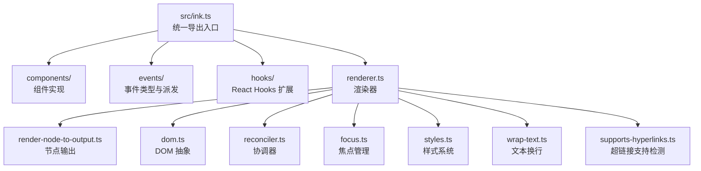
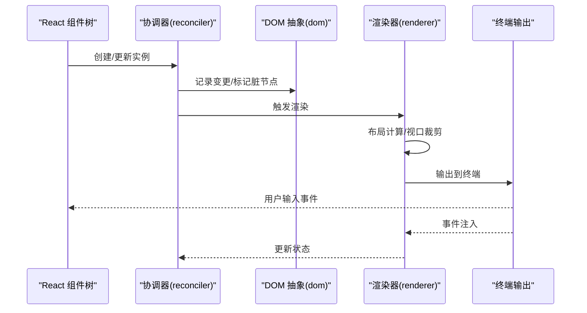
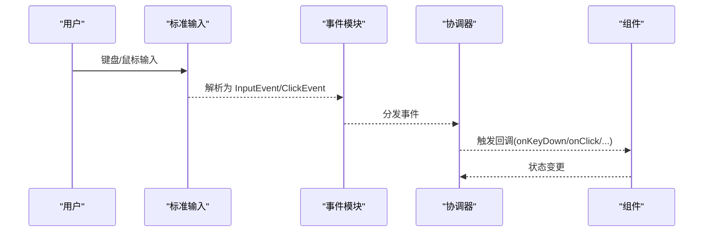
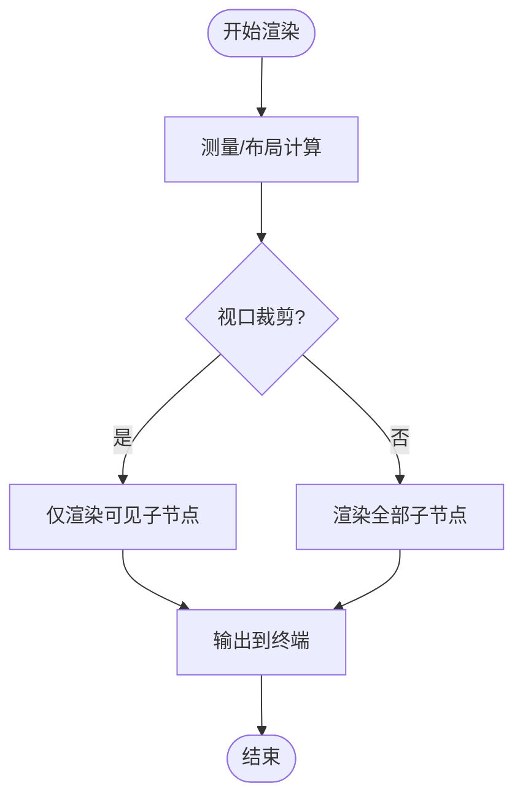
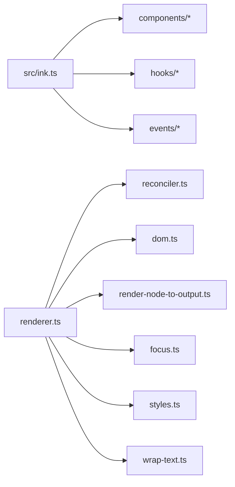

# Ink 组件参考

<cite>
**本文档引用的文件**
- [src/ink.ts](file://src/ink.ts)
- [src/ink/components/Text.tsx](file://src/ink/components/Text.tsx)
- [src/ink/components/Box.tsx](file://src/ink/components/Box.tsx)
- [src/ink/components/Button.tsx](file://src/ink/components/Button.tsx)
- [src/ink/components/ScrollBox.tsx](file://src/ink/components/ScrollBox.tsx)
- [src/ink/components/Link.tsx](file://src/ink/components/Link.tsx)
- [src/ink/reconciler.ts](file://src/ink/reconciler.ts)
- [src/ink/dom.ts](file://src/ink/dom.ts)
- [src/ink/renderer.ts](file://src/ink/renderer.ts)
- [src/ink/render-node-to-output.ts](file://src/ink/render-node-to-output.ts)
- [src/ink/events/input-event.ts](file://src/ink/events/input-event.ts)
- [src/ink/events/click-event.ts](file://src/ink/events/click-event.ts)
- [src/ink/events/terminal-focus-event.ts](file://src/ink/events/terminal-focus-event.ts)
- [src/ink/hooks/use-input.ts](file://src/ink/hooks/use-input.ts)
- [src/ink/hooks/use-stdin.ts](file://src/ink/hooks/use-stdin.ts)
- [src/ink/hooks/use-terminal-focus.ts](file://src/ink/hooks/use-terminal-focus.ts)
- [src/ink/hooks/use-animation-frame.ts](file://src/ink/hooks/use-animation-frame.ts)
- [src/ink/hooks/use-interval.ts](file://src/ink/hooks/use-interval.ts)
- [src/ink/focus.ts](file://src/ink/focus.ts)
- [src/ink/styles.ts](file://src/ink/styles.ts)
- [src/ink/measure-element.ts](file://src/ink/measure-element.ts)
- [src/ink/wrap-text.ts](file://src/ink/wrap-text.ts)
- [src/ink/supports-hyperlinks.ts](file://src/ink/supports-hyperlinks.ts)
</cite>

## 目录
1. [简介](#简介)
2. [项目结构](#项目结构)
3. [核心组件](#核心组件)
4. [架构总览](#架构总览)
5. [详细组件分析](#详细组件分析)
6. [依赖关系分析](#依赖关系分析)
7. [性能考量](#性能考量)
8. [故障排查指南](#故障排查指南)
9. [结论](#结论)
10. [附录](#附录)

## 简介
本参考文档面向使用 Ink 构建终端 UI 的开发者，系统梳理了 Ink 组件体系与运行机制。内容涵盖：
- 内置组件：Box、Text、Button、ScrollBox、Link 等的属性、事件与样式选项
- 上下文系统：AppContext、TerminalSizeContext、CursorDeclarationContext 等的作用与使用场景
- 事件处理：键盘、鼠标、终端焦点事件的捕获与分发
- 渲染优化：虚拟 DOM、布局计算与性能优化策略
- 实际示例与最佳实践：组件组合模式与高级用法

## 项目结构
Ink 的核心位于 src/ink 目录，对外通过 src/ink.ts 暴露统一入口，内部按功能拆分为组件、事件、渲染器、布局与工具模块。

图表来源
- [src/ink.ts:1-86](file://src/ink.ts#L1-L86)
- [src/ink/renderer.ts](file://src/ink/renderer.ts)
- [src/ink/render-node-to-output.ts](file://src/ink/render-node-to-output.ts)
- [src/ink/dom.ts](file://src/ink/dom.ts)
- [src/ink/reconciler.ts:292-340](file://src/ink/reconciler.ts#L292-L340)
- [src/ink/focus.ts](file://src/ink/focus.ts)
- [src/ink/styles.ts](file://src/ink/styles.ts)
- [src/ink/wrap-text.ts](file://src/ink/wrap-text.ts)
- [src/ink/supports-hyperlinks.ts](file://src/ink/supports-hyperlinks.ts)

章节来源
- [src/ink.ts:1-86](file://src/ink.ts#L1-L86)

## 核心组件
本节概述 Ink 的核心组件及其职责与典型用法。

- Box：终端布局容器，提供 Flex 布局能力与交互事件（点击、聚焦、键盘等），是大多数布局的基础。
- Text：终端文本渲染组件，支持颜色、背景色、粗体/细体、斜体、下划线、删除线、反色、换行/截断策略等。
- Button：可交互按钮，支持 onAction 回调、tabIndex、autoFocus，并暴露状态（focused/hovered/active）供自定义样式。
- ScrollBox：带滚动的容器，提供滚动 API（scrollTo、scrollBy、scrollToBottom、scrollToElement 等），支持粘性滚动与视口裁剪。
- Link：超链接组件，自动检测终端是否支持超链接，支持回退渲染。

章节来源
- [src/ink/components/Box.tsx:48-213](file://src/ink/components/Box.tsx#L48-L213)
- [src/ink/components/Text.tsx:1-254](file://src/ink/components/Text.tsx#L1-L254)
- [src/ink/components/Button.tsx:1-192](file://src/ink/components/Button.tsx#L1-L192)
- [src/ink/components/ScrollBox.tsx:1-237](file://src/ink/components/ScrollBox.tsx#L1-L237)
- [src/ink/components/Link.tsx:1-42](file://src/ink/components/Link.tsx#L1-L42)

## 架构总览
Ink 的渲染流程从 React 组件树开始，经由协调器生成虚拟 DOM，再由渲染器将节点转换为终端可显示的输出。

图表来源
- [src/ink/reconciler.ts:292-340](file://src/ink/reconciler.ts#L292-L340)
- [src/ink/dom.ts](file://src/ink/dom.ts)
- [src/ink/renderer.ts](file://src/ink/renderer.ts)
- [src/ink/render-node-to-output.ts](file://src/ink/render-node-to-output.ts)

## 详细组件分析

### Box 组件
- 作用：终端布局容器，提供 Flex 布局与交互事件（onClick、onFocus、onBlur、onKeyDown、onMouseEnter、onMouseLeave、tabIndex、autoFocus 等）。
- 关键点：
  - 不允许在 Text 内嵌套 Box（会抛错）。
  - 支持 flexWrap、flexDirection、flexGrow、flexShrink 等布局属性。
  - 作为交互载体，常用于按钮、列表项等。

章节来源
- [src/ink/components/Box.tsx:48-213](file://src/ink/components/Box.tsx#L48-L213)
- [src/ink/reconciler.ts:331-340](file://src/ink/reconciler.ts#L331-L340)

### Text 组件
- 作用：终端文本渲染，支持颜色、背景色、粗体/细体、斜体、下划线、删除线、反色、换行/截断策略。
- 关键点：
  - 文本换行策略通过 wrap 属性控制（wrap、wrap-trim、end、middle、truncate、truncate-end、truncate-middle、truncate-start）。
  - 与样式系统配合，实现丰富的终端文本表现。

章节来源
- [src/ink/components/Text.tsx:1-254](file://src/ink/components/Text.tsx#L1-L254)
- [src/ink/styles.ts](file://src/ink/styles.ts)
- [src/ink/wrap-text.ts](file://src/ink/wrap-text.ts)

### Button 组件
- 作用：可交互按钮，支持 onAction、tabIndex、autoFocus；通过 render prop 暴露交互状态（focused/hovered/active）。
- 关键点：
  - 键盘激活：Enter 或空格触发 onAction 并短暂进入 active 状态。
  - 鼠标点击与焦点/悬停状态管理。
  - 与 Box 复用交互事件与样式。

章节来源
- [src/ink/components/Button.tsx:1-192](file://src/ink/components/Button.tsx#L1-L192)

### ScrollBox 组件
- 作用：带滚动的容器，提供滚动 API 与粘性滚动能力。
- 关键点：
  - 滚动 API：scrollTo、scrollBy、scrollToBottom、scrollToElement、getScrollTop、getScrollHeight、getViewportHeight、isSticky、subscribe、setClampBounds 等。
  - 视口裁剪：仅渲染可见窗口内的子元素。
  - 粘性滚动：内容增长时自动贴底，手动滚动后取消粘性。
  - 性能优化：滚动变更通过 DOM 节点直接修改，避免 React 状态开销。

章节来源
- [src/ink/components/ScrollBox.tsx:1-237](file://src/ink/components/ScrollBox.tsx#L1-L237)
- [src/ink/dom.ts](file://src/ink/dom.ts)

### Link 组件
- 作用：超链接渲染，自动检测终端是否支持超链接，不支持时回退为普通文本。
- 关键点：
  - children 为空时默认显示 url。
  - 支持自定义回退内容 fallback。

章节来源
- [src/ink/components/Link.tsx:1-42](file://src/ink/components/Link.tsx#L1-L42)
- [src/ink/supports-hyperlinks.ts](file://src/ink/supports-hyperlinks.ts)

### 事件处理机制
- 输入事件：useInput/useStdin 提供键盘与鼠标事件监听，InputEvent/CliickEvent/TerminalFocusEvent 定义事件类型。
- 事件注入：渲染器接收用户输入，注入到协调器，驱动组件状态更新。
- 焦点管理：FocusManager 管理焦点顺序与行为。

图表来源
- [src/ink/events/input-event.ts](file://src/ink/events/input-event.ts)
- [src/ink/events/click-event.ts](file://src/ink/events/click-event.ts)
- [src/ink/events/terminal-focus-event.ts](file://src/ink/events/terminal-focus-event.ts)
- [src/ink/hooks/use-input.ts](file://src/ink/hooks/use-input.ts)
- [src/ink/hooks/use-stdin.ts](file://src/ink/hooks/use-stdin.ts)
- [src/ink/focus.ts](file://src/ink/focus.ts)

章节来源
- [src/ink/hooks/use-input.ts](file://src/ink/hooks/use-input.ts)
- [src/ink/hooks/use-stdin.ts](file://src/ink/hooks/use-stdin.ts)
- [src/ink/hooks/use-terminal-focus.ts](file://src/ink/hooks/use-terminal-focus.ts)
- [src/ink/events/input-event.ts](file://src/ink/events/input-event.ts)
- [src/ink/events/click-event.ts](file://src/ink/events/click-event.ts)
- [src/ink/events/terminal-focus-event.ts](file://src/ink/events/terminal-focus-event.ts)

### 上下文系统
- AppContext：应用级上下文，提供 AppProps 类型。
- TerminalSizeContext：终端尺寸上下文，提供终端宽高信息。
- CursorDeclarationContext：光标声明上下文，用于声明式光标行为。
- 使用场景：在复杂布局或需要全局状态的组件中，通过这些上下文共享状态与配置。

章节来源
- [src/ink.ts:45-60](file://src/ink.ts#L45-L60)

### 渲染优化机制
- 虚拟 DOM：协调器负责比较新旧节点，最小化更新范围。
- 布局计算：基于 Yoga 的布局引擎，支持 Flex 布局与溢出处理。
- 性能优化：
  - 视口裁剪：ScrollBox 仅渲染可见区域子节点。
  - 微任务合并：滚动事件通过微任务合并多次更新。
  - 滚动旁路：滚动 API 直接修改 DOM 节点，绕过 React 状态，减少开销。
  - 布局缓存：测量与宽度缓存减少重复计算。

图表来源
- [src/ink/measure-element.ts](file://src/ink/measure-element.ts)
- [src/ink/render-node-to-output.ts](file://src/ink/render-node-to-output.ts)
- [src/ink/components/ScrollBox.tsx:206-234](file://src/ink/components/ScrollBox.tsx#L206-L234)

章节来源
- [src/ink/reconciler.ts:292-340](file://src/ink/reconciler.ts#L292-L340)
- [src/ink/dom.ts](file://src/ink/dom.ts)
- [src/ink/measure-element.ts](file://src/ink/measure-element.ts)
- [src/ink/render-node-to-output.ts](file://src/ink/render-node-to-output.ts)
- [src/ink/components/ScrollBox.tsx:82-117](file://src/ink/components/ScrollBox.tsx#L82-L117)

## 依赖关系分析

图表来源
- [src/ink.ts:1-86](file://src/ink.ts#L1-L86)
- [src/ink/renderer.ts](file://src/ink/renderer.ts)
- [src/ink/reconciler.ts:292-340](file://src/ink/reconciler.ts#L292-L340)
- [src/ink/dom.ts](file://src/ink/dom.ts)
- [src/ink/render-node-to-output.ts](file://src/ink/render-node-to-output.ts)
- [src/ink/focus.ts](file://src/ink/focus.ts)
- [src/ink/styles.ts](file://src/ink/styles.ts)
- [src/ink/wrap-text.ts](file://src/ink/wrap-text.ts)

章节来源
- [src/ink.ts:1-86](file://src/ink.ts#L1-L86)

## 性能考量
- 滚动性能：ScrollBox 的滚动 API 直接操作 DOM 节点，避免 React 状态更新；通过微任务合并多次滚动事件，降低渲染频率。
- 视口裁剪：仅渲染可见区域子节点，显著减少布局与输出开销。
- 布局缓存：测量与宽度缓存减少重复计算，提升高频更新场景的响应速度。
- 动画与定时：useAnimationFrame/useInterval 提供稳定的动画与定时任务，避免阻塞主线程。

## 故障排查指南
- 在 Text 内嵌套 Box 报错：确保 Box 不在 Text 内部使用。
- 滚动异常或空白：确认 ScrollBox 的子元素已正确布局，必要时使用 setClampBounds 限制滚动范围。
- 事件无响应：检查 useInput/useStdin 是否正确挂载，事件是否被上层组件拦截。
- 超链接无效：Link 会在不支持的终端回退为普通文本，可通过 fallback 自定义回退内容。

章节来源
- [src/ink/reconciler.ts:331-340](file://src/ink/reconciler.ts#L331-L340)
- [src/ink/components/ScrollBox.tsx:118-204](file://src/ink/components/ScrollBox.tsx#L118-L204)
- [src/ink/components/Link.tsx:19-41](file://src/ink/components/Link.tsx#L19-L41)

## 结论
Ink 以 React 为声明式 UI 框架，结合终端特性实现了高效的布局与渲染系统。通过 Box/Text/Button/ScrollBox/Link 等组件与事件、上下文、渲染器的协同，开发者可以构建高性能、可维护的终端应用。建议优先采用 ScrollBox 进行长内容展示，善用 Link 的超链接能力，并通过上下文与 Hooks 管理全局状态与交互。

## 附录
- 组件组合模式：以 Box 为布局骨架，Text 与 Link 提供文本与超链接，Button 提供交互入口，ScrollBox 管理长列表滚动。
- 高级用法：利用 ScrollBox 的粘性滚动与视口裁剪，结合 useAnimationFrame 实现平滑动画；通过自定义样式与主题系统统一视觉风格。