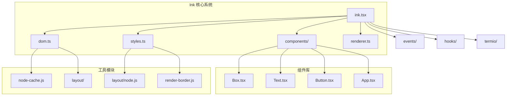
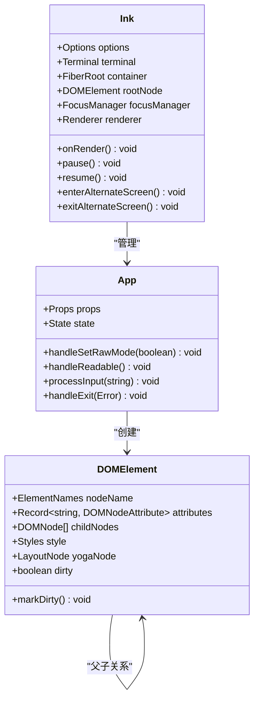
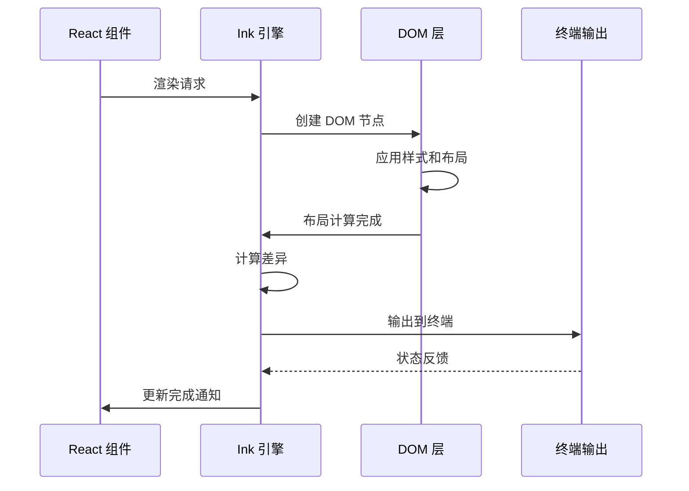
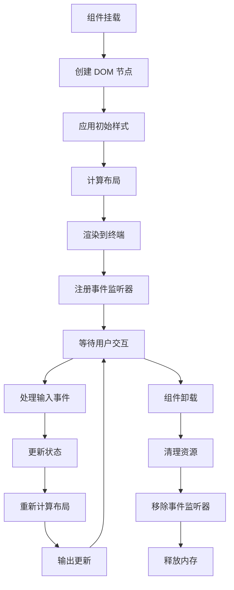
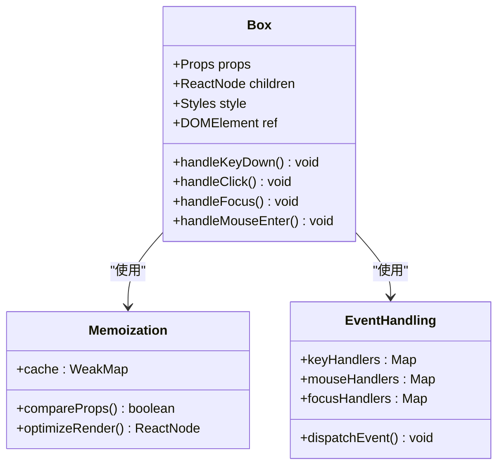
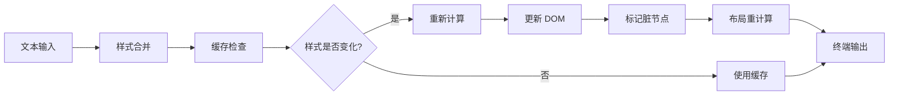
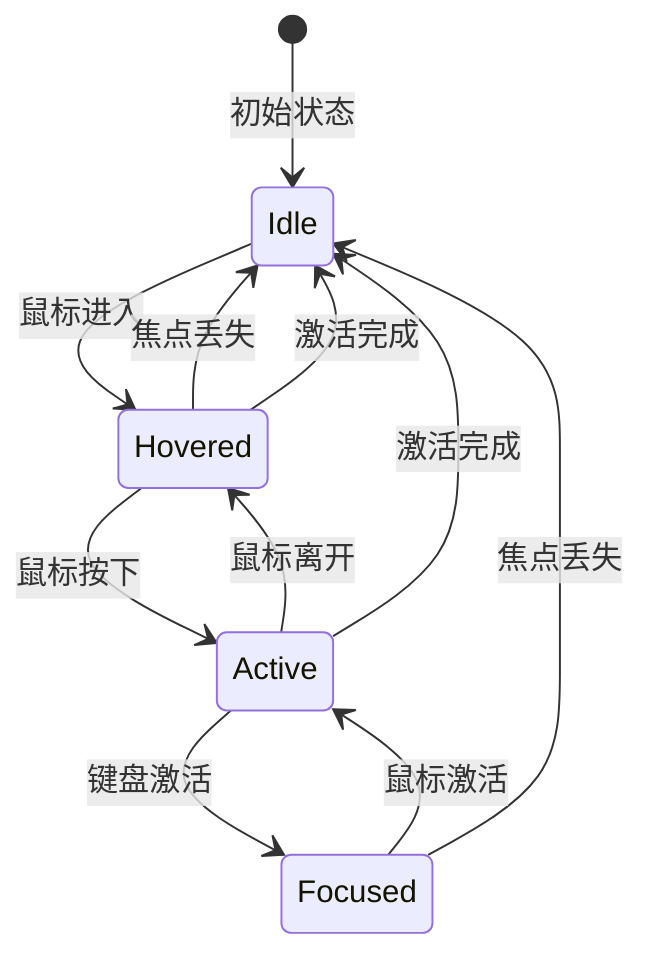
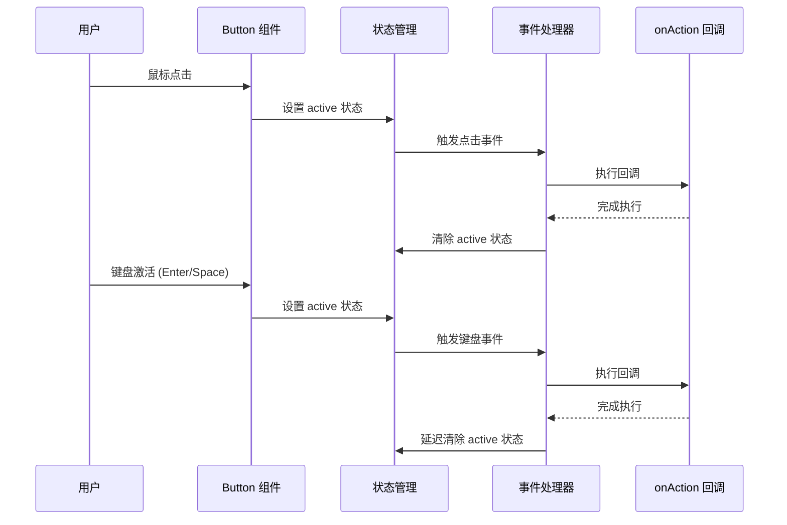
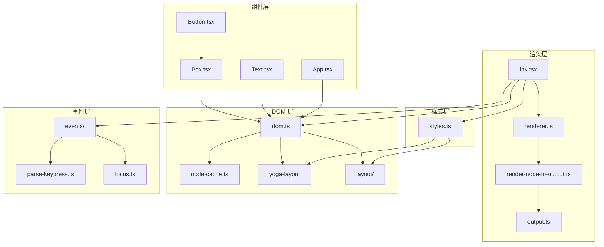

# 组件开发指南

<cite>
**本文档引用的文件**
- [src/ink/ink.tsx](file://src/ink/ink.tsx)
- [src/ink/components/App.tsx](file://src/ink/components/App.tsx)
- [src/ink/components/Box.tsx](file://src/ink/components/Box.tsx)
- [src/ink/components/Text.tsx](file://src/ink/components/Text.tsx)
- [src/ink/components/Button.tsx](file://src/ink/components/Button.tsx)
- [src/ink/styles.ts](file://src/ink/styles.ts)
- [src/ink/dom.ts](file://src/ink/dom.ts)
</cite>

## 目录
1. [简介](#简介)
2. [项目结构](#项目结构)
3. [核心组件](#核心组件)
4. [架构概览](#架构概览)
5. [详细组件分析](#详细组件分析)
6. [依赖关系分析](#依赖关系分析)
7. [性能考虑](#性能考虑)
8. [故障排除指南](#故障排除指南)
9. [结论](#结论)

## 简介

本指南面向 free-code 项目中的 UI 组件开发，专注于 React + Ink 组件系统的开发实践。Ink 是一个专为终端环境设计的 React 渲染器，它将 React 组件树渲染到终端中，提供了丰富的布局、样式和交互能力。

本指南涵盖从基础组件设计原则到高级优化技巧的完整开发流程，帮助开发者构建高性能、可维护的终端 UI 组件。

## 项目结构

free-code 项目采用模块化架构，核心组件位于 `src/ink/` 目录下，包含渲染引擎、组件库和工具函数：

**图表来源**
- [src/ink/ink.tsx:1-800](file://src/ink/ink.tsx#L1-L800)
- [src/ink/components/Box.tsx:1-214](file://src/ink/components/Box.tsx#L1-L214)
- [src/ink/components/Text.tsx:1-254](file://src/ink/components/Text.tsx#L1-L254)

**章节来源**
- [src/ink/ink.tsx:1-800](file://src/ink/ink.tsx#L1-L800)
- [src/ink/components/App.tsx:1-658](file://src/ink/components/App.tsx#L1-L658)

## 核心组件

### Ink 渲染引擎

Ink 渲染引擎是整个系统的核心，负责协调 React 组件与终端输出之间的交互：

**图表来源**
- [src/ink/ink.tsx:76-800](file://src/ink/ink.tsx#L76-L800)
- [src/ink/components/App.tsx:36-440](file://src/ink/components/App.tsx#L36-L440)
- [src/ink/dom.ts:31-91](file://src/ink/dom.ts#L31-L91)

### 基础组件系统

Ink 提供了三个核心基础组件，它们构成了所有复杂 UI 的基石：

**Box 组件** - 布局容器
- 支持 Flexbox 布局属性
- 提供焦点管理和键盘事件处理
- 支持鼠标事件（在全屏模式下）

**Text 组件** - 文本显示
- 支持丰富的文本样式（粗体、斜体、下划线等）
- 提供多种文本换行和截断策略
- 支持自定义颜色和背景色

**Button 组件** - 交互按钮
- 封装了完整的交互状态管理
- 提供渲染属性以支持状态驱动的样式
- 支持键盘和鼠标交互

**章节来源**
- [src/ink/components/Box.tsx:11-46](file://src/ink/components/Box.tsx#L11-L46)
- [src/ink/components/Text.tsx:5-59](file://src/ink/components/Text.tsx#L5-L59)
- [src/ink/components/Button.tsx:10-38](file://src/ink/components/Button.tsx#L10-L38)

## 架构概览

Ink 采用分层架构设计，确保了组件的可扩展性和性能：

**图表来源**
- [src/ink/ink.tsx:420-789](file://src/ink/ink.tsx#L420-L789)
- [src/ink/dom.ts:110-132](file://src/ink/dom.ts#L110-L132)

### 组件生命周期管理

Ink 实现了完整的组件生命周期管理：

**图表来源**
- [src/ink/components/App.tsx:181-205](file://src/ink/components/App.tsx#L181-L205)
- [src/ink/dom.ts:393-423](file://src/ink/dom.ts#L393-L423)

## 详细组件分析

### Box 组件深度解析

Box 组件是 Ink 中最重要的布局容器，它提供了类似浏览器 Flexbox 的功能：

#### 核心特性

**样式系统集成**
- 支持完整的 CSS 布局属性
- 自动处理样式验证和类型安全
- 提供智能的默认值处理

**事件处理机制**
- 支持键盘事件（Tab 导航、焦点管理）
- 支持鼠标事件（点击、悬停）
- 提供事件冒泡和捕获机制

**焦点管理**
- 自动焦点管理集成
- 支持程序化焦点控制
- 完整的无障碍支持

#### 性能优化策略

**图表来源**
- [src/ink/components/Box.tsx:51-212](file://src/ink/components/Box.tsx#L51-L212)

**章节来源**
- [src/ink/components/Box.tsx:1-214](file://src/ink/components/Box.tsx#L1-L214)

### Text 组件详细实现

Text 组件提供了丰富的文本渲染能力：

#### 文本样式系统

**颜色系统**
- 支持 RGB、十六进制、ANSI 256 色彩格式
- 内置 ANSI 颜色常量定义
- 自动色彩空间转换

**文本格式化**
- 粗体、斜体、下划线、删除线
- 文本对齐和换行控制
- 多种截断策略（开始、中间、结束）

#### 性能优化技术

**图表来源**
- [src/ink/components/Text.tsx:114-253](file://src/ink/components/Text.tsx#L114-L253)

**章节来源**
- [src/ink/components/Text.tsx:1-254](file://src/ink/components/Text.tsx#L1-L254)

### Button 组件状态管理

Button 组件实现了完整的交互状态管理：

#### 状态模型

**图表来源**
- [src/ink/components/Button.tsx:10-14](file://src/ink/components/Button.tsx#L10-L14)

#### 交互处理流程

**图表来源**
- [src/ink/components/Button.tsx:94-103](file://src/ink/components/Button.tsx#L94-L103)

**章节来源**
- [src/ink/components/Button.tsx:1-192](file://src/ink/components/Button.tsx#L1-L192)

## 依赖关系分析

Ink 组件系统具有清晰的依赖层次结构：

**图表来源**
- [src/ink/ink.tsx:1-50](file://src/ink/ink.tsx#L1-L50)
- [src/ink/dom.ts:1-15](file://src/ink/dom.ts#L1-L15)

### 关键依赖关系

**样式系统依赖**
- styles.ts 提供统一的样式接口
- 与 Yoga 布局引擎深度集成
- 支持运行时样式动态更新

**DOM 系统依赖**
- dom.ts 提供虚拟 DOM 实现
- 与 React reconciler 集成
- 支持增量更新和差异计算

**事件系统依赖**
- events/ 目录提供完整的事件处理
- 支持键盘、鼠标和焦点事件
- 与终端输入系统集成

**章节来源**
- [src/ink/styles.ts:1-772](file://src/ink/styles.ts#L1-L772)
- [src/ink/dom.ts:1-485](file://src/ink/dom.ts#L1-L485)

## 性能考虑

### 渲染性能优化

Ink 实现了多层次的性能优化策略：

**帧率控制**
- 使用节流机制控制渲染频率
- 支持自适应帧率调整
- 避免不必要的重绘

**内存管理**
- 对象池模式减少垃圾回收
- 缓存系统优化重复计算
- 及时清理未使用的资源

**布局优化**
- Yoga 布局引擎提供高效的布局计算
- 支持虚拟滚动减少渲染节点
- 智能的脏节点标记系统

### 最佳实践建议

**组件设计原则**
- 保持组件职责单一
- 合理使用 memo 化
- 避免深层嵌套

**样式优化**
- 使用样式缓存减少计算
- 避免频繁的样式变更
- 合理使用 flex 属性

**事件处理**
- 优化事件监听器数量
- 使用事件委托减少开销
- 及时清理事件处理器

## 故障排除指南

### 常见问题诊断

**渲染问题**
- 检查组件是否正确挂载
- 验证样式属性的有效性
- 确认布局计算是否正常

**性能问题**
- 分析帧率和内存使用
- 检查是否有过多的重绘
- 优化组件层级结构

**事件处理问题**
- 验证事件绑定是否正确
- 检查事件传播机制
- 确认焦点管理状态

### 调试工具使用

**开发模式**
- 启用调试输出获取详细信息
- 使用开发者工具检查组件树
- 监控渲染性能指标

**日志系统**
- Ink 提供详细的日志输出
- 支持条件性日志过滤
- 方便问题定位和分析

**章节来源**
- [src/ink/ink.tsx:612-618](file://src/ink/ink.tsx#L612-L618)
- [src/ink/components/App.tsx:206-208](file://src/ink/components/App.tsx#L206-L208)

## 结论

Ink 组件系统为终端环境下的 React 开发提供了完整的解决方案。通过理解其架构设计、组件实现和性能优化策略，开发者可以构建出高效、可维护的终端 UI 组件。

关键要点包括：
- 深入理解 Ink 的渲染机制和生命周期
- 掌握基础组件的正确使用方法
- 应用性能优化的最佳实践
- 建立有效的调试和故障排除流程

这些知识将帮助开发者在 free-code 项目中创建高质量的 UI 组件，提升用户体验和开发效率。