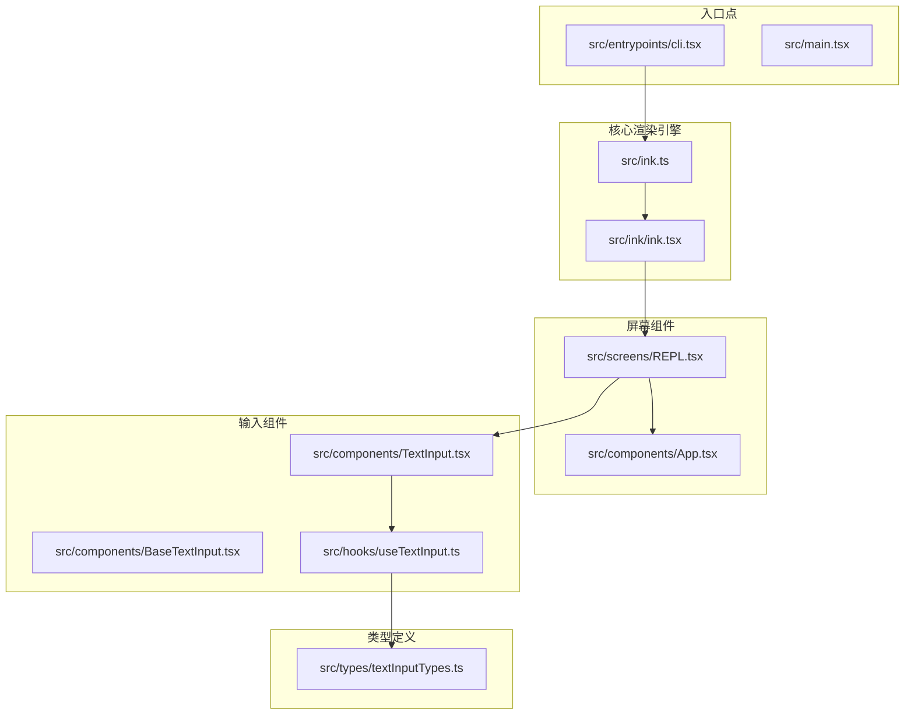
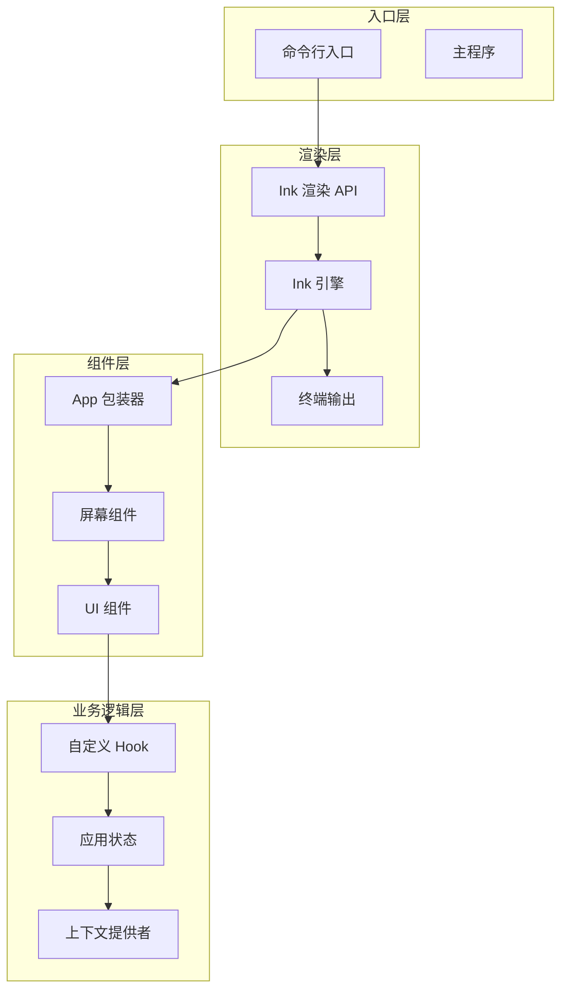
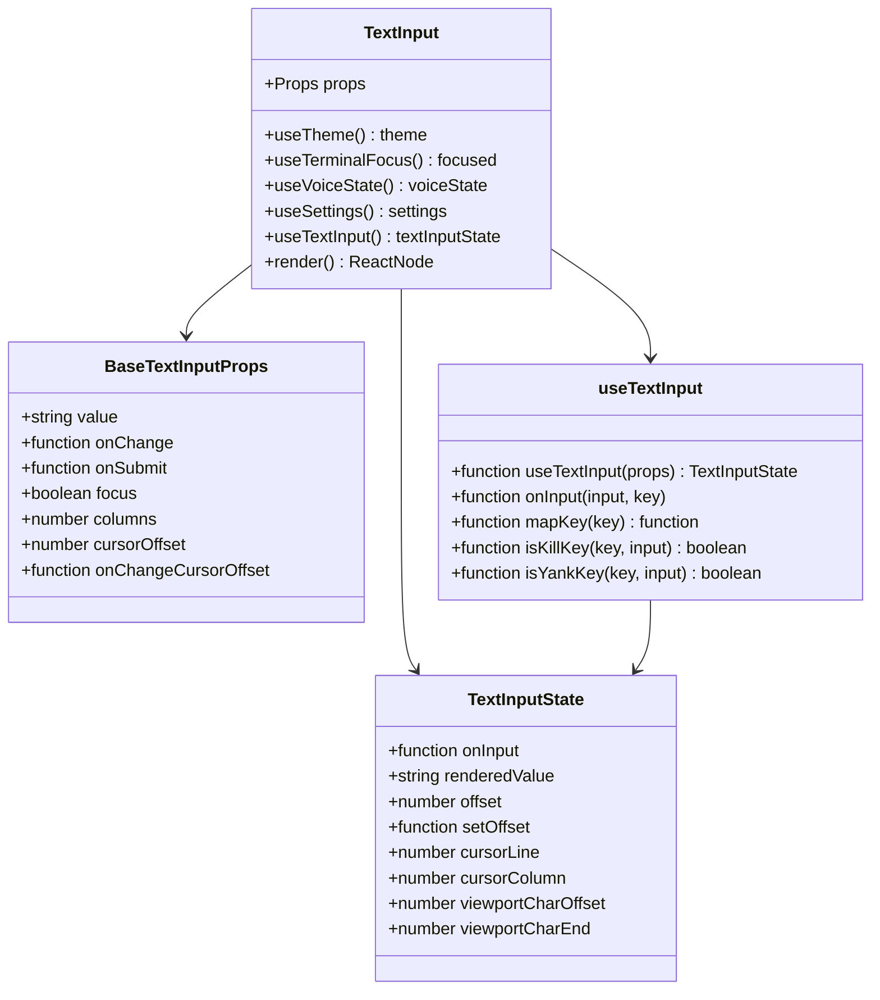
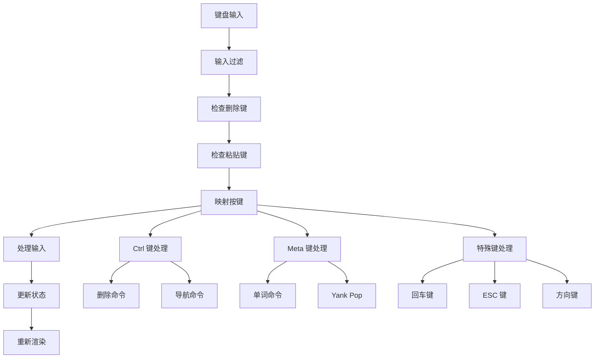
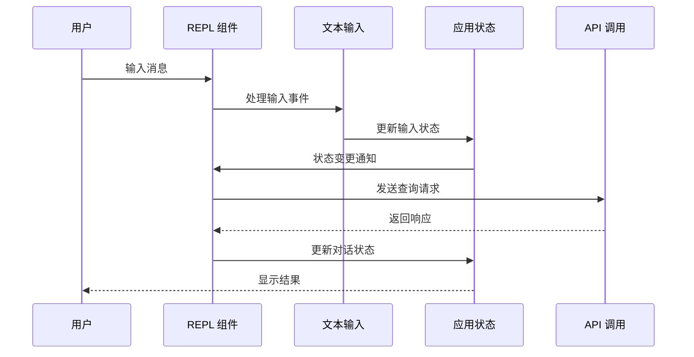
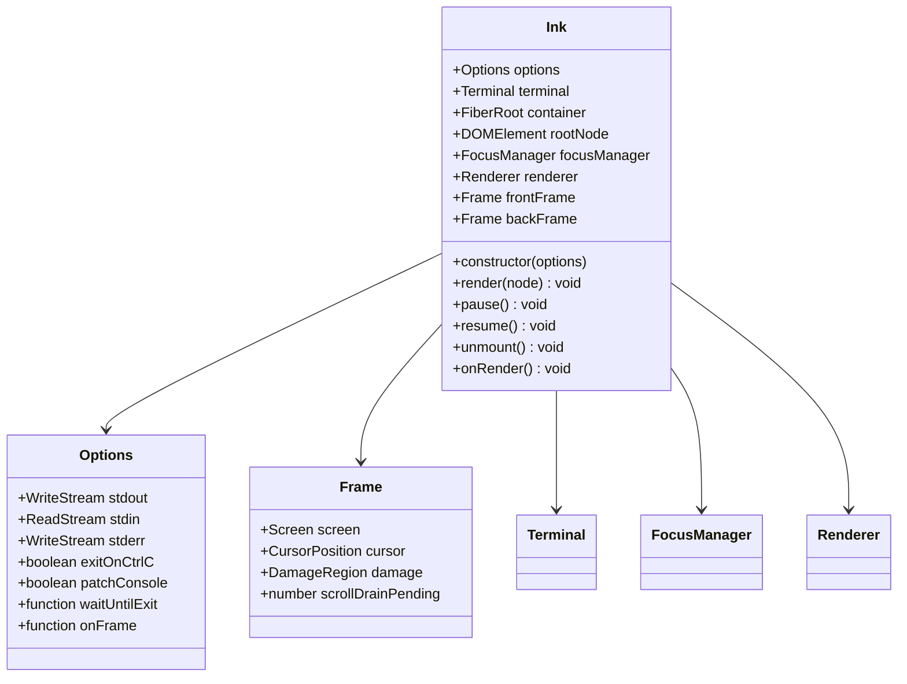
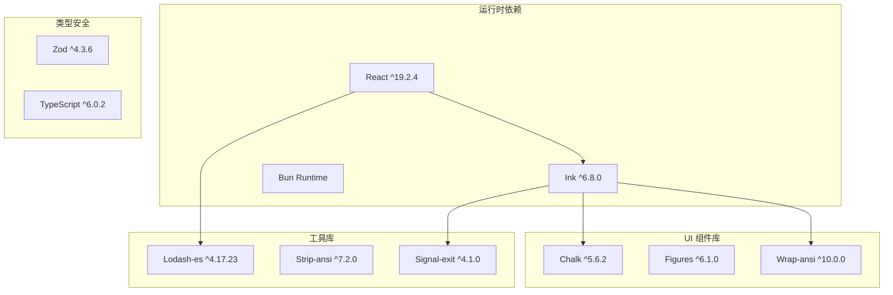
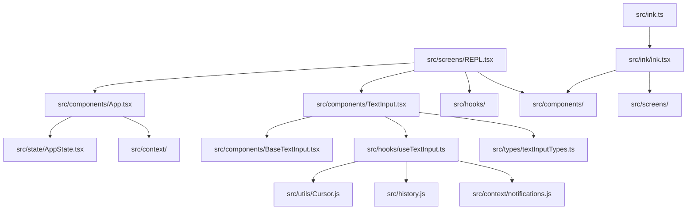

# 组件开发流程

<cite>
**本文档引用的文件**
- [README.md](file://README.md)
- [package.json](file://package.json)
- [src/entrypoints/cli.tsx](file://src/entrypoints/cli.tsx)
- [src/screens/REPL.tsx](file://src/screens/REPL.tsx)
- [src/ink.ts](file://src/ink.ts)
- [src/ink/ink.tsx](file://src/ink/ink.tsx)
- [src/components/App.tsx](file://src/components/App.tsx)
- [src/components/TextInput.tsx](file://src/components/TextInput.tsx)
- [src/hooks/useTextInput.ts](file://src/hooks/useTextInput.ts)
- [src/types/textInputTypes.ts](file://src/types/textInputTypes.ts)
</cite>

## 目录
1. [简介](#简介)
2. [项目结构](#项目结构)
3. [核心组件](#核心组件)
4. [架构概览](#架构概览)
5. [详细组件分析](#详细组件分析)
6. [依赖关系分析](#依赖关系分析)
7. [性能考虑](#性能考虑)
8. [故障排除指南](#故障排除指南)
9. [结论](#结论)

## 简介

本指南详细阐述了基于 React + Ink 的终端 UI 组件开发流程。该代码库是一个基于 Bun 的 CLI 应用，使用 React 和 Ink 构建交互式终端界面。项目采用模块化架构，通过组件化设计实现高度可复用的 UI 组件。

## 项目结构

该项目采用清晰的分层架构，主要包含以下核心目录：



**图表来源**
- [src/entrypoints/cli.tsx:1-313](file://src/entrypoints/cli.tsx#L1-L313)
- [src/ink.ts:1-31](file://src/ink.ts#L1-L31)
- [src/ink/ink.tsx:1-800](file://src/ink/ink.tsx#L1-L800)
- [src/screens/REPL.tsx:1-800](file://src/screens/REPL.tsx#L1-L800)

**章节来源**
- [README.md:284-313](file://README.md#L284-L313)
- [package.json:1-122](file://package.json#L1-L122)

## 核心组件

### 组件设计原则

1. **单一职责原则**: 每个组件专注于特定功能
2. **组合优于继承**: 通过组合多个小组件构建复杂界面
3. **状态提升**: 将共享状态提升到最近的共同祖先
4. **不可变性**: 使用不可变数据结构避免意外修改

### 命名约定

- **组件文件**: 使用帕斯卡命名法（如 `TextInput.tsx`）
- **属性接口**: 使用 `Props` 后缀（如 `BaseTextInputProps`）
- **状态接口**: 使用 `State` 后缀（如 `TextInputState`）
- **Hook 函数**: 使用 `use` 前缀（如 `useTextInput`）

### 文件组织结构

```
src/
├── components/           # UI 组件
│   ├── BaseTextInput.tsx  # 基础文本输入组件
│   └── TextInput.tsx      # 增强文本输入组件
├── hooks/               # 自定义 Hook
│   └── useTextInput.ts    # 文本输入处理 Hook
├── types/               # TypeScript 类型定义
│   └── textInputTypes.ts  # 输入相关类型
└── screens/             # 屏幕级组件
    └── REPL.tsx         # 主要交互界面
```

**章节来源**
- [src/types/textInputTypes.ts:1-388](file://src/types/textInputTypes.ts#L1-L388)

## 架构概览

系统采用分层架构，从底层渲染引擎到顶层应用组件：



**图表来源**
- [src/ink.ts:1-31](file://src/ink.ts#L1-L31)
- [src/ink/ink.tsx:1-800](file://src/ink/ink.tsx#L1-L800)
- [src/components/App.tsx:1-56](file://src/components/App.tsx#L1-L56)

## 详细组件分析

### TextInput 组件分析

TextInput 是一个增强的文本输入组件，集成了语音输入、光标动画等功能：



**图表来源**
- [src/components/TextInput.tsx:1-124](file://src/components/TextInput.tsx#L1-L124)
- [src/types/textInputTypes.ts:27-202](file://src/types/textInputTypes.ts#L27-L202)
- [src/hooks/useTextInput.ts:73-530](file://src/hooks/useTextInput.ts#L73-L530)

#### 组件结构

TextInput 组件的核心结构包括：

1. **主题支持**: 集成 Ink 的主题系统
2. **焦点管理**: 处理终端焦点状态
3. **语音集成**: 支持语音输入模式
4. **光标动画**: 实现波形动画效果
5. **输入处理**: 通过 useTextInput Hook 处理复杂的键盘输入

#### 属性定义

```typescript
export type Props = BaseTextInputProps & {
  highlights?: TextHighlight[];
};
```

BaseTextInputProps 提供了完整的输入组件配置选项，包括：
- 基础输入属性（value、onChange、onSubmit等）
- 视觉样式属性（focus、mask、showCursor等）
- 行为控制属性（multiline、columns、cursorOffset等）
- 回调函数属性（onHistoryUp、onHistoryDown、onImagePaste等）

#### 事件处理

useTextInput Hook 实现了复杂的键盘事件处理逻辑：



**图表来源**
- [src/hooks/useTextInput.ts:318-413](file://src/hooks/useTextInput.ts#L318-L413)

**章节来源**
- [src/components/TextInput.tsx:1-124](file://src/components/TextInput.tsx#L1-L124)
- [src/hooks/useTextInput.ts:1-530](file://src/hooks/useTextInput.ts#L1-L530)
- [src/types/textInputTypes.ts:1-388](file://src/types/textInputTypes.ts#L1-L388)

### REPL 主界面分析

REPL 组件是应用的主要交互界面，集成了多种功能模块：



**图表来源**
- [src/screens/REPL.tsx:601-800](file://src/screens/REPL.tsx#L601-L800)

REPL 组件的特点：
1. **状态管理**: 集中管理应用状态
2. **功能扩展**: 支持多种实验性功能
3. **插件系统**: 集成插件管理和工具池
4. **多模式支持**: 支持不同的输入模式和工作流

**章节来源**
- [src/screens/REPL.tsx:1-800](file://src/screens/REPL.tsx#L1-L800)

### Ink 渲染引擎分析

Ink 渲染引擎提供了高性能的终端渲染能力：



**图表来源**
- [src/ink/ink.tsx:67-350](file://src/ink/ink.tsx#L67-L350)

Ink 引擎的核心特性：
1. **高性能渲染**: 使用帧缓冲和差异算法优化渲染性能
2. **终端兼容**: 完整支持各种终端特性和功能
3. **内存管理**: 智能的内存池管理和垃圾回收
4. **事件处理**: 处理键盘、鼠标和窗口大小变化事件

**章节来源**
- [src/ink/ink.tsx:1-800](file://src/ink/ink.tsx#L1-L800)

## 依赖关系分析

### 技术栈依赖



**图表来源**
- [package.json:22-116](file://package.json#L22-L116)

### 组件间依赖关系



**图表来源**
- [src/components/App.tsx:1-56](file://src/components/App.tsx#L1-L56)
- [src/components/TextInput.tsx:1-124](file://src/components/TextInput.tsx#L1-L124)
- [src/hooks/useTextInput.ts:1-530](file://src/hooks/useTextInput.ts#L1-L530)
- [src/screens/REPL.tsx:1-800](file://src/screens/REPL.tsx#L1-L800)

**章节来源**
- [package.json:1-122](file://package.json#L1-L122)

## 性能考虑

### 渲染性能优化

1. **虚拟滚动**: 对于大量消息列表，使用虚拟滚动减少 DOM 节点数量
2. **增量更新**: 仅更新发生变化的部分，避免全量重绘
3. **帧率控制**: 通过节流和防抖控制渲染频率
4. **内存池**: 使用对象池减少垃圾回收压力

### 内存管理

1. **生命周期管理**: 正确清理事件监听器和定时器
2. **状态优化**: 使用 useMemo 和 useCallback 优化状态更新
3. **资源释放**: 及时释放大对象和缓存数据

### 网络性能

1. **请求合并**: 合并相似的网络请求
2. **缓存策略**: 实现智能缓存机制
3. **超时处理**: 设置合理的超时和重试机制

## 故障排除指南

### 常见问题及解决方案

1. **组件不显示或渲染异常**
   - 检查组件是否正确包装在 Ink 渲染环境中
   - 验证 props 传递是否正确
   - 确认依赖项版本兼容性

2. **输入事件无响应**
   - 检查 useTextInput Hook 的配置
   - 验证键盘事件绑定是否正确
   - 确认焦点状态管理

3. **性能问题**
   - 分析渲染时间线，识别瓶颈
   - 检查不必要的重渲染
   - 优化大数据量的处理逻辑

### 调试技巧

1. **启用调试模式**: 使用环境变量开启详细日志
2. **性能分析**: 利用内置的性能监控工具
3. **状态检查**: 定期检查应用状态的一致性

**章节来源**
- [src/ink/ink.tsx:420-789](file://src/ink/ink.tsx#L420-L789)

## 结论

本指南详细介绍了基于 React + Ink 的组件开发流程，包括架构设计、组件实现、性能优化和故障排除等方面。通过遵循这些最佳实践，开发者可以创建高质量、高性能的终端 UI 组件。

关键要点：
- 采用模块化和组件化的架构设计
- 严格遵守命名约定和代码风格
- 注重性能优化和用户体验
- 建立完善的测试和调试流程
- 持续关注依赖更新和安全补丁

这套开发流程确保了组件的可维护性、可扩展性和可靠性，为构建复杂的终端应用程序奠定了坚实基础。