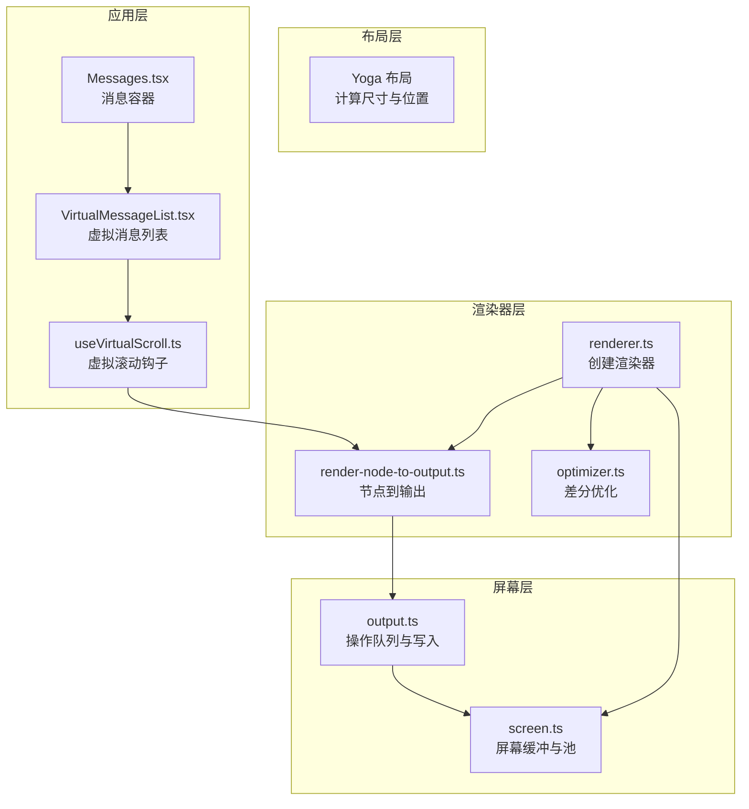
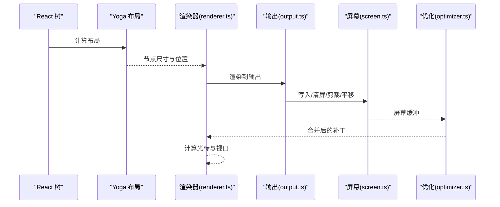
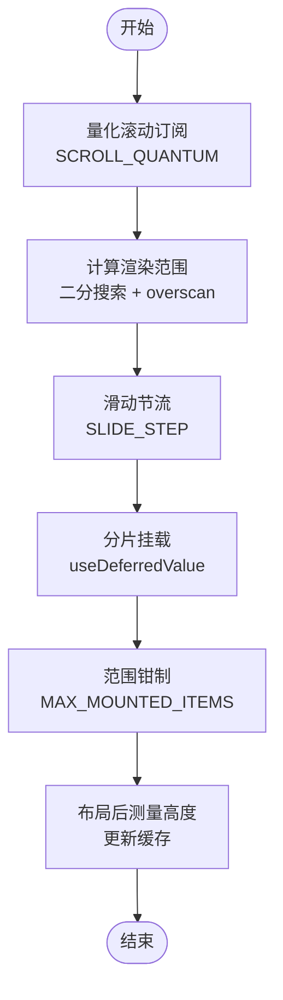
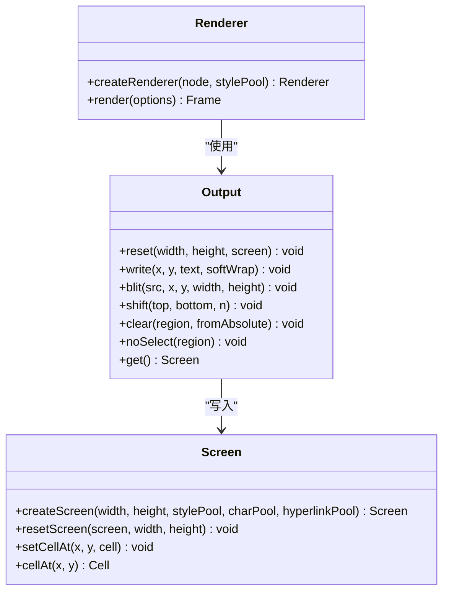
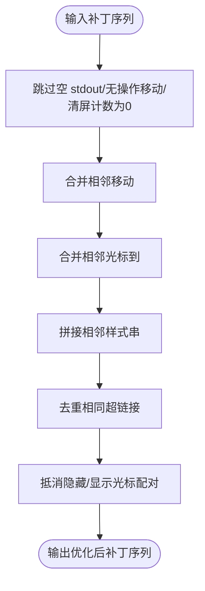
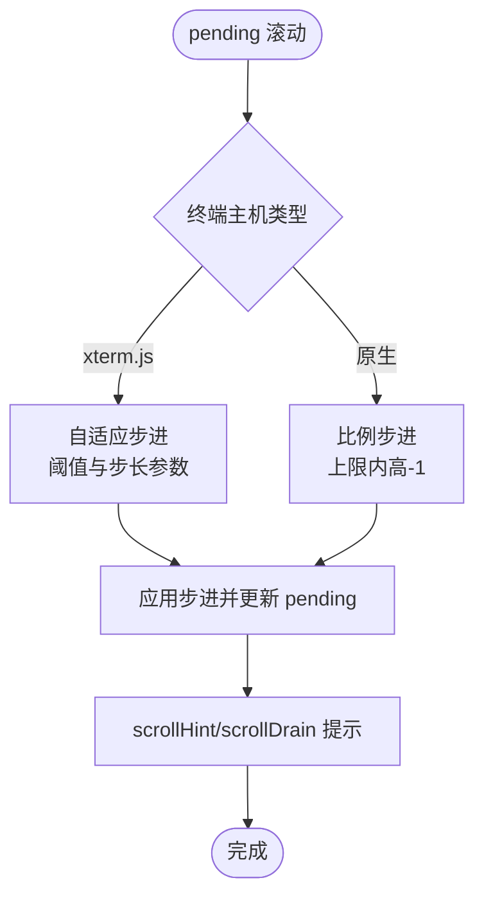
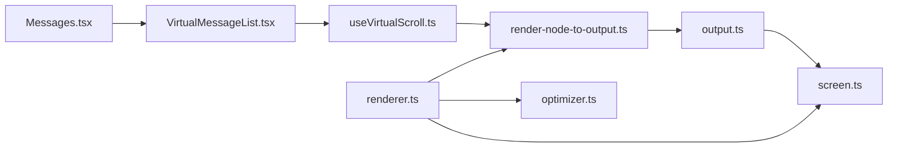

# 组件性能优化

<cite>
**本文档引用的文件**
- [renderer.ts](file://src/ink/renderer.ts)
- [optimizer.ts](file://src/ink/optimizer.ts)
- [useVirtualScroll.ts](file://src/hooks/useVirtualScroll.ts)
- [VirtualMessageList.tsx](file://src/components/VirtualMessageList.tsx)
- [fpsMetrics.tsx](file://src/context/fpsMetrics.tsx)
- [fpsTracker.ts](file://src/utils/fpsTracker.ts)
- [frame.ts](file://src/ink/frame.ts)
- [render-node-to-output.ts](file://src/ink/render-node-to-output.ts)
- [screen.ts](file://src/ink/screen.ts)
- [output.ts](file://src/ink/output.ts)
- [Messages.tsx](file://src/components/Messages.tsx)
</cite>

## 目录
1. [简介](#简介)
2. [项目结构](#项目结构)
3. [核心组件](#核心组件)
4. [架构总览](#架构总览)
5. [详细组件分析](#详细组件分析)
6. [依赖关系分析](#依赖关系分析)
7. [性能考量](#性能考量)
8. [故障排查指南](#故障排查指南)
9. [结论](#结论)
10. [附录](#附录)

## 简介
本指南聚焦于 React + Ink 应用中的组件性能优化策略，涵盖渲染优化、内存管理与计算效率提升。文档基于仓库中 Ink 渲染器、虚拟滚动、帧与屏幕缓冲等核心模块，系统阐述以下主题：
- 组件渲染优化：减少无效重渲染、稳定回调、避免闭包泄漏
- 内存管理：池化复用、缓存命中、垃圾回收压力控制
- 计算效率：布局与样式计算优化、增量 diff、批处理与节流
- 虚拟滚动：实现原理、覆盖范围与 overscan 策略、滑动节流与分片挂载
- 懒加载与代码分割：按需加载与过渡渲染
- 渲染器优化：布局计算、重绘减少、硬件滚动与 GPU 加速利用
- 性能监控与调试：帧率指标、瓶颈定位与可视化

## 项目结构
本项目采用“渲染器 + 布局 + 屏幕缓冲 + 差分输出”的分层架构：
- 渲染器层：负责将 React 树转换为 Ink DOM，并进行布局计算与屏幕输出
- 布局层：Yoga 布局引擎驱动，生成节点尺寸与位置
- 屏幕层：共享池（字符、超链接、样式）与紧凑存储，支持增量 damage 区域
- 输出层：操作队列（写入、剪裁、平移、清屏、标记不可选区域），最终生成屏幕缓冲
- 优化层：差分补丁合并、滚动提示、滚动冲量自适应

**图表来源**
- [renderer.ts:31-179](file://src/ink/renderer.ts#L31-L179)
- [render-node-to-output.ts:1-200](file://src/ink/render-node-to-output.ts#L1-L200)
- [optimizer.ts:16-94](file://src/ink/optimizer.ts#L16-L94)
- [screen.ts:451-544](file://src/ink/screen.ts#L451-L544)
- [output.ts:170-532](file://src/ink/output.ts#L170-L532)
- [VirtualMessageList.tsx:289-336](file://src/components/VirtualMessageList.tsx#L289-L336)
- [useVirtualScroll.ts:142-722](file://src/hooks/useVirtualScroll.ts#L142-L722)
- [Messages.tsx:55-76](file://src/components/Messages.tsx#L55-L76)

**章节来源**
- [renderer.ts:31-179](file://src/ink/renderer.ts#L31-L179)
- [screen.ts:451-544](file://src/ink/screen.ts#L451-L544)
- [output.ts:170-532](file://src/ink/output.ts#L170-L532)
- [VirtualMessageList.tsx:289-336](file://src/components/VirtualMessageList.tsx#L289-L336)
- [useVirtualScroll.ts:142-722](file://src/hooks/useVirtualScroll.ts#L142-L722)
- [Messages.tsx:55-76](file://src/components/Messages.tsx#L55-L76)

## 核心组件
- 渲染器（renderer.ts）
  - 复用 Output 以保持字符与图形单元缓存，避免每帧重复 tokenization 与聚簇
  - 在 alt-screen 模式下强制高度约束，防止溢出导致的全量重绘
  - 使用 prevFrameContaminated 标志避免从污染帧复制错误内容
- 屏幕与池（screen.ts）
  - 字符、超链接、样式三类池共享，跨帧复用 ID，降低字符串分配与查找成本
  - 屏幕缓冲采用 Int32Array/BigInt64Array 紧凑存储，支持批量清空与 damage 区域追踪
- 输出与操作队列（output.ts）
  - 将写入、剪裁、平移、清屏、不可选区域标记等操作延迟到 get() 执行，统一应用
  - 对绝对定位节点的清屏区域进行特殊处理，避免 ghost 内容
- 虚拟滚动（useVirtualScroll.ts）
  - 基于 scrollTop 量化订阅与 useDeferredValue 的时间切片，限制单次挂载数量
  - 通过偏乐观高度估算与 overscan 保证滚动过程无空白，二分搜索快速定位范围
- 虚拟消息列表（VirtualMessageList.tsx）
  - 将消息键数组增量构建，避免每次渲染重建完整字符串数组
  - 提供搜索与跳转能力，结合滚动锚定与粘性底部行为
- 差分优化（optimizer.ts）
  - 合并相邻移动、去重超链接、抵消隐藏/显示光标、拼接样式串等，显著减少补丁数
- 帧与事件（frame.ts）
  - 定义帧、差分补丁类型与清屏判定，提供阶段耗时统计字段用于性能剖析

**章节来源**
- [renderer.ts:35-129](file://src/ink/renderer.ts#L35-L129)
- [screen.ts:21-80](file://src/ink/screen.ts#L21-L80)
- [output.ts:170-205](file://src/ink/output.ts#L170-L205)
- [useVirtualScroll.ts:19-58](file://src/hooks/useVirtualScroll.ts#L19-L58)
- [VirtualMessageList.tsx:308-324](file://src/components/VirtualMessageList.tsx#L308-L324)
- [optimizer.ts:16-94](file://src/ink/optimizer.ts#L16-L94)
- [frame.ts:12-94](file://src/ink/frame.ts#L12-L94)

## 架构总览
Ink 渲染管线的关键流程如下：
- React 树经 Yoga 计算布局，生成 Ink DOM
- 渲染器将 DOM 转换为屏幕缓冲，期间记录 damage 区域
- 输出层执行操作队列，写入屏幕缓冲
- 差分器对补丁进行合并与去重
- 最终将最小化补丁序列写入终端

**图表来源**
- [renderer.ts:38-177](file://src/ink/renderer.ts#L38-L177)
- [render-node-to-output.ts:1-200](file://src/ink/render-node-to-output.ts#L1-L200)
- [output.ts:268-532](file://src/ink/output.ts#L268-L532)
- [screen.ts:451-544](file://src/ink/screen.ts#L451-L544)
- [optimizer.ts:16-94](file://src/ink/optimizer.ts#L16-L94)

## 详细组件分析

### 虚拟滚动实现与优化
useVirtualScroll 钩子通过以下机制实现高性能滚动：
- 量化滚动订阅：使用 SCROLL_QUANTUM 将小幅度滚动合并为一次 React 重渲染，避免高频布局与 diff
- 偏乐观高度与 overscan：默认估计高度较低，配合 80 行 overscan，保证滚动过程不出现空白
- 分片挂载与滑动节流：SLIDE_STEP 控制单次新增挂载上限，避免一次性挂载大量新项造成长同步阻塞
- 偏远范围保护：MAX_MOUNTED_ITEMS 限制有效范围大小，确保 Fiber 数量与视口规模成正比
- 列宽变化缩放：列数变化时按比例缩放已缓存高度，减少重新测量带来的抖动
- 偏差修正与粘性底部：在滚动至底部时采用尾部回溯策略，保证内容可见性

**图表来源**
- [useVirtualScroll.ts:220-244](file://src/hooks/useVirtualScroll.ts#L220-L244)
- [useVirtualScroll.ts:385-479](file://src/hooks/useVirtualScroll.ts#L385-L479)
- [useVirtualScroll.ts:539-552](file://src/hooks/useVirtualScroll.ts#L539-L552)
- [useVirtualScroll.ts:619-645](file://src/hooks/useVirtualScroll.ts#L619-L645)

**章节来源**
- [useVirtualScroll.ts:142-722](file://src/hooks/useVirtualScroll.ts#L142-L722)
- [VirtualMessageList.tsx:289-336](file://src/components/VirtualMessageList.tsx#L289-L336)

### 渲染器与屏幕缓冲优化
渲染器通过以下策略减少重绘与提高吞吐：
- 复用 Output 与池：每帧复用 Output 实例，保持 charCache 与图形单元缓存，避免重复 tokenization
- alt-screen 高度约束：严格限制高度等于终端行数，防止溢出导致全量重绘
- prevFrameContaminated 标记：当上一帧被选择覆盖或强制重绘时，禁用前帧 blit，避免复制错误内容
- damage 区域追踪：仅对变更区域进行 diff，减少屏幕扫描与补丁生成开销

**图表来源**
- [renderer.ts:31-179](file://src/ink/renderer.ts#L31-L179)
- [output.ts:170-532](file://src/ink/output.ts#L170-L532)
- [screen.ts:451-544](file://src/ink/screen.ts#L451-L544)

**章节来源**
- [renderer.ts:35-129](file://src/ink/renderer.ts#L35-L129)
- [screen.ts:451-544](file://src/ink/screen.ts#L451-L544)
- [output.ts:170-205](file://src/ink/output.ts#L170-L205)

### 差分优化与补丁合并
optimizer.ts 对补丁序列进行多轮合并与去重：
- 合并相邻移动、抵消隐藏/显示光标配对、拼接相邻样式串
- 去除空 stdout、无操作移动与清屏计数为 0 的指令
- 保持过渡样式的正确性，避免误删 undo 码导致背景色泄漏

**图表来源**
- [optimizer.ts:16-94](file://src/ink/optimizer.ts#L16-L94)

**章节来源**
- [optimizer.ts:16-94](file://src/ink/optimizer.ts#L16-L94)

### 滚动冲量与硬件滚动优化
render-node-to-output.ts 中实现了针对不同终端主机的滚动冲量策略：
- xterm.js 主机：自适应步进，低 pending 一次性冲到底，高 pending 固定步进，最大 pending 截断
- 原生主机：按比例逐步冲刷，上限不超过内高减一，确保 DECSTBM 快路径触发
- 结合 followScroll 与 scrollHint，实现粘性跟随与硬件滚动

**图表来源**
- [render-node-to-output.ts:112-176](file://src/ink/render-node-to-output.ts#L112-L176)
- [render-node-to-output.ts:813-836](file://src/ink/render-node-to-output.ts#L813-L836)

**章节来源**
- [render-node-to-output.ts:112-176](file://src/ink/render-node-to-output.ts#L112-L176)
- [render-node-to-output.ts:813-836](file://src/ink/render-node-to-output.ts#L813-L836)

### 组件懒加载与代码分割最佳实践
- 使用 React.lazy 与 Suspense 对重型组件进行懒加载，避免首屏阻塞
- 对大型对话列表采用虚拟滚动，仅渲染可视区域及 overscan
- 使用 useDeferredValue 进行非关键渲染过渡，让紧急渲染优先完成
- 将昂贵的计算放入 Web Worker 或后台线程，主线程只保留必要状态

[本节为通用实践说明，不直接分析具体文件]

### 移动端与大终端环境优化建议
- 大终端：增大 overscan 与滑动节流上限，避免一次性挂载过多项；启用硬件滚动提示
- 移动端：降低字体大小与样式复杂度，减少图形单元与超链接池的使用频率
- 高 DPI/双宽字符：注意 SpacerTail 与 SpacerHead 的处理，避免 ghost 内容与游标错位

[本节为通用实践说明，不直接分析具体文件]

## 依赖关系分析
- 渲染器依赖输出层与屏幕层，输出层依赖屏幕层的池与缓冲
- 虚拟滚动钩子依赖 ScrollBox 句柄与 Ink DOM 的 Yoga 节点
- Messages 组件通过 VirtualMessageList 使用虚拟滚动钩子
- 差分优化独立于渲染器，但作用于补丁序列

**图表来源**
- [useVirtualScroll.ts:142-722](file://src/hooks/useVirtualScroll.ts#L142-L722)
- [VirtualMessageList.tsx:289-336](file://src/components/VirtualMessageList.tsx#L289-L336)
- [Messages.tsx:55-76](file://src/components/Messages.tsx#L55-L76)
- [render-node-to-output.ts:1-200](file://src/ink/render-node-to-output.ts#L1-L200)
- [output.ts:170-532](file://src/ink/output.ts#L170-L532)
- [screen.ts:451-544](file://src/ink/screen.ts#L451-L544)
- [renderer.ts:31-179](file://src/ink/renderer.ts#L31-L179)
- [optimizer.ts:16-94](file://src/ink/optimizer.ts#L16-L94)

**章节来源**
- [useVirtualScroll.ts:142-722](file://src/hooks/useVirtualScroll.ts#L142-L722)
- [VirtualMessageList.tsx:289-336](file://src/components/VirtualMessageList.tsx#L289-L336)
- [Messages.tsx:55-76](file://src/components/Messages.tsx#L55-L76)
- [renderer.ts:31-179](file://src/ink/renderer.ts#L31-L179)

## 性能考量
- 渲染路径
  - 优先使用 blit 与 shift 替代全量写入，damage 区域越小越好
  - 合理设置 overscan，避免过大导致内存占用与测量抖动
  - 使用 useDeferredValue 对非关键渲染进行时间切片
- 内存与缓存
  - 共享池复用字符、超链接与样式 ID，避免频繁分配
  - 控制 charCache 大小，定期清理避免增长无界
  - 屏幕缓冲采用紧凑存储，批量清空减少 GC 压力
- 计算与布局
  - 量化滚动订阅减少布局与 diff 次数
  - 二分搜索定位范围，线性扫描替换为对数复杂度
  - 列宽变化时按比例缩放高度，减少重新测量

[本节为通用性能指导，不直接分析具体文件]

## 故障排查指南
- 性能指标采集
  - 使用 FpsTracker 记录帧耗时，计算平均 FPS 与低 1% 分位 FPS
  - 通过 FpsMetricsProvider 在组件树中注入指标获取器
- 帧事件与阶段耗时
  - Frame 类型包含阶段耗时字段（renderer、diff、optimize、write、yoga、commit 等）
  - 结合 shouldClearScreen 判定是否因尺寸变化或溢出导致清屏
- 常见问题定位
  - 高写入比例：检查 blit 是否被正确使用，damage 区域是否过大
  - 黑屏/空白：确认 overscan 是否足够，范围钳制是否过严
  - 滚动卡顿：检查量化滚动与滑动节流参数，确认 pending 是否过大

**章节来源**
- [fpsMetrics.tsx:10-29](file://src/context/fpsMetrics.tsx#L10-L29)
- [fpsTracker.ts:6-47](file://src/utils/fpsTracker.ts#L6-L47)
- [frame.ts:38-71](file://src/ink/frame.ts#L38-L71)
- [frame.ts:105-125](file://src/ink/frame.ts#L105-L125)

## 结论
本指南总结了 React + Ink 应用在渲染、内存与计算方面的关键优化点。通过池化复用、增量 diff、虚拟滚动与滚动冲量优化，可在大数据集与高刷新率场景下维持流畅体验。建议在实际项目中：
- 优先采用虚拟滚动与时间切片
- 强化 damage 区域与 blit 使用
- 建立帧级性能指标与瓶颈定位流程
- 针对不同终端主机调整滚动策略与硬件滚动提示

[本节为总结性内容，不直接分析具体文件]

## 附录
- 实际优化案例
  - 虚拟消息列表：通过增量键数组与偏乐观高度估算，显著降低长会话内存占用与测量抖动
  - 搜索与跳转：结合滚动锚定与粘性底部，确保搜索命中后精确落点且不出现空白
- 性能测试方法
  - 使用 FpsTracker 与帧事件统计，对比优化前后指标变化
  - 对比不同 overscan 与滑动节流参数对滚动体验与内存的影响
  - 在不同终端主机（xterm.js 与原生）下验证滚动冲量策略效果

[本节为通用实践说明，不直接分析具体文件]