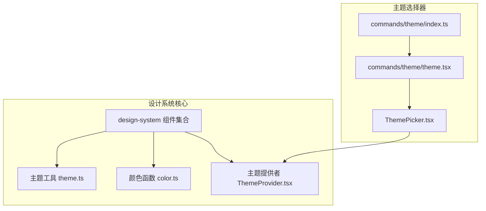
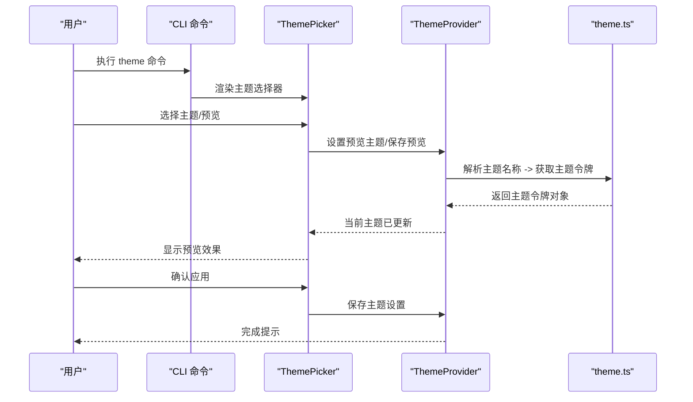
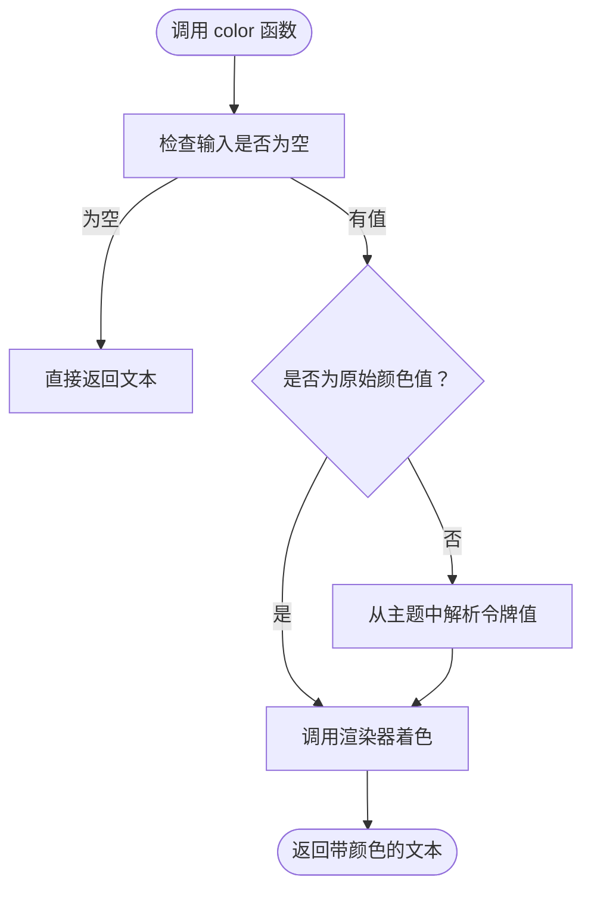
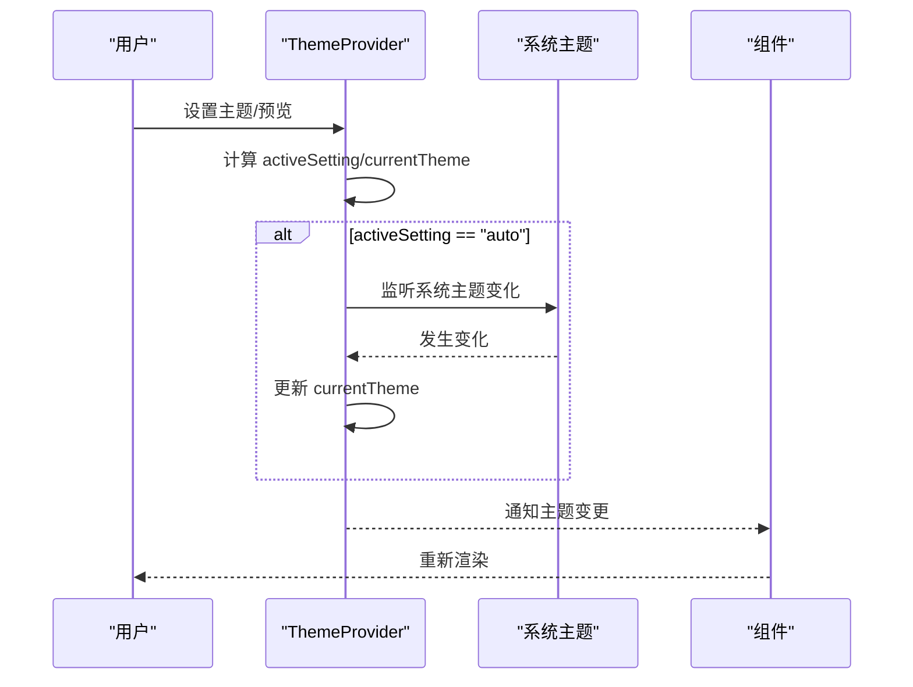
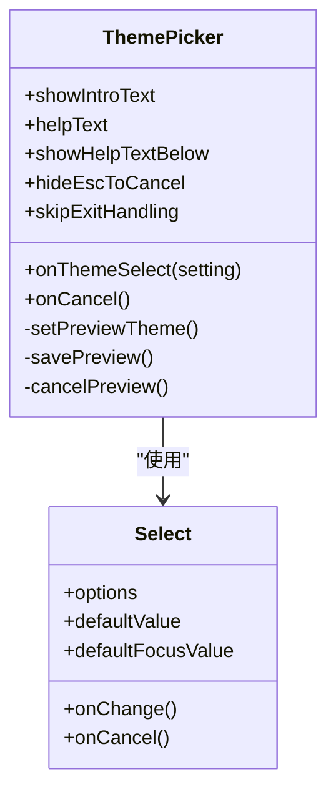
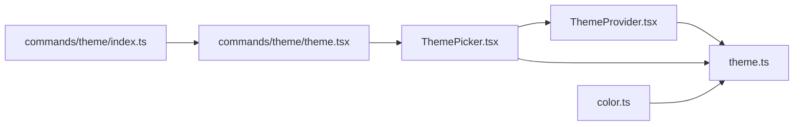

# 设计系统指南

<cite>
**本文档引用的文件**
- [color.ts](file://src/components/design-system/color.ts)
- [ThemeProvider.tsx](file://src/components/design-system/ThemeProvider.tsx)
- [theme.ts](file://src/utils/theme.ts)
- [ThemePicker.tsx](file://src/components/ThemePicker.tsx)
- [index.ts](file://src/commands/theme/index.ts)
- [theme.tsx](file://src/commands/theme/theme.tsx)
- [Byline.tsx](file://src/components/design-system/Byline.tsx)
- [Dialog.tsx](file://src/components/design-system/Dialog.tsx)
- [Divider.tsx](file://src/components/design-system/Divider.tsx)
- [FuzzyPicker.tsx](file://src/components/design-system/FuzzyPicker.tsx)
- [KeyboardShortcutHint.tsx](file://src/components/design-system/KeyboardShortcutHint.tsx)
- [ListItem.tsx](file://src/components/design-system/ListItem.tsx)
- [LoadingState.tsx](file://src/components/design-system/LoadingState.tsx)
- [Pane.tsx](file://src/components/design-system/Pane.tsx)
- [ProgressBar.tsx](file://src/components/design-system/ProgressBar.tsx)
- [Ratchet.tsx](file://src/components/design-system/Ratchet.tsx)
- [StatusIcon.tsx](file://src/components/design-system/StatusIcon.tsx)
- [Tabs.tsx](file://src/components/design-system/Tabs.tsx)
- [ThemedBox.tsx](file://src/components/design-system/ThemedBox.tsx)
- [ThemedText.tsx](file://src/components/design-system/ThemedText.tsx)
</cite>

## 目录
1. [简介](#简介)
2. [项目结构](#项目结构)
3. [核心组件](#核心组件)
4. [架构总览](#架构总览)
5. [详细组件分析](#详细组件分析)
6. [依赖关系分析](#依赖关系分析)
7. [性能考虑](#性能考虑)
8. [故障排除指南](#故障排除指南)
9. [结论](#结论)
10. [附录](#附录)

## 简介
本指南面向使用 free-code 设计系统的开发者与产品团队，系统性阐述设计系统架构与使用方法。内容涵盖颜色系统、字体规范、间距规则、组件样式、主题系统（深色/浅色切换与自定义）、CSS-in-JS 使用策略、设计令牌（颜色、尺寸、排版）以及响应式与无障碍最佳实践。通过图示与路径引用帮助快速定位实现细节，并提供可操作的使用示例与代码演示。

## 项目结构
free-code 的设计系统主要位于 `src/components/design-system` 目录下，配合 `src/utils/theme.ts` 提供主题与颜色令牌，`src/components/ThemePicker.tsx` 提供主题选择器 UI，以及命令层 `src/commands/theme/` 提供 CLI 主题切换入口。



**图表来源**
- [ThemeProvider.tsx:1-170](file://src/components/design-system/ThemeProvider.tsx#L1-L170)
- [theme.ts:1-647](file://src/utils/theme.ts#L1-L647)
- [color.ts:1-31](file://src/components/design-system/color.ts#L1-L31)
- [ThemePicker.tsx:1-333](file://src/components/ThemePicker.tsx#L1-L333)
- [index.ts:1-11](file://src/commands/theme/index.ts#L1-L11)
- [theme.tsx:1-57](file://src/commands/theme/theme.tsx#L1-L57)

**章节来源**
- [ThemeProvider.tsx:1-170](file://src/components/design-system/ThemeProvider.tsx#L1-L170)
- [theme.ts:1-647](file://src/utils/theme.ts#L1-L647)
- [ThemePicker.tsx:1-333](file://src/components/ThemePicker.tsx#L1-L333)
- [index.ts:1-11](file://src/commands/theme/index.ts#L1-L11)
- [theme.tsx:1-57](file://src/commands/theme/theme.tsx#L1-L57)

## 核心组件
- 主题提供者：负责解析用户偏好、系统主题、预览主题与持久化保存，向消费方暴露当前主题与设置。
- 颜色函数：基于主题键或原始颜色值，调用渲染器进行着色。
- 主题工具：集中管理多套主题（深/浅、色弱友好、仅 ANSI），提供主题名称枚举与颜色令牌映射。
- 主题选择器：交互式 UI，支持自动匹配终端、色弱友好模式、仅 ANSI 模式等选项，并实时预览效果。
- 命令入口：CLI 命令触发主题选择器，完成主题设置与结果反馈。

**章节来源**
- [ThemeProvider.tsx:1-170](file://src/components/design-system/ThemeProvider.tsx#L1-L170)
- [color.ts:1-31](file://src/components/design-system/color.ts#L1-L31)
- [theme.ts:1-647](file://src/utils/theme.ts#L1-L647)
- [ThemePicker.tsx:1-333](file://src/components/ThemePicker.tsx#L1-L333)
- [index.ts:1-11](file://src/commands/theme/index.ts#L1-L11)
- [theme.tsx:1-57](file://src/commands/theme/theme.tsx#L1-L57)

## 架构总览
设计系统采用“主题令牌 + 主题提供者 + 组件消费”的分层架构：
- 令牌层：在 `theme.ts` 中定义颜色、语义色、差异色、Agent 色板等完整令牌集。
- 解析层：`ThemeProvider.tsx` 将用户设置（含“自动”）解析为最终渲染主题，并提供预览与保存能力。
- 渲染层：`color.ts` 将主题令牌映射到具体颜色值；组件通过主题令牌引用样式。
- 交互层：`ThemePicker.tsx` 提供可视化主题选择与预览；命令层触发主题变更流程。



**图表来源**
- [theme.tsx:1-57](file://src/commands/theme/theme.tsx#L1-L57)
- [ThemePicker.tsx:1-333](file://src/components/ThemePicker.tsx#L1-L333)
- [ThemeProvider.tsx:1-170](file://src/components/design-system/ThemeProvider.tsx#L1-L170)
- [theme.ts:1-647](file://src/utils/theme.ts#L1-L647)

## 详细组件分析

### 主题系统与令牌
- 主题名称：支持深色、浅色、色弱友好（暗/亮）、仅 ANSI（暗/亮）共 6 种。
- 令牌类型：基础文本色、反色、状态色（成功/错误/警告/合并）、差异色（增删/词级）、Agent 多彩、Grove/Chrome/TUI V2 特定色、滚动/速率限制/快速模式等。
- 主题解析：根据名称返回对应令牌集，确保在任意终端环境下稳定渲染。

```mermaid
classDiagram
class Theme {
+autoAccept
+bashBorder
+claude
+startupAccent
+permission
+promptBorder
+text
+inverseText
+inactive
+subtle
+success
+error
+warning
+merged
+diffAdded
+diffRemoved
+diffAddedWord
+diffRemovedWord
+agentColors...
+groveColors...
+chromeColors...
+tuiV2Colors...
+fastMode
+rate_limit_fill
+rate_limit_empty
+briefLabelYou
+briefLabelClaude
+rainbow_* / *_shimmer
}
class ThemeName {
<<enumeration>>
"dark"
"light"
"light-daltonized"
"dark-daltonized"
"light-ansi"
"dark-ansi"
}
class ThemeSetting {
<<enumeration>>
"auto"
"dark"
"light"
"light-daltonized"
"dark-daltonized"
"light-ansi"
"dark-ansi"
}
class ThemeProvider {
+themeSetting
+currentTheme
+setThemeSetting()
+setPreviewTheme()
+savePreview()
+cancelPreview()
}
ThemeProvider --> ThemeName : "解析"
ThemeProvider --> ThemeSetting : "存储"
```

**图表来源**
- [theme.ts:4-90](file://src/utils/theme.ts#L4-L90)
- [theme.ts:92-110](file://src/utils/theme.ts#L92-L110)
- [theme.ts:605-620](file://src/utils/theme.ts#L605-L620)
- [ThemeProvider.tsx:8-28](file://src/components/design-system/ThemeProvider.tsx#L8-L28)

**章节来源**
- [theme.ts:1-647](file://src/utils/theme.ts#L1-L647)
- [ThemeProvider.tsx:1-170](file://src/components/design-system/ThemeProvider.tsx#L1-L170)

### 颜色函数与 CSS-in-JS
- 颜色函数：接收主题键或原始颜色值，结合类型（前景/背景）委托给渲染器进行着色。
- 支持格式：十六进制、RGB、ANSI 256、ANSI 名称等。
- 使用建议：优先使用主题令牌键，避免硬编码颜色；在需要时传入原始颜色值以覆盖默认。



**图表来源**
- [color.ts:9-30](file://src/components/design-system/color.ts#L9-L30)

**章节来源**
- [color.ts:1-31](file://src/components/design-system/color.ts#L1-L31)

### 主题提供者与自动切换
- 用户设置：支持“自动”跟随系统主题；非“自动”时直接使用指定主题。
- 预览机制：打开选择器时可临时预览不同主题，确认后保存。
- 自动监听：在支持特性下监听终端系统主题变化，动态刷新当前主题。
- 持久化：通过配置保存主题设置，重启后恢复。



**图表来源**
- [ThemeProvider.tsx:43-116](file://src/components/design-system/ThemeProvider.tsx#L43-L116)

**章节来源**
- [ThemeProvider.tsx:1-170](file://src/components/design-system/ThemeProvider.tsx#L1-L170)

### 主题选择器与交互
- 选项：根据特性启用“自动”选项；提供深/浅、色弱友好、仅 ANSI 等多种主题。
- 预览：焦点/变更时即时预览，取消时回滚。
- 语法高亮：可切换语法高亮显示，展示主题在代码片段中的效果。
- 快捷键：支持快捷键切换语法高亮与退出。



**图表来源**
- [ThemePicker.tsx:19-29](file://src/components/ThemePicker.tsx#L19-L29)
- [ThemePicker.tsx:113-134](file://src/components/ThemePicker.tsx#L113-L134)

**章节来源**
- [ThemePicker.tsx:1-333](file://src/components/ThemePicker.tsx#L1-L333)

### 命令入口与主题设置
- 命令注册：本地 JSX 命令，描述为“更改主题”，加载主题命令模块。
- 命令执行：渲染主题选择器，回调中设置主题并反馈结果。

**章节来源**
- [index.ts:1-11](file://src/commands/theme/index.ts#L1-L11)
- [theme.tsx:1-57](file://src/commands/theme/theme.tsx#L1-L57)

### 设计系统组件清单
以下为设计系统提供的通用 UI 组件，均应遵循主题令牌进行样式消费：

- 基础布局与容器：Pane、ThemedBox
- 文本与排版：ThemedText、Byline、KeyboardShortcutHint
- 交互控件：FuzzyPicker、Tabs、StatusIcon、ProgressBar、Ratchet
- 布局辅助：Divider、ListItem、LoadingState、Dialog
- 其他：Spinner（由 Ink 提供，遵循主题）

这些组件在渲染时应通过主题令牌引用颜色与尺寸，避免硬编码。

**章节来源**
- [Pane.tsx](file://src/components/design-system/Pane.tsx)
- [ThemedBox.tsx](file://src/components/design-system/ThemedBox.tsx)
- [ThemedText.tsx](file://src/components/design-system/ThemedText.tsx)
- [Byline.tsx](file://src/components/design-system/Byline.tsx)
- [KeyboardShortcutHint.tsx](file://src/components/design-system/KeyboardShortcutHint.tsx)
- [FuzzyPicker.tsx](file://src/components/design-system/FuzzyPicker.tsx)
- [Tabs.tsx](file://src/components/design-system/Tabs.tsx)
- [StatusIcon.tsx](file://src/components/design-system/StatusIcon.tsx)
- [ProgressBar.tsx](file://src/components/design-system/ProgressBar.tsx)
- [Ratchet.tsx](file://src/components/design-system/Ratchet.tsx)
- [Divider.tsx](file://src/components/design-system/Divider.tsx)
- [ListItem.tsx](file://src/components/design-system/ListItem.tsx)
- [LoadingState.tsx](file://src/components/design-system/LoadingState.tsx)
- [Dialog.tsx](file://src/components/design-system/Dialog.tsx)

## 依赖关系分析
- 组件依赖：设计系统组件依赖主题令牌与颜色函数；颜色函数依赖主题工具与渲染器。
- 主题提供者：依赖全局配置与系统主题检测；在支持特性下依赖系统主题监听。
- 命令层：依赖主题选择器与 Ink 提供的主题钩子。



**图表来源**
- [ThemePicker.tsx:1-333](file://src/components/ThemePicker.tsx#L1-L333)
- [ThemeProvider.tsx:1-170](file://src/components/design-system/ThemeProvider.tsx#L1-L170)
- [theme.ts:1-647](file://src/utils/theme.ts#L1-L647)
- [color.ts:1-31](file://src/components/design-system/color.ts#L1-L31)
- [theme.tsx:1-57](file://src/commands/theme/theme.tsx#L1-L57)
- [index.ts:1-11](file://src/commands/theme/index.ts#L1-L11)

**章节来源**
- [ThemePicker.tsx:1-333](file://src/components/ThemePicker.tsx#L1-L333)
- [ThemeProvider.tsx:1-170](file://src/components/design-system/ThemeProvider.tsx#L1-L170)
- [theme.ts:1-647](file://src/utils/theme.ts#L1-L647)
- [color.ts:1-31](file://src/components/design-system/color.ts#L1-L31)
- [theme.tsx:1-57](file://src/commands/theme/theme.tsx#L1-L57)
- [index.ts:1-11](file://src/commands/theme/index.ts#L1-L11)

## 性能考虑
- 主题解析缓存：主题提供者在计算 currentTheme 时使用记忆化，减少重复解析开销。
- 条件监听：仅在启用 AUTO_THEME 特性且具备查询器时才启动系统主题监听，避免不必要的监听成本。
- 颜色函数：对空输入直接返回，避免不必要渲染；原始颜色值走快速路径。
- 组件渲染：主题选择器内部广泛使用记忆化与条件渲染，降低重绘频率。

[本节为通用指导，无需特定文件引用]

## 故障排除指南
- 主题未生效
  - 检查主题提供者是否包裹在根组件上。
  - 确认设置为“自动”时系统主题监听是否可用（需 AUTO_THEME 特性与终端查询器）。
  - 参考路径：[ThemeProvider.tsx:64-80](file://src/components/design-system/ThemeProvider.tsx#L64-L80)
- 颜色异常
  - 确认使用的颜色值格式是否正确（十六进制、RGB、ANSI）。
  - 优先使用主题令牌键而非硬编码颜色。
  - 参考路径：[color.ts:19-28](file://src/components/design-system/color.ts#L19-L28)
- 语法高亮不可用
  - 检查环境变量与设置项是否禁用了语法高亮。
  - 在主题选择器中使用快捷键切换。
  - 参考路径：[ThemePicker.tsx:78-99](file://src/components/ThemePicker.tsx#L78-L99)
- CLI 主题命令无效
  - 确认命令注册与加载是否正常。
  - 参考路径：[index.ts:3-8](file://src/commands/theme/index.ts#L3-L8)，[theme.tsx:54-56](file://src/commands/theme/theme.tsx#L54-L56)

**章节来源**
- [ThemeProvider.tsx:64-80](file://src/components/design-system/ThemeProvider.tsx#L64-L80)
- [color.ts:19-28](file://src/components/design-system/color.ts#L19-L28)
- [ThemePicker.tsx:78-99](file://src/components/ThemePicker.tsx#L78-L99)
- [index.ts:3-8](file://src/commands/theme/index.ts#L3-L8)
- [theme.tsx:54-56](file://src/commands/theme/theme.tsx#L54-L56)

## 结论
free-code 的设计系统通过“主题令牌 + 主题提供者 + 组件消费”的架构实现了跨平台、可扩展、可访问的主题体系。借助颜色函数与主题选择器，开发者可以以最小成本实现一致的视觉体验，并在需要时灵活覆盖与定制。建议在所有新组件中统一使用主题令牌，避免硬编码颜色，确保在深/浅、色弱友好与仅 ANSI 模式下的稳定表现。

[本节为总结，无需特定文件引用]

## 附录

### 设计令牌使用指南
- 颜色令牌
  - 基础：text、inverseText、background、subtle、inactive
  - 状态：success、error、warning、merged
  - 差异：diffAdded、diffRemoved、diffAddedWord、diffRemovedWord
  - 语义：permission、suggestion、remember、startupAccent
  - Agent/Grove/Chrome/TUI V2：按功能域使用专用令牌
  - 参考路径：[theme.ts:4-90](file://src/utils/theme.ts#L4-L90)
- 尺寸令牌
  - 建议使用组件内置的间距属性（如 gap、margin、padding）配合主题令牌的颜色值，避免硬编码像素值。
  - 参考路径：[Pane.tsx](file://src/components/design-system/Pane.tsx)、[ThemedBox.tsx](file://src/components/design-system/ThemedBox.tsx)
- 排版令牌
  - 文本组件使用 ThemedText，通过 color 属性引用主题令牌键，确保在不同主题下保持对比度与可读性。
  - 参考路径：[ThemedText.tsx](file://src/components/design-system/ThemedText.tsx)

### 组件样式定制策略
- CSS-in-JS 使用
  - 通过颜色函数将主题令牌映射为最终颜色，避免在样式对象中直接写死颜色。
  - 参考路径：[color.ts:9-30](file://src/components/design-system/color.ts#L9-L30)
- 样式继承与覆盖
  - 优先继承组件默认样式，仅在必要时覆盖关键属性（如颜色、边框、阴影）。
  - 对于复杂覆盖，建议封装为新的受控组件，复用主题令牌。
- 响应式设计
  - 使用组件的宽度/高度/边距等属性适配终端窗口大小。
  - 参考路径：[ThemePicker.tsx:246-250](file://src/components/ThemePicker.tsx#L246-L250)

### 响应式与无障碍最佳实践
- 响应式
  - 利用终端宽度自适应布局，避免固定宽度。
  - 在窄屏下优先保证关键信息可见。
- 无障碍
  - 保持足够的对比度（使用 inverseText 与 background 的组合）。
  - 为色弱用户提供色弱友好主题（light-daltonized/dark-daltonized）。
  - 为仅 ANSI 终端提供降级方案（light-ansi/dark-ansi）。

### 实际使用示例与代码演示
- 在组件中使用主题颜色
  - 使用颜色函数包装文本，传入主题键与主题名。
  - 参考路径：[color.ts:9-30](file://src/components/design-system/color.ts#L9-L30)
- 在主题选择器中应用主题
  - 通过 ThemePicker 的 onThemeSelect 回调设置主题。
  - 参考路径：[ThemePicker.tsx:184-187](file://src/components/ThemePicker.tsx#L184-L187)
- 通过 CLI 更换主题
  - 执行 theme 命令，选择目标主题并确认应用。
  - 参考路径：[index.ts:3-8](file://src/commands/theme/index.ts#L3-L8)，[theme.tsx:54-56](file://src/commands/theme/theme.tsx#L54-L56)

**章节来源**
- [color.ts:1-31](file://src/components/design-system/color.ts#L1-L31)
- [ThemePicker.tsx:184-187](file://src/components/ThemePicker.tsx#L184-L187)
- [index.ts:3-8](file://src/commands/theme/index.ts#L3-L8)
- [theme.tsx:54-56](file://src/commands/theme/theme.tsx#L54-L56)