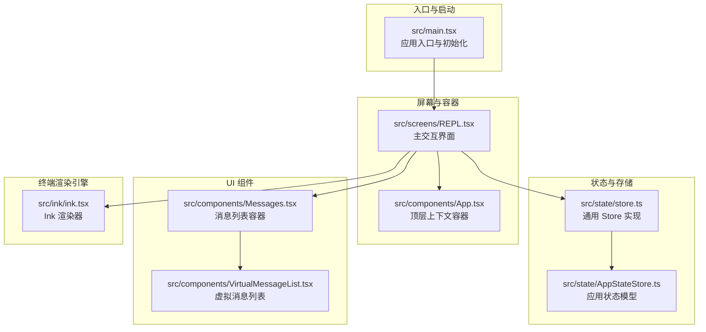
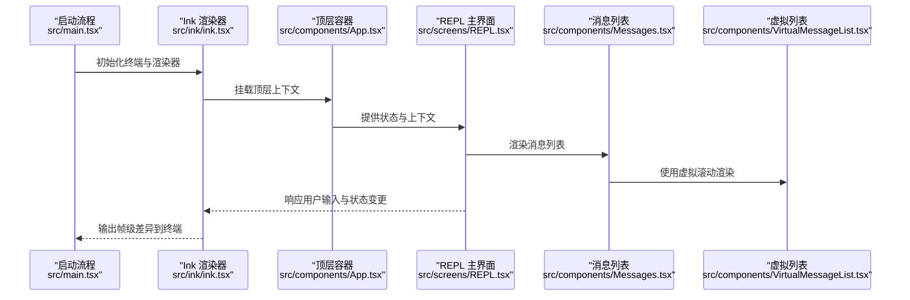
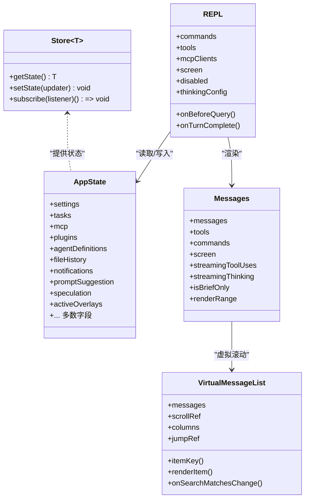
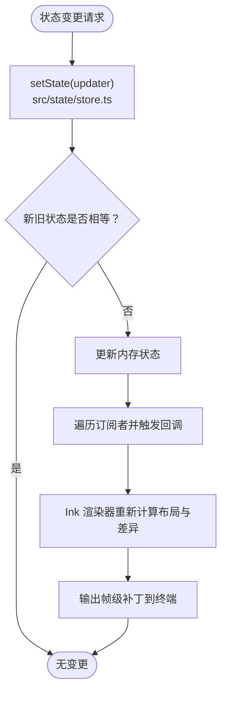
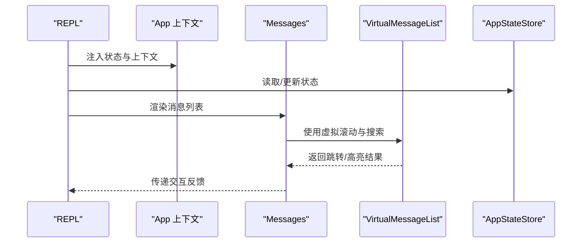
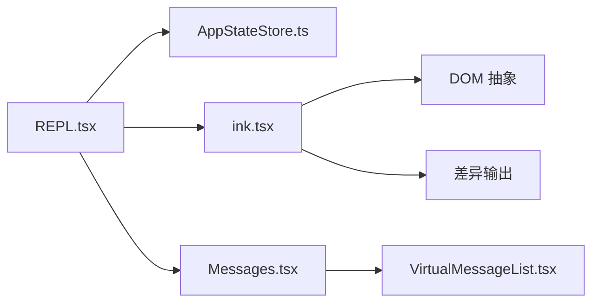

# 终端 UI 架构

<cite>
**本文引用的文件**
- [README.md](file://README.md)
- [main.tsx](file://src/main.tsx)
- [ink.tsx](file://src/ink/ink.tsx)
- [App.tsx](file://src/components/App.tsx)
- [REPL.tsx](file://src/screens/REPL.tsx)
- [AppStateStore.ts](file://src/state/AppStateStore.ts)
- [store.ts](file://src/state/store.ts)
- [Messages.tsx](file://src/components/Messages.tsx)
- [VirtualMessageList.tsx](file://src/components/VirtualMessageList.tsx)
</cite>

## 目录
1. [简介](#简介)
2. [项目结构](#项目结构)
3. [核心组件](#核心组件)
4. [架构总览](#架构总览)
5. [详细组件分析](#详细组件分析)
6. [依赖关系分析](#依赖关系分析)
7. [性能考量](#性能考量)
8. [故障排查指南](#故障排查指南)
9. [结论](#结论)
10. [附录](#附录)

## 简介
本文件系统性阐述 free-code 的终端 UI 架构，围绕 React + Ink 框架在终端中的实现，深入解析组件层次、状态管理、组件通信与数据流，并给出虚拟滚动、实时更新与性能优化策略。文档同时提供 UI 组件开发指南与最佳实践，帮助开发者在保持高性能的同时扩展交互体验。

## 项目结构
free-code 采用以功能域划分的模块化组织方式：入口点负责初始化与启动流程；屏幕层承载交互主界面（REPL）；组件层封装可复用 UI 组件；状态层提供全局状态存储与订阅；Ink 层实现终端渲染引擎与虚拟 DOM 差分输出。

**图表来源**
- [main.tsx:585-800](file://src/main.tsx#L585-L800)
- [REPL.tsx:575-601](file://src/screens/REPL.tsx#L575-L601)
- [App.tsx:19-55](file://src/components/App.tsx#L19-L55)
- [AppStateStore.ts:89-452](file://src/state/AppStateStore.ts#L89-L452)
- [store.ts:10-34](file://src/state/store.ts#L10-L34)
- [Messages.tsx:341-721](file://src/components/Messages.tsx#L341-L721)
- [VirtualMessageList.tsx:289-407](file://src/components/VirtualMessageList.tsx#L289-L407)
- [ink.tsx:76-279](file://src/ink/ink.tsx#L76-L279)

**章节来源**
- [README.md:179-204](file://README.md#L179-L204)

## 核心组件
- 应用入口与启动：负责环境初始化、特性开关、命令行参数解析、信任对话与 REPL 启动。
- REPL 主界面：承载消息展示、输入处理、快捷键绑定、工具权限与 MCP 集成、任务与通知等。
- 顶层容器 App：提供 FPS 指标、统计信息与应用状态上下文。
- 消息列表 Messages：负责消息归并、折叠、截断、搜索索引与渲染范围控制。
- 虚拟消息列表 VirtualMessageList：基于 useVirtualScroll 的高性能虚拟滚动实现，支持搜索高亮与位置扫描。
- Ink 渲染器：实现 React 组件到终端的渲染、布局计算、差异输出与帧级优化。
- 应用状态 AppState：集中管理模型、插件、MCP、任务、权限、提示建议、推测等状态。

**章节来源**
- [main.tsx:585-800](file://src/main.tsx#L585-L800)
- [REPL.tsx:575-601](file://src/screens/REPL.tsx#L575-L601)
- [App.tsx:19-55](file://src/components/App.tsx#L19-L55)
- [AppStateStore.ts:89-452](file://src/state/AppStateStore.ts#L89-L452)
- [store.ts:10-34](file://src/state/store.ts#L10-L34)
- [Messages.tsx:341-721](file://src/components/Messages.tsx#L341-L721)
- [VirtualMessageList.tsx:289-407](file://src/components/VirtualMessageList.tsx#L289-L407)
- [ink.tsx:76-279](file://src/ink/ink.tsx#L76-L279)

## 架构总览
React + Ink 在终端中的工作流如下：应用入口初始化后，通过 Ink 渲染器挂载根节点，REPL 作为顶层组件渲染消息列表与输入区域。状态通过 AppStateStore 提供的 Store 进行集中管理，组件通过订阅与选择器读取状态变化，实现高效的数据驱动渲染。

**图表来源**
- [main.tsx:585-800](file://src/main.tsx#L585-L800)
- [ink.tsx:420-789](file://src/ink/ink.tsx#L420-L789)
- [App.tsx:19-55](file://src/components/App.tsx#L19-L55)
- [REPL.tsx:575-601](file://src/screens/REPL.tsx#L575-L601)
- [Messages.tsx:341-721](file://src/components/Messages.tsx#L341-L721)
- [VirtualMessageList.tsx:289-407](file://src/components/VirtualMessageList.tsx#L289-L407)

## 详细组件分析

### 组件层次与职责
- 入口与启动：解析 CLI、加载配置、初始化遥测与特性开关，最终启动 REPL。
- REPL：聚合命令、工具、MCP 客户端、任务与通知，协调输入、权限与会话生命周期。
- Messages：对消息进行去重、重组、分组、折叠与截断，生成可渲染的消息序列。
- VirtualMessageList：基于 useVirtualScroll 的虚拟滚动，按需渲染可见项，支持搜索定位与高亮。
- Ink：负责布局计算、差异输出、光标管理、全屏/备用缓冲区切换与帧级性能指标。

**图表来源**
- [store.ts:4-34](file://src/state/store.ts#L4-L34)
- [AppStateStore.ts:89-452](file://src/state/AppStateStore.ts#L89-L452)
- [REPL.tsx:575-601](file://src/screens/REPL.tsx#L575-L601)
- [Messages.tsx:207-275](file://src/components/Messages.tsx#L207-L275)
- [VirtualMessageList.tsx:69-113](file://src/components/VirtualMessageList.tsx#L69-L113)

**章节来源**
- [store.ts:10-34](file://src/state/store.ts#L10-L34)
- [AppStateStore.ts:89-452](file://src/state/AppStateStore.ts#L89-L452)
- [REPL.tsx:575-601](file://src/screens/REPL.tsx#L575-L601)
- [Messages.tsx:207-275](file://src/components/Messages.tsx#L207-L275)
- [VirtualMessageList.tsx:69-113](file://src/components/VirtualMessageList.tsx#L69-L113)

### 状态管理机制与数据流
- Store 抽象：提供 getState、setState 与 subscribe，避免重复渲染并触发订阅者。
- AppState 模型：集中管理设置、任务、MCP、插件、代理定义、文件历史、通知、提示建议、推测等。
- 订阅与选择器：REPL 与子组件通过 useAppState 读取状态片段，减少不必要的重渲染。
- 变更传播：onChangeAppState 与 setAppState 更新状态树，Ink 渲染器感知变更并输出差异帧。

**图表来源**
- [store.ts:20-27](file://src/state/store.ts#L20-L27)
- [AppStateStore.ts:456-569](file://src/state/AppStateStore.ts#L456-L569)
- [ink.tsx:420-789](file://src/ink/ink.tsx#L420-L789)

**章节来源**
- [store.ts:10-34](file://src/state/store.ts#L10-L34)
- [AppStateStore.ts:456-569](file://src/state/AppStateStore.ts#L456-L569)
- [ink.tsx:420-789](file://src/ink/ink.tsx#L420-L789)

### 组件通信与数据流
- 上下文注入：App 提供 FPS 指标、统计与应用状态上下文，REPL 作为根容器承载所有子组件。
- 子组件间通信：Messages 与 VirtualMessageList 通过 jumpRef 与 setPositions 协作实现搜索定位与高亮；REPL 通过 useAppState 与 setAppState 与状态层交互。
- 输入与事件：REPL 接收用户输入、处理快捷键、触发查询与工具调用，消息流经状态层与渲染层。

**图表来源**
- [App.tsx:19-55](file://src/components/App.tsx#L19-L55)
- [REPL.tsx:621-643](file://src/screens/REPL.tsx#L621-L643)
- [Messages.tsx:341-721](file://src/components/Messages.tsx#L341-L721)
- [VirtualMessageList.tsx:289-407](file://src/components/VirtualMessageList.tsx#L289-L407)
- [AppStateStore.ts:89-452](file://src/state/AppStateStore.ts#L89-L452)

**章节来源**
- [App.tsx:19-55](file://src/components/App.tsx#L19-L55)
- [REPL.tsx:621-643](file://src/screens/REPL.tsx#L621-L643)
- [Messages.tsx:341-721](file://src/components/Messages.tsx#L341-L721)
- [VirtualMessageList.tsx:289-407](file://src/components/VirtualMessageList.tsx#L289-L407)
- [AppStateStore.ts:89-452](file://src/state/AppStateStore.ts#L89-L452)

### 主要 UI 组件参考
- 主应用容器：App.tsx 提供顶层上下文，确保 FPS、统计与应用状态在整棵组件树中可用。
- 消息列表：Messages.tsx 负责消息的去重、重组、分组、折叠、截断与渲染范围控制，支持 Brief 模式与思维块过滤。
- 虚拟消息列表：VirtualMessageList.tsx 提供基于 useVirtualScroll 的虚拟滚动，支持搜索定位、位置扫描与高亮。
- REPL 主界面：REPL.tsx 聚合命令、工具、MCP 客户端、任务与通知，协调输入、权限与会话生命周期。
- Ink 渲染器：ink.tsx 实现布局计算、差异输出、光标管理与帧级性能指标。

**章节来源**
- [App.tsx:19-55](file://src/components/App.tsx#L19-L55)
- [Messages.tsx:341-721](file://src/components/Messages.tsx#L341-L721)
- [VirtualMessageList.tsx:289-407](file://src/components/VirtualMessageList.tsx#L289-L407)
- [REPL.tsx:575-601](file://src/screens/REPL.tsx#L575-L601)
- [ink.tsx:76-279](file://src/ink/ink.tsx#L76-L279)

### UI 组件开发指南
- 设计原则
  - 最小化渲染：使用 React.memo 与稳定依赖，避免不必要的重渲染。
  - 分层解耦：将状态管理与 UI 渲染分离，通过上下文与选择器降低耦合。
  - 可访问性：确保键盘导航、焦点管理与屏幕阅读器友好。
- 样式与主题
  - 使用 Ink 的主题与样式能力，结合设计系统组件实现一致的视觉语言。
  - 通过上下文与 Provider 将主题与样式注入到组件树。
- 组件扩展
  - 新增组件时，优先考虑复用现有上下文与状态，减少额外依赖。
  - 对于高频更新区域，采用局部状态与细粒度订阅，避免全局广播。

[本节为概念性指导，不直接分析具体文件]

## 依赖关系分析
- REPL 依赖 AppStateStore 与 Ink 渲染器，向上提供上下文，向下驱动消息渲染。
- Messages 依赖 VirtualMessageList 与搜索/高亮工具，负责消息的预处理与渲染范围控制。
- Ink 渲染器依赖 DOM 抽象、布局计算与差异输出，保证帧级性能与一致性。

**图表来源**
- [REPL.tsx:575-601](file://src/screens/REPL.tsx#L575-L601)
- [AppStateStore.ts:89-452](file://src/state/AppStateStore.ts#L89-L452)
- [Messages.tsx:341-721](file://src/components/Messages.tsx#L341-L721)
- [VirtualMessageList.tsx:289-407](file://src/components/VirtualMessageList.tsx#L289-L407)
- [ink.tsx:76-279](file://src/ink/ink.tsx#L76-L279)

**章节来源**
- [REPL.tsx:575-601](file://src/screens/REPL.tsx#L575-L601)
- [AppStateStore.ts:89-452](file://src/state/AppStateStore.ts#L89-L452)
- [Messages.tsx:341-721](file://src/components/Messages.tsx#L341-L721)
- [VirtualMessageList.tsx:289-407](file://src/components/VirtualMessageList.tsx#L289-L407)
- [ink.tsx:76-279](file://src/ink/ink.tsx#L76-L279)

## 性能考量
- 虚拟滚动
  - VirtualMessageList 基于 useVirtualScroll，仅渲染可见区域，显著降低内存占用与重绘成本。
  - 支持增量键数组与高度缓存，避免每次渲染重建键列表。
- 渲染优化
  - Ink 渲染器采用差异输出与帧级优化，减少不必要的写入与布局计算。
  - 通过池化与重置策略控制字符与超链接池的增长，避免长期运行内存膨胀。
- 状态更新
  - Store 的浅比较与订阅机制避免无效重渲染，配合 React.memo 与稳定依赖进一步优化。
- 搜索与高亮
  - Messages 提供搜索文本缓存与索引预热，VirtualMessageList 支持增量匹配与锚点记忆，提升搜索体验与性能。

[本节提供通用性能建议，不直接分析具体文件]

## 故障排查指南
- REPL 未响应或卡顿
  - 检查虚拟滚动开关与终端尺寸变化处理，确认 resize 事件正确触发。
  - 关注帧级指标（渲染、差异、优化、写入耗时），定位瓶颈阶段。
- 消息显示异常
  - 确认消息预处理链（去重、重组、分组、折叠）是否正确执行。
  - 检查 Brief 模式与思维块过滤逻辑，确保只在必要时启用。
- 输入与权限问题
  - 核对工具权限上下文与权限模式，确保权限更新及时反映到状态层。
  - 检查 MCP 客户端连接状态与错误回调，确保异常被正确上报。

**章节来源**
- [ink.tsx:309-346](file://src/ink/ink.tsx#L309-L346)
- [Messages.tsx:486-529](file://src/components/Messages.tsx#L486-L529)
- [AppStateStore.ts:500-503](file://src/state/AppStateStore.ts#L500-L503)

## 结论
free-code 的终端 UI 架构以 React + Ink 为核心，结合集中式状态管理与虚拟滚动技术，在保证交互流畅性的同时实现了高可扩展性。通过清晰的组件层次、稳定的上下文注入与高效的渲染路径，开发者可以在终端环境中构建复杂而高性能的交互体验。

[本节为总结性内容，不直接分析具体文件]

## 附录
- 快速参考
  - 入口与启动：src/main.tsx
  - 主界面：src/screens/REPL.tsx
  - 顶层容器：src/components/App.tsx
  - 消息列表：src/components/Messages.tsx
  - 虚拟列表：src/components/VirtualMessageList.tsx
  - 状态存储：src/state/store.ts
  - 应用状态：src/state/AppStateStore.ts
  - 终端渲染：src/ink/ink.tsx

[本节为补充信息，不直接分析具体文件]