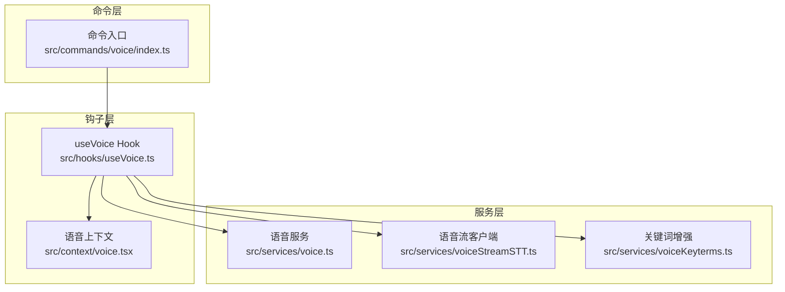
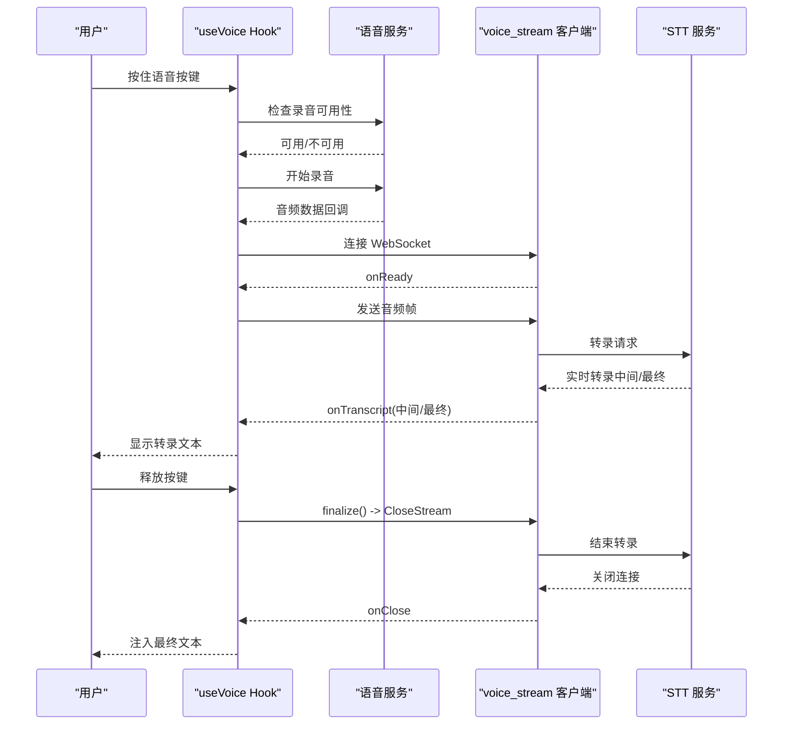
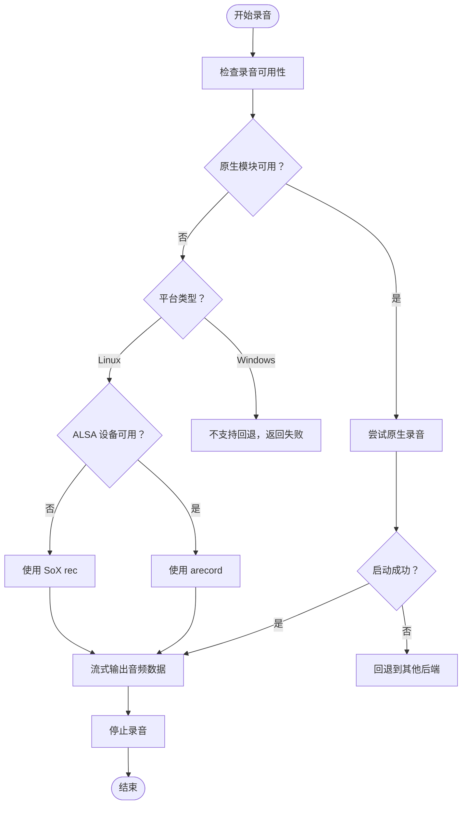
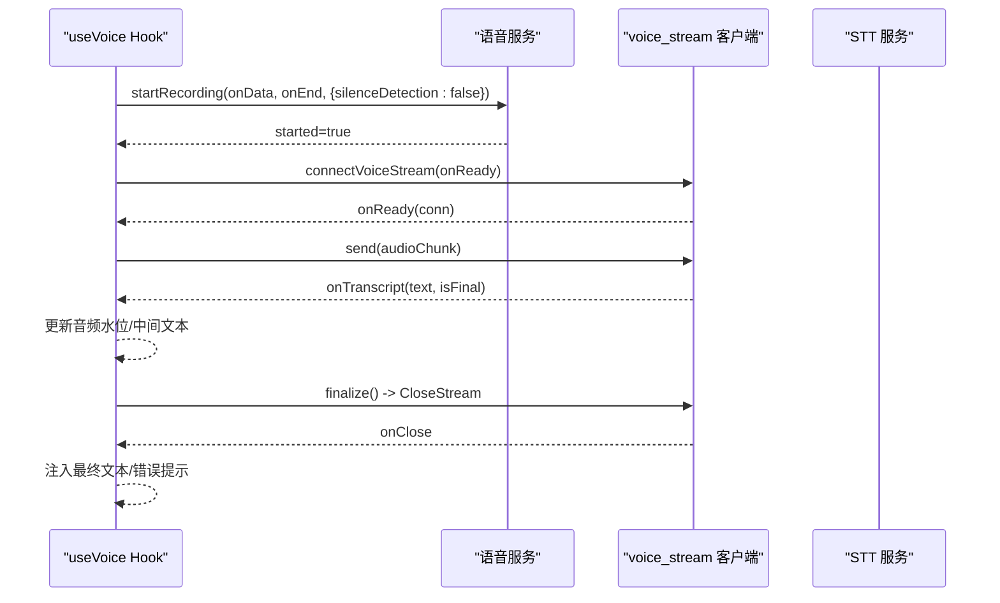
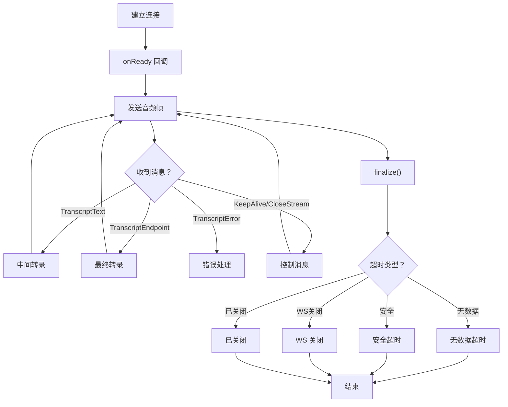
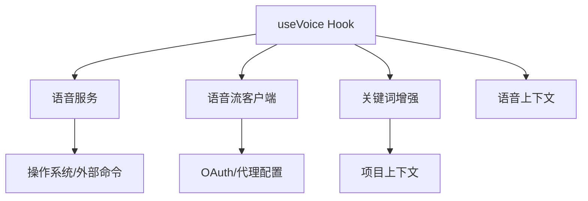

# 语音输入系统

<cite>
**本文档引用的文件**
- [voice.ts](file://src/services/voice.ts)
- [useVoice.ts](file://src/hooks/useVoice.ts)
- [voiceStreamSTT.ts](file://src/services/voiceStreamSTT.ts)
- [voiceKeyterms.ts](file://src/services/voiceKeyterms.ts)
- [voice.tsx](file://src/context/voice.tsx)
- [index.ts](file://src/commands/voice/index.ts)
</cite>

## 目录
1. [简介](#简介)
2. [项目结构](#项目结构)
3. [核心组件](#核心组件)
4. [架构概览](#架构概览)
5. [详细组件分析](#详细组件分析)
6. [依赖关系分析](#依赖关系分析)
7. [性能考虑](#性能考虑)
8. [故障排除指南](#故障排除指南)
9. [结论](#结论)
10. [附录](#附录)

## 简介
free-code 的语音输入系统为用户提供了一种便捷的语音转文字（Speech-to-Text）体验，支持按住按键录音并自动提交的推送到讲（Push-to-Talk）模式。该系统集成了本地音频捕获、跨平台录音后端（原生模块、SoX、ALSA），以及基于 WebSocket 的实时语音流 STT（语音转文字）服务。用户可以通过语音命令快速切换语音模式，并在终端聚焦时实现跟随窗口焦点的连续语音输入。

## 项目结构
语音输入系统主要由以下模块组成：
- 服务层：负责音频录制、设备可用性检查、跨平台后端选择与控制
- 钩子层：React Hook 实现语音状态管理、按键事件处理、会话生命周期控制
- 语音流客户端：连接 Anthropic 的 voice_stream WebSocket 服务，处理实时转录
- 关键词增强：动态构建领域特定关键词列表以提升识别准确率
- 上下文状态：集中管理语音输入的状态（录音中、处理中、错误信息等）
- 命令入口：提供语音模式的命令入口与可用性检查

**图表来源**
- [index.ts:1-21](file://src/commands/voice/index.ts#L1-L21)
- [useVoice.ts:1-800](file://src/hooks/useVoice.ts#L1-L800)
- [voice.ts:1-554](file://src/services/voice.ts#L1-L554)
- [voiceStreamSTT.ts:1-545](file://src/services/voiceStreamSTT.ts#L1-L545)
- [voiceKeyterms.ts:1-107](file://src/services/voiceKeyterms.ts#L1-L107)
- [voice.tsx:1-88](file://src/context/voice.tsx#L1-L88)

**章节来源**
- [index.ts:1-21](file://src/commands/voice/index.ts#L1-L21)
- [useVoice.ts:1-800](file://src/hooks/useVoice.ts#L1-L800)
- [voice.ts:1-554](file://src/services/voice.ts#L1-L554)
- [voiceStreamSTT.ts:1-545](file://src/services/voiceStreamSTT.ts#L1-L545)
- [voiceKeyterms.ts:1-107](file://src/services/voiceKeyterms.ts#L1-L107)
- [voice.tsx:1-88](file://src/context/voice.tsx#L1-L88)

## 核心组件
- 语音服务（voice.ts）
  - 负责加载原生音频模块（macOS/Linux/Windows），并在不可用时回退到 SoX 或 ALSA（arecord）
  - 提供录音可用性检查、麦克风权限请求、录音启动/停止与静音检测
  - 支持 Linux ALSA 卡片探测与 WSL 环境适配
- React Hook（useVoice.ts）
  - 实现按住按键录音、自动释放定时器、焦点模式下的自动录音/停止
  - 管理录音会话生命周期、错误处理、静默掉落重试、音频可视化水位
  - 连接 voice_stream WebSocket 并处理实时转录
- 语音流客户端（voiceStreamSTT.ts）
  - 基于 WebSocket 的 voice_stream 接口，发送音频帧并接收转录结果
  - 处理 KeepAlive、CloseStream、TranscriptText、TranscriptEndpoint、TranscriptError 等消息类型
  - 提供 finalize() 超时控制与安全兜底
- 关键词增强（voiceKeyterms.ts）
  - 构建全局编程术语集合与项目上下文关键词（分支名、最近文件名等）
  - 通过查询参数传递给 STT 服务以提升识别准确率
- 语音上下文（voice.tsx）
  - 提供语音状态的全局存储与订阅接口（录音状态、错误信息、音频水位等）

**章节来源**
- [voice.ts:1-554](file://src/services/voice.ts#L1-L554)
- [useVoice.ts:1-800](file://src/hooks/useVoice.ts#L1-L800)
- [voiceStreamSTT.ts:1-545](file://src/services/voiceStreamSTT.ts#L1-L545)
- [voiceKeyterms.ts:1-107](file://src/services/voiceKeyterms.ts#L1-L107)
- [voice.tsx:1-88](file://src/context/voice.tsx#L1-L88)

## 架构概览
语音输入系统的整体流程如下：
- 用户触发语音模式或按键（按住录音，释放提交）
- 系统检查录音可用性并请求麦克风权限
- 启动本地录音（原生模块优先，回退到 SoX/ALSA）
- 将音频数据通过 voice_stream WebSocket 发送至 STT 服务
- 实时接收转录文本（中间结果与最终结果），并根据焦点模式决定注入时机
- 完成录音后进行 finalize，等待服务器关闭并读取最终转录

**图表来源**
- [useVoice.ts:632-800](file://src/hooks/useVoice.ts#L632-L800)
- [voice.ts:363-424](file://src/services/voice.ts#L363-L424)
- [voiceStreamSTT.ts:111-347](file://src/services/voiceStreamSTT.ts#L111-L347)

## 详细组件分析

### 组件A：语音服务（录音与设备管理）
- 功能要点
  - 延迟加载原生音频模块，避免启动阻塞
  - 在 macOS/Linux/Windows 上优先使用原生模块；Windows 不支持回退
  - Linux 上优先探测 ALSA 设备，若存在则使用 arecord；否则回退到 SoX
  - 提供录音可用性检查与麦克风权限请求（首次录音触发 TCC 对话框）
  - 支持静音检测（用于自动停止）与推送到讲（手动控制）
- 关键流程
  - 录音启动：根据平台选择后端，设置回调与错误处理
  - 录音结束：停止原生录音或向子进程发送终止信号
  - 设备探测：检查命令是否存在、探测 ALSA 卡片、WSL 环境适配

**图表来源**
- [voice.ts:287-424](file://src/services/voice.ts#L287-L424)

**章节来源**
- [voice.ts:1-554](file://src/services/voice.ts#L1-L554)

### 组件B：React Hook（useVoice）
- 功能要点
  - 按住按键录音，自动释放定时器（基于系统按键重复间隔）
  - 焦点模式：终端获得/失去焦点时自动开始/结束录音
  - 会话生成与过期保护：防止旧会话覆盖新会话
  - 静默掉落重试：当服务器接受音频但无转录时，重放缓冲音频
  - 语言规范化：将用户语言偏好映射到 STT 支持的 BCP-47 代码
  - 音频可视化：计算 RMS 幅度并更新水位条
- 关键流程
  - 开始会话：检查可用性、启动录音、连接 WebSocket、缓冲音频
  - 录音中：更新音频水位、处理中间转录、焦点模式下立即注入
  - 结束会话：发送 CloseStream、等待 finalize、注入最终文本、错误处理

**图表来源**
- [useVoice.ts:632-800](file://src/hooks/useVoice.ts#L632-L800)
- [voiceStreamSTT.ts:215-320](file://src/services/voiceStreamSTT.ts#L215-L320)

**章节来源**
- [useVoice.ts:1-800](file://src/hooks/useVoice.ts#L1-L800)

### 组件C：语音流客户端（voice_stream STT）
- 功能要点
  - 使用与 Claude Code 相同的 OAuth 凭据建立连接
  - 支持 Deepgram Nova 3 提供商与 conversation_engine 路由
  - 发送 KeepAlive 防止空闲超时，发送 CloseStream 触发服务器停止
  - 处理 TranscriptText（中间）、TranscriptEndpoint（段落结束）、TranscriptError（错误）
  - finalize() 提供多种超时策略：无数据超时、安全超时、WS 关闭、已关闭
- 关键流程
  - 连接建立：刷新令牌、构造 URL 参数、建立 WebSocket
  - 数据传输：复制缓冲区避免共享内存问题，发送二进制音频帧
  - 结束流程：延迟发送 CloseStream，等待服务器响应或超时

**图表来源**
- [voiceStreamSTT.ts:111-347](file://src/services/voiceStreamSTT.ts#L111-L347)
- [voiceStreamSTT.ts:357-461](file://src/services/voiceStreamSTT.ts#L357-L461)

**章节来源**
- [voiceStreamSTT.ts:1-545](file://src/services/voiceStreamSTT.ts#L1-L545)

### 组件D：关键词增强（voiceKeyterms）
- 功能要点
  - 全局编程术语集合（如 TypeScript、JSON、OAuth 等）
  - 项目根目录名称、Git 分支词汇、最近文件名拆分
  - 限制最大关键词数量，避免过度膨胀
- 作用
  - 通过查询参数传递给 voice_stream，提升识别准确率

**章节来源**
- [voiceKeyterms.ts:1-107](file://src/services/voiceKeyterms.ts#L1-L107)

### 组件E：语音上下文（VoiceProvider）
- 功能要点
  - 提供语音状态的全局存储（录音状态、错误信息、音频水位、中间文本）
  - 订阅接口仅在状态变化时触发重新渲染
  - 稳定的 setter 引用，便于在事件处理器中同步读取最新状态

**章节来源**
- [voice.tsx:1-88](file://src/context/voice.tsx#L1-L88)

### 组件F：命令入口（voice 命令）
- 功能要点
  - 提供语音模式的命令入口，支持可用性检查与隐藏逻辑
  - 仅在 GrowthBook 开关开启且语音模式可用时显示

**章节来源**
- [index.ts:1-21](file://src/commands/voice/index.ts#L1-L21)

## 依赖关系分析
- useVoice 依赖 voice.ts（录音）、voiceStreamSTT.ts（语音流）、voiceKeyterms.ts（关键词）、voice.tsx（状态）
- voice.ts 依赖平台工具与外部命令（SoX、arecord），并延迟加载原生模块
- voiceStreamSTT.ts 依赖 OAuth 工具与网络代理配置
- voiceKeyterms.ts 依赖项目根路径与 Git 信息

**图表来源**
- [useVoice.ts:1-800](file://src/hooks/useVoice.ts#L1-L800)
- [voice.ts:1-554](file://src/services/voice.ts#L1-L554)
- [voiceStreamSTT.ts:1-545](file://src/services/voiceStreamSTT.ts#L1-L545)
- [voiceKeyterms.ts:1-107](file://src/services/voiceKeyterms.ts#L1-L107)
- [voice.tsx:1-88](file://src/context/voice.tsx#L1-L88)

**章节来源**
- [useVoice.ts:1-800](file://src/hooks/useVoice.ts#L1-L800)
- [voice.ts:1-554](file://src/services/voice.ts#L1-L554)
- [voiceStreamSTT.ts:1-545](file://src/services/voiceStreamSTT.ts#L1-L545)
- [voiceKeyterms.ts:1-107](file://src/services/voiceKeyterms.ts#L1-L107)
- [voice.tsx:1-88](file://src/context/voice.tsx#L1-L88)

## 性能考虑
- 延迟加载原生模块：避免启动时阻塞，首次语音按键才触发 dlopen
- 流式音频输出：SoX 使用小缓冲区减少首包延迟
- 会话生成与过期保护：防止旧会话覆盖新会话导致的竞态
- 静默掉落重试：在极少数情况下（服务器接受音频但无转录）重放音频
- 音频水位计算：使用 RMS 幅度与平方根曲线提升视觉效果
- 语言规范化：避免不支持的语言代码导致连接失败

## 故障排除指南
- 无法录音或提示“无音频设备”
  - 检查录音可用性与设备探测结果，确认原生模块是否可用
  - 在 Linux 上确认 ALSA 卡片存在，或安装 SoX/arecord
  - WSL 环境需确保 PulseAudio 正常工作（WSL2+WSLg）
- 权限被拒绝或无麦克风访问
  - 首次录音会触发 TCC 对话框，确认授权
  - 在非原生平台跳过此检查，但仍需确保系统权限正确
- 连接失败或“无语音检测”
  - 检查网络与代理配置，确认 OAuth 令牌有效
  - 若无音频信号，可能是麦克风未接入或权限不足
- 语音模式不可用
  - 确认命令入口可用性与 GrowthBook 开关状态
  - 在远程环境（Homespace/远程）可能不支持本地麦克风

**章节来源**
- [voice.ts:287-356](file://src/services/voice.ts#L287-L356)
- [useVoice.ts:491-510](file://src/hooks/useVoice.ts#L491-L510)
- [index.ts:1-21](file://src/commands/voice/index.ts#L1-L21)

## 结论
free-code 的语音输入系统通过模块化设计实现了跨平台录音、实时语音流转录与智能关键词增强。其关键优势在于：
- 低启动开销与灵活的后端选择
- 健壮的错误处理与静默掉落重试
- 与终端焦点联动的连续语音输入体验
- 丰富的状态管理与可视化反馈

建议在生产环境中关注设备权限、网络稳定性与关键词质量，以进一步提升用户体验。

## 附录

### 语音模式启用方法
- 通过命令入口启用语音模式（仅在可用时显示）
- 在终端中按住语音按键开始录音，释放按键提交
- 在焦点模式下，终端获得焦点时自动开始录音，失去焦点时自动结束

**章节来源**
- [index.ts:1-21](file://src/commands/voice/index.ts#L1-L21)
- [useVoice.ts:572-630](file://src/hooks/useVoice.ts#L572-L630)

### 麦克风权限与音频设备选择
- 首次录音触发系统权限对话框（macOS TCC）
- Linux 上优先探测 ALSA 卡片，若不可用则回退到 SoX
- WSL 环境需确保 PulseAudio 正常工作

**章节来源**
- [voice.ts:269-356](file://src/services/voice.ts#L269-L356)

### 语音命令使用示例与最佳实践
- 示例
  - 按住语音按键进行录音，释放按键自动提交
  - 在焦点模式下，跟随终端焦点自动录音/停止
  - 使用关键词增强提升编程术语识别准确率
- 最佳实践
  - 在安静环境下使用，避免背景噪音影响识别
  - 合理设置语言偏好，确保与实际说话语言一致
  - 避免频繁切换语音模式，保持会话稳定

**章节来源**
- [useVoice.ts:199-800](file://src/hooks/useVoice.ts#L199-L800)
- [voiceKeyterms.ts:55-107](file://src/services/voiceKeyterms.ts#L55-L107)

### 语音输入与文本输入的切换机制
- 语音状态通过全局上下文管理，仅在状态变化时触发重新渲染
- 事件处理器可同步读取最新状态，保证交互一致性
- 在焦点模式下，终端焦点变化会驱动录音状态切换

**章节来源**
- [voice.tsx:55-88](file://src/context/voice.tsx#L55-L88)
- [useVoice.ts:572-630](file://src/hooks/useVoice.ts#L572-L630)