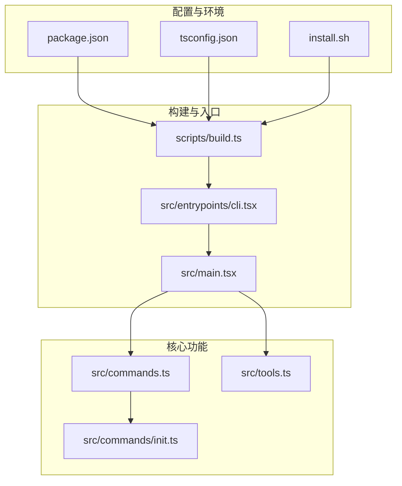
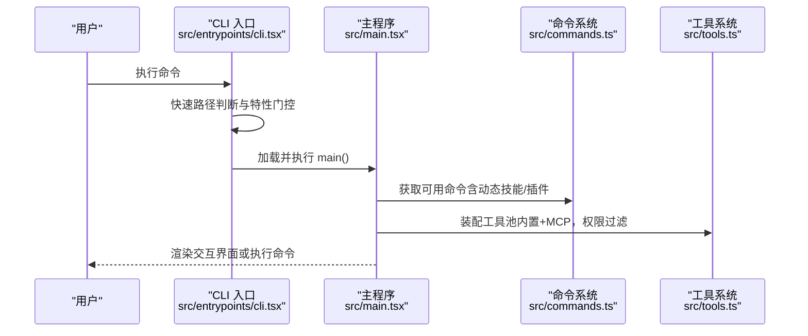
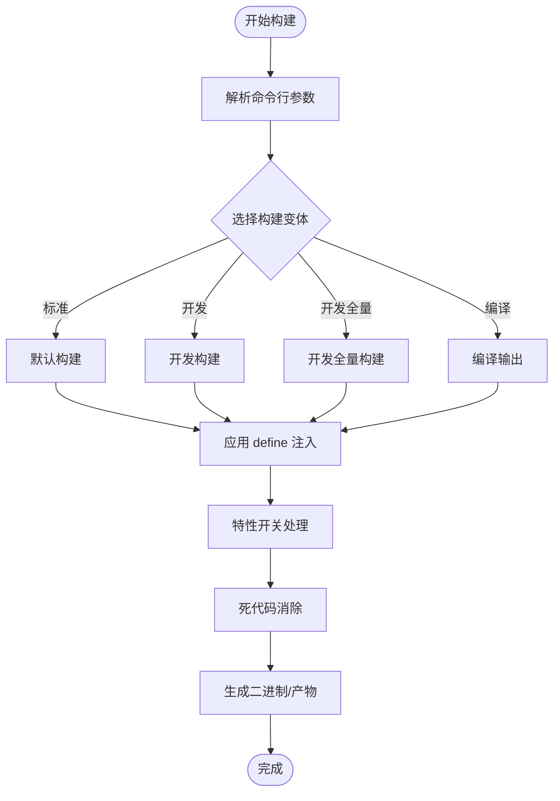
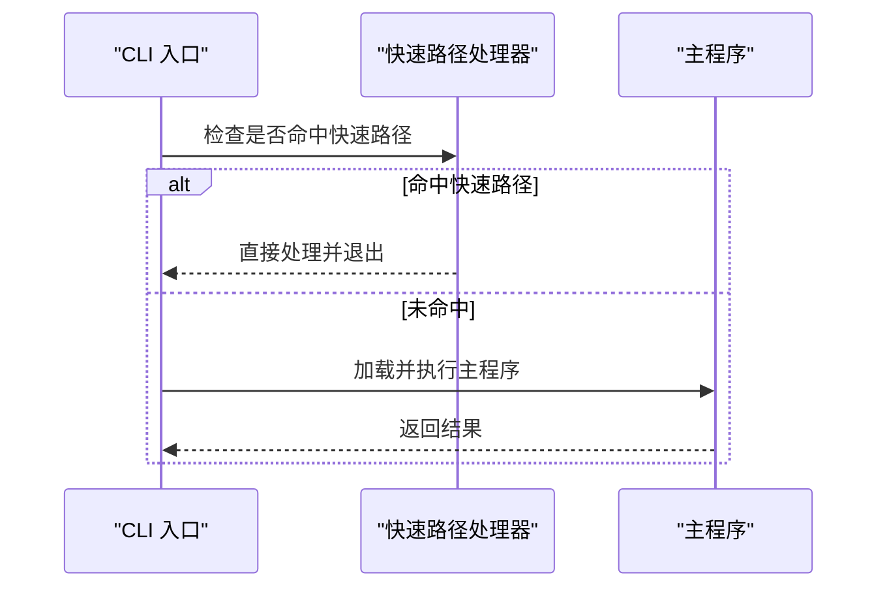
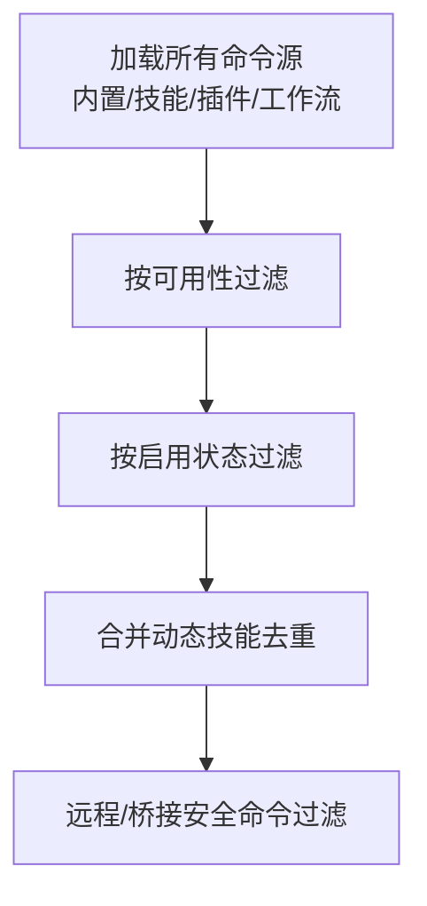
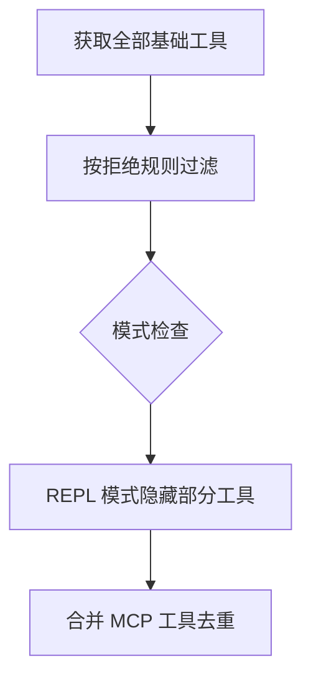
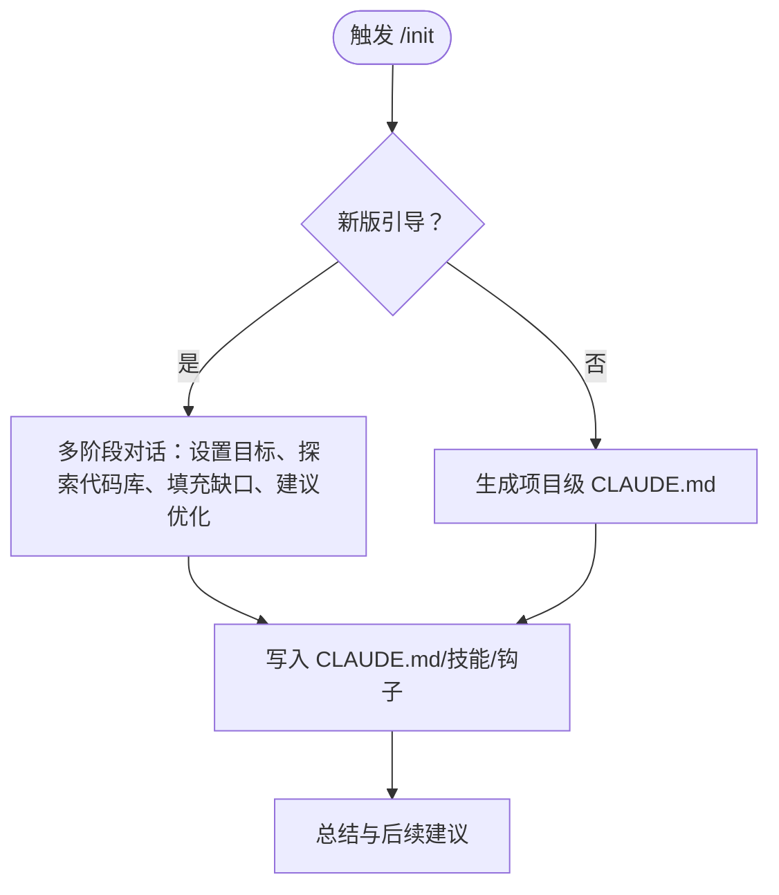
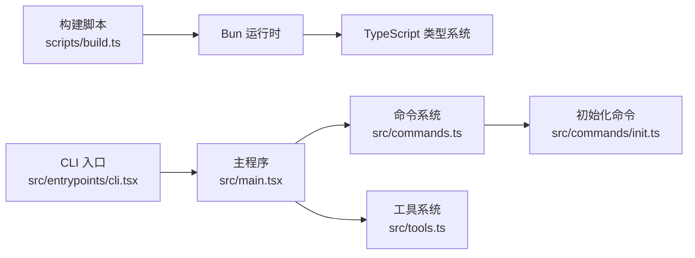

# 贡献指南

<cite>
**本文档引用的文件**
- [README.md](file://README.md)
- [package.json](file://package.json)
- [tsconfig.json](file://tsconfig.json)
- [scripts/build.ts](file://scripts/build.ts)
- [install.sh](file://install.sh)
- [FEATURES.md](file://FEATURES.md)
- [src/entrypoints/cli.tsx](file://src/entrypoints/cli.tsx)
- [src/main.tsx](file://src/main.tsx)
- [src/commands.ts](file://src/commands.ts)
- [src/tools.ts](file://src/tools.ts)
- [src/commands/init.ts](file://src/commands/init.ts)
</cite>

## 目录
1. [简介](#简介)
2. [项目结构](#项目结构)
3. [核心组件](#核心组件)
4. [架构总览](#架构总览)
5. [详细组件分析](#详细组件分析)
6. [依赖关系分析](#依赖关系分析)
7. [性能考虑](#性能考虑)
8. [故障排除指南](#故障排除指南)
9. [结论](#结论)
10. [附录](#附录)

## 简介
本指南面向希望参与 free-code（Claude Code 的开源构建）项目的贡献者，帮助你快速搭建开发环境、理解项目架构与构建流程、掌握代码规范与提交流程，并明确功能开发、Bug 修复与文档改进的参与方式。项目基于 Bun 运行时与 TypeScript，采用特性开关驱动的功能扩展机制，支持多种实验性功能的编译与运行。

## 项目结构
项目采用按功能域分层的组织方式，核心目录与职责如下：
- scripts：构建脚本与特性开关处理
- src：源码主体，包含入口点、命令系统、工具系统、状态管理、服务层等
- 入口点：CLI 入口负责快速路径与特性门控，主程序负责完整启动流程
- 命令系统：集中注册与动态加载，支持特性开关控制
- 工具系统：内置工具与 MCP 工具的统一装配与权限过滤
- 构建系统：通过 Bun 的特性开关与 define 注入实现按需打包

图表来源
- [scripts/build.ts:1-208](file://scripts/build.ts#L1-L208)
- [src/entrypoints/cli.tsx:1-313](file://src/entrypoints/cli.tsx#L1-L313)
- [src/main.tsx:1-800](file://src/main.tsx#L1-L800)
- [src/commands.ts:1-755](file://src/commands.ts#L1-L755)
- [src/tools.ts:1-390](file://src/tools.ts#L1-L390)
- [src/commands/init.ts:1-257](file://src/commands/init.ts#L1-L257)
- [package.json:1-122](file://package.json#L1-L122)
- [tsconfig.json:1-24](file://tsconfig.json#L1-L24)
- [install.sh:1-180](file://install.sh#L1-L180)

章节来源
- [README.md:179-205](file://README.md#L179-L205)
- [package.json:1-122](file://package.json#L1-L122)
- [tsconfig.json:1-24](file://tsconfig.json#L1-L24)

## 核心组件
- 构建系统与特性开关
  - 通过构建脚本支持默认构建、开发构建、全量实验特性构建以及编译输出变体
  - 使用特性开关控制命令与工具的启用范围，实现按需打包与死代码消除
- CLI 入口与快速路径
  - CLI 入口在加载完整 CLI 前进行快速路径判断，减少模块加载开销
  - 支持远程控制桥接、守护进程、模板作业、BYOC 自托管等子命令的快速路径
- 命令系统
  - 集中注册命令，按可用性与特性开关过滤，支持动态技能与插件命令的合并
- 工具系统
  - 统一装配内置工具与 MCP 工具，支持权限规则过滤与去重
- 初始化命令
  - 提供初始化 CLAUDE.md 与可选技能/钩子的引导流程

章节来源
- [scripts/build.ts:1-208](file://scripts/build.ts#L1-L208)
- [src/entrypoints/cli.tsx:1-313](file://src/entrypoints/cli.tsx#L1-L313)
- [src/main.tsx:585-800](file://src/main.tsx#L585-L800)
- [src/commands.ts:1-755](file://src/commands.ts#L1-L755)
- [src/tools.ts:1-390](file://src/tools.ts#L1-L390)
- [src/commands/init.ts:1-257](file://src/commands/init.ts#L1-L257)

## 架构总览
下图展示从 CLI 入口到主程序、命令系统与工具系统的调用链路，以及特性开关在构建期与运行期的作用位置。

图表来源
- [src/entrypoints/cli.tsx:43-313](file://src/entrypoints/cli.tsx#L43-L313)
- [src/main.tsx:585-800](file://src/main.tsx#L585-L800)
- [src/commands.ts:476-518](file://src/commands.ts#L476-L518)
- [src/tools.ts:345-390](file://src/tools.ts#L345-L390)

## 详细组件分析

### 构建系统与特性开关
- 特性开关
  - 在构建脚本中定义了大量特性开关，用于控制命令、工具、任务与查询行为的启用
  - 支持通过命令行参数选择性启用特性，或一次性启用“开发全量”特性集
- 构建变体
  - 提供标准构建、开发构建、开发全量构建与编译输出等多种变体，满足不同场景需求
- 定义注入
  - 通过 define 注入版本号、构建时间、包名等信息，便于运行时识别与诊断

图表来源
- [scripts/build.ts:82-160](file://scripts/build.ts#L82-L160)
- [scripts/build.ts:161-208](file://scripts/build.ts#L161-L208)

章节来源
- [scripts/build.ts:1-208](file://scripts/build.ts#L1-L208)
- [FEATURES.md:1-318](file://FEATURES.md#L1-L318)

### CLI 入口与快速路径
- 快速路径
  - 对版本查询、系统提示导出、远程控制桥接、守护进程等常见场景提供快速路径，避免加载完整模块
- 特性门控
  - 通过特性开关在入口层进行门控，确保外部构建不会加载内部专用功能
- 子命令快速路径
  - 支持模板作业、BYOC 环境运行器、自托管运行器等子命令的快速路径

图表来源
- [src/entrypoints/cli.tsx:43-313](file://src/entrypoints/cli.tsx#L43-L313)

章节来源
- [src/entrypoints/cli.tsx:1-313](file://src/entrypoints/cli.tsx#L1-L313)

### 命令系统
- 动态加载与缓存
  - 命令列表按工作目录缓存，动态技能与插件命令异步加载后合并
- 可用性与启用过滤
  - 根据认证与提供商要求过滤命令，再根据特性开关与启用状态进一步筛选
- 远程安全命令
  - 明确列出可在远程模式与桥接模式下安全执行的命令集合

图表来源
- [src/commands.ts:449-518](file://src/commands.ts#L449-L518)
- [src/commands.ts:619-687](file://src/commands.ts#L619-L687)

章节来源
- [src/commands.ts:1-755](file://src/commands.ts#L1-L755)

### 工具系统
- 工具装配
  - 统一装配内置工具与 MCP 工具，按权限规则过滤并去重
  - 支持简单模式（仅基础工具）与 REPL 模式下的特殊处理
- 权限过滤
  - 基于权限上下文与拒绝规则过滤工具，确保安全边界

图表来源
- [src/tools.ts:193-327](file://src/tools.ts#L193-L327)
- [src/tools.ts:345-390](file://src/tools.ts#L345-L390)

章节来源
- [src/tools.ts:1-390](file://src/tools.ts#L1-L390)

### 初始化命令（/init）
- 新版引导流程
  - 通过多阶段对话收集项目与个人偏好，生成最小化 CLAUDE.md 与可选技能/钩子
- 旧版引导流程
  - 生成项目级 CLAUDE.md，聚焦代码库分析与常用开发任务

图表来源
- [src/commands/init.ts:28-257](file://src/commands/init.ts#L28-L257)

章节来源
- [src/commands/init.ts:1-257](file://src/commands/init.ts#L1-L257)

## 依赖关系分析
- 构建与运行时依赖
  - 项目使用 Bun 作为运行时与构建工具，TypeScript 作为类型系统
  - 通过特性开关与 define 注入实现按需打包与运行时标识
- 外部依赖
  - 包含 Anthropic SDK、MCP、LSP、OpenTelemetry 等生态组件，但构建时会移除遥测与分析相关端点
- 开发与测试
  - 项目未提供内置测试框架，建议遵循现有代码风格并通过集成测试验证功能

图表来源
- [package.json:1-122](file://package.json#L1-L122)
- [tsconfig.json:1-24](file://tsconfig.json#L1-L24)
- [scripts/build.ts:1-208](file://scripts/build.ts#L1-L208)
- [src/entrypoints/cli.tsx:1-313](file://src/entrypoints/cli.tsx#L1-L313)
- [src/main.tsx:1-800](file://src/main.tsx#L1-L800)
- [src/commands.ts:1-755](file://src/commands.ts#L1-L755)
- [src/tools.ts:1-390](file://src/tools.ts#L1-L390)
- [src/commands/init.ts:1-257](file://src/commands/init.ts#L1-L257)

章节来源
- [package.json:1-122](file://package.json#L1-L122)
- [tsconfig.json:1-24](file://tsconfig.json#L1-L24)

## 性能考虑
- 启动性能
  - CLI 入口提供多条快速路径，避免不必要的模块加载
  - 主程序在首次渲染后延迟执行部分预取任务，减少首帧阻塞
- 特性开关与死代码消除
  - 通过特性开关与 define 注入，在构建期剔除未启用的功能，减小体积与提升启动速度
- 运行时优化
  - 命令与工具列表采用缓存策略，动态加载与去重减少重复计算

章节来源
- [src/entrypoints/cli.tsx:43-313](file://src/entrypoints/cli.tsx#L43-L313)
- [src/main.tsx:388-431](file://src/main.tsx#L388-L431)
- [scripts/build.ts:135-160](file://scripts/build.ts#L135-L160)

## 故障排除指南
- 安装与环境问题
  - 确保已安装 Bun（版本要求见 package.json），并在支持的操作系统上运行
  - 使用安装脚本自动检测与安装依赖，或手动执行构建命令
- 构建失败
  - 检查特性开关参数是否正确，确认目标平台与依赖可用
  - 如需特定特性，请参考特性审计文档，确认该特性在当前快照下可打包
- 运行异常
  - 查看 CLI 入口的快速路径与错误输出，确认是否命中远程控制桥接或守护进程等子命令
  - 若出现权限或策略限制，检查组织策略与认证状态

章节来源
- [install.sh:1-180](file://install.sh#L1-L180)
- [package.json:12-14](file://package.json#L12-L14)
- [src/entrypoints/cli.tsx:118-172](file://src/entrypoints/cli.tsx#L118-L172)
- [FEATURES.md:1-318](file://FEATURES.md#L1-L318)

## 结论
本指南提供了从环境搭建到功能开发、Bug 修复与文档改进的完整路径。通过理解构建系统、特性开关、命令与工具系统的工作原理，你可以高效地参与项目贡献。请在提交前确保遵循代码规范与测试要求，并通过特性审计文档确认你的改动与特性开关一致。

## 附录

### 开发环境设置
- 系统要求
  - Bun 版本：参见 package.json 中 engines 字段
  - 操作系统：macOS 或 Linux（Windows 通过 WSL）
- 安装步骤
  - 使用安装脚本一键安装并构建
  - 或手动克隆仓库、安装依赖、执行构建命令
- 运行方式
  - 直接运行构建产物或从源码运行（较慢）

章节来源
- [README.md:86-96](file://README.md#L86-L96)
- [install.sh:1-180](file://install.sh#L1-L180)
- [package.json:12-14](file://package.json#L12-L14)

### 代码规范与提交流程
- 代码风格
  - 项目使用 TypeScript，类型系统由 tsconfig.json 配置
  - 代码中广泛使用特性开关与 define 注入，新增功能应以特性开关形式提供
- 提交建议
  - 功能开发：优先以特性开关形式实现，便于按需启用与测试
  - Bug 修复：定位到具体模块（命令/工具/服务），补充最小化复现与修复
  - 文档改进：更新相关文档与特性审计，确保一致性

章节来源
- [tsconfig.json:1-24](file://tsconfig.json#L1-L24)
- [scripts/build.ts:135-160](file://scripts/build.ts#L135-L160)

### 测试要求
- 当前项目未提供内置测试框架
- 建议通过以下方式进行验证
  - 构建变体验证：确保默认构建、开发构建与全量特性构建均能成功产出
  - 功能验证：针对启用的特性开关进行端到端验证
  - 性能验证：关注启动路径与首帧渲染时间

章节来源
- [scripts/build.ts:122-130](file://scripts/build.ts#L122-L130)

### 发布流程
- 构建变体
  - 标准构建：适用于生产环境
  - 开发构建：带版本戳与实验性密钥
  - 开发全量构建：启用全部可打包特性
  - 编译输出：生成替代输出路径
- 发布建议
  - 在变更特性开关或命令/工具注册时，同步更新特性审计文档
  - 发布前进行多变体构建验证

章节来源
- [README.md:122-142](file://README.md#L122-L142)
- [scripts/build.ts:122-130](file://scripts/build.ts#L122-L130)
- [FEATURES.md:16-29](file://FEATURES.md#L16-L29)

### 治理结构与决策机制
- 项目背景
  - 本项目为 Claude Code 的开源重建版本，源码来源于 npm 分发中的源映射暴露
- 决策与贡献
  - 由于项目性质，贡献流程以功能与稳定性为核心，遵循现有代码风格与特性开关机制
  - 重大变更建议先讨论，确保与项目目标一致

章节来源
- [README.md:1-237](file://README.md#L1-L237)

### 开发者资源与社区支持
- 官方资源
  - 项目 README 与特性审计文档
  - 构建脚本与安装脚本
- 社区支持
  - 通过项目提供的反馈渠道进行交流与问题报告
  - 参考安装脚本中的使用说明与示例

章节来源
- [README.md:1-237](file://README.md#L1-L237)
- [install.sh:166-179](file://install.sh#L166-L179)