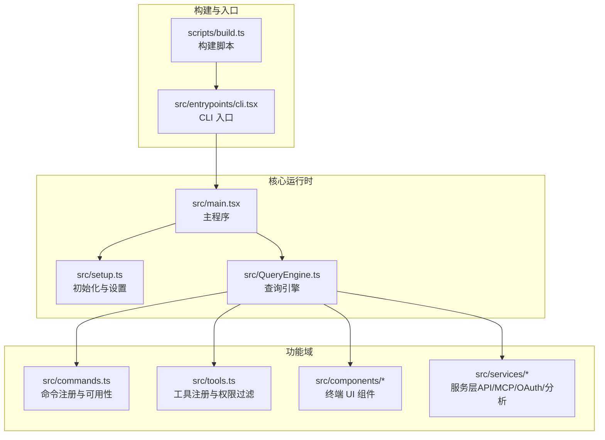
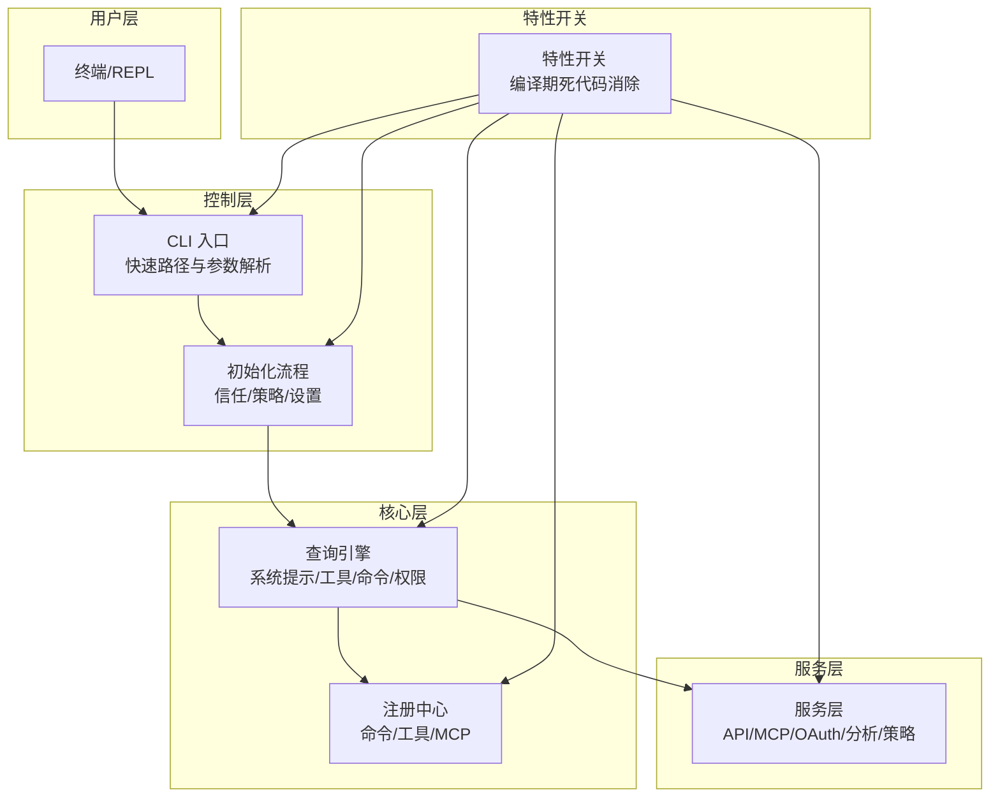
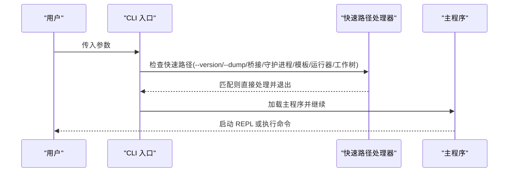
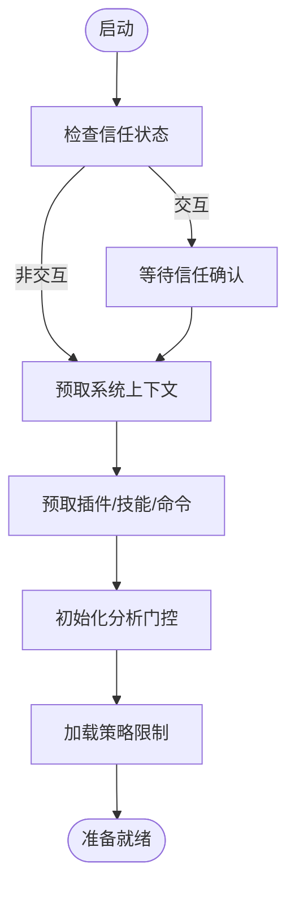
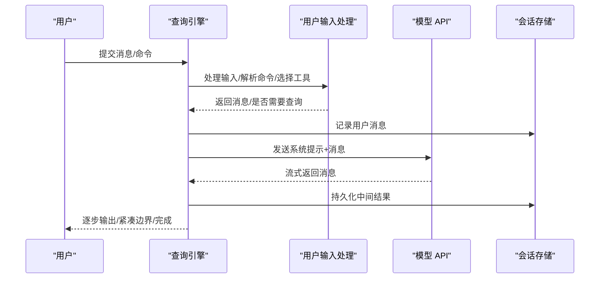
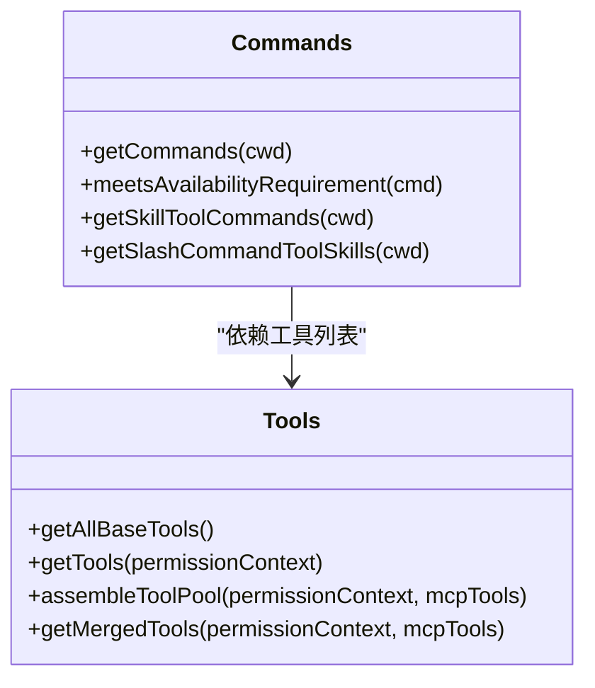
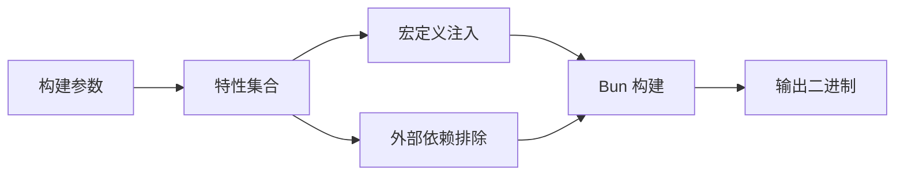
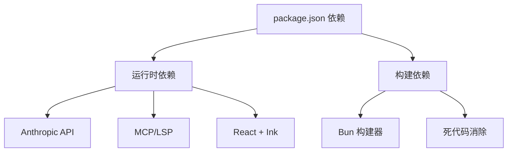

# 项目概述

<cite>
**本文档引用的文件**
- [README.md](file://README.md)
- [install.sh](file://install.sh)
- [package.json](file://package.json)
- [scripts/build.ts](file://scripts/build.ts)
- [src/main.tsx](file://src/main.tsx)
- [src/setup.ts](file://src/setup.ts)
- [src/entrypoints/cli.tsx](file://src/entrypoints/cli.tsx)
- [src/commands.ts](file://src/commands.ts)
- [src/tools.ts](file://src/tools.ts)
- [src/QueryEngine.ts](file://src/QueryEngine.ts)
- [src/constants/betas.ts](file://src/constants/betas.ts)
- [src/types/command.ts](file://src/types/command.ts)
- [FEATURES.md](file://FEATURES.md)
</cite>

## 目录
1. [简介](#简介)
2. [项目结构](#项目结构)
3. [核心组件](#核心组件)
4. [架构总览](#架构总览)
5. [详细组件分析](#详细组件分析)
6. [依赖关系分析](#依赖关系分析)
7. [性能考量](#性能考量)
8. [故障排除指南](#故障排除指南)
9. [结论](#结论)
10. [附录](#附录)

## 简介

free-code 是 Anthropic Claude Code 的清洁构建版本，专注于隐私、自由度与实验性功能的完全开放。该项目通过以下三大改进，为用户提供更透明、可定制且功能丰富的终端原生 AI 编码代理体验：

- **移除遥测与安全护栏**：彻底剥离上游版本中的 OpenTelemetry/gRPC、GrowthBook 分析、Sentry 错误上报等遥测链路；移除系统级安全护栏（如拒绝模式、网络风险指令块、远程托管的安全覆盖），仅保留模型自身的安全训练约束。
- **解锁全部实验性功能**：在默认构建基础上，进一步解锁 45+ 个编译期特性开关，涵盖多智能体规划、深度思考模式、语音输入、IDE 远程控制桥接、令牌预算、记忆提取、历史选择器、消息动作入口、快速搜索、统计可视化、紧凑提醒、缓存微紧凑状态等。
- **单二进制、零回调**：最终产物为单一可执行文件，不向任何外部服务发送数据，确保用户对数据主权的完全掌控。

本项目采用 Bun + React 技术栈，结合 Ink 终端 UI 框架，提供类桌面应用般的交互体验，同时保持命令行工具的轻量与高效。

## 项目结构

项目采用按职责分层的模块化组织方式，核心目录与职责如下：

- scripts/：构建脚本与打包逻辑，支持按需启用特性开关与自定义输出路径。
- src/entrypoints/：CLI 入口与初始化流程，负责参数解析、早期快速路径与启动配置。
- src/：核心业务逻辑与 UI 组件
  - commands/：斜杠命令实现集合，涵盖会话管理、技能、工具、插件、MCP、IDE 集成等。
  - tools/：代理工具实现，如 Bash、文件读写、Web 搜索、任务管理、计划模式等。
  - components/：终端 UI 组件与对话展示层。
  - services/：API 客户端、MCP、OAuth、分析与遥测、策略限制等服务层。
  - state/：应用状态存储与选择器。
  - utils/：通用工具函数、权限处理、环境检测、日志与诊断等。
  - bridge/：IDE 远程控制桥接相关能力。
  - voice/：语音输入与字幕功能。
  - tasks/：后台任务管理。
  - screens/：特定界面（如 REPL、医生诊断）。
- assets/：项目资源与截图。
- install.sh：一键安装脚本，自动检查系统、安装 Bun、克隆仓库、安装依赖、构建并链接到 PATH。

**图表来源**
- [scripts/build.ts:1-205](file://scripts/build.ts#L1-L205)
- [src/entrypoints/cli.tsx:1-304](file://src/entrypoints/cli.tsx#L1-L304)
- [src/main.tsx:1-800](file://src/main.tsx#L1-L800)
- [src/setup.ts:1-478](file://src/setup.ts#L1-L478)
- [src/QueryEngine.ts:1-800](file://src/QueryEngine.ts#L1-L800)
- [src/commands.ts:1-755](file://src/commands.ts#L1-L755)
- [src/tools.ts:1-390](file://src/tools.ts#L1-L390)

**章节来源**
- [README.md:179-205](file://README.md#L179-L205)
- [package.json:1-122](file://package.json#L1-L122)

## 核心组件

- CLI 入口与快速路径
  - 在未加载完整模块前，对 --version、--dump-system-prompt、远程控制桥接、守护进程、模板作业、环境运行器、自我托管运行器、工作树与 tmux、更新重定向等进行快速路径处理，减少冷启动开销。
- 主程序与初始化
  - 负责信任对话框、策略限制、远程托管设置、MCP 注册、插件与技能预取、延迟预取、分析门控初始化、启动遥测等。
- 查询引擎
  - 封装一次对话的生命周期，负责系统提示组装、用户上下文与系统上下文注入、工具与命令选择、权限决策、消息记录与回放、结构化输出、紧凑边界与快照等。
- 命令与工具注册
  - 动态注册命令与工具，支持特性开关、可用性过滤、权限规则、REPL 模式隐藏、MCP 工具合并与去重等。
- 构建系统
  - 支持默认特性集、开发变体、全量实验特性集，以及按需启用单个特性开关，生成最小化、可移植的二进制产物。

**章节来源**
- [src/entrypoints/cli.tsx:1-304](file://src/entrypoints/cli.tsx#L1-L304)
- [src/main.tsx:585-800](file://src/main.tsx#L585-L800)
- [src/setup.ts:56-478](file://src/setup.ts#L56-L478)
- [src/QueryEngine.ts:184-800](file://src/QueryEngine.ts#L184-L800)
- [src/commands.ts:257-517](file://src/commands.ts#L257-L517)
- [src/tools.ts:193-390](file://src/tools.ts#L193-L390)
- [scripts/build.ts:13-110](file://scripts/build.ts#L13-L110)

## 架构总览

free-code 的整体架构围绕“特性开关 + 动态注册 + 权限过滤 + 查询引擎”的模式展开，既保证了上游功能的可移植性，又允许下游用户以最小代价启用实验性能力。

**图表来源**
- [src/entrypoints/cli.tsx:34-304](file://src/entrypoints/cli.tsx#L34-L304)
- [src/main.tsx:585-800](file://src/main.tsx#L585-L800)
- [src/setup.ts:56-478](file://src/setup.ts#L56-L478)
- [src/QueryEngine.ts:184-800](file://src/QueryEngine.ts#L184-L800)
- [src/commands.ts:257-517](file://src/commands.ts#L257-L517)
- [src/tools.ts:193-390](file://src/tools.ts#L193-L390)
- [scripts/build.ts:181-187](file://scripts/build.ts#L181-L187)

## 详细组件分析

### CLI 入口与快速路径

- 快速路径设计
  - 对 --version、--dump-system-prompt、远程控制桥接、守护进程、模板作业、环境运行器、自我托管运行器、工作树与 tmux、更新重定向等进行快速路径处理，避免加载重型模块。
- 特性门控
  - 使用 Bun 的 feature('FLAG') 在构建时进行死代码消除，确保未启用的特性不会进入最终二进制。
- 启动阶段
  - 在加载完整 CLI 前，捕获早期输入、设置早期标志（如 --bare）、启用配置与分析门控。

**图表来源**
- [src/entrypoints/cli.tsx:34-304](file://src/entrypoints/cli.tsx#L34-L304)

**章节来源**
- [src/entrypoints/cli.tsx:1-304](file://src/entrypoints/cli.tsx#L1-L304)

### 初始化与设置流程

- 信任与策略
  - 在非交互模式下跳过信任对话框，在已建立信任后预取系统上下文；在交互模式下等待信任确认后再进行敏感操作。
- 插件与技能预取
  - 在渲染后延迟执行插件钩子、技能与命令的预取，避免阻塞首帧；在 --bare 模式下跳过大部分预取。
- 分析与遥测
  - 启动分析门控，记录启动遥测事件（如是否为 Git 仓库、工作树数量、证书环境变量等），但不包含任何外部上报。
- 权限与沙箱
  - 校验危险权限开关（如 root/sudo、容器无网环境）的安全性；根据策略限制决定远程控制等功能的可用性。

**图表来源**
- [src/main.tsx:360-380](file://src/main.tsx#L360-L380)
- [src/setup.ts:306-381](file://src/setup.ts#L306-L381)
- [src/setup.ts:395-442](file://src/setup.ts#L395-L442)

**章节来源**
- [src/main.tsx:360-380](file://src/main.tsx#L360-L380)
- [src/setup.ts:56-478](file://src/setup.ts#L56-L478)

### 查询引擎与对话生命周期

- 系统提示组装
  - 结合默认系统提示、用户上下文、系统上下文、可选自定义提示与附加提示，形成最终系统提示。
- 工具与命令选择
  - 基于用户输入与上下文，动态选择可用工具与命令；支持权限过滤、REPL 模式隐藏、MCP 工具合并与去重。
- 权限与安全
  - 包装 canUseTool 以追踪权限拒绝；在 SDK 场景下报告拒绝详情；支持孤儿权限处理与恢复。
- 记录与回放
  - 在首次响应前持久化用户消息，确保即使请求被中断也能恢复会话；支持紧凑边界与快照。
- 结构化输出
  - 当提供 JSON Schema 且存在合成输出工具时，注册结构化输出强制执行钩子。

**图表来源**
- [src/QueryEngine.ts:209-800](file://src/QueryEngine.ts#L209-L800)

**章节来源**
- [src/QueryEngine.ts:184-800](file://src/QueryEngine.ts#L184-L800)

### 命令与工具注册体系

- 命令注册
  - 通过 memoized 方式加载内置命令、技能目录命令、插件命令、工作流命令；支持按可用性（认证/提供商）过滤与启用状态检查。
- 工具注册
  - 提供基础工具集合，结合特性开关与环境变量条件性添加；支持 REPL 模式下的工具隐藏；统一过滤拒绝规则并去重。
- MCP 工具整合
  - 将内置工具与 MCP 工具合并，按名称去重（内置优先），保持提示缓存稳定性。

**图表来源**
- [src/commands.ts:257-517](file://src/commands.ts#L257-L517)
- [src/tools.ts:193-390](file://src/tools.ts#L193-L390)

**章节来源**
- [src/commands.ts:257-517](file://src/commands.ts#L257-L517)
- [src/tools.ts:193-390](file://src/tools.ts#L193-L390)

### 构建系统与特性开关

- 特性开关
  - 默认启用 VOICE_MODE；支持通过 --feature-set=dev-full 启用 45+ 实验特性；支持按需启用单个特性。
- 定义与外链
  - 通过 --define 注入版本信息、包 URL、反馈渠道、问题解释器等；通过 --external 排除 @ant/*、音频/图像/修饰符/NAPI 等外部依赖。
- 输出与权限
  - 生成可执行文件并赋予可执行权限；在开发变体中注入开发环境变量与实验构建标记。

**图表来源**
- [scripts/build.ts:13-110](file://scripts/build.ts#L13-L110)
- [scripts/build.ts:124-187](file://scripts/build.ts#L124-L187)

**章节来源**
- [scripts/build.ts:1-205](file://scripts/build.ts#L1-L205)

## 依赖关系分析

- 运行时依赖
  - Bun 作为运行时与包管理器；React + Ink 提供终端 UI；Commander.js 解析 CLI 参数；Zod 进行模式校验；MCP/LSP 协议支持；Anthropic Messages API。
- 构建依赖
  - Bun 构建器、死代码消除（feature('FLAG')）、条件编译与外链排除。
- 外部集成
  - AWS/Google/Azure 凭证与运行时；OAuth 登录；IPFS 永久镜像（用于项目存档）。

**图表来源**
- [package.json:22-116](file://package.json#L22-L116)
- [scripts/build.ts:158-187](file://scripts/build.ts#L158-L187)

**章节来源**
- [package.json:1-122](file://package.json#L1-L122)
- [scripts/build.ts:158-187](file://scripts/build.ts#L158-L187)

## 性能考量

- 冷启动优化
  - CLI 快速路径避免模块加载；延迟预取与延迟初始化减少首帧阻塞；--bare 模式下跳过大部分预取。
- 模块评估与内存
  - 通过特性开关与条件导入，避免加载未使用的模块；在长会话中使用紧凑边界与快照降低内存占用。
- I/O 与网络
  - 插件与技能加载采用缓存只读模式；在 CCR/SDK 场景下避免网络阻塞；必要时进行急切刷新以提升一致性。
- 令牌与成本
  - 支持令牌预算跟踪与使用警告；提供快速模式与思考深度配置以平衡成本与效果。

## 故障排除指南

- 安装失败
  - 确认系统满足要求（Bun >= 1.3.11、macOS/Linux、设置 ANTHROPIC_API_KEY）；使用 install.sh 自动安装 Bun 并构建。
- 权限与安全
  - 禁止在 root/sudo 或有互联网访问的容器中使用危险权限开关；确保在沙箱且无网环境下启用相应功能。
- 功能不可用
  - 检查特性开关是否正确启用；确认命令/工具的可用性（认证/提供商要求）；查看日志与调试输出。
- 会话恢复
  - 确保在首次响应前已记录用户消息；若请求被中断，仍可通过最近日志恢复会话。

**章节来源**
- [install.sh:1-180](file://install.sh#L1-L180)
- [src/setup.ts:395-442](file://src/setup.ts#L395-L442)
- [src/QueryEngine.ts:436-463](file://src/QueryEngine.ts#L436-L463)

## 结论

free-code 以“清洁构建 + 实验解锁 + 零遥测”为核心理念，为终端原生 AI 编码代理提供了高度可定制、可审计且功能完备的解决方案。通过特性开关与动态注册机制，项目在保持上游兼容的同时，最大化释放实验性能力，满足从初学者到高级用户的多样化需求。配合一键安装与最小化二进制，用户可以快速上手并在本地环境中获得接近桌面应用的交互体验。

## 附录

### 系统要求与安装

- 系统要求
  - Bun >= 1.3.11、macOS 或 Linux（Windows 通过 WSL）
  - 设置 ANTHROPIC_API_KEY 环境变量
- 安装步骤
  - 执行安装脚本，自动检查系统、安装 Bun、克隆仓库、安装依赖、构建并链接到 PATH
- 运行方式
  - 直接运行二进制或从源码运行（较慢）

**章节来源**
- [README.md:86-96](file://README.md#L86-L96)
- [README.md:70-83](file://README.md#L70-L83)
- [install.sh:1-180](file://install.sh#L1-L180)

### 构建变体与特性清单

- 构建变体
  - 标准构建：仅启用 VOICE_MODE
  - 开发构建：带开发版本戳与实验 GrowthBook 密钥
  - 全量实验构建：启用 45+ 特性开关
  - 编译构建：输出到 dist/cli
- 特性清单
  - 交互与 UI 实验：历史选择器、消息动作、快速搜索、令牌预算、超计划/深思模式、语音模式等
  - 智能体与记忆：内置探索/计划代理、验证代理、记忆提取、紧凑提醒、缓存微紧凑状态等
  - 工具与远程：Bash 分类器、IDE 桥接、MCP 丰富渲染、无头重试等

**章节来源**
- [README.md:122-142](file://README.md#L122-L142)
- [FEATURES.md:16-49](file://FEATURES.md#L16-L49)
- [FEATURES.md:77-128](file://FEATURES.md#L77-L128)